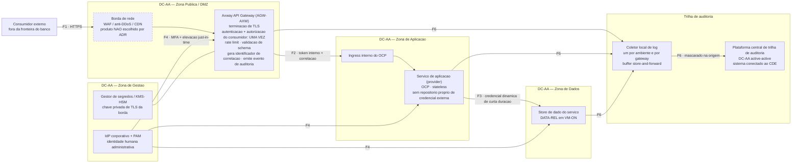
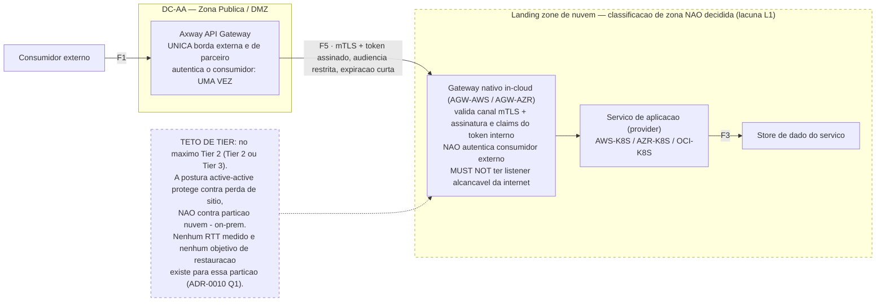

# AR-001 — API REST exposta externamente no Axway, com provider em `OCP` ou Kubernetes gerenciado

> Esta AR realiza decisões que estão todas em status `proposta`. Pelo item de prontidão **R3**, ela própria não pode passar de `proposta` — **R3 limita o status, não o envio**: esta AR vai ao comitê de arquitetura no **mesmo pacote** das ADRs que realiza, como `proposta`, para que o comitê leia a decisão e a sua realização juntas. Nada aqui está aprovado pelo Escritório; a aprovação final é do comitê de arquitetura do banco.

## 0. Cabeçalho

| Campo | Valor |
| --- | --- |
| **ID da AR** | `AR-001` (reservado em [registro de decisões §8](/ARC/issues/ARC-2#document-decision-registry)) |
| **Status** | `proposta` |
| **Versão** | 0.11 |
| **Responsável** | Solution Architect |
| **Realiza as ADRs** | `ADR-0002`, `ADR-0003`, `ADR-0004`, `ADR-0005`, `ADR-0006`, `ADR-0007`, `ADR-0008`, `ADR-0009`, `ADR-0010`, `ADR-0011`, `ADR-0012`, `ADR-0013`, `ADR-0014`, `ADR-0015`. **`ADR-0006` e `ADR-0007` acrescentadas nesta revisão:** a §4.3, a §7 e a §7.1 realizam `ADR-0006` C1/C2/C3/C6/C7/C8/C9/C10 e §1.1/§1.1.1 (failover de sítio, fencing, clusters não esticados, replicação assíncrona), e a §6, a §7.1 e a §11 realizam `ADR-0007` C1/C2/C3/C8/C9/C11 e §4.3 (circuitos híbridos da Variante B, IPsec no caminho híbrido, objetivo de restauração da partição híbrida) |
| **Decisões ainda `proposta`** | **Todas as catorze acima.** Nenhuma ADR realizada por esta AR está `aceita` nesta data. Por **R3**, esta AR permanece `proposta` até que sejam aceitas. **R3 limita o status, não o envio:** ela segue ao comitê no mesmo pacote das ADRs que realiza, como `proposta` ([registro §8](/ARC/issues/ARC-2#document-decision-registry)) |
| **Tier reivindicável (D-7)** | **No máximo Tier 1** na primeira onda. **Nenhum workload construído a partir desta AR reivindica Tier 0**, por decisão **D-7** do Arquiteto Principal ([ARC-39](/ARC/issues/ARC-39#document-decisao-d7-d11)); o mecanismo de Tier 0 permanece como **alvo de desenho**. A conformidade com `ADR-0009` C11 (herança de tier de serviço compartilhado) **não está verificada para tier algum** até o inventário de `ADR-0006` Q5 existir. Critério de saída de D-7 em §7 e na lacuna **L3** |
| **Substitui / Substituída por** | Nenhuma / Nenhuma |
| **Consumidor pretendido** | Time de entrega de canal digital ou de API de negócio, construindo uma API REST síncrona para consumidor fora da fronteira do banco (app próprio, internet banking, parceiro sob contrato, open finance, app de terceiro) |
| **Maturidade** | `Apenas referência` — nenhum workload foi construído a partir desta AR. Nenhuma das ADRs que ela realiza está aceita, portanto não existe construção conforme a declarar |
| **Idioma** | Português do Brasil (conforme `PARAM-LANG`) |
| **Data de submissão ao comitê / resultado** | Não submetida / `pendente`. **Vai no mesmo pacote das ADRs que realiza, como `proposta`** — não há pré-requisito de aceitação prévia para o envio; o que depende da aceitação é a mudança de status desta AR (**R3**). **Atualizado nesta revisão 0.9 pelo gate interno da 3ª rodada** ([ARC-139](/ARC/issues/ARC-139#document-handoff-comite-primeira-onda-r3), §0 e §1.3): esta AR passou à **classe F** — a substância dos itens do gate está atendida nas seções operativas e ela **não volta ao gate do Arquiteto Principal**. Duas condições governam o envio: **(i)** veredito **APROVADO** de prontidão do Governance Architect sobre a revisão corrigida — o veredito consolidado de 2026-10-07 06:29 em [ARC-138](/ARC/issues/ARC-138) é **REPROVADO, item G7**, e esta revisão 0.9 corrige exatamente isso; **(ii)** por **D-24(k)**, ela vai ao comitê **junto com, ou depois de,** cada ADR `proposta` que realiza — na prática `ADR-0010`, `ADR-0011` e `ADR-0014`, devolvidas como `proposta` naquele gate —, e **nunca antes**. Nada disso é aprovação |

**Documentos de referência:** [Template de AR](/ARC/issues/ARC-2#document-ar-template) · [Checklist de prontidão](/ARC/issues/ARC-2#document-readiness-checklist) · [Registro de decisões](/ARC/issues/ARC-2#document-decision-registry) · [Modelo operacional](/ARC/issues/ARC-2#document-operating-model) · [Catálogo de obrigações](/ARC/issues/ARC-8#document-catalogo-obrigacoes-regulatorias) · [Contrato de insumos](/ARC/issues/ARC-9#document-ar-001-ar-002-input-contract) · [Processo de exceção e waiver](/ARC/issues/ARC-2#document-exception-and-waiver-path)

## 1. Quando usar esta referência — e quando não usar

**Use esta referência quando todos estes forem verdadeiros:**

- A API é **REST síncrona sobre HTTPS**, com contrato request/response.
- O consumidor está **fora da fronteira do banco**: app mobile próprio, internet banking, parceiro sob contrato, consumidor de open finance, ou app de terceiro. Pela regra de desempate (i) de [`ADR-0010` §4.3](/ARC/issues/ARC-6#document-adr-0010-api-gateway-exposure-strategy), app próprio e internet banking **são** consumidores externos, não tráfego interno.
- O provider é um serviço de aplicação **stateless** em `OCP` ou em Kubernetes gerenciado (`AWS-K8S`, `AZR-K8S`, `OCI-K8S`), conforme `ADR-0008` C2 e `ADR-0004` C1.
- O acesso a dado persistido é de responsabilidade do próprio serviço, dentro dos guardrails de `ADR-0011`.
- O time aceita a borda única do Axway (`ADR-0010` C1/C2) — esta referência não oferece alternativa de borda.

**Não a use quando qualquer um destes for verdadeiro:**

| Se … | Use em vez disso |
| --- | --- |
| O consumidor é um serviço interno **no mesmo** ambiente de hospedagem do provider | Nenhuma AR existe. Aplique `ADR-0010` C4 diretamente: service-to-service por service mesh ou chamada direta com mTLS, **sem gateway**. Nenhuma referência do Escritório cobre east-west intra-ambiente nesta onda |
| O consumidor é um serviço interno em **outro** ambiente (on-prem ↔ nuvem, nuvem ↔ nuvem) | Nenhuma AR existe. Aplique `ADR-0010` C5 (Axway como ponto único de travessia) e observe que o critério de escape de C5 é **provisório, sem orçamento numérico de latência**, conforme a resposta à Q3 daquela ADR |
| O consumidor e o provider estão no **mesmo provedor de nuvem e na mesma região** | Nenhuma AR existe. Aplique `ADR-0010` C15 (`AGW-AWS` / `AGW-AZR`). Na OCI não há gateway in-cloud atribuído — lacuna declarada em `ADR-0010` Q6; aplique C4 ou escale |
| A integração é assíncrona — tópico, fila, streaming, arquivo em lote | Nenhuma referência e nenhuma ADR. `ADR-0010` §4.2 declara mensageria assíncrona explicitamente fora de escopo na primeira onda. Levante intake ao Escritório (modelo operacional §5) |
| O serviço é um **sistema de registro transacional** cujo tema central é sobreviver à perda de um site | [`AR-002`](/ARC/issues/ARC-9#document-ar-002-servico-transacional-active-active). As duas referências se compõem: `AR-001` cobre a exposição, `AR-002` cobre a persistência e o failover |
| O provider é um motor de banco de dados, uma fila, ou um cache usado como fonte de verdade | Nenhuma AR. Esses não são workloads de aplicação exponíveis: `ADR-0008` C5/C8 os fixa em `VM-ON` por padrão e `ADR-0011` C1 os trata como sistema de registro |
| O caminho precisa transportar, ou pode alcançar, **dado de portador de cartão** — em nuvem **ou** on-premises | **A Variante C da §5.2 é o único caminho desta AR, por decisão D-9** ([ARC-39](/ARC/issues/ARC-39#document-decisao-d7-d11)). Em nuvem o caminho é **proibido** (`ADR-0010` C9 + `ADR-0011` C7 + `ADR-0003` C2, mais a Q2 de `ADR-0011`: nenhuma landing zone tem enclave PCI aprovado). On-premises, as Variantes A e B também **não** são aplicáveis: elas só mantinham o PAN fora do caminho padrão por meio do token irreversível de `ADR-0011` C7(c), e [ARC-40](/ARC/issues/ARC-40) confirmou que **o serviço de tokenização não existe**. A Variante C **amplia** o escopo PCI-DSS — ver §8.1 |

**Anti-padrões que esta referência existe para prevenir:**

- Publicar a API no gateway da nuvem onde o workload foi deployado, porque era o gateway mais próximo. Proibido por `ADR-0010` C3.
- Autenticar o consumidor externo duas vezes, ou em nenhum dos dois gateways, no encadeamento de dois saltos. `ADR-0010` C7 fixa exatamente uma vez, no Axway.
- Gerar um novo identificador de correlação no segundo gateway. Proibido por `ADR-0010` C8 — é o modo de falha real que destrói a rastreabilidade de ponta a ponta.
- Assumir que a API externa herda Tier 0 porque o Axway é Tier 0. Além de o tier alcançável de ponta a ponta ser **limitado para baixo** pelos serviços compartilhados de que a API depende (`ADR-0009` C11), **nenhum workload reivindica Tier 0 na primeira onda** (D-7) — ver §7 e a lacuna **L3** da §10.
- Presumir que o PAN "já chega tokenizado" porque o banco processa cartão. O serviço de tokenização **não existe** ([ARC-40](/ARC/issues/ARC-40)); desenhar as Variantes A ou B em cima dele é construir sobre um componente ausente (D-9).
- Terminar a sessão TLS vinda da internet dentro da **Zona CDE interna** ou na **DMZ compartilhada** quando a API transporta dado de cartão, ou atender API com dado de cartão no **mesmo** runtime Axway que atende API sem dado de cartão. Proibido por `ADR-0010` C17 e `ADR-0014` C5 (**D-22(a)**, que substitui D-17(a)): a terminação é na **subzona DMZ-CDE**, classificada como CDE, e a borda compartilhada atua só em L3/L4 e **nunca decifra** esse tráfego.
- Terminar o gateway diretamente na zona de aplicação. Proibido por `ADR-0014` C5.
- Guardar a chave privada do certificado de TLS ou o segredo do banco em configuração versionada ou variável de pipeline. Proibido por `ADR-0013` C4.
- Tokenizar ou mascarar PAN no coletor de log em vez de na origem. Proibido por `ADR-0015` C6.

## 2. O arquétipo de workload

| Atributo | Valor desta referência | Base declarada |
| --- | --- | --- |
| Forma funcional | API REST síncrona, request/response, sem estado de sessão no serviço | Escopo da task [ARC-9](/ARC/issues/ARC-9) |
| Perfil de transação | Leitura predominante (≈ 80% das chamadas), escrita transacional em minoria (≈ 20%) | **Envelope de desenho declarado pelo autor.** Não derivado de medição de canal em produção — ver §10, Q1 |
| Taxa de pico dimensionada | **500–1.500 TPS agregados na borda**, p95 de latência fim a fim ≤ 400 ms medidos no Axway | **Envelope de desenho declarado pelo autor.** Esta referência é dimensionada *para* esta faixa; a faixa **não** vem de volumetria medida de um canal existente, porque o Escritório não a tem. Um time cuja carga real fique fora dela (abaixo de ~100 TPS ou acima de ~3.000 TPS) deve tratar §3, §5 e §11 como não dimensionadas para o seu caso e levantar intake. Fechar esta linha com base medida é a **Q1** da §10 |
| Tamanho de payload | ≤ 256 KB por requisição e por resposta | Envelope de desenho declarado pelo autor, alinhado à baseline de limites de payload de borda de `ADR-0010` C13 (baseline ainda não publicada) |
| Sensibilidade do dado | Dado pessoal (`OBL-LGPD`): cadastral, de identificação, de autenticação de consumidor, e transacional atribuível a titular | Decorre de §8 e de `ADR-0010` §6 |
| Dado de portador de cartão | **Não no caminho padrão** (Variantes A e B). A Variante C é o único caminho desta AR que o transporta — e, **enquanto o serviço de tokenização não existir ([ARC-40](/ARC/issues/ARC-40)), é o único caminho admissível para qualquer API que armazene, transmita ou alcance dado de cartão** (D-9) | Decorre de `ADR-0010` C9/C10/C17 e `ADR-0011` C7; D-9 ([ARC-39](/ARC/issues/ARC-39#document-decisao-d7-d11)) — ver §5, §8 e §8.1 |
| Tier de criticidade | **Tier 1** por padrão (`ADR-0009`: RTO ≤ 1 h, RPO ≤ 15 min). **Tier 0 é alvo de desenho e não é reivindicável na primeira onda** (D-7): o tier reivindicável é no máximo Tier 1, e a conformidade com `ADR-0009` C11 não está verificada para tier algum até o inventário de `ADR-0006` Q5 existir. Critério de saída em §7 | `ADR-0009` §4; **D-7** do Arquiteto Principal ([ARC-39](/ARC/issues/ARC-39#document-decisao-d7-d11)). O tier vem da criticidade de negócio, não do CDE (decisão D-3 daquela ADR) |
| Consumidores | App mobile próprio, internet banking, parceiro sob contrato, open finance, app de terceiro | `ADR-0010` §4.3, linhas 1–4 |
| Volume de consumidores de parceiro | ≤ 50 identidades de consumidor de parceiro registradas por API | Envelope de desenho declarado pelo autor; acima disso o custo de gestão de identidade de consumidor em `ADR-0010` C2 muda de natureza |

## 3. Visão geral da arquitetura

### 3.1 Visão lógica

**Atores externos — não são componentes desta referência.** Ficam em tabela separada porque não têm plataforma da §5: o banco não os implanta nem os opera, e preencher a coluna de plataforma obrigaria a inventar um valor. A tabela de componentes abaixo é a que o item de prontidão **R6** governa.

| Ator | Papel | Onde está | Responsável |
| --- | --- | --- | --- |
| Consumidor externo | Origina a chamada fora da fronteira do banco; apresenta credencial de consumidor e, no caso de parceiro, certificado de cliente | Fora da fronteira do banco; entra pela fronteira `F1` da §3.3 | Time dono do canal ou parceiro contratado |

**Componentes.** Cada linha nomeia **uma** plataforma da lista canônica da §5 e **um** responsável. Onde o componente é legitimamente multi-plataforma, a linha é **decomposta por plataforma**, em vez de descrever o padrão de distribuição em prosa — correção do **R6** apontado em [ARC-37](/ARC/issues/ARC-37) e fixado pelo precedente de **R6** da [D-17(A)](/ARC/issues/ARC-10#document-handoff-comite-primeira-onda): `N/A — plano de controle do provedor <nuvem>` vale **somente** para componente inteiramente gerenciado pelo provedor, sem nada implantado pelo banco, e com o motivo declarado.

| Componente | Responsabilidade | Plataforma (da §5) | Responsável |
| --- | --- | --- | --- |
| Borda de rede compartilhada (WAF / anti-DDoS / CDN) | Filtragem volumétrica e de aplicação antes do gateway, para tráfego **sem** dado de portador de cartão. **No caminho de cartão (Variante C), a borda compartilhada atua somente em L3/L4 (anti-DDoS) e MUST NOT decifrar o tráfego** (`ADR-0010` C17, `ADR-0014` C5, D-22(a)) — por isso ela permanece **fora** do escopo do CDE | `DC-AA` (Zona Pública/DMZ compartilhada) | Infrastructure Architect — **produto não escolhido por nenhuma ADR**; `ADR-0014` §4.2 declara a escolha de produto de WAF fora de escopo |
| **Axway API Gateway — borda externa** | Borda externa e de parceiro única **para API que não transporta dado de portador de cartão**: terminação da sessão TLS vinda da internet, na **DMZ compartilhada** (`ADR-0014` C5, `ADR-0010` C17, D-22(a)), autenticação e autorização do consumidor externo (uma única vez), rate limiting, validação de schema, geração do identificador de correlação, emissão de evento de auditoria | `AGW-AXW` no `DC-AA` (Zona Pública/DMZ) | Technical Architect (`ADR-0010`) |
| **Axway API Gateway — runtime dedicado da subzona DMZ-CDE (somente Variante C)** | Runtime Axway **dedicado** que **termina a sessão TLS vinda da internet** da API com dado de portador de cartão, implantado na **subzona DMZ-CDE** da Zona Pública/DMZ — classificada como **CDE** e separada por controle de segurança de rede da DMZ compartilhada e da Zona CDE interna. Um runtime **por sítio** do `DC-AA`, simétrico (`ADR-0006` C1), dentro da reserva de 2× de `ADR-0009`. **MUST NOT ser compartilhado com API que não transporte dado de cartão**, e a sessão **MUST NOT** terminar na DMZ compartilhada nem dentro da Zona CDE interna (`ADR-0010` C17, `ADR-0014` C5, **D-22(a)**, que substitui D-17(a)) | `AGW-AXW` no `DC-AA` (subzona DMZ-CDE, classificada CDE) | Technical Architect (`ADR-0010` C17 — dimensionamento de licença e capacidade) |
| **WAF dedicado da subzona DMZ-CDE (somente Variante C)** | WAF das APIs com dado de portador de cartão, na **mesma subzona DMZ-CDE** que o runtime dedicado (`ADR-0010` C17, D-22(a)) — distinto do WAF da borda compartilhada. O produto **não é escolhido por nenhuma ADR** (`ADR-0014` §4.2 declara a escolha fora de escopo) | `DC-AA` (subzona DMZ-CDE, classificada CDE) | Infrastructure Architect |
| Gateway in-cloud (somente Variante B) | Segundo salto quando o workload **já** está publicado atrás do gateway nativo por outro motivo. Valida o canal (mTLS com a borda) e a assinatura e os claims do token interno. **Não** autentica consumidor externo | `AGW-AWS` ou `AGW-AZR` | Technical Architect (`ADR-0010` C6/C7) |
| Serviço de aplicação (provider) — padrão | Lógica de negócio da API; stateless; sem repositório próprio de credencial de consumidor externo | `OCP` | Time de entrega |
| Serviço de aplicação (provider) — Variante B | Mesma responsabilidade, em Kubernetes gerenciado | `AWS-K8S`, `AZR-K8S` ou `OCI-K8S` | Time de entrega |
| Store de dado do serviço | Persistência do domínio de dado do serviço, sob os guardrails de `ADR-0011` | `DATA-REL` (padrão) ou `DATA-NREL` (quando `ADR-0011` C3 se aplicar) | Time de entrega, com revisão do Technical Architect quando `ADR-0011` C2 se aplicar |
| Serviço de tokenização | Geraria token irreversível para PAN dentro do enclave, para que o caminho padrão não transportasse dado de cartão | `DC-AA`, dentro da Zona CDE | Security Architect — **componente exigido por `ADR-0011` C7(c) e `ADR-0010` C10 que [ARC-40](/ARC/issues/ARC-40) confirmou não existir**. Enquanto não existir, as Variantes A e B não são aplicáveis a API com dado de cartão (D-9) e esta linha é uma dependência **ausente**, não um componente disponível. Ver lacuna **L5** da §10 |
| Provedor de identidade corporativo (IdP) | Identidade humana federada para acesso administrativo ao gateway e ao cluster | `DC-AA` | Security Architect (`ADR-0012` C1) |
| Emissor de identidade de workload — on-premises | Emite a identidade local do serviço no cluster (conta de serviço com token projetado) | `OCP` | Security Architect (`ADR-0012` C4) |
| Emissor de identidade de workload — travessia de ambiente | CA interna / emissor OIDC interno que emite o token verificável de curta duração usado na travessia on-prem↔nuvem | `DC-AA` | Security Architect (`ADR-0012` C5) |
| Emissor de identidade de workload — nuvem (somente Variante B) | Federa o token da conta de serviço do cluster para a identidade nativa: **IRSA ou EKS Pod Identity** na AWS, Workload Identity Federation no Azure, instance/resource principals na OCI. **IAM Roles Anywhere não se aplica a pod dentro do cluster** (`ADR-0012` §4.1, linha `AWS-K8S`) | `N/A — plano de controle do provedor (AWS, Azure, OCI)`. Motivo: o emissor é o plano de controle de identidade do provedor; o banco não implanta componente algum para ele, apenas configura a confiança | Security Architect (`ADR-0012` C4) |
| Gestor de segredos on-premises / HSM | Custódia da chave privada de TLS da borda, dos segredos do serviço e das chaves de dado em repouso on-premises; na Variante C, chave de dado de cartão em HSM | `DC-AA` | Security Architect (`ADR-0013` C1–C4) |
| KMS nativo de nuvem (somente Variante B) | Custódia da chave de dado em repouso no ambiente onde o dado reside | `N/A — plano de controle do provedor (AWS KMS, Azure Key Vault / Managed HSM, OCI Vault)`. Motivo: serviço inteiramente gerenciado pelo provedor, sem componente implantado pelo banco | Security Architect (`ADR-0013` C1/C2) |
| Coletor local de log — `DC-AA` | Normaliza e encaminha evento de auditoria e de segurança à plataforma central, com buffer store-and-forward. Cobre os coletores das **duas** instâncias Axway (borda na DMZ compartilhada e runtime dedicado da subzona DMZ-CDE, nos dois sítios) | `DC-AA` | Security Architect (`ADR-0015` C4) |
| Coletor local de log — `OCP` | Mesma responsabilidade, no cluster on-premises | `OCP` | Security Architect (`ADR-0015` C4) |
| Coletor local de log — nuvem (somente Variante B) | Mesma responsabilidade, um por ambiente de nuvem e um por gateway nativo no caminho | `AWS-K8S`, `AZR-K8S` ou `OCI-K8S` | Security Architect (`ADR-0015` C4) |
| Plataforma central de trilha de auditoria | Repositório autoritativo do evento de auditoria e de segurança | `DC-AA`, active-active | Security Architect (`ADR-0015` C2/C3) |

### 3.2 Diagrama

O Escritório não exige ferramenta de diagramação (template de AR §3); exige que o diagrama e a tabela da §3.1 não se contradigam. Os três diagramas abaixo são normativos quanto à **topologia e à rota**, e derivados da §3.1, da §3.3 e dos fluxos da §4 — em caso de divergência entre um diagrama e aquelas tabelas, **a tabela vence e o diagrama é defeito a corrigir**. As arestas estão rotuladas com a fronteira de confiança (`F1`–`F7`) da §3.3, para que a leitura do desenho e a leitura do controle sejam a mesma leitura.

Cadeia padrão (Variante A), em uma linha:

`Consumidor externo → WAF/anti-DDoS (DMZ) → Axway (DMZ, autenticação única, correlação) → ingress interno do OCP (Zona de Aplicação) → serviço → store (Zona de Dados)`, com cada salto emitindo evento ao coletor local e daí à plataforma central.

#### D1 — Variante A (padrão): um salto de gateway, tudo no `DC-AA`

#### D2 — Variante B: segundo salto para gateway nativo in-cloud — **limitada a no máximo Tier 2**

Mostra apenas o **delta** sobre D1: o provider sai do `OCP` e vai para Kubernetes gerenciado, e um segundo gateway entra na rota. Todo o resto de D1 permanece.

#### D3 — Variante C: caminho de dado de portador de cartão — **único caminho admissível hoje**

Nenhuma landing zone de nuvem tem enclave PCI aprovado (`ADR-0011` Q2), então **esta variante não tem perna em nuvem**. **Topologia revisada nesta revisão 0.7, por D-22(a), que substitui D-17(a)** (`ADR-0010` C17 rev. 7, `ADR-0014` C5 rev. 3): a sessão TLS vinda da internet termina num **runtime Axway dedicado, na subzona DMZ-CDE** da Zona Pública/DMZ — subzona **classificada como CDE** e separada por controle de segurança de rede da **DMZ compartilhada** e da **Zona CDE interna**. A sessão **não** termina na DMZ compartilhada (que atua só em L3/L4 e nunca decifra esse tráfego) **nem** dentro da Zona CDE interna. Dessa subzona ao provider na Zona CDE interna: **mTLS, em um único salto Axway**. O WAF dessas APIs fica na mesma subzona. Os runtimes dedicados são **um por sítio, simétricos** (`ADR-0006` C1). Provider e persistência ficam na Zona CDE interna. **Por D-9, esta é a única variante aplicável a qualquer API que toque dado de cartão**, porque o serviço de tokenização não existe ([ARC-40](/ARC/issues/ARC-40)).

```mermaid
flowchart LR
  EXT["Consumidor externo"]

  subgraph DMZS["DC-AA — DMZ compartilhada (FORA do escopo do CDE)"]
    EDGE["Borda compartilhada: links de internet<br/>L3/L4 apenas (anti-DDoS)<br/>MUST NOT decifrar o trafego de cartao<br/>ADR-0010 C17 · ADR-0014 C5 (D-22(a))"]
  end

  subgraph DMZC["DC-AA — subzona DMZ-CDE (classificada CDE, 1 runtime por SITIO, simetrica)"]
    AXWE["Axway API Gateway — runtime DEDICADO<br/>TERMINA a sessao TLS vinda da internet AQUI<br/>ADR-0010 C17 · ADR-0014 C5 (D-22(a))<br/>autentica o consumidor: UMA VEZ<br/>MUST NOT ser compartilhado com API sem dado de cartao"]
    WAFC["WAF dedicado destas APIs<br/>mesma subzona (ADR-0010 C17)<br/>produto NAO escolhido por ADR"]
  end

  subgraph CDE["DC-AA — Zona CDE interna (enclave aprovado, simetrico nos DOIS sitios)"]
    SVCC["Provider<br/>na Zona CDE interna"]
    DBC["Persistencia de dado de cartao<br/>na Zona CDE interna"]
    TOK["Servico de tokenizacao<br/>NAO EXISTE (ARC-40) — por isso esta variante<br/>e o unico caminho (D-9); lacuna L5"]
  end

  REP["Caminho de replicacao entre os dois sitios<br/>coberto pela segmentacao do enclave (ADR-0011 C7, ADR-0006 C8)<br/>criptografia em transito NAO fixada por clausula (lacuna L4)"]

  EXT -- "F1 · L3/L4" --> EDGE
  EDGE -- "F1 · sem decifrar" --> WAFC
  WAFC --> AXWE
  AXWE -- "F7 · mTLS, 1 salto Axway" --> SVCC
  SVCC --> DBC
  SVCC -. "tokeniza o PAN na origem" .-> TOK
  DBC --- REP

  classDef gap stroke-dasharray: 5 5
  class TOK,REP gap
```

**Convenção dos diagramas:** traço contínuo é componente ou rota que uma cláusula de ADR fixa. **Traço tracejado é dependência que nenhuma ADR hoje declara existente, cuja escolha de produto está declarada fora de escopo, ou cujo controle nenhuma cláusula fixa** — ou seja, lacuna da §10.3 (`L1`, `L4`, `L5`) ou escopo explicitamente excluído por ADR (produto de WAF, `ADR-0014` §4.2), não detalhe de desenho. Um time que copia esta referência não pode tratar caixa tracejada como pronta.

### 3.3 Fronteiras de confiança

As zonas são as cinco de [`ADR-0014`](/ARC/issues/ARC-7#document-adr-0014-segmentacao-rede-zonas-confianca-cde) C1: Pública/DMZ, Aplicação, CDE, Dados, Gestão.

| # | Fronteira | O que a atravessa | Controle, e de qual cláusula |
| --- | --- | --- | --- |
| F1 | Internet → Zona Pública/DMZ | Requisição HTTPS do consumidor externo | **Variantes A e B:** TLS terminado no Axway, dentro da **DMZ compartilhada** (`ADR-0014` C5). **Variante C (D-22(a)):** TLS terminado no runtime Axway dedicado da **subzona DMZ-CDE**, classificada como CDE; a borda compartilhada atua só em L3/L4 (anti-DDoS) e **MUST NOT decifrar** (`ADR-0010` C17, `ADR-0014` C5). Em ambos: default-deny na borda da zona (`ADR-0014` C3); filtragem volumétrica no WAF — o da subzona, no caminho de cartão |
| F2 | Zona Pública/DMZ → Zona de Aplicação | Requisição já autenticada e autorizada, portando token interno e identificador de correlação | Autenticação e autorização do consumidor acontecem **exatamente uma vez**, no Axway (`ADR-0010` C7); travessia por ponto de controle default-deny (`ADR-0014` C3) |
| F3 | Zona de Aplicação → Zona de Dados | Consulta e escrita do serviço em seu store | Acesso origina-se apenas da zona imediatamente anterior, nunca da Zona Pública (`ADR-0014` §4.1, linha `DATA-REL`); credencial dinâmica de curta duração ou identidade de workload federada, nunca usuário/senha estático compartilhado (`ADR-0012` §4.1 `DATA-REL`, `ADR-0013` C5) |
| F4 | Zona de Gestão → Axway, cluster, store | Acesso administrativo humano | Identidade federada ao IdP central com MFA (`ADR-0012` C1/C2); PAM com elevação just-in-time para privilégio (`ADR-0012` C3); acesso administrativo a sistema da Zona CDE só da Zona de Gestão (`ADR-0014` C6) |
| F5 | **Somente Variante B** — Zona Pública/DMZ on-premises → landing zone de nuvem | Requisição autenticada atravessando do Axway para o gateway nativo in-cloud | Canal mTLS entre a borda e o gateway in-cloud; token interno assinado assimetricamente, audiência restrita ao gateway de destino, expiração curta (`ADR-0010` C7 + resposta à Q2 daquela ADR); **o gateway in-cloud MUST NOT ter listener alcançável da internet** (`ADR-0010` C7). **A classificação de zona do gateway in-cloud nesta travessia não está decidida por nenhuma ADR** — ver lacuna **L1** da §10 |
| F6 | Qualquer componente → coletor local → plataforma central de log | Evento de auditoria e de segurança | Mascaramento/tokenização na origem (`ADR-0015` C6); PAN e dado de autenticação sensível nunca gravados (`ADR-0015` C5); plataforma central tratada como sistema conectado ao CDE, com segmentação dedicada (`ADR-0015` C14) |
| F7 | **Somente Variante C** — subzona DMZ-CDE → Zona CDE interna | Chamada que transporta dado de portador de cartão, **depois** de a sessão TLS externa ter terminado no runtime dedicado da subzona DMZ-CDE | **Revisado nesta revisão 0.7 (D-22(a), que substitui D-17(a); `ADR-0010` C17, `ADR-0014` C5):** a sessão TLS vinda da internet termina **dentro da subzona DMZ-CDE**, classificada como CDE e segregada por controle de rede da DMZ compartilhada e da Zona CDE interna — **não** na DMZ compartilhada e **não** na Zona CDE interna. O runtime que a atende é **dedicado**, um por sítio, e **MUST NOT** ser compartilhado com API sem dado de cartão (`ADR-0010` C17). Da subzona ao provider: **mTLS, em um único salto Axway**. Provider e persistência ficam na **Zona CDE interna** (`ADR-0010` C9 e §4.3 linha 9, `ADR-0011` C7/C8, `ADR-0002` C2). Segmentação do enclave cobre os **dois** sítios do `DC-AA`, inclusive o caminho de replicação (`ADR-0011` C7, `ADR-0006` C8). **A fronteira anterior, Zona Pública/DMZ compartilhada → Zona CDE, deixa de existir no caminho de cartão:** não há travessia a partir da DMZ compartilhada, porque ela nunca decifra esse tráfego |

## 4. Fluxos de ponta a ponta

### 4.1 Fluxo 1 — Caminho feliz (leitura ou escrita transacional pelo consumidor externo)

**Limite de transação:** o limite transacional é **o serviço de aplicação e seu store**, inteiramente dentro de um ambiente de hospedagem. Nem o Axway nem o gateway in-cloud participam do limite transacional. **Síncrono:** passos 1–11. **Assíncrono:** passos 12–13. **Onde o estado vive:** no store do serviço (`DATA-REL` por padrão); o Axway e o serviço não guardam estado de sessão.

1. O consumidor externo resolve o nome público e envia `HTTPS` ao WAF/anti-DDoS na Zona Pública/DMZ.
2. O WAF aplica filtragem volumétrica e de aplicação e encaminha ao Axway.
3. O Axway termina o TLS: nas **Variantes A e B**, na **DMZ compartilhada** (`ADR-0014` C5); na **Variante C**, no runtime dedicado da **subzona DMZ-CDE**, classificada como CDE, sem que a borda compartilhada decifre (`ADR-0010` C17, `ADR-0014` C5, D-22(a)).
4. O Axway autentica o consumidor: esquema de autenticação conforme a baseline de borda de `ADR-0010` C13; para consumidor de parceiro, mTLS com identidade de consumidor registrada e atribuída a um contrato nomeado (`ADR-0010` C2).
5. O Axway autoriza a rota. **Esta é a única autenticação e autorização de consumidor externo em todo o fluxo** (`ADR-0010` C7).
6. O Axway aplica rate limit por consumidor, limite de payload, validação de schema e cabeçalhos de segurança, conforme a baseline de C13.
7. O Axway **gera o identificador de correlação** (`ADR-0010` C8) e emite evento de auditoria no contrato de `ADR-0015` C8 — enquanto `ADR-0015` estiver `proposta`, no formato vigente do produto, com a pendência registrada (`ADR-0010` C8 e Q5).
8. O Axway encaminha ao provider:
   - **Variante A** — ingress interno do `OCP`, na Zona de Aplicação, em um salto.
   - **Variante B** — gateway nativo in-cloud, que valida apenas canal e token interno, e repassa (dois saltos; o identificador de correlação **não** é substituído, `ADR-0010` C8).
   - **Variante C** — a sessão TLS externa já terminou no **runtime dedicado da subzona DMZ-CDE** (passo 3); dele ao provider na **Zona CDE interna** por **mTLS, em um único salto Axway** (`ADR-0010` C17, `ADR-0014` C5, D-22(a)) — não há segundo runtime Axway no caminho.
9. O serviço obtém sua credencial de acesso ao store: identidade de workload federada ou credencial dinâmica de curta duração emitida pelo gestor de segredos (`ADR-0012` §4.1 `DATA-REL`, `ADR-0013` C5). Nenhum segredo estático em configuração (`ADR-0013` C4).
10. O serviço executa a transação de negócio contra o store, dentro de um único limite transacional local. Se o serviço estiver no `DC-AA` e o store for sistema de registro, a escrita vai ao **site primário de escrita daquele domínio** (`ADR-0006` C2, `ADR-0011` C6).
11. A resposta retorna pelo mesmo caminho; o Axway devolve ao consumidor, com tratamento de erro que não vaza detalhe interno (`ADR-0010` C13).
12. Cada componente emite seu evento de auditoria ao coletor local, com mascaramento na origem (`ADR-0015` C4/C6).
13. O coletor encaminha à plataforma central no `DC-AA`; evento de segurança de severidade alta chega ao monitoramento em até 5 min (`ADR-0015` C12).

### 4.2 Fluxo 2 — Caminho de falha primário: o provider está indisponível ou degradado

**Limite de transação:** nenhuma transação é aberta. **Síncrono:** todos os passos. **Onde o estado vive:** nenhum estado novo é criado; o estado do consumidor é a ausência de resposta.

Falha mais provável deste arquétipo: o provider, e não a borda. A borda é um produto maduro em `DC-AA` active-active; o provider é código novo de um time de entrega.

1. O Axway detecta falha de health check, timeout, ou taxa de erro acima do limiar da rota.
2. O Axway retira a instância do pool. Dentro de um cluster, o próprio `OCP`/Kubernetes já removeu o pod não saudável antes disso.
3. Se **alguma** instância saudável restar, a chamada é reencaminhada e **o consumidor não percebe a falha**. Este é o caso esperado.
4. Se **nenhuma** instância saudável restar, o Axway devolve erro de indisponibilidade ao consumidor, sem detalhe interno (`ADR-0010` C13).
5. **O que o consumidor experimenta:** erro explícito e imediato, não um timeout longo. O limite de tempo da rota faz parte da baseline de C13.
6. **Obrigação que cai no consumidor e na aplicação:** para operação de **escrita**, o consumidor reenviará. O provider precisa de **idempotência com chave durável** para que o reenvio não duplique a transação. Esta referência exige isso na §9, item 6 — e é a mesma obrigação que [`AR-002`](/ARC/issues/ARC-9#document-ar-002-servico-transacional-active-active) §4.1 detalha; nenhuma camada de infraestrutura a resolve.
7. O Axway emite evento de falha; falha de autenticação repetida e alteração de controle de segurança são evento de segurança de severidade alta (`ADR-0015` C12).

### 4.3 Fluxo 3 — Failover de site do `DC-AA`, e degradação de região de nuvem

**Declaração de postura, exigida pelo template:** a **borda é active-active** entre os dois sítios do `DC-AA`. O **provider é active-active** nas Variantes A e C em compute, mas o **store de sistema de registro é primário único de escrita por domínio** (`ADR-0006` C2, `ADR-0011` C6) — portanto o fluxo de **escrita é site-pinned** ao site primário daquele domínio, e não active-active. **Limite de transação:** inalterado — um único site. **Síncrono:** passos 1–4 e 8–10. **Assíncrono:** replicação entre sítios (passo 5) e a reconciliação do passo 11.

**4.3.1 Perda de um sítio do `DC-AA`**

1. O sítio A é perdido (energia, rede ou capacidade de computação — `ADR-0006` §1.1, linha "Site completo").
2. O GSLB/DNS de borda redireciona o tráfego de entrada para o Axway do sítio B. O GSLB tem domínio de falha próprio e não pode depender de um único sítio (`ADR-0006` §1.1).
3. As instâncias do provider no sítio B absorvem a carga. **Os clusters OpenShift são um por sítio, não esticados** (`ADR-0006` §1.1.1): workloads **não** migram automaticamente de cluster para cluster. O serviço precisa estar **implantado e aquecido nos dois clusters antes do incidente**, por configuração declarativa replicada. Um serviço implantado em um só cluster não sobrevive a este passo, por mais que a borda redirecione.
4. **Se o store de sistema de registro do serviço tinha primário no sítio A, a escrita para.** Não há auto-promoção (`ADR-0006` C3). A leitura continua onde houver réplica.
5. A promoção do sítio B exige, cumulativamente: expiração do lease de auto-fencing (`T_lease`), confirmação de fencing por caminho fora de banda, e autorização do **Gerente de Operações de Infraestrutura em plantão 24x7** (`ADR-0006` C9/C10). Promoção automatizada só com testemunha de quorum em terceiro domínio de falha, que **não está contratada nem integrada** (`ADR-0006` Q2/Q6).
6. **O que o consumidor experimenta:** leitura continua; **escrita recebe erro durante a janela de indisponibilidade de escrita**, que é `T_lease` + decisão humana + fencing + promoção + redirecionamento. Para Tier 0, o orçamento alvo dessa soma é ≤ 15 min, e `ADR-0009` §4.0 declara explicitamente que esse orçamento **não tem evidência de teste medida** — Tier 0 é provisório.
7. Transações em andamento no instante do corte ficam no estado "enviada, sem resposta". Resolver isso é obrigação da aplicação (§9, itens 6 e 7).

**4.3.2 Degradação de região de nuvem (Variante B)**

8. A região que hospeda o provider degrada. O Axway, no `DC-AA`, continua íntegro.
9. O Axway detecta a falha como no Fluxo 2 e devolve erro — **não existe failover automático do provider de nuvem para o `OCP`**, salvo o time ter implantado o provider nos dois e configurado a rota de contingência na borda. Esta AR **não** prescreve esse desenho: ele depende de `ADR-0003` Q3/Q6 e `ADR-0009` Q3/Q6, todas abertas.
10. **Restrição de residência que agrava este passo:** a AWS tem **uma única região no Brasil** (`sa-east-1`) e nenhum par regional in-country; o par brasileiro do Azure tem acesso restrito a um subconjunto de serviços; só a OCI tem par nativo in-country (`ADR-0003` C4). Um provider Tier 0/1 com restrição de residência em AWS não tem destino de failover regional no país.
11. Após a restauração, divergência entre o que a borda registrou e o que o provider processou é reconciliada pela aplicação, usando o identificador de correlação de `ADR-0010` C8 e a trilha de `ADR-0015` C8.

### 4.4 Fluxo 4 — Autenticação do consumidor externo e propagação de identidade

**Limite de transação:** nenhuma transação de negócio. **Síncrono:** todos os passos.

1. O consumidor apresenta sua credencial ao Axway: token de portador, ou certificado de cliente no plano de parceiro (`ADR-0010` C2).
2. O Axway valida contra o repositório de identidade de consumidor da borda. **O gateway in-cloud não tem repositório próprio de credencial de consumidor externo e não integra IdP de consumidor** (`ADR-0010` C7).
3. O Axway emite o **token interno**: assinado assimetricamente (validável só pela chave pública/JWKS do Axway), audiência restrita ao destino, expiração curta, identificador de correlação embutido ou propagado em cabeçalho correlato, namespace distinto do token externo — posição vinculante do Security Architect registrada na Q2 de `ADR-0010`, a ser formalizada por `ADR-0012`/`ADR-0013`.
4. **Variante B:** o gateway in-cloud valida canal (mTLS) e assinatura e claims do token interno. Nada mais.
5. O provider valida o token interno e não reautentica o consumidor.
6. O provider se autentica no store por identidade de workload federada ou credencial dinâmica (`ADR-0012` C4, `ADR-0013` C5). Nenhuma credencial de workload tem validade superior a 24 h sem justificativa registrada (`ADR-0012` C6).
7. Evento de autenticação, falha de autenticação e elevação de privilégio são emitidos por todo provedor de identidade e ponto de federação (`ADR-0012` C9), no contrato de `ADR-0015`.
8. **Fora de escopo desta AR e de `ADR-0012`:** autenticação do **usuário final cliente do banco** nos canais digitais. `ADR-0012` §4.2 a exclui explicitamente. Nenhuma ADR da primeira onda a cobre — ver lacuna **L6** da §10.

## 5. Realização na plataforma

| Plataforma | Nesta referência? | O que você implanta / como difere aqui |
| --- | --- | --- |
| `DC-AA` — DC on-prem, active-active | **Sim** | Hospeda a borda Axway nos dois sítios (Zona Pública/DMZ), o WAF/anti-DDoS, o IdP, o HSM e a plataforma central de log. O **serviço de tokenização** é previsto aqui, dentro da Zona CDE, mas **não existe** ([ARC-40](/ARC/issues/ARC-40)). A borda precisa sustentar Tier 0 como alvo (resposta à Q1 de `ADR-0010`), e o tier do Axway entra na atribuição de D-7/D-17(h), 60 dias após a vigência. Na **Variante C**, hospeda também a **subzona DMZ-CDE** — runtime Axway dedicado e WAF dedicado, um conjunto por sítio (`ADR-0010` C17, D-22(a)) — e, na Zona CDE interna, o provider e a persistência |
| `OCP` — OpenShift on-prem | **Sim — plataforma padrão do provider** | Deployment do serviço, Service, NetworkPolicy, ingress interno. Um cluster por sítio, **não esticado** (`ADR-0006` §1.1.1) — o serviço é implantado nos dois clusters por configuração declarativa replicada, nunca em um só. Namespace mapeia para **exatamente uma** zona (`ADR-0014` §4.1) |
| `VM-ON` — VMs / bare metal on-prem | **Sim, para componentes nomeados** | Não hospeda o serviço de aplicação (`ADR-0008` C2 fixa container para workload novo stateless). Hospeda o motor de banco de dados: `ADR-0008` C5 é `MUST` para `DATA-REL`/`DATA-NREL`, e na prática "VM/bare metal sempre", porque nenhum operador de container está aprovado sob `ADR-0011` |
| `AWS-K8S` — Kubernetes gerenciado na AWS | **Sim — Variante B** | **EKS** (`ADR-0004` C1); manifestos em Kubernetes puro, nunca em formato exclusivo do OpenShift (`ADR-0004` C5); política de admissão por Pod Security Admission + motor de política (`ADR-0004` C4); identidade de workload por **IRSA (IAM Roles for Service Accounts) ou EKS Pod Identity**, sem chave de acesso estática no pod — **IAM Roles Anywhere não se aplica a pod dentro do cluster**, é o mecanismo para workload fora da AWS (`ADR-0012` §4.1, linha `AWS-K8S`; corrigido nesta revisão). Conta dedicada vendida por Account Factory, com baseline de guardrails antes do primeiro recurso (`ADR-0003` C1/C3/C6). **Proibido para a Variante C** |
| `AWS-VM` — compute AWS | **Não** | Esta referência não posiciona o provider em VM de nuvem: `ADR-0008` C2 fixa container para o arquétipo. Linha mantida marcada, não omitida |
| `AZR-K8S` — Kubernetes gerenciado no Azure | **Sim — Variante B** | **AKS** (`ADR-0004` C1), tier com SLA de control plane para Tier 1/2 (`ADR-0004` C1a); identidade por Workload Identity Federation; subscription sob management group `Landing Zones` (`ADR-0003` C1). Observar a restrição do par regional brasileiro (`ADR-0003` C4). **Proibido para a Variante C** |
| `AZR-VM` — compute Azure | **Não** | Mesmo motivo de `AWS-VM` |
| `OCI-K8S` — Kubernetes gerenciado na OCI | **Sim — Variante B, com restrição** | **OKE** (`ADR-0004` C1), tier Enhanced para Tier 1/2; identidade por instance/resource principals. Exposição externa pelo Axway como qualquer outra (`ADR-0010` C12). **Sem gateway in-cloud atribuído** — o encadeamento de dois saltos **não existe** na OCI; é sempre um salto. Única das três nuvens com par regional in-country (`ADR-0003` C4). **Proibido para a Variante C** |
| `OCI-VM` — compute OCI | **Não** | Mesmo motivo de `AWS-VM` |
| `DATA-REL` — bases de dados relacionais | **Sim — store padrão** | Motor relacional com garantias ACID. É `MUST` por `ADR-0011` C1 quando o domínio passa o teste positivo de sistema de registro (fonte autoritativa de saldo/posição/ledger; **ou** inconsistência silenciosa que exija comunicação regulatória; **ou** alimenta contabilidade/fechamento). Primário único de escrita por domínio (C6); replicação entre sítios assíncrona, RPO > 0 (C11); sem sequência independente por sítio (C12); domínios transacionalmente acoplados compartilham o primário (C13) |
| `DATA-NREL` — bases de dados não relacionais | **Sim, condicionado** | Opção padrão (`SHOULD`) apenas para padrão de acesso de catálogo, sessão, cache derivado reconstruível, documento semiestruturado, telemetria ou busca, e **somente** quando não é fonte de verdade de sistema de registro (`ADR-0011` C3). Um store de chave de idempotência cuja perda causa pagamento duplicado **é** sistema de registro (C1) e exige a justificativa e a revisão do Technical Architect de C2 |
| `AGW-AWS` — AWS API Gateway | **Sim, somente como segundo salto da Variante B** | **Proibido como borda externa ou de parceiro** (`ADR-0010` C3). Sem repositório de credencial de consumidor externo, sem reemissão de identidade externa, sem listener alcançável da internet (C7). Não substitui o identificador de correlação (C8). Fora do caminho de dado de cartão até existir enclave avaliado (C9) |
| `AGW-AZR` — Azure API Management | **Sim, somente como segundo salto da Variante B** | Idêntico a `AGW-AWS` |
| `AGW-AXW` — Axway API Gateway | **Sim — borda única, obrigatória** | Borda externa e de parceiro única (`ADR-0010` C1/C2), em um ou dois saltos. **Fora do caminho de cartão:** terminação da sessão TLS externa na **DMZ compartilhada** (`ADR-0014` C5). **No caminho de dado de portador de cartão** é o único gateway autorizado, e nesse caminho o **runtime é dedicado e implantado na subzona DMZ-CDE**, classificada como CDE, um por sítio, simétrico, sem compartilhamento com API sem dado de cartão (C9/C10/C17, **D-22(a)**, que substitui D-17(a)). São, portanto, **instâncias distintas** — a da DMZ compartilhada e a da subzona DMZ-CDE —, mas o caminho de cartão tem **um único salto Axway**, não dois. Nenhuma variante desta AR dispensa o Axway |

### 5.1 Divisão entre container e VM

Declarada explicitamente, porque `OCP` e `VM-ON` coexistem neste estado:

| Componente | Forma de compute | Cláusula |
| --- | --- | --- |
| Serviço de aplicação (provider) | **Container** | `ADR-0008` C2 — workload novo, stateless, horizontalmente escalável |
| Motor de banco de dados (`DATA-REL`/`DATA-NREL`) | **VM / bare metal** | `ADR-0008` C5 (`MUST`) — nenhum operador de container aprovado sob `ADR-0011` hoje |
| Store que é a única fonte de verdade de estado em voo (chave de idempotência, controle de duplicidade) | **VM / bare metal** | `ADR-0008` C8 (`MUST`) — mesma baseline de C5, mesmo não sendo motor de banco |
| Cache meramente volátil, recriável sem perda de dado de negócio | **Container** | `ADR-0008` C8, segunda frase |
| Axway, WAF, HSM, IdP | **Conforme o produto** — fora da decisão desta AR | `ADR-0008` §4.1 não os endereça; são componentes de plataforma, não workload de aplicação |

### 5.2 Combinação padrão e variantes nomeadas

Um time que recebe quatro realizações igualmente endossadas recebeu um cardápio. Esta AR nomeia **uma** padrão.

| Variante | Combinação | Quando | Saltos de gateway |
| --- | --- | --- | --- |
| **A — PADRÃO** | `AGW-AXW` + `OCP` + `DATA-REL` em `VM-ON`, tudo no `DC-AA` | Caso default **para API que não toca dado de portador de cartão**. É também a única variante que pode reivindicar **Tier 1** de ponta a ponta — e **nenhuma variante reivindica Tier 0 na primeira onda** (D-7); ver §7 e as lacunas **L2** e **L3** da §10 | 1 |
| **B — provider em nuvem** | `AGW-AXW` + `AWS-K8S` / `AZR-K8S` / `OCI-K8S` + store na mesma nuvem | Quando o fluxo de decisão de `ADR-0002` §4.3 posicionar o workload em nuvem, e a API **não** toca dado de cartão. **Limitada a no máximo Tier 2** — isto é, Tier 2 ou Tier 3 — por D-8, até a medição de RTT e o objetivo de restauração da partição híbrida existirem. **Redação corrigida nesta revisão 0.9** (gate da 3ª rodada, §1.3(f)), pela mesma lógica da errata **D-19(c)**: a escala de `ADR-0009` numera o tier mais crítico como **0**, logo "≤ Tier 2/3" lido como número admitiria Tier 0 e Tier 1, que é o inverso da restrição. A substância de D-8 não muda — **90 dias corridos após a vigência de `ADR-0009`**, e **sem caminho de waiver** (ver **L2**) | 2 na AWS e no Azure **somente se** o workload já estiver atrás do gateway nativo por outro motivo; 1 caso contrário; **sempre 1** na OCI |
| **C — caminho de dado de portador de cartão** | **`AGW-AXW` dedicado na subzona DMZ-CDE** (terminação da TLS externa, subzona classificada CDE), com **WAF dedicado na mesma subzona**, + `OCP` ou `VM-ON` + `DATA-REL`, estes **na Zona CDE interna do `DC-AA`** | **Único caminho admissível para qualquer API que armazene, transmita ou alcance dado de portador de cartão** (D-9), porque o serviço de tokenização não existe ([ARC-40](/ARC/issues/ARC-40)) e, sem ele, as Variantes A e B não podem manter o PAN fora do caminho (`ADR-0011` C7(c)). Nuvem proibida: `ADR-0011` Q2 confirma que **nenhuma** landing zone tem enclave PCI aprovado. **Efeito de escopo PCI-DSS: amplia** — ver §8.1. Topologia conforme **D-22(a)**/`ADR-0010` C17/`ADR-0014` C5, que substitui D-17(a) | **1** — a terminação e a travessia são do mesmo runtime dedicado, em **um único salto Axway** (`ADR-0010` C6 inalterada, §4.3 linha 9 em 1 salto). A revisão 0.6 contava 2 saltos porque descrevia D-17(a), com um runtime na DMZ e outro na Zona CDE |

**D-24(d) transcrita — qual é o caminho de cartão na data de vigência, enquanto o runtime dedicado não existir.** O gate interno da 3ª rodada ([ARC-139](/ARC/issues/ARC-139#document-handoff-comite-primeira-onda-r3), **D-24(d)**) fixou o estado interino, porque o texto de `ADR-0010` §5 lido naquele gate mandava cortar o caminho de cartão para o runtime dedicado da subzona DMZ-CDE "imediato na data de vigência", um componente que, pela própria ADR (§5/Q9), só existe depois da confirmação de capacidade pelo banco. O que vale, e o que esta AR descreve: **na data de vigência, a API com dado de cartão sai do gateway de nuvem (`AGW-AWS`/`AGW-AZR`) para o Axway existente, sem duplo-funcionamento**; nesse estado o **Axway existente fica inteiro no escopo do CDE**; o caminho passa ao **runtime dedicado da subzona DMZ-CDE quando o runtime existir**, e esse relógio corre a partir da confirmação de capacidade de equipe pelo banco (`ADR-0010` §5/Q9 — Time de Gateway, 3 analistas, [ARC-137](/ARC/issues/ARC-137)). **Efeito de escopo PCI-DSS do estado interino: amplia** em relação ao desenho alvo — o Axway existente inteiro no CDE, em vez de um runtime dedicado — e **reduz** em relação a hoje, porque o gateway de nuvem sai do caminho de cartão; as famílias tocadas são as nomeadas na célula "Família de requisitos PCI-DSS afetada" da §8.1, por **G7**. A topologia alvo da Variante C descrita na tabela acima **não muda**: muda o que vale entre a vigência e a existência do runtime. **Dependência nomeada como lacuna, não como fato resolvido:** a §4.2, a §5 e a §6 de `ADR-0010` ainda carregam a redação que D-24(d) corrige, e essa correção é do Technical Architect no retrabalho da 4ª rodada. Até ela ser gravada, esta AR cita **D-24(d)** como fundamento e **não** o texto corrente daquela ADR, e a divergência fica declarada aqui em vez de silenciada.

**Quando a API toca dado de cartão, a padrão não é A, é C.** A regra condicional de **D-9** é explícita nos dois sentidos: enquanto o serviço de tokenização não estiver confirmado — existência, produto, dono, tier e localização dentro do enclave —, a Variante C é o único caminho para API que armazene, transmita ou alcance dado de cartão; **quando** o serviço for confirmado, a Variante A volta a ser a padrão também para esse caso, desde que o dado seja tokenizado na saída do enclave (`ADR-0010` C10, `ADR-0011` C7(c)), e isso entra por **nova revisão desta AR**, não por declaração de time. [ARC-40](/ARC/issues/ARC-40) concluiu que o serviço **não existe**: logo, hoje, vale o primeiro sentido.

**Por que A é a padrão para o resto, e não B:** a resposta do Infrastructure Architect à Q1 de `ADR-0010` é explícita — a postura active-active do `DC-AA` sustenta Tier 0 para o componente Axway isolado, mas **não** para uma API cujo provider roda em nuvem, porque protege contra falha de sítio e não contra partição nuvem↔on-prem, e **não existe RTT medido nem objetivo de restauração para essa partição**. Logo, hoje, a Variante B não pode reivindicar o tier que um canal externo de banco normalmente exige. Isso é consequência das **decisões propostas** que esta AR realiza — nenhuma delas está `aceita` — e não preferência do autor.

## 6. Preocupações transversais

| Preocupação | O que esta referência prescreve | De qual ADR |
| --- | --- | --- |
| Identidade e acesso (workload e humano) | **Humano:** federado ao IdP corporativo único por OIDC/SAML; sem conta local de rotina; MFA em produção e MFA resistente a phishing (FIDO2) para privilégio administrativo; PAM com elevação just-in-time e break-glass testado; desprovisionamento em ação única em até 24 h. **Workload:** identidade emitida localmente pelo mecanismo nativo do ambiente; travessia de fronteira de ambiente por federação de token OIDC verificável ou certificado de cliente de curta duração, **nunca** chave estática copiada; vida da credencial ≤ 24 h sem justificativa registrada. **Consumidor externo:** autenticado no Axway, uma única vez | `ADR-0012` C1–C8; `ADR-0010` C7 |
| Segredos e gestão de chaves | Chave de dado em repouso no KMS/HSM nativo do ambiente onde o dado reside; chave de dado de cartão em HSM com certificação equivalente a FIPS 140-2 Nível 3 e cryptoperíodo com rotação ao menos anual sob controle dual; material de chave em claro nunca exportado — travessia por criptografia de envelope com KEK própria por ambiente; segredo de aplicação em gestor dedicado por ambiente, **nunca** em configuração versionada, variável de pipeline persistida, ou mensagem; credencial dinâmica de curta duração onde o destino suportar; segredo fora do CDE rotaciona em ≤ 90 dias ou imediatamente na mudança de pessoal com acesso | `ADR-0013` C1–C9 |
| Segmentação e exposição de rede | Workload classificado em **exatamente uma** das cinco zonas antes de entrar em produção; default-deny entre zonas; microssegmentação leste-oeste **dentro** da zona, não apenas na borda; todo ponto de entrada externo termina na Zona Pública/DMZ, nunca direto em Aplicação, CDE ou Dados; acesso administrativo a sistema da Zona CDE só da Zona de Gestão; toda regra que concede acesso à Zona CDE tem dono, motivo e revisão a cada 90 dias; o modelo de zona vale igual nos quatro ambientes | `ADR-0014` C1–C9 |
| Exposição de API: qual gateway, qual padrão, quais políticas | **Axway como borda externa e de parceiro única**, qualquer que seja o ambiente do provider; `AGW-AWS`/`AGW-AZR` proibidos como borda; no máximo dois gateways no caminho, no único encadeamento permitido `Axway → nativo in-cloud`; autenticação e autorização do consumidor **exatamente uma vez**, no Axway; identificador de correlação gerado na borda e nunca substituído; evento de auditoria emitido por cada gateway; baseline transversal de política de borda — esquema de autenticação, limites de payload, rate limit por consumidor, cabeçalhos de segurança, tratamento de erro que não vaza detalhe interno — mantida como padrão único do Escritório (`SHOULD`, **ainda não publicada**) | `ADR-0010` C1–C8, C12, C13, C15 |
| Dados: escolha de store, titularidade do schema, retenção, classificação | Motor escolhido pelo **padrão de acesso e pelo papel do dado**, não pela plataforma onde o workload roda: relacional ACID por padrão para sistema de registro (teste positivo de C1), não relacional por padrão para catálogo/sessão/cache derivado/documento/telemetria/busca; desvio exige justificativa técnica registrada **e** revisão do Technical Architect, e a classificação em si também fica registrada na documentação de design; schema é do time dono do domínio. **Retenção/descarte do dado persistido:** cada domínio declara classificação e período de retenção ou critério de descarte na documentação de design; até o esquema corporativo existir, o interino é **não descartar dado não classificado**, e esse interino **vence** na publicação de [ARC-8](/ARC/issues/ARC-8) ou em 2027-10-05, o que vier primeiro. **Classificação corporativa:** `Não endereçado` — ver §10, **L7** | `ADR-0011` C1–C3, C9, C10 |
| Proteção de dados em trânsito e em repouso | **Trânsito:** TLS terminado no Axway na DMZ; mTLS na travessia de ambiente da Variante B; em caminho híbrido que carregue ou possa carregar dado de CDE, **IPsec** é o mecanismo padrão nas três nuvens, e MACsec é adicional apenas onde a combinação porta/provedor suportar, nunca presumido. **Repouso:** chave gerenciada pelo KMS/HSM nativo do ambiente do dado; dado de cartão sob HSM FIPS 140-2 Nível 3 equivalente. **Lacuna:** criptografia em trânsito no link inter-sítio do `DC-AA` para dado de CDE — ver §10, **L4** | `ADR-0007` C11; `ADR-0013` C1, C2; `ADR-0010` §4.1 |
| Observabilidade: logs, métricas, traces, o que deve ser emitido | **Lado de segurança e auditoria:** prescrito abaixo. **Observabilidade operacional — métricas, traces, SLO, APM: `Não endereçado`.** Nenhuma decisão do Escritório na primeira onda; o time decide localmente. `ADR-0015` C15 permite explicitamente ferramenta local, fora do escopo daquela ADR. Consequência concreta deste arquétipo: um time pode cumprir integralmente `ADR-0010` C8 e **não ter visibilidade operacional da borda** (`ADR-0010` §6, G1-op). Declarado na §10, **L7** | Nenhuma — lacuna consciente **G1-op** ([decisão ARC-11 §6](/ARC/issues/ARC-11#document-decisao-lacunas-g1-g4)) |
| Auditoria e rastreabilidade de transações de negócio | Cada evento classificado em uma de três classes (auditoria de transação de negócio, segurança, telemetria operacional); repositório autoritativo **único, on-premises no `DC-AA`**, active-active; coletor/normalizador local em cada ambiente **e em cada um dos três gateways**, com buffer store-and-forward na perda de conectividade; **PAN e dado de autenticação sensível nunca gravados em nenhum estágio**; mascaramento/tokenização **na origem**, nunca no coletor ou na plataforma central; dado pessoal no evento limitado a identificador de usuário/workload, demais atributos consultados na origem no momento da investigação; cada evento carrega identidade humana e de workload, identificador de correlação gerado no primeiro ingresso e propagado de ponta a ponta, e timestamp de fonte de tempo sincronizada comum aos quatro ambientes; trilha protegida contra adulteração (encadeamento criptográfico ou WORM) e selada periodicamente; quem administra a infraestrutura de log **não tem via padrão de exclusão ou alteração**, toda ação administrativa sobre a trilha é registrada, e exclusão exige dupla aprovação; evento de segurança de severidade alta encaminhado ao monitoramento em ≤ 5 min. **Retenção:** o piso por classe de evento vem da tabela da §5 de `ADR-0015` (C11/C13) — **12 meses de retenção total, 3 meses de janela "a quente"**. Qualquer prazo **acima** desse piso depende de confirmação de Compliance/Jurídico (`ADR-0015` §9 Q6) — ver §10, **L8**, reescrita nesta revisão 0.5 | `ADR-0015` C1–C14; `ADR-0010` C8, C11; `ADR-0012` C9; `ADR-0014` §6 (negação entre zonas gera evento) |
| Configuração e deployment | **`Não endereçado`.** Nenhuma decisão do Escritório na primeira onda. Dois pontos que **são** prescritos por outras ADRs e que um time não deve confundir com cobertura desta linha: (a) toda criação de conta/subscription/compartment é por automação, nunca por console (`ADR-0003` C6); (b) o serviço é implantado nos **dois** clusters `OCP` por configuração declarativa replicada, porque os clusters não são esticados (`ADR-0006` §1.1.1). Fora disso, o controle fica com o processo de mudança vigente do banco e com o time. Declarado na §10, **L7**, com a nota PCI nomeada na §8.1, por **G7** | Nenhuma — lacuna consciente **G3** ([decisão ARC-11 §6](/ARC/issues/ARC-11#document-decisao-lacunas-g1-g4)); `ADR-0003` C6 e `ADR-0006` §1.1.1 apenas nos dois pontos nomeados |
| Promoção entre ambientes | **`Não endereçado`** — mesma lacuna **G3**. Toca a família de gestão de mudança e de separação entre ambientes de desenvolvimento/teste e produção — **nomeada na §8.1, por G7** — para qualquer workload no CDE ou conectado a ele, e é nomeada como tal por `ADR-0012` Q4 e `ADR-0014` Q4. Declarado na §10, **L7** | Nenhuma — lacuna consciente **G3** |

## 7. Resiliência e recuperação

| Atributo | Valor |
| --- | --- |
| Criticidade / tier de DR | **Tier 1 por padrão, e Tier 1 é o teto reivindicável na primeira onda** (`ADR-0009` §4; **D-7**, [ARC-39](/ARC/issues/ARC-39#document-decisao-d7-d11)). O mecanismo de **Tier 0 permanece como alvo de desenho** — um time que constrói hoje para core bancário, pagamentos ou liquidação deve construir para ele, para não refazer depois —, mas **nenhum workload reivindica Tier 0**. **Variante B limitada a Tier 2/Tier 3** por D-8 — motivo abaixo. **`ADR-0009` C11 não está verificada para tier algum:** o inventário de serviços compartilhados não existe (`ADR-0006` Q5, cuja regra interina trata serviço não inventariado como violação de C1 **não confirmada**), portanto o Tier 1 declarado é **condicional à auditoria cruzada de C11**. **`ADR-0002` C5, estendida a Tier 0 e Tier 1 por D-17(i), não se aplica a workload construído a partir desta AR — e isso é por construção, não omissão:** C5 governa workload Tier 0/1 posicionado em nuvem pública; a Variante A não usa nuvem pública e a Variante B está limitada a no máximo Tier 2 por D-8, logo nenhuma variante desta referência posiciona workload Tier 0/1 em nuvem. Registrado na revisão 0.5 a pedido do Enterprise Architect ([ARC-95](/ARC/issues/ARC-95)), para que um revisor futuro não precise refazer a dedução. **Confirmado na revisão 0.7** ([ARC-145](/ARC/issues/ARC-145), reiterado em [ARC-147](/ARC/issues/ARC-147)): o texto vigente de `ADR-0002` §2 C5, após o retrabalho de [ARC-134](/ARC/issues/ARC-134), diz expressamente que **D-17(i) estende C5 a Tier 0 e Tier 1**. A frase sugerida em ARC-95 dizia "Tier 1" porque refletia uma leitura anterior de `ADR-0002`; o próprio revisor instruiu **não** corrigir para "Tier 1". Existe hoje **uma única** leitura correta — Tier 0 e Tier 1 —, e a conclusão vale por ela, sem depender de "as duas leituras" |
| **Critério de saída do Tier 0 (D-7)** | Um workload só passa a reivindicar Tier 0 quando as **três** condições estiverem cumpridas, e a saída é por **nova revisão desta AR**, nunca por declaração do time: **(a)** todos os serviços compartilhados de que ele depende têm **Tier 0** atribuído, ou a dependência foi elevada (`ADR-0009` C11) — escrito assim, e **não** "≥ Tier 0", porque a escala de `ADR-0009` numera o tier mais crítico como 0: lido como número, "≥ Tier 0" admitiria Tier 1, 2 e 3, que é o inverso da exigência. Correção de redação aplicada na revisão 0.6 a pedido do gate [ARC-76](/ARC/issues/ARC-76#document-handoff-comite-primeira-onda-r2), pela mesma lógica da errata **D-19(c)** sobre D-8; **(b)** o primeiro ciclo trimestral de teste do orçamento de RTO decomposto passou (`ADR-0009` Q4) — e **esse teste pressupõe um valor de `T_lease` que não existe hoje**, o que faz de `T_lease` uma condição própria deste critério de saída, e não um detalhe da linha de RTO abaixo: `ADR-0009` §4.0 e Q4 nomeiam `T_lease` como componente obrigatório do orçamento decomposto. **Corrigido nesta revisão 0.7, a pedido do próprio dono da cláusula** (Infrastructure Architect, confirmação restrita de [ARC-144](/ARC/issues/ARC-144)): `ADR-0006` §9 Q7 **ainda não fixa o valor numérico** de `T_lease`, mas já tem **dono e data** por **D-22(h)** — **teto global até 2026-10-30** (junto com o rascunho do runbook de D-10) e **valores por domínio**, sempre ≤ teto, **30 dias corridos após a vigência**, junto com o inventário da Q5, ambos com o Infrastructure Architect como dono. A redação da 0.5 — "sem valor, sem dono e sem data" — **deixou de ser verdade** com D-22(h), e hoje falta apenas o valor numérico (explicitado na revisão 0.5 a pedido do Infrastructure Architect, [ARC-93](/ARC/issues/ARC-93)); **(c)** o RTT entre os sítios do `DC-AA` está medido (`ADR-0006` Q1). Donos e datas: Infrastructure Architect (inventário 30 dias e atribuição de tier 60 dias após a vigência de `ADR-0006`/`ADR-0009`), Security Architect (tier do IdP e da plataforma de log, 60 dias após a vigência de `ADR-0012`/`ADR-0015`) |
| RTO | **≤ 1 h** (Tier 1), que é o teto reivindicável. Tier 0, como **alvo de desenho**: ≤ 15 min, declarado **provisório** por `ADR-0009` — o orçamento decomposto (detecção + decisão + fencing incluindo `T_lease` + promoção + redirecionamento) não tem evidência de teste medida, e `T_lease` não tem valor (`ADR-0006` Q7, 2026-10-30). Tier 2: ≤ 8 h. Tier 3: ≤ 72 h. **RTO de restauração após corrupção lógica** tem relógio próprio — ver §7.1 |
| RPO | **≤ 15 min** (Tier 1). Tier 0, como alvo de desenho: **≤ 1 min** — **alvo, não capacidade comprovada**: até o RTT entre sítios ser medido, nenhum workload Tier 0/1 persistido no `DC-AA` pode reivindicar RPO próximo de zero, e a replicação é assíncrona com RPO > 0 (`ADR-0009` §4.1 `DATA-REL`; `ADR-0011` C11; `ADR-0006` C7). Tier 2: ≤ 4 h. Tier 3: ≤ 24 h |
| Active-active, active-passive, ou site único | **Composto, e é preciso dizer assim:** borda **active-active** entre os dois sítios; provider **active-active em compute** (implantado nos dois clusters); **escrita no store de sistema de registro é site-pinned** ao primário daquele domínio (`ADR-0006` C2, `ADR-0011` C6). Uma leitura de que "a API é active-active" é falsa para o caminho de escrita |
| Comportamento na perda de um sítio do DC | Leitura continua no sítio remanescente. **Escrita para**, sem auto-promoção (`ADR-0006` C3), até promoção manual autorizada pelo Gerente de Operações de Infraestrutura em plantão, com lease expirado e fencing confirmado fora de banda (C9/C10). Capacidade: operação normal usa ≤ 50% da capacidade total de cada sítio, para que o remanescente absorva 2× a carga Tier 0/1 própria; Tier 2/3 **não tem garantia de capacidade** no remanescente e pode ser descartado (`ADR-0009` §4.0) |
| Comportamento na perda de uma região de nuvem | **Variante B:** o Axway devolve erro; não há failover automático para o `OCP`. Restrição de residência agrava: AWS sem par regional in-country, par brasileiro do Azure com subconjunto restrito de serviços, só a OCI com par nativo (`ADR-0003` C4; `ADR-0009` Q6). **Variantes A e C:** nenhum efeito |
| Modelo de replicação de dados e garantia de consistência | Entre sítios do `DC-AA`: **assíncrona, RPO > 0**, obrigatório até o RTT ser medido e publicado (`ADR-0006` C7, `ADR-0011` C11). Proibidos: multi-master bidirecional entre quaisquer dois ambientes (`ADR-0011` C4), 2PC/transação distribuída cross-sítio e cross-nuvem (C5), lock distribuído cross-sítio (C14), sequência ou gerador de ID independente por sítio (C12) |
| Janela de perda de dados conhecida, se houver | **Existe e não está quantificada.** O RTT real entre os dois sítios não foi medido (`ADR-0006` Q1, 30 dias após a vigência). Enquanto isso, a janela é o lag de replicação assíncrona no instante do corte, que ninguém mediu. Esta AR **não** declara um número aqui: declará-lo seria inventá-lo |

### 7.1 Modos de falha

| Modo de falha | Detecção | Resposta automática | Resposta manual |
| --- | --- | --- | --- |
| Instância do provider não saudável | Health check do Axway e probe do `OCP`/Kubernetes | Pod removido do pool; chamada reencaminhada a instância saudável | Nenhuma, se houver instância saudável |
| Todas as instâncias do provider indisponíveis | Health check do Axway; taxa de erro da rota | Erro de indisponibilidade ao consumidor, sem detalhe interno | Acionamento do time de entrega; consumidor reenvia escritas — **idempotência é obrigação da aplicação** (§9, item 6) |
| Perda de um caminho do link inter-sítio | Monitoramento do link | Tráfego falha para o segundo caminho fisicamente diverso (`ADR-0006` C6) | Nenhuma — é o propósito de C6 |
| Partição completa entre os sítios | Monitoramento do link; expiração do lease | **Nenhuma promoção.** O primário isolado **deixa de aceitar escrita** em até `T_lease` (`ADR-0006` C9a) | Promoção manual autorizada pelo Gerente de Operações de Infraestrutura em plantão, com confirmação de fencing fora de banda (C9b/C10) |
| Perda completa de um sítio | GSLB/DNS e monitoramento de capacidade | Redirecionamento de tráfego de entrada para o sítio remanescente | Promoção manual do primário de escrita; Tier 2/3 pode ser descartado em favor de Tier 0/1 |
| Perda de um circuito híbrido (Variante B) | Monitoramento de circuito | Failover automático para o caminho de contingência (`ADR-0007` C1/C3) | Avaliar degradação: se a VPN de contingência não tiver capacidade para a carga completa, é cenário de degradação declarado, não continuidade plena (`ADR-0007` C9) |
| Degradação de região de nuvem (Variante B) | Health check do Axway | Erro ao consumidor | Decisão de failover para `OCP`, **se** o time tiver implantado o provider nos dois |
| Indisponibilidade do IdP central | Monitoramento do IdP | Sessões já estabelecidas seguem até expirar | **Break-glass nomeado e testado** (`ADR-0012` C3). **O tier de RTO/RPO do próprio IdP não está definido por nenhuma ADR** — ver §10, **L3** |
| Indisponibilidade da plataforma central de log | Monitoramento da plataforma | Buffer store-and-forward no coletor local absorve (`ADR-0015` C4) | Dimensionar o limite do buffer — `ADR-0015` §5 nomeia esse limite como ainda não dimensionado. Perda de trilha além do buffer é achado de conformidade de logging e monitoramento em escopo PCI-DSS — a família é nomeada na §8.1, por **G7** (citação retirada desta célula na revisão 0.5, a pedido do Infrastructure Architect, [ARC-93](/ARC/issues/ARC-93)) |
| Indisponibilidade da publicação no Axway após uma restauração | Verificação de liberação para consumo, dentro do cenário de C9 | Nenhuma — a republicação da rota é passo operacional | **Conta dentro do orçamento de RTO de restauração** (`ADR-0009` C9 revisada): o relógio só para quando a rota está publicada e o consumidor religado. Se o mesmo incidente atingir a própria borda Axway, a recuperação dela entra no mesmo orçamento |
| Indisponibilidade do HSM | Monitoramento do HSM | Dado já decriptado em memória segue até expirar do cache | HSM com domínio de falha próprio; um HSM único compartilhado pelos dois sítios é **violação de `ADR-0006` C1** e está no inventário pendente da Q5 daquela ADR |
| Corrupção lógica ou ransomware no store | Análise forense do incidente | Nenhuma — replicação **propaga** corrupção, não a contém | Restauração do backup imutável e logicamente isolado: domínio administrativo e credenciais distintos de produção, imutabilidade com trava de tempo, retenção ≥ 35 dias e **finita, efetivamente configurada e declarada no inventário de `ADR-0009` Q5** — "sem expiração" ou "indefinida" não atende C8, e retenção acima do piso de 35 dias em domínio com dado pessoal exige **justificativa nomeada** (janela de detecção maior, ou obrigação legal nomeada pelo DPO/Jurídico). **Lacuna fechada por D-21** ([registro §13](/ARC/issues/ARC-2#document-decision-registry)): o gatilho de justificativa de `ADR-0009` C8 passou a disparar para domínio com dado pessoal **ou** domínio no CDE, de modo que o backup de domínio **dentro do CDE** (account data) exige a mesma justificativa nomeada, mesmo quando o dado não é classificado como pessoal. D-21 é adoção literal da recomendação do próprio Security Architect ([ARC-97](/ARC/issues/ARC-97)) e, por **D-22(p)**, não reabre revisão por pares. O número de requisito que a motivou fica na §8.1, por **G7** (precedente 15). **O relógio do RTO de restauração vai até a liberação do ambiente restaurado para consumo — rota de aplicação religada, publicação no API gateway restabelecida, consumidor religado — e não até o fim da cópia de dados** (`ADR-0009` C9, revisada por D-12). Todo passo obrigatório entre a restauração e essa liberação conta no orçamento, inclusive a **republicação da API no Axway** e, quando aplicável ao workload, a reaplicação de eliminações pendentes e o reprocessamento de correções (C10(a)/(b)); e **quando o mesmo incidente atingir um serviço do qual a liberação depende, a recuperação desse serviço também conta no orçamento**. Alvos: Tier 0 RTO ≤ 4 h; Tier 1 RTO ≤ 8 h; RPO ≤ 24 h, medido do início da corrupção à cópia íntegra mais recente anterior a ele (C9) |

### 7.2 Cenários testados

**Nenhum testado.** Esta AR tem maturidade `Apenas referência` e nenhum dos cenários acima foi exercitado a partir dela. O que o Escritório sabe sobre o estado atual do teste, para que ninguém leia resiliência onde há apenas desenho:

| Cenário | Estado | Origem |
| --- | --- | --- |
| Teste completo de failover entre sítios com RTO/RPO medidos | Não executado. Cadência obrigatória: trimestral para Tier 0, semestral para Tier 1 (`ADR-0009` C2/C3), com os três elementos nomeados de C10 | `ADR-0009` Q4 |
| Orçamento de RTO decomposto do Tier 0 | Sem evidência medida. Tier 0 é **provisório** | `ADR-0009` §4.0, Q4 |
| Medição de RTT entre os dois sítios | Não medida | `ADR-0006` Q1 |
| Teste de segmentação simétrica do CDE nos dois sítios (família de requisitos nomeada na §8.1, por **G7**) | Não executado; prazo de 75 dias após a vigência de `ADR-0006`, sequenciado após o levantamento de sistemas CDE | `ADR-0006` Q3; `ADR-0009` Q2 |
| Levantamento de sistemas conectados ao CDE | Não concluído; 45 dias após a vigência de `ADR-0014` | `ADR-0014` Q1 |
| Inventário de serviços compartilhados entre sítios (AD/IAM, DNS, HSM, backup, observabilidade, NTP) | Não levantado. **Regra interina: serviço não inventariado é tratado como violação de C1 não confirmada, não como conformidade presumida** | `ADR-0006` Q5 |
| Teste de failover da borda Axway entre sítios | Evidência a ser definida com o Infrastructure Architect; não existe hoje | `ADR-0010` §6 |
| Capacidade de teste de failover em nuvem (multi-AZ, multi-região) | Não confirmada. **Regra interina: nenhum workload Tier 0/1 em nuvem reivindica o tier sem essa confirmação** — é o segundo motivo pelo qual a Variante B está limitada a no máximo Tier 2 | `ADR-0009` Q3 |
| Backup imutável conforme `ADR-0009` C8 | Inventário não levantado. **Regra interina: workload sem evidência de backup imutável não pode reivindicar Tier 0–2** | `ADR-0009` Q5 |
| Break-glass do IdP | Não testado por evidência registrada | `ADR-0012` C3 |

## 8. Controles de segurança e regulatórios

Profundidade conforme `PARAM-REGDEPTH` (nível geral). IDs de obrigação conforme [modelo operacional §3](/ARC/issues/ARC-2#document-operating-model) e [catálogo de obrigações](/ARC/issues/ARC-8#document-catalogo-obrigacoes-regulatorias).

| Regime | ID(s) de obrigação | O que exige, em substância | Controle nesta referência | Onde é implementado | Evidência que um time pode produzir |
| --- | --- | --- | --- | --- | --- |
| BACEN/CMN | `OBL-CYB`, `OBL-RES`, `OBL-CLOUD` | `OBL-CYB`: política de cibersegurança, classificação e proteção de dados, prevenção/detecção/resposta a incidente, gestão de risco de terceiro. `OBL-RES`: continuidade, objetivos de recuperação e estratégia de saída para serviço crítico. `OBL-CLOUD`: diligência e controle sobre serviço relevante em nuvem, incluindo portabilidade e saída | Borda externa única com política de autenticação em um só lugar e inventário único de exposição (`ADR-0010` C1/C2); correlação obrigatória entre saltos (C8); identidade federada com MFA, PAM e desprovisionamento central (`ADR-0012` C1–C7); encaminhamento de evento de severidade alta ao monitoramento em ≤ 5 min (`ADR-0015` C12); tier de DR com cadência de teste obrigatória (`ADR-0009` C1–C3, C10); borda em produto on-prem cloud-neutro, que preserva a postura de saída; manifestos em Kubernetes puro (`ADR-0004` C5) e caminho de saída contratual de KMS (`ADR-0013` C11), que preservam portabilidade | Axway no `DC-AA`; IdP e PAM corporativos; plataforma central de log; configuração de tier e relatório de teste | Inventário de exposição externa mantido no Axway; evidência de federação ativa e de MFA obrigatório; runbook de break-glass testado; relatório de teste de failover com RTO/RPO **medidos** conforme `ADR-0009` C10(a)(b)(c); registro de tag `escopo-pci` e `classe-criticidade` por unidade (`ADR-0005` C1) |
| LGPD | `OBL-LGPD` | Medidas de segurança, controle de acesso e rastreabilidade sobre tratamento de dado pessoal; registro das operações de tratamento; minimização; condições para transferência internacional | Toda chamada que carrega dado pessoal e sai do banco atravessa uma borda única, com autenticação e autorização em um ponto (`ADR-0010` C1/C2/C7) e correlação obrigatória (C8); identidade única por pessoa produzindo rastreabilidade (`ADR-0012`); evento de auditoria carrega **identificador, não atributo pessoal** (`ADR-0015` C7); proibição de registrar payload completo de chamada do CDE (`ADR-0010` C11); classificação e critério de descarte declarados por domínio de dado (`ADR-0011` C9), com o interino de não descartar dado não classificado vencendo em 2027-10-05 ou na publicação de [ARC-8](/ARC/issues/ARC-8) | Axway; serviço; store; plataforma central de log | Amostra de evento mostrando ausência de atributo pessoal além do identificador; política de retenção configurada por domínio; registro de classificação e critério de descarte na documentação de design do serviço; log de eventos de autenticação central. **Lacuna de evidência:** minimização de dado pessoal **no contrato da API** não é endereçada por nenhuma ADR (`ADR-0010` Q7) — ver §10, **L6** |
| PCI-DSS | `OBL-PCI` | Proteção de dado de portador de cartão armazenado, transmitido ou processado, e de sistema conectado ao CDE; segmentação para reduzir escopo; controle de acesso; criptografia em trânsito; logging e monitoramento do CDE | **Variantes A e B — aplicáveis somente a API que não toca dado de cartão.** Elas mantinham o PAN fora do caminho por tokenização na origem, com token irreversível gerado dentro do enclave e tratável fora do CDE (`ADR-0011` C7(c)); **[ARC-40](/ARC/issues/ARC-40) confirmou que o serviço de tokenização não existe**, portanto, por **D-9**, nenhuma API com dado de cartão usa A ou B hoje. **Variante C — único caminho para dado de cartão:** sessão TLS externa terminada num **runtime Axway dedicado na subzona DMZ-CDE**, subzona classificada como CDE e segregada por controle de rede da DMZ compartilhada e da Zona CDE interna, com **WAF dedicado na mesma subzona** e a borda compartilhada restrita a L3/L4 **sem decifrar**; runtime não compartilhado com API sem dado de cartão, um por sítio (`ADR-0010` C9/C17, `ADR-0014` C5, **D-22(a)**, que substitui D-17(a)); dessa subzona ao provider por **mTLS em um único salto Axway**; provider e persistência na **Zona CDE interna**, cobrindo os dois sítios e o caminho de replicação (`ADR-0011` C7/C8, `ADR-0006` C8); nuvem proibida porque nenhuma landing zone tem enclave aprovado (`ADR-0011` Q2). **Efeito de escopo declarado: amplia** — ver §8.1. **Todas as variantes:** PAN e dado de autenticação sensível nunca em log, cache ou trilha de troubleshooting de nenhum gateway (`ADR-0010` C11, `ADR-0015` C5/C6); zona CDE como menor conjunto defensável, default-deny entre zonas, microssegmentação leste-oeste, entrada externa sempre na DMZ, acesso administrativo ao CDE só da Zona de Gestão, revisão de regra a cada 90 dias (`ADR-0014` C2–C7); chave de dado de cartão em HSM FIPS 140-2 Nível 3 equivalente com controle dual (`ADR-0013` C2/C6); verificação de segmentação dentro do teste de DR (`ADR-0009` C6) | Axway (borda da DMZ compartilhada e runtime dedicado da subzona DMZ-CDE); enclave CDE no `DC-AA`; HSM; plataforma central de log. **O serviço de tokenização saiu desta célula nesta revisão 0.9** (gate da 3ª rodada, §1.3(b)): o componente **não existe** ([ARC-40](/ARC/issues/ARC-40)) e, por **D-9**, nenhuma variante o usa — nomeá-lo como lugar de implementação descrevia controle implementado em componente ausente. Ver a lacuna **L5** | Configuração do Axway evidenciando a **terminação da sessão TLS externa no runtime dedicado da subzona DMZ-CDE** e o **encaminhamento, por mTLS em um salto, ao provider na Zona CDE interna** (Variante C), conforme `ADR-0010` C17 / `ADR-0014` C5 / **D-22(a)**; topologia de rede evidenciando a **segregação entre a subzona DMZ-CDE, a DMZ compartilhada e a Zona CDE interna** e a ausência de decifragem na borda compartilhada; configuração dos gateways de nuvem evidenciando supressão de campo e ausência de rota para dado de cartão; regra de DLP/scanner de log sobre amostra de evento (`ADR-0015` §6); diagrama de segmentação com regra default-deny por borda de zona e microssegmentação por workload; inventário da Zona CDE e de sistemas conectados (`ADR-0014` C8); evidência de revisão de regra de 90 dias; relatório de teste de failover com verificação de segmentação (`ADR-0009` C6); tag `escopo-pci` da unidade (`ADR-0005` C1). **Lacunas de evidência:** as famílias que a §8.1 nomeia como tocadas e `Não endereçadas` — desde a revisão 0.7, uma delas apenas **em parte**, porque o WAF dedicado da subzona DMZ-CDE passou a ser endereçado — ver a célula "Família de requisitos PCI-DSS afetada" da §8.1 (por **G7**) e, na §10, **L7** e **L9** |

### 8.1 Perguntas de escopo PCI-DSS

A linha de PCI-DSS não é `N/A`.

| Pergunta de escopo PCI-DSS | Resposta |
| --- | --- |
| Esta referência armazena, transmite ou processa dados de portador de cartão? | **Variantes A e B: Não** — e, **por D-9, elas não são aplicáveis a API que toque dado de cartão**, porque o token irreversível que as mantinha fora do escopo depende de um serviço de tokenização que não existe ([ARC-40](/ARC/issues/ARC-40)). **Variante C: Sim** — transmite no runtime dedicado da **subzona DMZ-CDE** (onde a sessão TLS externa termina) e no salto mTLS ao provider na Zona CDE interna, e armazena no store. Toda API com dado de cartão é Variante C hoje |
| Algum componente da §3/§5 fica dentro do CDE ou conectado a ele? | **Sim.** **Dentro do CDE, na Variante C:** a **subzona DMZ-CDE** inteira — runtime Axway dedicado e WAF dedicado, um conjunto por sítio —, mais o provider e o store na Zona CDE interna; isto é, **o runtime do time de canal passa a ser componente do CDE**. **A subzona DMZ-CDE é componente novo no escopo nesta revisão 0.7** (ela não existia na topologia de D-17(a)), por **D-22(a)**/`ADR-0010` C17/`ADR-0014` C5. **Fora do CDE, e isto é leitura deliberada:** a **DMZ compartilhada** e a borda L3/L4 anti-DDoS, porque não decifram o tráfego de cartão. O serviço de tokenização ficaria dentro do CDE, mas **não existe**. **Acrescentado na revisão 0.5:** o **coletor local de log hospedado em host da Zona CDE** é componente do CDE, e não sistema conectado a ele — ele herda a categoria do host em que reside (`ADR-0015` C14 tal como fechada em [ARC-70](/ARC/issues/ARC-70), D-17(k)). **Conectado ao CDE (*connected-to*, nas Zonas de Gestão/Segurança e não na Zona CDE, conforme D-17(d) e `ADR-0014` C2):** a plataforma central de trilha de auditoria e o SIEM, por receberem evento derivado de sistema em escopo (`ADR-0015` C14, D-17(k)); todo provedor de identidade, ponto de federação e PAM que autoriza acesso ao CDE (`ADR-0012` §6); o HSM que custodia chave de dado de cartão; e os **serviços de tempo (NTP) e de resolução de nomes (DNS)**, que D-17(d) nomeia expressamente como *connected-to* e de que esta referência depende — o timestamp de fonte de tempo sincronizada comum aos quatro ambientes da §8.2 pressupõe NTP, e o caminho de borda pressupõe DNS. **Correção desta revisão 0.5, pedida no veredito do Security Architect ([ARC-92](/ARC/issues/ARC-92)):** o **coletor local que roda em host da Zona CDE saiu desta lista**. Pelo próprio teste de zona de D-17(d) — *connected-to* é o que está nas Zonas de Gestão/Segurança e **não** na Zona CDE — e por `ADR-0015` C14, um coletor hospedado em host do CDE **é componente do CDE**, pela categoria do host, não um sistema conectado a ele. **Precisão acrescentada na revisão 0.7, a pedido do Security Architect na confirmação restrita de [ARC-143](/ARC/issues/ARC-143):** essa reclassificação é **neutra em população** — o host do coletor já era componente do CDE antes da correção textual, como a tabela de efeito de escopo de `ADR-0015` declara (*"os coletores em host já classificado como CDE não ampliam o escopo por si … a ampliação líquida daquela decisão é de dois sistemas — plataforma central e SIEM —, não dos coletores em host CDE"*, D-17(k)). A reclassificação corrige um rótulo, não acrescenta sistema. **O "amplia" declarado na linha abaixo vem da Variante C** (runtime dedicado, provider e store entrando no CDE), **não do coletor** — registrado assim para que comitê e QSA não contem a mesma expansão duas vezes entre `ADR-0015` e esta AR |
| **Efeito desta AR sobre o escopo PCI-DSS, por cenário (D-9)** | **Cenário atual — sem tokenizador: o efeito é AMPLIAR.** Toda API que armazene, transmita ou alcance dado de cartão cai na Variante C, e com isso **o provider da API passa a ser sistema dentro do CDE**: as famílias de requisitos nomeadas na célula "Família de requisitos PCI-DSS afetada" desta §8.1 passam a se aplicar ao **runtime do time de canal**, não apenas à plataforma (enumeração mantida apenas naquela célula, por **G7**/D-24(j)). O CDE cresce na medida em que APIs de cartão forem construídas. **Acrescentado nesta revisão 0.7, por D-22(a):** a ampliação passa a incluir a **subzona DMZ-CDE** como componente novo no escopo — componente que não existia na topologia de D-17(a) —, e, em compensação declarada, **a DMZ compartilhada sai do escopo para o tráfego de cartão**, porque não decifra. Nenhum dos dois movimentos é redução líquida: a leitura desta AR permanece **amplia**. **A ampliação vem da Variante C**, não da reclassificação do coletor da linha acima, que é neutra em população ([ARC-143](/ARC/issues/ARC-143)). **Cenário futuro — com o tokenizador confirmado (existência, produto, dono, tier e localização dentro do enclave): o efeito seria REDUZIR** — o provider e o gateway de nuvem ficariam fora do CDE, com o tokenizador e o Axway dentro, afetando as famílias de segmentação de rede, de proteção do dado armazenado e de criptografia em trânsito nomeadas na célula "Família de requisitos PCI-DSS afetada" desta §8.1 (`ADR-0010` §6). Esse cenário **não é o de hoje** e só entra por nova revisão desta AR. **Cenário interino, acrescentado nesta revisão 0.9 por D-24(d):** enquanto o runtime dedicado da subzona DMZ-CDE não existir, o caminho de cartão corre pelo **Axway existente, inteiro no escopo do CDE** — **amplia** em relação ao desenho alvo e **reduz** em relação a hoje, porque o gateway de nuvem sai do caminho de cartão na data de vigência, sem duplo-funcionamento. Ver a nota de D-24(d) no fim da §5.2. **Lacuna de interpretação, declarada:** tratar token irreversível como fora do CDE é posição do Escritório **não validada com QSA** (`ADR-0010` Q8, `ADR-0011` §6) |
| Família de requisitos PCI-DSS afetada | **Família 1** — segmentação de rede e contenção de escopo (`ADR-0014` C2–C4; `ADR-0006` C8 com segmentos simétricos e permanentes nos dois sítios; `ADR-0015` C14), **incluindo, nesta revisão 0.7, a segmentação da subzona DMZ-CDE em relação à DMZ compartilhada e à Zona CDE interna** (`ADR-0010` C17, `ADR-0014` C5, D-22(a)). **Família 6** — passa a ser tocada também pelo **WAF dedicado da subzona DMZ-CDE** (`ADR-0010` C17), e não apenas pela lacuna G3 de gestão de mudança descrita no fim desta célula; o produto de WAF segue não escolhido por nenhuma ADR (`ADR-0014` §4.2). **Família 3** — proteção do dado armazenado, inclusive em réplica, por restrição de localização ao enclave e por custódia de chave em HSM com controle dual (`ADR-0011` C7/C8; `ADR-0013` C2/C6). **Acrescentado nesta revisão 0.9** (gate da 3ª rodada, §1.3(c)): a família 3 alcança também a **retenção da cópia de backup imutável de domínio dentro do CDE**, porque por **D-21** o gatilho de justificativa nomeada de `ADR-0009` C8 passou a disparar para domínio com dado pessoal **ou** domínio no CDE — é a esta célula que a §7.1 remete, e até esta revisão ela não dizia nada sobre backup. **A tokenização saiu desta célula na revisão 0.6:** ela não é mecanismo disponível — o serviço de tokenização não existe ([ARC-40](/ARC/issues/ARC-40)) e, por **D-9**, nenhuma API o usa; nomeá-la aqui contradizia a §5.2 e o próprio efeito "amplia" declarado na linha acima. **Família 4** — criptografia em trânsito: IPsec como mecanismo padrão no caminho híbrido (`ADR-0007` C11) e, **acrescentado nesta revisão 0.9** (gate da 3ª rodada, §1.3(e)), o **salto mTLS da subzona DMZ-CDE ao provider na Zona CDE interna** — salto único, inteiramente dentro do escopo do CDE (`ADR-0010` C17, `ADR-0014` C5, **D-22(a)**). Permanece `Não endereçada` a criptografia em trânsito do link inter-sítio do `DC-AA` para dado de CDE (lacuna **L4**). **Famílias 7 e 8** — controle de acesso por necessidade de conhecer e identificação/autenticação, com MFA resistente a phishing e PAM (`ADR-0012` C1–C7; `ADR-0014` C6). **Famílias 1, 3, 4, 7, 8 e 10 aplicadas ao runtime do time de canal, e não só à plataforma, enquanto a Variante C for o único caminho de cartão** (D-9). **Família 10** — logging e monitoramento do CDE (`ADR-0015`, toda a ADR; `ADR-0010` C8/C11). **Família 12.5.1/12.5.2** — inventário de componentes em escopo (`ADR-0014` C8, tag `escopo-pci` de `ADR-0005` C1) e reconfirmação de escopo a cada mudança significativa de topologia, **incluindo evento de promoção de sítio** (`ADR-0006` §6). **Famílias 6 e 11 — tocadas e parcialmente `Não endereçadas` por decisão de arquitetura:** da família 6, a parte de **WAF** passa a ser endereçada pela subzona DMZ-CDE (acima), mas **gestão de mudança e separação entre ambientes segue `Não endereçada`** — é a lacuna consciente G3, e a **escolha de produto do WAF** continua fora de escopo por `ADR-0014` §4.2; programa recorrente de pentest e varredura de vulnerabilidade (família 11) é declarado operacional e fora do alcance do Escritório pelo [catálogo de obrigações](/ARC/issues/ARC-8#document-catalogo-obrigacoes-regulatorias). Ver §10, **L7** e **L9** |

**Ressalva de escopo, declarada e não escondida:** o Escritório afirma a leitura de escopo acima em nível arquitetural e **não a validou com um QSA** — é a mesma lacuna de interpretação registrada na Q8 de `ADR-0010` e no risco residual de `ADR-0011` §6. A avaliação formal de escopo do CDE é de compliance de cartões do banco. Além disso, **o que depende de classificação do banco é quais APIs externas transportam, ou podem alcançar, dado de portador de cartão** — a **Q2** da §10.4 —, e **não** qual variante se aplica a elas. **Corrigido nesta revisão 0.9**, a pedido do gate da 3ª rodada ([ARC-139](/ARC/issues/ARC-139#document-handoff-comite-primeira-onda-r3), §1.3(a)): a redação anterior dizia que "qual das três variantes corresponde ao caminho externo padrão do banco" era questão de classificação, o que contradizia a Q2 reescrita na 0.6 e **D-9**. Por D-9, enquanto o serviço de tokenização não existir ([ARC-40](/ARC/issues/ARC-40)), **toda API com dado de cartão é Variante C**, e a Variante A é padrão apenas para API que não toca cartão. A classificação do banco determina **quantas** APIs caem na Variante C — com o efeito de dimensionamento e de capacidade que a §5, a §8 e a §11 descrevem —, não **se** a Variante C se aplica.

### 8.2 Perguntas gerais

| Pergunta | Resposta |
| --- | --- |
| Dados pessoais processados? | **Sim.** Em nível geral: dado cadastral e de identificação de cliente, dado de autenticação de consumidor, dado transacional atribuível a titular e, na Variante C, dado de portador de cartão. Na trilha de auditoria, apenas identificador de usuário/workload (`ADR-0015` C7) |
| Processamento ou armazenamento fora do Brasil? | **Variantes A e C: Não** — `DC-AA` e `OCP` são on-premises no Brasil. **Variante B: potencialmente sim**, conforme a região da landing zone: `AWS-K8S` (`sa-east-1` é a única região AWS no Brasil), `AZR-K8S` (`Brazil South`, com `Brazil Southeast` de serviços restritos), `OCI-K8S` (`sa-saopaulo-1` e `sa-vinhedo-1`). Workload com restrição de residência é posicionado apenas em região certificada no Brasil (`ADR-0003` C4, `ADR-0002` C3). A borda permanece no Brasil em todas as variantes |
| Depende de um arranjo relevante de processamento de dados / armazenamento / serviço em nuvem? | **Variante B: Sim — sinalizado para compliance sob `OBL-CLOUD`.** Kubernetes gerenciado, gateway nativo in-cloud, KMS nativo e circuito dedicado híbrido são serviços de nuvem contratados. **Variantes A e C: Não** — nenhum componente em nuvem. O Escritório sinaliza; não decide. O catálogo de obrigações registra que a diligência e a comunicação prévia ao BACEN sobre os contratos de nuvem já vigentes não podem ser confirmadas pelo Escritório |
| Exposta externamente? | **Sim — pelo Axway (`AGW-AXW`)**, em todas as variantes, sem exceção (`ADR-0010` C1/C2). Na Variante B, com `AGW-AWS` ou `AGW-AZR` como segundo salto, sem autenticar consumidor externo |
| Logging suficiente para reconstruir uma transação de negócio? | **Sim na forma, não na capacidade comprovada.** A forma está completa: evento de auditoria de transação de negócio como classe nomeada, identificador de correlação gerado na borda e preservado no segundo salto, timestamp de fonte de tempo sincronizada comum aos quatro ambientes, trilha protegida contra adulteração, repositório autoritativo único (`ADR-0015` C1, C8, C9, C2; `ADR-0010` C8). **Três ressalvas:** (a) o contrato e o formato do cabeçalho de correlação nos três gateways ainda não estão fechados (`ADR-0015` Q4, `ADR-0010` Q5) e, até lá, cada gateway emite no formato vigente do produto; (b) a **retenção** pode agora ser declarada no piso, e só no piso: 12 meses totais e 3 meses "a quente" pela tabela da §5 de `ADR-0015` (C11/C13), com qualquer prazo acima do piso dependendo de Compliance/Jurídico (`ADR-0015` §9 Q6) — ver §10, **L8**; (c) a plataforma central não existe hoje — `ADR-0015` §5 registra que nada foi provisionado |

> **Ressalva regulatória, reproduzida literalmente conforme o template:** o Escritório mapeia obrigações para controles de arquitetura em nível geral e não emite parecer jurídico.

## 9. Checklist de conformidade para o time que copia a referência

Itens binários, respondíveis por inspeção, sem julgamento.

| # | O time tem … | Evidência | Sim/Não |
| --- | --- | --- | --- |
| 1 | A API publicada **no Axway** como borda externa ou de parceiro, e em nenhum outro gateway como borda | Configuração de publicação no Axway; ausência de rota externa em `AGW-AWS`/`AGW-AZR` | |
| 2 | No máximo dois gateways no caminho, e, se dois, exatamente `Axway → gateway nativo in-cloud` | Diagrama de rota e configuração dos dois gateways | |
| 3 | Autenticação e autorização de consumidor externo acontecendo **somente** no Axway, com o gateway in-cloud sem IdP de consumidor externo, sem repositório de credencial externa e sem reemissão de identidade externa | Configuração de política dos dois gateways | |
| 4 | Ausência de listener do gateway in-cloud alcançável da internet ou de rede de parceiro | Tabela de rotas e configuração de rede da landing zone, mostrando ausência de rota pública | |
| 5 | Identificador de correlação gerado na borda, **não substituído** no segundo salto, e presente no evento de auditoria de cada salto | Amostra de evento dos dois gateways e do serviço, com o mesmo identificador | |
| 6 | Toda operação de **escrita** idempotente, com chave de idempotência durável | Contrato da API documentando a chave; teste de reenvio produzindo um único efeito | |
| 7 | Tratamento explícito do estado "enviada, sem resposta" para escrita, com reconciliação definida | Documentação de design do serviço; procedimento de reconciliação | |
| 8 | Serviço implantado nos **dois** clusters `OCP`, por configuração declarativa replicada (Variantes A e C) | Repositório de configuração declarativa; inventário de deployment nos dois clusters | |
| 9 | Workload classificado em **exatamente uma** das cinco zonas de confiança antes do primeiro deploy em produção | Registro de classificação de zona | |
| 10 | Regra default-deny na borda de cada zona que o caminho atravessa, e microssegmentação leste-oeste dentro da zona | Grupos de segurança / NSGs / listas de segurança / `NetworkPolicy` | |
| 11 | Ponto de entrada externo terminando na Zona Pública/DMZ, nunca direto em Aplicação, Zona CDE interna ou Dados | Configuração de rede do gateway e da zona | |
| 11-bis | **Somente Variante C** — sessão TLS da API com dado de cartão terminando no **runtime Axway dedicado da subzona DMZ-CDE**, em **ambos** os sítios; subzona segregada por controle de rede da DMZ compartilhada e da Zona CDE interna; borda compartilhada **sem decifrar** esse tráfego; WAF dedicado na mesma subzona; um único salto Axway até o provider (`ADR-0010` C17, `ADR-0014` C5, D-22(a)) | Topologia de rede da subzona DMZ-CDE; inventário de instâncias Axway; configuração de listener e de política de TLS da borda compartilhada | |
| 12 | Namespace do `OCP` mapeando para exatamente uma zona, sem misturar workloads de zonas diferentes | Rótulos de namespace e `NetworkPolicy` | |
| 13 | Identidade humana federada ao IdP corporativo, com MFA em produção e MFA resistente a phishing para privilégio administrativo | Configuração de federação; registro de MFA por conta administrativa | |
| 14 | Nenhuma conta local de uso humano de rotina no cluster, na nuvem ou no gateway | Listagem de contas por ambiente | |
| 15 | Identidade de workload emitida pelo mecanismo nativo do ambiente, sem chave de acesso estática anexada ao pod ou à instância | Configuração de IRSA / Workload Identity Federation / instance principal / conta de serviço com token projetado | |
| 16 | Nenhuma credencial de workload com validade superior a 24 h sem justificativa registrada | Configuração de TTL de token e certificado; registro da justificativa, se houver | |
| 17 | Travessia de fronteira de ambiente sem chave de API estática, segredo compartilhado ou credencial de longa duração copiada | Configuração de federação de identidade de workload na travessia | |
| 18 | Segredo de aplicação **apenas** no gestor de segredos do ambiente — ausente de configuração versionada, de variável de pipeline persistida e de mensagem | Varredura de segredo no repositório e no pipeline; configuração do gestor | |
| 19 | Credencial dinâmica de curta duração para acesso ao store, onde o motor suportar | Configuração do gestor de segredos e do motor de dado | |
| 20 | Segredo fora do CDE com rotação em ≤ 90 dias configurada | Política de rotação configurada | |
| 21 | Chave de dado em repouso no KMS/HSM nativo do ambiente onde o dado reside, sem exportação de material em claro | Configuração de KMS/HSM; política de exportação | |
| 22 | Classificação do domínio de dado como sistema de registro — ou não — **registrada na documentação de design**, pelo teste positivo de `ADR-0011` C1 | Documentação de design do serviço | |
| 23 | Justificativa técnica registrada **e** revisão do Technical Architect, se usa motor não relacional como sistema de registro | Registro da justificativa e do veredito da revisão | |
| 24 | Período de retenção ou critério de descarte declarado para cada domínio de dado persistido | Documentação de design do serviço | |
| 25 | Store de sistema de registro com **um** site primário de escrita por domínio, sem auto-promoção, sem multi-master, sem 2PC cross-sítio, sem lock distribuído cross-sítio e sem sequência independente por sítio | Configuração de replicação do motor; revisão de design | |
| 26 | Motor de banco de dados e store de estado em voo em **VM/bare metal**, salvo operador de container aprovado sob `ADR-0011` | Inventário de forma de compute por componente | |
| 27 | Workload classificado em exatamente um dos quatro tiers de DR **antes** de entrar em produção | Registro de classificação de tier; tag `classe-criticidade` | |
| 28 | Backup imutável e logicamente isolado — domínio administrativo e credenciais distintos de produção, imutabilidade com trava de tempo — para os quatro tiers (`ADR-0009` C8; para Tier 3 o backup imutável **é** o mecanismo primário de DR), com retenção **≥ 35 dias, finita, efetivamente configurada e declarada** no inventário de `ADR-0009` Q5, e com **justificativa nomeada** se passar do piso de 35 dias em domínio com dado pessoal | Configuração de backup e de retenção, mostrando valor finito configurado; evidência de domínio administrativo distinto; linha do domínio no inventário de Q5 com retenção configurada e efetiva; registro da justificativa, se houver | |
| 28-bis | O **relógio do RTO de restauração** medido até a **liberação para consumo** — rota de aplicação religada e **publicação da API no Axway restabelecida**, consumidor religado — e não até o fim da cópia de dados, incluindo a recuperação de qualquer serviço de que essa liberação dependa e, quando aplicável, a reaplicação de eliminações pendentes medida à parte | Relatório do cenário de corrupção lógica com o relógio decomposto até a liberação para consumo (`ADR-0009` C9/C10(a)(b)(c) revisadas) | |
| 29 | Teste de failover na cadência do tier, com os três elementos de `ADR-0009` C10 nomeados — cenários exercitados, método de medição de RPO, critério de aprovação | Relatório de teste com RTO e RPO **medidos**, não estimados | |
| 30 | Verificação de que a segmentação do CDE permanece íntegra durante e após o failover, se o workload está dentro ou adjacente ao CDE | Relatório de teste de failover incluindo a verificação de segmentação | |
| 31 | Coletor local de log implantado no ambiente **e** no gateway, com buffer store-and-forward configurado | Configuração do coletor; teste de perda de conectividade | |
| 32 | Mascaramento ou tokenização de dado sensível **na origem**, nunca no coletor ou na plataforma central | Configuração de instrumentação da aplicação; amostra de evento na origem | |
| 33 | Ausência de PAN e de dado de autenticação sensível em log, cache de resposta e trilha de troubleshooting de qualquer componente | Varredura/DLP sobre amostra de evento e de cache | |
| 34 | Ausência de payload completo de requisição e resposta de chamada do CDE em qualquer log de gateway | Configuração de log dos gateways | |
| 35 | Timestamp de fonte de tempo sincronizada comum aos ambientes do caminho | Configuração de NTP por ambiente; amostra de evento | |
| 36 | Tags obrigatórias aplicadas no vending da unidade de isolamento, incluindo `escopo-pci` com valor `cde`/`conectado`/`fora` e `classe-criticidade` | Configuração de tag policy / Azure Policy / tag default; inventário de tags | |
| 37 | Unidade de isolamento criada por automação, nunca pela console, com o baseline de guardrails aplicado antes do primeiro recurso (Variante B) | Execução do factory/IaC; evidência de baseline anterior ao primeiro recurso | |
| 38 | Manifestos em Kubernetes puro, sem recurso exclusivo do OpenShift, quando o provider está em nuvem | Repositório de manifestos | |
| 39 | Camada de política de admissão padronizada antes de migrar qualquer workload Tier 1 para Kubernetes gerenciado | Configuração de Pod Security Admission e do motor de política | |
| 40 | Patch crítico de segurança aplicado em ≤ 30 dias da disponibilização, em qualquer forma de compute | Registro de patch por componente | |
| 41 | Proteção anti-malware declarada: host para VM/bare metal; escaneamento de imagem antes do deploy **mais** monitoramento de runtime no nó, para container | Configuração do controle por forma de compute | |
| 42 | Acesso administrativo a sistema da Zona CDE originando-se **apenas** da Zona de Gestão, por caminho de acesso privilegiado com elevação registrada | Configuração de PAM e de rota administrativa | |
| 43 | Toda regra de segmentação que concede acesso à Zona CDE com dono nomeado, motivo registrado e revisão em ≤ 90 dias | Registro de regra com dono, motivo e data da última revisão | |

Um time que responde `Não` a qualquer item ou corrige, ou solicita waiver **contra a cláusula da ADR subjacente**, nunca contra esta AR. ARs não recebem waiver; as decisões que elas realizam, sim ([processo de exceção e waiver](/ARC/issues/ARC-2#document-exception-and-waiver-path)).

## 10. O que o time ainda precisa decidir localmente

### 10.1 Decisões deixadas ao time

| Decisão deixada ao time | Orientação | Precisa ser registrada localmente? |
| --- | --- | --- |
| Qual variante da §5.2 se aplica | Rode o fluxo de decisão de `ADR-0002` §4.3. **Se o caminho armazena, transmite ou alcança dado de cartão, a Variante C é obrigatória — on-premises e em nuvem — enquanto o serviço de tokenização não existir (D-9, [ARC-40](/ARC/issues/ARC-40))**. Se o workload é Tier 1, hoje só a Variante A ou C é defensável (ver **L2**). **Tier 0 não é reivindicável** (D-7) | **Sim** — documentação de design |
| Esquema concreto de autenticação do consumidor externo | A baseline transversal de borda de `ADR-0010` C13 é `SHOULD` e **ainda não foi publicada**. Até lá o time escolhe, dentro do que a borda suporta, e registra. Quando a baseline existir, ela prevalece | **Sim** |
| Produto específico de motor de banco dentro da categoria escolhida | `ADR-0011` §4.2 declara a escolha de produto fora de escopo: é decisão de plataforma/entrega aplicando o guardrail | **Sim** |
| Chave de idempotência: formato, escopo e janela de validade | Esta AR exige a existência (§9, item 6), não o desenho. Se o store da chave é a única fonte de verdade do controle de duplicidade, ele **é** sistema de registro (`ADR-0011` C1) e segue C1–C6 e `ADR-0008` C8 | **Sim** |
| Procedimento de reconciliação do estado "enviada, sem resposta" | Use o identificador de correlação de `ADR-0010` C8 e a trilha de `ADR-0015`. Ver [`AR-002`](/ARC/issues/ARC-9#document-ar-002-servico-transacional-active-active) §4 e §6 | **Sim** |
| Tier de DR concreto do workload | Vem da **criticidade de negócio** (`ADR-0009` §4, decisão D-3). Pertencer ao CDE **não** eleva o tier; acrescenta a obrigação C6 de verificar segmentação no teste. **Teto reivindicável: Tier 1** (D-7); Tier 0 é alvo de desenho, e a saída depende do critério (a)–(c) da §7, por nova revisão desta AR | **Sim** — e tag `classe-criticidade` |
| Observabilidade operacional: métricas, traces, SLO, APM | Lacuna consciente **G1-op** — ver §10.2 | **Sim** |
| Configuração, deployment e promoção entre ambientes | Lacuna consciente **G3** — ver §10.2 | **Sim** |
| Classificação de sensibilidade do dado do arquétipo | Lacuna consciente **G4-class** — ver §10.2. A arquitetura consome a classificação; o dono do dado a fornece | **Sim** |
| Dimensionamento concreto do WAF/anti-DDoS e escolha de produto | `ADR-0014` §4.2 declara a escolha de produto de WAF fora de escopo; nenhuma AR a cobre | **Sim** |
| Limite do buffer store-and-forward do coletor local | `ADR-0015` §5 nomeia o dimensionamento desse limite como pendente. Perda de trilha além do buffer é achado de conformidade de logging e monitoramento em escopo PCI-DSS — a família é nomeada na §8.1, por **G7** | **Sim** |

### 10.2 Lacunas conscientes da primeira onda, com a redação de origem preservada

> **G1-op — Observabilidade operacional.** Não há decisão do Escritório na primeira onda para métricas, traces, SLO e APM. O time de entrega decide localmente. Não há obrigação regulatória mapeada diretamente sobre esta lacuna; o lado de segurança da observabilidade está endereçado por `ADR-0015`. Candidata à segunda onda. *(Origem: [decisão ARC-11 §6](/ARC/issues/ARC-11#document-decisao-lacunas-g1-g4); registro central em [registro de decisões §12](/ARC/issues/ARC-2#document-decision-registry).)*

> **G3 — Configuração, deployment e promoção entre ambientes.** Não há decisão do Escritório na primeira onda. **Nota PCI-DSS:** o tema toca a família de requisitos de gestão de mudança e separação entre ambientes de desenvolvimento/teste e produção — nomeada na §8.1, por **G7** — para qualquer workload no CDE ou conectado a ele. Esse controle fica com o processo de mudança vigente do banco e com o time de entrega; **não há padrão de arquitetura para ele nesta onda**. Candidata à segunda onda. Se o comitê considerar isso inaceitável para workloads em escopo PCI, a resposta é uma ADR na segunda onda, não um remendo em `ADR-0004`. *(Mesma origem. Nomeada também em `ADR-0010` §6, `ADR-0012` Q4, `ADR-0014` Q4 e `ADR-0004` §5.2.)*

> **G4-class — Esquema corporativo de classificação de dados.** A classificação é política do banco (`OBL-CYB`, classificação e proteção de dados; `OBL-LGPD`, minimização). A arquitetura **consome** a classificação e não a define. Endereçada a [ARC-8](/ARC/issues/ARC-8) como insumo de mapeamento de obrigação, não como ADR. Esta AR assume que a classificação do dado do arquétipo é fornecida pelo dono do dado. *(Mesma origem.)*

### 10.3 Lacunas que esta AR encontrou e **não pode** fechar por si — escaladas ao Arquiteto Principal

O template de AR §12 e a acceptance criteria desta task exigem que uma referência que não consegue satisfazer um padrão diga isso e escale, em vez de desenhar em volta do padrão em silêncio. Estas são as nove. Todas estão nomeadas no comentário de escalada desta task.

| # | Lacuna | Por que esta AR não pode fechá-la | Encaminhamento proposto | Responsável |
| --- | --- | --- | --- | --- |
| **L1** | **Classificação de zona do gateway in-cloud no encadeamento de dois saltos (Variante B).** `ADR-0014` C5 exige que todo ponto de entrada de tráfego externo termine na Zona Pública/DMZ; `ADR-0010` C7 exige que o gateway in-cloud **não** tenha listener alcançável da internet, o que o afasta de ser ponto de entrada externo. Em qual zona ele fica, e qual é a regra de travessia para tráfego que chega da DMZ on-premises a uma landing zone de nuvem, não está decidido: `ADR-0014` §4.2 exclui explicitamente a topologia híbrida de seu escopo | É uma decisão de segmentação, não de solução. Escolhê-la aqui seria o Solution Architect legislando sobre zona de confiança | Esclarecimento em `ADR-0014` (cláusula de travessia híbrida de zona) ou ADR de segunda onda. Até existir, a Variante B de dois saltos deve ser tratada como **revisão de arquitetura necessária** por time | Security Architect, com Technical Architect e Infrastructure Architect |
| **L2** | **O tier alcançável de ponta a ponta pela Variante B.** A resposta à Q1 de `ADR-0010` diz que a postura active-active **não** sustenta Tier 0 para API com provider em nuvem, por não proteger contra partição nuvem↔on-prem, e que não existe RTT medido nem objetivo de restauração para essa partição. `ADR-0009` Q3 acrescenta a regra interina de que nenhum workload Tier 0/1 em nuvem reivindica o tier sem confirmação de capacidade de teste de failover | Esta AR aplicou a consequência (limitar a Variante B a no máximo Tier 2), mas **não pode criar** o objetivo de restauração que falta | **Resolvido quanto ao caminho, por D-8 ([ARC-39](/ARC/issues/ARC-39#document-decisao-d7-d11)): medição, não waiver.** A medição de RTT nuvem↔`DC-AA` por nuvem e a fixação do objetivo de restauração da partição híbrida são de **Infrastructure Architect (lado on-prem, `ADR-0007` §4.3) com Cloud Architect (lado nuvem, `ADR-0003`)**, com prazo de **90 dias corridos após a vigência de `ADR-0009`** — e **não** mais "antes da submissão ao comitê"; a data de `ADR-0010` Q1 foi alinhada a esta, e `ADR-0007` §9 Q8 a registra. **Não há caminho de waiver:** D-8 rejeitou o waiver porque (i) waiver se concede contra cláusula nomeada de ADR **aceita**, e a regra interina de `ADR-0009` Q3 não é cláusula e `ADR-0009` está `proposta`; (ii) nenhuma cláusula recebe waiver sem que a ADR diga que pode; (iii) waiver é por workload nomeado, e não há workload pedindo Tier 0/1 em nuvem. Se aparecer um workload real após a vigência, ele pede waiver pelo processo normal, contra a cláusula que vier a existir. Até lá, **a regra interina é a posição declarada: Variante A padrão, Variante B no máximo Tier 2** | Infrastructure Architect com Cloud Architect |
| **L3** | **Herança de tier por serviço compartilhado: o tier reivindicável é no máximo Tier 1, e a conformidade com C11 não está verificada para tier algum.** `ADR-0009` C11 é `MUST`: um workload herda como piso o tier do serviço compartilhado de que depende. Esta API depende de IdP, DNS interno, HSM, GSLB, Axway e da plataforma central de log. O tier do IdP **não está definido** (`ADR-0012` §6); o tier da plataforma de log **não está definido** (`ADR-0015` C3, Q5); o tier do **Axway** entra na lista de atribuição de D-7 por D-17(h); o inventário de serviços compartilhados **não foi levantado**, e a regra interina de `ADR-0006` Q5 trata serviço não inventariado como **violação de C1 não confirmada** — não como conformidade presumida | Esta AR não atribui tier a serviço compartilhado de plataforma | **Decidido por D-7 ([ARC-39](/ARC/issues/ARC-39#document-decisao-d7-d11)): o Escritório vai ao comitê declarando que nenhum workload reivindica Tier 0 na primeira onda**, em vez de atribuir tier sem base antes da vigência. **O tier reivindicável é no máximo Tier 1**, e o Tier 1 declarado é **condicional à auditoria cruzada de C11**, que não está verificada. Trabalho com dono e data: Infrastructure Architect — inventário de `ADR-0006` Q5 em **30 dias após a vigência** e **atribuição de tier** a DNS interno, IAM/AD de infraestrutura, HSM, GSLB, NTP, backup e **Axway** em **60 dias após a vigência** de `ADR-0006`/`ADR-0009` (o levantamento pode começar já, porque não depende da vigência); Security Architect — tier do IdP federado (`ADR-0012` §6) e da plataforma central de log (`ADR-0015` C3/Q5) em **60 dias após a vigência** de `ADR-0012`/`ADR-0015`. **Critério de saída (a)–(c) de D-7 na §7.** Isto **não bloqueia a submissão ao comitê**: a declaração é a posição defensável sob `OBL-RES`, e uma reivindicação sem teste não é | Infrastructure Architect (inventário, tier e Axway), Security Architect (IdP, plataforma de log), Arquiteto Principal (declaração ao comitê) |
| **L4** | **Criptografia em trânsito no link inter-sítio do `DC-AA` para dado de CDE.** `ADR-0007` C11 fixa IPsec como mecanismo padrão no **caminho híbrido**. `ADR-0006` C8 exige que o fluxo de replicação entre sítios de dado dentro ou adjacente ao CDE rode em segmento CDE dedicado, mas **não** fixa criptografia em trânsito para esse link. A família de requisitos PCI-DSS de criptografia em trânsito — nomeada na §8.1, por **G7** — exige criptografia forte em trânsito, e se um link privado inter-sítio se qualifica como rede aberta é interpretação do banco | Não é decisão de solução. Afeta a Variante C e toda `AR-002` | Cláusula de criptografia em trânsito no link inter-sítio em `ADR-0006` ou `ADR-0007`, ou declaração explícita ao comitê de que a interpretação do banco dispensa a exigência naquele link | Infrastructure Architect, com Security Architect; interpretação para compliance de cartões |
| **L5** | **O serviço de tokenização NÃO EXISTE, e por isso a Variante C é o único caminho para API com dado de cartão.** As Variantes A e B só manteriam o dado de cartão fora do caminho porque `ADR-0011` C7(c) permite tratar como fora do CDE um token irreversível gerado por serviço de tokenização **dentro do enclave**. O levantamento de fato pedido por **D-9** foi concluído em [ARC-40](/ARC/issues/ARC-40): **nenhum sistema em operação, contrato ou time dono aparece em qualquer fonte disponível ao Escritório**; produto, operador, sítio, enclave, irreversibilidade do token e custódia de chave em HSM são todos `Não aplicável` por ausência do serviço | Esta AR depende do componente e não pode criá-lo | **Lacuna confirmada e aberta — o fato foi levantado, o componente continua inexistente.** Consequências já aplicadas nesta revisão: (i) por D-9, **para API que armazene, transmita ou alcance dado de cartão, a Variante C é o único caminho**, e as Variantes A/B seguem disponíveis apenas para API que **não** toque cartão; (ii) o **efeito sobre o escopo PCI-DSS é ampliar** — as famílias de requisitos nomeadas na célula "Família de requisitos PCI-DSS afetada" da §8.1 passam a se aplicar ao runtime do time de canal (enumeração mantida apenas lá, por **G7**); (iii) uma **ADR de serviço de tokenização** entra na segunda onda, **posição 3** do backlog (D-11, reconfirmada em D-15), com Security Architect e Technical Architect; (iv) quando o serviço for confirmado, a Variante A volta a ser padrão também para cartão, por **nova revisão desta AR**. **Lacuna adicional, independente desta:** tratar token irreversível como fora do CDE não foi validado com QSA (`ADR-0010` Q8) | Security Architect, com Technical Architect (ADR de segunda onda); Arquiteto Principal (prioridade) |
| **L6** | **Autenticação do usuário final cliente do banco, e minimização de dado pessoal no contrato da API.** `ADR-0012` §4.2 exclui explicitamente a autenticação de usuário final em canais digitais. `ADR-0010` Q7 registra que uma API pode cumprir todas as cláusulas e ainda expor mais dado pessoal do que a finalidade exige. As duas são centrais para uma API externa de banco e nenhuma tem decisão de primeira onda | Posso escrever o fluxo quando houver uma decisão para realizar; não posso decidir o esquema de autenticação de cliente nem a política de minimização | **Priorizada e com donos, por D-11 e D-15/D-16 ([ARC-39](/ARC/issues/ARC-39#document-decisao-d7-d11), [ARC-51](/ARC/issues/ARC-51#document-decisao-d12-d16)).** (a) **Autenticação de usuário final de canais digitais** é a **posição 1** do backlog da segunda onda, do **Security Architect**, e por **D-16** foi **aberta já**, como exceção motivada a D-11, sem esperar a revisão do comitê — está em [ARC-54](/ARC/issues/ARC-54), com a §2.2 da AR de direitos do titular como insumo obrigatório do contrato de asserção de identidade. (b) **Minimização de dado pessoal no contrato da API** não é revisão de `ADR-0010`: por **D-15** é uma **ADR nova**, **posição 4** do backlog, do **Technical Architect** com coautoria do Governance Architect e revisão obrigatória do Security Architect, que fecha `ADR-0010` Q7 por referência e **não relaxa** `ADR-0010` C10/C11, `ADR-0011` C7/C8 nem `ADR-0015` C5–C7 para dado de cartão; nasce em `backlog` ([ARC-55](/ARC/issues/ARC-55)) e abre quando o backlog da segunda onda abrir. (c) O **fluxo de direitos do titular** é a **posição 2**, atribuída a mim, e está em curso em [ARC-50](/ARC/issues/ARC-50) sob a interpretação LGPD confirmada pelo board em [ARC-46](/ARC/issues/ARC-46). As duas lacunas (a) e (b) seguem declaradas ao comitê; o que mudou é que têm dono, posição e, no caso de (a), task aberta | Security Architect (posição 1, [ARC-54](/ARC/issues/ARC-54)); Technical Architect (posição 4, [ARC-55](/ARC/issues/ARC-55)); Solution Architect (posição 2, [ARC-50](/ARC/issues/ARC-50)); Arquiteto Principal (priorização) |
| **L7** | **A família de requisitos PCI-DSS de gestão de mudança e separação de ambientes — nomeada na §8.1, por G7 — não tem padrão de arquitetura, e esta AR a toca.** Consequência direta e concreta de **G3** para este arquétipo: uma API externa em escopo PCI, copiada desta AR, não tem padrão do Escritório para separação de ambientes nem para promoção de mudança — inclusive de regra de segmentação da Zona CDE (`ADR-0014` Q4) e de federação de identidade de workload (`ADR-0012` Q4) | G3 é lacuna consciente já decidida. O que registro aqui é o **efeito concreto na célula de evidência da §8** | Se o comitê considerar inaceitável para workload em escopo PCI, a resposta é ADR na segunda onda, não remendo (redação de origem de G3) | Arquiteto Principal / comitê |
| **L8** | **Reescrita e estreitada nesta revisão 0.5: a tabela de retenção que `ADR-0015` C11 e C13 invocam passou a existir.** A redação de 0.4 dizia que a tabela não estava presente na §5 daquela ADR. Isso **deixou de ser verdade** — a tabela de retenção por classe de evento **existe** na §5 de `ADR-0015` desde o retrabalho de [ARC-70](/ARC/issues/ARC-70) (changelog de 2026-10-06 daquela ADR), com piso de **12 meses de retenção total e 3 meses de janela "a quente"**, fixado pela família de registro e monitoramento de logs — número de requisito apenas na §8.1, por **G7** (correção de prontidão da revisão 0.6). A correção é do Security Architect, que a aplicou em `ADR-0015` e a apontou no próprio veredito desta rodada ([ARC-92](/ARC/issues/ARC-92)); o que esta AR fez foi deixar de refletir o fato. **O que resta aberto é mais estreito do que L8 descrevia:** apenas a confirmação de Compliance/Jurídico para qualquer prazo **acima** do piso, que é `ADR-0015` §9 **Q6** | Esta AR consome o piso de retenção; ela não fixa prazo acima dele, porque isso é de `ADR-0015` e, em última instância, de Compliance/Jurídico | **Lacuna fechada quanto à tabela.** O resíduo não é mais lacuna desta AR: é a Q6 de `ADR-0015`, já com dono e prazo ("antes da aceitação pelo comitê"). Esta linha permanece na §10.3 nesta revisão apenas para registrar o fechamento de forma rastreável, e sai na próxima revisão | Security Architect (tabela — **feita**); Governance Architect com Compliance/Jurídico (prazo acima do piso, `ADR-0015` §9 Q6) |
| **L9** | **Pentest e varredura de vulnerabilidade — a família de requisitos PCI-DSS nomeada na §8.1, por G7 — é declarada fora do alcance do Escritório.** O [catálogo de obrigações](/ARC/issues/ARC-8#document-catalogo-obrigacoes-regulatorias) a classifica como processo operacional. Esta AR herda `ADR-0008` C7 (patch crítico em ≤ 30 dias) e C9 (anti-malware por forma de compute), mas não há programa recorrente de teste de segurança de aplicação a citar na coluna de evidência da §8 | Não é decisão de arquitetura e o Escritório declarou não ter o alcance | Declarar como lacuna no pacote do comitê, com o encaminhamento a Security Ops / Risco que o catálogo já indica | Arquiteto Principal (encaminhamento); Security Ops / Risco (programa) |

### 10.4 Questões que precisam de interpretação do banco, não do Escritório

| # | Questão | Por que o Escritório não pode responder sozinho | Quem |
| --- | --- | --- | --- |
| Q1 | Volumetria real para fixar a faixa de dimensionamento da §2 | O item de prontidão **R5** exige base declarada. O Escritório não tem medição de nenhum canal em produção; a §2 declara um envelope de desenho do autor e nomeia isso como tal | Time de canal / dono do produto |
| Q2 | **Quais** APIs externas do banco transportam, ou podem alcançar, dado de portador de cartão? | Determina **quantas** APIs caem na Variante C — e com isso o dimensionamento da §5, da §6, da §8 e da capacidade da §11. **Não** determina qual variante se aplica a elas: por **D-9**, enquanto o serviço de tokenização não existir ([ARC-40](/ARC/issues/ARC-40)), **toda** API com dado de cartão é Variante C, e a Variante A é padrão de referência **apenas para API que não toca cartão**. **Reescrita na revisão 0.6:** a redação anterior perguntava "a variante padrão é A ou C?" e oferecia "PAN tokenizado antes da borda" como hipótese aberta — as duas contradiziam a §5.2 e D-9, porque o tokenizador que sustentaria a segunda não existe | Compliance PCI-DSS do banco, com Technical Architect |
| Q3 | `PARAM-REGDEPTH` permanece em nível geral, ou o comitê exige citação em nível de artigo e avaliação formal de QSA? | Se passar a exigir nível de artigo, a §8 é reescrita. Já é questão aberta do modelo operacional §12 e da Q7 de `ADR-0015` | Comitê de arquitetura, via [ARC-8](/ARC/issues/ARC-8) |

## 11. Notas de custo e capacidade

**Base de dimensionamento declarada:** o envelope de desenho da §2 — 500–1.500 TPS agregados na borda, payload ≤ 256 KB, ≈ 80% leitura, p95 ≤ 400 ms. Esse envelope é proposta do autor e **não** vem de medição de canal em produção (Q1 da §10.4). Toda estimativa abaixo é ordem de grandeza com base declarada, não precisão.

**Direcionadores de custo:**

| Direcionador | Como escala | Penhasco conhecido |
| --- | --- | --- |
| Licenciamento e capacidade do Axway | Com a taxa de requisição agregada e o número de APIs publicadas | Modelo de licença por capacidade ou por chamada do fornecedor. **O Escritório não tem o inventário de APIs por gateway** (`ADR-0010` Q4, 90 dias após a vigência) — sem ele, o dimensionamento da borda única é uma estimativa sem base |
| Concentração da borda no Axway | Com a soma de todas as APIs externas e de parceiro do banco, não só desta | `ADR-0010` §5 declara o risco de fornecedor concentrado; a Q9 daquela ADR encaminha ao Arquiteto Principal o reforço de competência de Axway, que é custo de equipe e não de infraestrutura |
| Precificação por requisição do gateway in-cloud (Variante B, dois saltos) | Linearmente com a taxa de requisição, **adicional** ao custo da borda | O segundo salto paga requisição duas vezes. `ADR-0010` C6 limita o segundo salto ao caso em que o gateway nativo já existe por outro motivo — o que também **limita** esse custo em vez de criá-lo |
| Transferência de dado entre nuvem e on-prem | Com volume de payload × taxa, nos dois sentidos, mais o encaminhamento de evento de log ao `DC-AA` | `ADR-0015` §5 nomeia o custo de transferência do encaminhamento de evento das três nuvens ao `DC-AA` como consequência negativa declarada |
| Circuitos híbridos dedicados (Variante B) | Com o número de pares sítio/nuvem, não com o tráfego | **Seis pares em vez de três**: `ADR-0007` C1/C2 exige circuito dedicado **mais** caminho de contingência de **cada** sítio para **cada** nuvem, sem compartilhar ponto de presença, colocation ou operadora de última milha (C8). Trade-off explicitamente aceito naquela ADR |
| Teto por túnel IPsec em caminho que carrega dado de CDE | Com a banda exigida | `ADR-0007` C11 nomeia o teto de ~1,25 Gbps por túnel de gateway gerenciado e o conflito com C9 (o sítio remanescente absorve 100% do tráfego). Três resoluções possíveis, uma delas sendo degradação declarada |
| Capacidade reservada de ~50% em cada sítio do `DC-AA` | Com a carga Tier 0/1 | `ADR-0009` §4.0, corrigido: operação normal usa **≤ 50% da capacidade total do sítio**, para que o remanescente absorva 2× a carga própria. Isso é capacidade comprada e ociosa em operação normal, e é o custo central da postura active-active |
| Control plane de Kubernetes gerenciado com SLA (Variante B) | Por cluster | `ADR-0004` C1a: Tier 1/2 exige o tier com SLA (AKS Standard, OKE Enhanced). Tier 3 pode usar o tier sem SLA |
| Custo de tradução de aplicação do `OCP` para Kubernetes gerenciado | Uma vez por aplicação migrada | `ADR-0004` §4.3 dá faixas de esforço. Quando esse custo se aproxima do prêmio de licenciamento, C7 permite ROSA/ARO sem waiver, com aprovação do Cloud Architect — não disponível na OCI |
| Backup imutável com retenção ≥ 35 dias | Com volume de dado × retenção, por tier | `ADR-0009` C8 — obrigatório para Tier 0, 1 e 2; exige domínio administrativo e credenciais distintos de produção, o que é custo operacional além do custo de armazenamento |
| Teste de failover na cadência do tier | Trimestral (Tier 0), semestral (Tier 1), anual (Tier 2) | `ADR-0009` §4.0 exige ambiente dedicado ou janela de manutenção para o teste completo de Tier 0. `ADR-0009` §5 nomeia esse custo operacional como o trade-off aceito |
| Plataforma central de trilha de auditoria | Com volume de evento × retenção; capacidade do buffer local por ambiente | `ADR-0015` §5: a plataforma **não existe** hoje e precisa ser provisionada active-active antes de qualquer onboarding de coletor. O limite do buffer store-and-forward não está dimensionado. **A retenção passou a ser estimável nesta revisão 0.5:** o piso da tabela da §5 de `ADR-0015` é de 12 meses totais com 3 meses "a quente", e é esse piso que entra na conta de volume × retenção; prazo acima do piso depende de `ADR-0015` §9 Q6 — ver **L8** |
| Runtime Axway **dedicado** da subzona DMZ-CDE, **um por sítio** (Variante C) | Por instância, não por chamada | `ADR-0010` C17 (**D-22(a)**, que substitui D-17(a)) exige runtime Axway dedicado na **subzona DMZ-CDE**, não compartilhado com API sem dado de cartão, **implantado nos dois sítios** do `DC-AA`, dentro da reserva de 2× de `ADR-0009`: **licença e capacidade adicionais à borda da DMZ compartilhada**, mais operação de dois runtimes adicionais, mais o **WAF dedicado** da mesma subzona (produto não escolhido por nenhuma ADR). O dimensionamento é do Technical Architect (`ADR-0010` §5) e **não está feito**. **Dono e prazo registrados desde a revisão 0.5, em vez de "não está feito" sem data:** o Technical Architect assumiu o dimensionamento como item de trabalho próprio ([ARC-91](/ARC/issues/ARC-91)), com entrega em **60 dias corridos após a vigência de `ADR-0010`** — mesmo horizonte já usado nesta AR para os itens de D-7 e de D-17(h). O compromisso é do revisor, dono da ADR; esta AR apenas o registra, e o revisor **confirmou dono, prazo e redação** na confirmação restrita de [ARC-142](/ARC/issues/ARC-142), com a nota de que D-22(a) **não altera dono nem prazo** — muda apenas onde o runtime fica e acrescenta o WAF dedicado. **Condicionamento acrescentado nesta revisão 0.7:** por `ADR-0010` §5/Q9, **os relógios de C17 só correm a partir da confirmação de capacidade de equipe pelo banco** — a área que opera o Axway hoje é o **Time de Gateway, com 3 analistas** (resposta do banco em [ARC-137](/ARC/issues/ARC-137)), e reforço, licença e orçamento são decisão do banco, não do Escritório. **Enquanto o runtime dedicado não existir, as APIs com dado de cartão seguem pelo Axway existente, inteiro no escopo do CDE.** **Precisado nesta revisão 0.9 por D-24(d):** isto **não** é status quo integral. Na data de vigência o **gateway de nuvem sai do caminho de cartão**, sem duplo-funcionamento — o que **reduz** o escopo em relação a hoje —, e o Axway existente fica **inteiro** no CDE, o que **amplia** em relação ao desenho alvo do runtime dedicado. Ver a nota de D-24(d) no fim da §5.2 |
| Tokenização de PAN antes da borda | Com a taxa de chamadas que tocam cartão | **Custo zero nesta revisão, porque o serviço não existe** ([ARC-40](/ARC/issues/ARC-40)) — e o custo que aparece em seu lugar é o da Variante C: enclave, **subzona DMZ-CDE com runtime Axway e WAF dedicados por sítio**, provider e persistência dentro do CDE, com as famílias de requisitos nomeadas na §8.1 aplicadas ao runtime do time de canal (enumeração mantida apenas lá, por **G7**). Ver **L5** e §8.1 |

**Penhasco de arquitetura, não de preço, que vale mais do que qualquer linha acima:** se o workload é Tier 0 ou Tier 1, a Variante B não é utilizável hoje (**L2**), e a alternativa é a Variante A, no `DC-AA`. Isso desloca custo de nuvem elástica para capacidade on-premises reservada. Um time que planeja orçamento de nuvem para uma API externa Tier 1 está orçando uma variante que esta referência não endossa nesta revisão.

**Pressão sobre a capacidade on-premises por força das regras interinas D-8 e D-9.** Enquanto a medição de RTT nuvem↔`DC-AA` e o objetivo de restauração da partição híbrida não existirem — prazo de **90 dias corridos após a vigência de `ADR-0009`**, alinhado a `ADR-0009` §9 Q3/Q6 e a `ADR-0007` §4.3/§9 Q8, **sem caminho de waiver** (ver **L2**) —, a **Variante B desta AR fica limitada a no máximo Tier 2** por decisão **D-8** do Arquiteto Principal ([ARC-39](/ARC/issues/ARC-39#document-decisao-d7-d11)). **Somada a isso, D-9 acrescenta uma segunda pressão na mesma direção:** sem serviço de tokenização ([ARC-40](/ARC/issues/ARC-40)), **toda** API com dado de cartão — de qualquer tier — vai para a Variante C, isto é, para o enclave CDE on-premises, com **um runtime Axway dedicado por sítio (dois no total) mais o WAF dedicado da mesma subzona DMZ-CDE** (`ADR-0010` C17, **D-22(a)**) — e não "uma instância Axway dedicada a mais", redação da 0.7 corrigida nesta 0.9 (gate da 3ª rodada, §1.3(d)). As duas regras empurram demanda para a mesma capacidade. A consequência de capacidade é direta: **toda API externa Tier 0/1 que de outra forma seria candidata à Variante B passa a depender exclusivamente da Variante A**, isto é, da capacidade on-premises do `DC-AA`. Não é uma preferência de desenho, é a única via disponível enquanto a regra interina valer.

Essa capacidade já é dimensionada para absorver **2× a carga Tier 0/1 própria** no failover de sítio — operação normal usa ≤ 50% da capacidade total do sítio, e **Tier 2/3 não tem garantia de capacidade no sítio remanescente**, podendo ser descartado ou degradado no mesmo cenário (`ADR-0009` §4 e §4.0, alinhada a `ADR-0006` §5; a mesma conta já aparece na linha "Capacidade reservada de ~50%" da tabela acima). Direcionar também a demanda de API externa Tier 0/1 que poderia ter ido para a nuvem **amplia a carga própria que esse fator de 2× precisa cobrir, sem que o dimensionamento de capacidade tenha sido revisado para o volume adicional**.

**Risco nomeado, não dimensionado nesta data:** o Escritório não tem hoje estimativa de quantas APIs externas Tier 0/1 seriam candidatas à Variante B na ausência da regra interina, logo não há como quantificar o acréscimo de carga on-premises nem traduzi-lo em capacidade comprada. Nomeá-lo é o que esta revisão pode fazer; fechá-lo depende da medição de RTT e do objetivo de restauração atribuídos em D-8 a Infrastructure Architect com Cloud Architect, executados em [ARC-45](/ARC/issues/ARC-45). Este ponto segue também ao Arch Master como informação ao board, conforme D-8.

> **Ponteiro resolvido nesta revisão.** O método de medição de RTT nuvem↔`DC-AA` por par sítio/nuvem/caminho e o objetivo de restauração alvo da partição híbrida total (**RTO ≤ 4 h, declarado como estimativa de planejamento sem base medida**) **existem** em [`ADR-0007`](/ARC/issues/ARC-5#document-adr-0007-conectividade-hibrida) **§4.3** — seção criada em execução de D-8 e **realocada da §3.2 para a §4.3 no retrabalho de [ARC-68](/ARC/issues/ARC-68)**, porque estava fora de lugar numa seção de alternativas — e a questão aberta correspondente é **`ADR-0007` §9 Q8**, com prazo de **90 dias corridos após a vigência de `ADR-0009`**, igual a `ADR-0009` §9 Q3/Q6. Esta nota passa a citá-los diretamente, em vez de declarar o ponteiro pendente. A substância registrada acima continua ancorada também em D-8 ([ARC-39](/ARC/issues/ARC-39#document-decisao-d7-d11)), `ADR-0009` §4/§4.0 e §9 Q3/Q6 e `ADR-0006` §5. **Alvo não reivindicável:** `ADR-0007` §4.3 declara expressamente que o RTO ≤ 4 h é número de planejamento, não capacidade comprovada, e que a regra interina da Variante B no máximo Tier 2 permanece em vigor até a medição.

**Efeito em escopo PCI-DSS, por regra, declarado separadamente porque as duas regras não têm o mesmo efeito.**

- **D-8 (Variante B no máximo Tier 2): nenhum efeito de escopo.** A regra interina não move dado de portador de cartão nem aproxima a nuvem do CDE — a Variante B já não podia transportar PAN em claro porque nenhuma landing zone tem enclave aprovado (`ADR-0011` Q2; `ADR-0010` C9). O que muda é concentração de capacidade on-premises. A família tocada indiretamente é a de **gestão de risco** — nomeada na §8.1, por **G7** —, pelo mesmo motivo que D-8 registra: o risco de indisponibilidade fica declarado e não oculto.
- **D-9 (ausência de tokenizador): o efeito é AMPLIAR o escopo.** Toda API com dado de cartão cai na Variante C, e o **provider do time de canal passa a ser sistema dentro do CDE**, com as famílias de requisitos nomeadas na §8.1 aplicadas ao seu runtime (enumeração mantida apenas lá, por **G7**). Não é uma reorganização de controle: é crescimento de CDE proporcional ao número de APIs de cartão construídas.

`OBL-RES` e `OBL-CLOUD` são as obrigações BACEN/CMN pertinentes à limitação de D-8 — ela evita afirmar continuidade em nuvem sem teste, que é a posição defensável diante de inspeção.

## 12. Orientação sobre desvios

- Desviar de uma cláusula `SHOULD` de uma ADR realizada: registre localmente, sem waiver. Nesta referência, as cláusulas `SHOULD` mais prováveis de desvio são `ADR-0010` C13 (baseline de borda, ainda não publicada), `ADR-0011` C3 (motor não relacional para padrão de acesso qualificado), `ADR-0004` C5 (manifestos em Kubernetes puro) e `ADR-0003` C5 (hub-and-spoke nativo).
- Desviar de uma cláusula `MUST` ou `MUST NOT`: **waiver necessário**, contra a cláusula nomeada, pelo [processo de exceção e waiver](/ARC/issues/ARC-2#document-exception-and-waiver-path). Nunca contra esta AR.
- **Cláusula que não recebe waiver:** `ADR-0015` C5 — proibição de PAN e de dado de autenticação sensível no log. `ADR-0015` §8 declara que uma exceção aqui é questão de conformidade com o padrão do cartão, a ser tratada por compliance PCI do banco, nunca por waiver de ADR.
- **Sem período de tolerância:** `ADR-0010` C9 e C11. Uma API existente que hoje faça gateway de nuvem fora de enclave transportar ou registrar dado de cartão em claro é achado de conformidade imediato, com remediação ou waiver `W3`.
- Encontrou um caso que esta referência não cobre — notadamente integração assíncrona, east-west, exposição in-cloud na OCI, ou autenticação de usuário final? Levante pergunta de intake (modelo operacional §5). É lacuna da referência, e o Escritório quer saber.

## 13. Revisão por pares e discordâncias

**O pedido datado de 2026-10-06 foi cumprido dentro do prazo: os cinco revisores de pares obrigatórios responderam em 2026-10-06, catorze dias antes do vencimento de 2026-10-20.** O pedido registrado na revisão 0.4 ficou restrito às seções tocadas — §0 (cabeçalho, "Realiza", tier reivindicável), §1, §2, §3.1, §3.2 (D3), §3.3 (F7), §4.1 (passo 8), §5, §5.2, §7, §7.1, §8, §8.1, §9 (itens 28 e 28-bis), §10.3 (**L2**, **L3**, **L5**, **L6**) e §11 — e as demais seções não foram reabertas por ele.

**Estado de G11 nesta revisão 0.8, depois da transcrição de D-23 e sem arredondamento: G11 não falha em nenhuma linha.** As duas confirmações restritas abertas pela 0.7 foram respondidas, e a linha do Governance Architect está **fora do cômputo** por **D-20(b)/D-23** — ver o bloco da divergência de prontidão abaixo. Os dois revisores responderam em **2026-10-07**, dentro do prazo de **2026-10-21** (D-22(s)), e **ambos contra a âncora correta**: `revisionNumber` **9**, gravado em **2026-10-07T01:53:48.345Z**, campo `Versão` **0.7**, última entrada da §14 **0.7**. Os dois registraram no próprio veredito ter conferido os três sinais do **precedente 14** (D-20(a)) antes do mérito. **Divergência de fato que registro em vez de silenciar:** os dois afirmam que o contador do armazenamento **não** estava adiante da âncora — o Technical escreve *"não há deslocamento de âncora a avaliar"* e o Security, *"sem contador de armazenamento adiante da âncora"* —, e **estava**: a gravação editorial de `revisionNumber` **10**, de 2026-10-07T02:00:39.317Z, precedeu os dois vereditos. **O resultado não muda**, e é por isso que a divergência é de fato e não de mérito: aquela gravação toca **apenas a §13 e esta §14** e, pelo **item 4 do precedente 14**, **não desloca a âncora** — foi declarada como tal no fim da §14 da própria 0.7, antes de os pedidos serem abertos. O que os dois conferiram corretamente foram o campo `Versão` e a última entrada da §14, que é precisamente o que o pedido mandava conferir. **Registro o erro de leitura do contador porque o Governance Architect confere esse ponto na Etapa 4** (precedente 14, item 5) e não deve encontrá-lo primeiro. **Technical Architect — `concorda`** ([ARC-154](/ARC/issues/ARC-154)); **Security Architect — `concorda com comentário`** ([ARC-155](/ARC/issues/ARC-155)). **Nenhum dos dois pediu correção.** O comentário do Security é de confirmação ponto a ponto, não de reparo: não há correção de mérito a aplicar nesta revisão, e por isso a 0.8 toca **apenas** a §13, esta §14 e o campo `Versão` da §0 — nenhuma prescrição da §5, §6, §7 ou §8 muda nela. **Com as duas linhas satisfeitas, restava uma — a do Governance Architect —, e ela saiu do cômputo por D-23.** A pergunta escalada pela 0.7 e pela 0.8, de se **D-20(b)** alcança esta AR, está **decidida em D-23** ([ARC-161](/ARC/issues/ARC-161#document-decisao-d23), revisão 1): D-20(b) é **leitura geral de G11**, e não regra própria da `AR-002`. **Pela conferência do Escritório, G11 não falha nesta AR em nenhuma linha.** O prazo de **2026-10-21 deixa de correr como prazo de G11**, e a linha permanece na tabela abaixo como **registro da Etapa 4**, cuja re-auditoria está em [ARC-138](/ARC/issues/ARC-138). **G11 satisfeito não é prontidão:** ver o bloco da linha do Governance Architect, abaixo, e a §14.

**Ponto de forma que esta revisão não decide sozinha e registra.** Pela regra de versão do fim da §14, mudança que não altera prescrição de §5–§8 **não** incrementa a versão — e esta 0.8 não altera nenhuma. Ela é publicada como versão nova por determinação expressa do pedido de retrabalho ([ARC-160](/ARC/issues/ARC-160)), para que o cômputo de G11 em uma linha tenha número de versão próprio e citável no registro §6. **Esse cômputo de uma linha é o da 0.8 como publicada por [ARC-160](/ARC/issues/ARC-160); a transcrição de D-23 o substituiu por nenhuma linha, sem incrementar a versão** — a declaração da gravação está no fim da §14. **Registro a tensão em vez de escondê-la**, e ela é a mesma coisa que a candidata (ii) de precedente levantada pela `AR-002` — se uma revisão que toca apenas §13 e §14 desloca o alvo de G11 para as linhas já emitidas. **Esta revisão não desloca âncora alguma:** os vereditos de [ARC-154](/ARC/issues/ARC-154) e [ARC-155](/ARC/issues/ARC-155) já estão emitidos contra a 0.7, e a linha do Governance Architect tem o seu alvo fixado pelo pedido de 2026-10-06 e pela re-auditoria de [ARC-138](/ARC/issues/ARC-138), não por esta gravação.

**Estado de G11 na revisão 0.7, preservado como registro: as quatro confirmações restritas abertas na 0.6 foram respondidas; duas novas foram abertas pela transcrição de D-22(a), e G11 falhava em três linhas, não em cinco.** Os quatro revisores responderam em 2026-10-07, dentro do prazo de 2026-10-21 (D-22(s)), todos contra a âncora correta (`revisionNumber` 7, `Versão` 0.6): **`concorda`** do Technical Architect ([ARC-142](/ARC/issues/ARC-142)) e **`concorda com comentário`** do Security ([ARC-143](/ARC/issues/ARC-143)), do Infrastructure ([ARC-144](/ARC/issues/ARC-144)) e do Enterprise ([ARC-145](/ARC/issues/ARC-145)). As três correções que os comentários pediram **estão aplicadas nesta revisão 0.7** — §7/`T_lease` por D-22(h), §8.1 com a neutralidade de população do coletor, e §7/C5 sob leitura única. **Das cinco linhas que falhavam, quatro estão satisfeitas; resta a do Governance Architect**, cujo prazo corre até 2026-10-21 — e esta revisão **abre duas novas** confirmações restritas, pela transcrição de D-22(a), de modo que **G11 falha em três linhas**, não em uma: ver os dois pedidos novos adiante. Pelo **precedente 13, item 1** (D-19(b)), aplicar a redação que o próprio revisor ofereceu é **adoção literal e herda o veredito**: das três correções desta revisão, a de `T_lease` e a de C5 são literais do revisor, e a de §8.1 é adoção literal da distinção que o Security Architect redigiu no veredito — **nenhuma delas abre pedido novo**. A transcrição de **D-22(a)**, por não ser correção de revisor e sim realização de cláusula de ADR publicada depois da 0.6, é tratada abaixo.

**Estado de G11 na revisão 0.6, preservado como registro: a declaração da 0.5 estava errada por omissão.** A 0.5 dizia que a única lacuna de G11 era a linha do Governance Architect. **Não era.** A aplicação de **D-19(b)** (precedente 13 do [checklist §4](/ARC/issues/ARC-2#document-readiness-checklist)) às sete linhas de correção da 0.5, feita pelo Governance Architect na [conferência por presença de ARC-74](/ARC/issues/ARC-74#comment-f7e6f911-59db-4a13-bf7c-d9f86d51bd96) e confirmada pelo gate em **D-22(t)**, mostra que **quatro** correções da 0.5 não são adoção literal do revisor e por isso **exigem confirmação restrita, datada e ancorada** antes que G11 possa ser tratado como satisfeito para aquelas células. Esta revisão 0.6 abre os quatro pedidos. **G11 falha nesta AR em cinco linhas, não em uma**, e está nomeado assim em vez de arredondado.

**As quatro confirmações restritas abertas na revisão 0.6, por D-19(b) — todas respondidas, com os vereditos transcritos na última coluna.** Cada uma é restrita à célula nomeada, não ao artefato; nenhuma reabre o veredito de mérito já emitido pelo mesmo revisor. Todas são **ancoradas pelo precedente 14** (D-20(a)): o pedido cita o `revisionNumber` do armazenamento e o `createdAt` da revisão que o revisor deve ler, e foi aberto **depois** de essa revisão estar gravada. **A âncora dos quatro é `revisionNumber` 7, gravada em 2026-10-07T01:11:00.171Z, campo `Versão` = 0.6.** Os ponteiros para as tasks nesta tabela entraram por **gravação editorial posterior** àquela — acréscimo de ponteiro não é mudança de prescrição de §5–§8 e, pela regra do fim da §14, **não** incrementa a versão da AR nem desloca a âncora; o contador do armazenamento, sim, fica acima de 7, e é por isso que o pedido manda conferir o campo `Versão` e a §14, não o contador.

| # | Revisor | Célula restrita | Por que não é adoção literal (D-19(b)) | Task do pedido | Veredito emitido em 2026-10-07, e o que esta revisão 0.7 fez com ele |
| --- | --- | --- | --- | --- | --- |
| 1 | Technical Architect | §11, linha "Instância Axway **dedicada** da Zona CDE" — dono e prazo do dimensionamento | O fato é do revisor; a **redação e o lugar** são do autor. A célula é prosa composta pelo Solution Architect, não citação | [ARC-142](/ARC/issues/ARC-142) | **`concorda`**, sem ressalva. Confirmou que prazo (60 dias corridos após a vigência de `ADR-0010`) e dono (Technical Architect, `ADR-0010` §5) correspondem exatamente ao compromisso de [ARC-91](/ARC/issues/ARC-91); que a frase *"o compromisso é do revisor, dono da ADR; esta AR apenas o registra"* descreve corretamente o limite do que a AR faz; e que **não tem preferência** por mover o registro para a §10.3. Registrou ainda que **D-22(a) não altera dono nem prazo** do dimensionamento — afeta apenas onde o runtime fica e acrescenta o WAF dedicado, questão de localização e segmentação, não de responsabilidade ou data. **Nenhuma correção pendente nesta célula**; a 0.7 só atualizou a topologia e acrescentou o condicionamento de capacidade de `ADR-0010` Q9 |
| 2 | Security Architect | §8.1, lista *connected-to* — acréscimo de NTP/DNS e reclassificação do coletor hospedado em host da Zona CDE | O revisor ofereceu **duas** saídas ("reclassificar… ou registrar por quê") e o autor **escolheu** uma. Escolha do autor, com efeito declarado de escopo PCI-DSS | [ARC-143](/ARC/issues/ARC-143) | **`concorda com comentário`**. Confirmou a reclassificação do coletor (teste de zona de D-17(d), `ADR-0015` C14 tal como fechada em [ARC-70](/ARC/issues/ARC-70), D-17(k)) e a entrada de **NTP e DNS** em *connected-to*. **Uma precisão pedida, aplicada nesta 0.7:** o "amplia" continua correto, mas funda-se na Variante C, **não** no coletor — *"o host do coletor já estava dentro do CDE antes da correção textual; a reclassificação é correção de rótulo sobre população que já existia"*, e a própria tabela de efeito de escopo de `ADR-0015` diz que a ampliação líquida daquela ADR é de dois sistemas (plataforma central e SIEM), não dos coletores em host CDE. A §8.1 passou a registrar essa distinção, *"para não induzir o comitê/QSA a contar a mesma expansão duas vezes"*. Não bloqueante |
| 3 | Infrastructure Architect | §7, célula "Critério de saída do Tier 0 (D-7)" — `T_lease` como condição própria | O veredito recomendou tornar a dependência explícita, **sem oferecer a frase**; o texto aplicado é composição do autor, com citações próprias (`ADR-0009` §4.0/Q4, `ADR-0006` §9 Q7) | [ARC-144](/ARC/issues/ARC-144) | **`concorda com comentário`**. Confirmou que a frase cumpre o que o veredito de [ARC-93](/ARC/issues/ARC-93) pediu e que as duas citações (`ADR-0009` §4.0/Q4 e `ADR-0006` §9 Q7) estão corretas em local e conteúdo. **Uma correção pedida e aplicada nesta 0.7, com a redação do próprio dono da cláusula:** *"`ADR-0006` §9 Q7 ainda não fixa o valor numérico de `T_lease`, mas já tem dono e data por D-22(h): teto global até 2026-10-30, valores por domínio 30 dias após a vigência."* A redação da 0.5 — "sem valor, sem dono e sem data" — deixou de ser verdade com D-22(h). Registrou também, fora do pedido, que a troca de "≥ Tier 0" por "Tier 0 atribuído" em (a) está correta pela lógica de D-19(c) |
| 4 | Enterprise Architect | §7, frase sobre `ADR-0002` C5 ("estendida a **Tier 0 e Tier 1** por D-17(i)") | A frase sugerida dizia **Tier 1**; a aplicada foi reescrita por inteiro e **ampliou** o escopo da extensão para "Tier 0 e Tier 1". É o caso de "autor estendeu a correção além do que o revisor enumerou" do precedente 13, item 2. Reclassificada de *literal* para *confirmação restrita* pelo Governance Architect | [ARC-145](/ARC/issues/ARC-145) | **`concorda com comentário`**, e a instrução é explícita: *"Não corrija a frase para 'Tier 1' — o literal de ARC-95 é que estava errado, à luz do retrabalho posterior de `ADR-0002`."* O texto vigente de `ADR-0002` §2 C5, pós-[ARC-134](/ARC/issues/ARC-134), diz que **D-17(i) estende C5 a Tier 0 e Tier 1**. Confirmou também que a reescrita descreve corretamente a inércia estrutural de C5 nesta AR. **Uma correção pedida e aplicada nesta 0.7:** a conclusão vale por **uma única** leitura correta, não "nas duas leituras" — a premissa das duas leituras é descartável, e a célula da §7 passou a dizer isso |

**Uma quinta linha da tabela de D-19(b) fica registrada e não vira pedido:** a §8, célula de evidência `OBL-PCI`, aplicou o literal do Technical Architect com três acréscimos — "sessão", "Zona Pública/" e a citação final de `ADR-0010` C17 / D-17(a). O Governance Architect registrou a divergência textual **sem** reclassificá-la, por nenhum dos três acrescentar mérito. Transcrevo a leitura dele como está e **não** abro pedido; se o Arquiteto Principal quiser presença byte-exata, o pedido sai na mesma hora. **Nota da revisão 0.7:** essa mesma célula foi reescrita aqui pela transcrição de **D-22(a)** — a citação final passa a ser `ADR-0010` C17 / `ADR-0014` C5 / D-22(a), e a evidência passa a pedir a topologia da subzona DMZ-CDE. É realização de cláusula de ADR, não escolha de redação sobre o literal do revisor, e é por isso que continua sem pedido. As outras duas linhas — §11 (coberta pelo pedido 1) e as relocações de família PCI por **G7** — são editoriais e não reabrem pares (precedente 13, item 3).

**Os dois pedidos de confirmação restrita abertos pela revisão 0.7 — respondidos, com os vereditos transcritos literalmente.** A transcrição de **D-22(a)** não foi correção de revisor — foi realização de cláusula de ADR publicada depois da 0.6 —, e por isso foi aos donos das duas cláusulas, cada pedido restrito ao seu recorte, ancorado em `revisionNumber` **9**, gravado em **2026-10-07T01:53:48.345Z**, `Versão` 0.7:

| # | Revisor | Recorte | Task | Veredito emitido em 2026-10-07, e o que esta revisão 0.8 fez com ele |
| --- | --- | --- | --- | --- |
| 5 | Technical Architect | Realização de **`ADR-0010` C17** — §1, §3.1, §3.2 (D3), §3.3 (F1/F7), §4.1 (passos 3 e 8), §5, §5.2, §9 (item 11-bis), §11; em particular a **contagem de saltos**, que passa de 2 para **1**, e o condicionamento de Q9 na §11 | [ARC-154](/ARC/issues/ARC-154) | **`concorda`**, sem ressalva e sem pedido de correção. Texto literal: *"**Alvo confirmado pelos três sinais do precedente 14/D-20(a):** `revisionNumber` **9** do armazenamento de `AR-001`, campo `Versão` da §0 = **0.7**, última entrada da §14 = **0.7**. Os três coincidem com o que a task nomeia; não há deslocamento de âncora a avaliar. **Veredito: concorda.** Conferi a célula nomeada contra o texto vigente de `ADR-0010` C17, rev. 7 (publicada por mim em ARC-132): 1. **Contagem de saltos.** C17 fixa: 'Da subzona DMZ-CDE ao provider na Zona CDE interna: mTLS, em um único salto Axway (C6 inalterada; a linha 9 do §4.3 permanece em 1 salto).' A §5.2 Variante C da AR ecoa essa frase quase literalmente, e a §9 (linha 11-bis), a §5 (linha `AGW-AXW`) e a §4.1 (passo 8) são consistentes entre si e com a cláusula: a terminação e a travessia são do **mesmo** runtime dedicado, 1 salto Axway, não 2. A leitura é a minha. 2. **Fronteira e classificação.** C17 e a resposta de `ADR-0010` §6 à família PCI-DSS confirmam: 'a DMZ compartilhada sai do escopo para o tráfego de cartão' e a subzona DMZ-CDE entra como componente novo do CDE, com WAF dedicado na mesma subzona e a borda compartilhada restrita a L3/L4, sem decifrar. A §3.1, a §3.2 (D3), a §3.3 (F1 e F7) e o §1 (anti-padrões) da AR reproduzem exatamente essa fronteira e essa classificação — não encontrei texto na AR que acrescente componente, controle ou classificação que a cláusula não diga. A lacuna de confirmação com o QSA (`ADR-0010` §6) é nomeada como aberta em ambos os documentos, não decidida pela AR. 3. **§11, condicionamento de Q9.** Confirmado contra `ADR-0010` §5/§9 Q9: os relógios de C17 e da migração de C1–C3 só correm a partir da confirmação de capacidade pelo banco, e, enquanto o runtime dedicado não existir, as APIs com dado de cartão seguem pelo Axway compartilhado, inteiro no escopo do CDE — status quo, sem redução. O dado 'Time de Gateway, 3 analistas' está correto por ARC-137 (resposta do banco transcrita em 2026-10-07). Dono (Technical Architect) e prazo (60 dias corridos após a vigência de `ADR-0010`) do dimensionamento seguem exatamente como confirmei em ARC-142: correspondem ao compromisso assumido em ARC-91, e a nota de que D-22(a) não altera dono nem prazo está correta. **Nada aqui reabre meu veredito de mérito anterior sobre `ADR-0010` ou sobre o artefato.**"* **Nenhuma correção pendente nesta célula; nada a aplicar na 0.8. G11 satisfeito para esta linha** |
| 6 | Security Architect | Realização de **`ADR-0014` C5** e o **efeito de escopo PCI-DSS** — §8 (linha `OBL-PCI`), §8.1 (as quatro células) e §3.3; em particular a **direção do efeito** (DMZ compartilhada sai, subzona entra, líquido **amplia**) e a família 6 endereçada em parte pelo WAF dedicado | [ARC-155](/ARC/issues/ARC-155) | **`concorda com comentário`** — e o comentário é de confirmação ponto a ponto, **não** de correção: nada foi pedido, e nada há a aplicar na 0.8. Texto literal: *"**Veredito: concorda com comentário** — lido `revisionNumber` **9** (campo `Versão` 0.7, última entrada da §14 = 0.7; os três sinais do precedente 14/D-20(a) coincidem, sem contador de armazenamento adiante da âncora). **Ponto 1 — Direção do efeito.** Confirmo: a §8 (linha `OBL-PCI`) e a §8.1 ('Efeito desta AR sobre o escopo PCI-DSS') registram que a saída da DMZ compartilhada e a entrada da subzona DMZ-CDE **não** se compensam — 'Nenhum dos dois movimentos é redução líquida: a leitura desta AR permanece **amplia**.' É leitura correta de `ADR-0010` C17 (rev. 7, ARC-132) e `ADR-0014` C5 (rev. 3, ARC-133), que publicam exatamente essa topologia (runtime dedicado por sítio, borda compartilhada só L3/L4 sem decifrar, mTLS em salto único ao provider). Não é redução disfarçada. **Ponto 2 — Famílias tocadas.** Confirmo o recorte. A célula 'Família de requisitos PCI-DSS afetada' da §8.1 nomeia a família 1 (segmentação da subzona) e declara a família 6 'tocada... e parcialmente `Não endereçada`': a parte de WAF passa a ser endereçada pela subzona DMZ-CDE — o que bate com `ADR-0010` C17 ('O WAF dessas APIs (6.4.2) fica na mesma subzona') — enquanto gestão de mudança (G3) segue `Não endereçada` e a escolha de produto de WAF continua fora de escopo por `ADR-0014` §4.2. Redação precisa, sem overclaim. **Ponto 3 — Precisão de ARC-143, aplicada.** Confirmo. A §8.1 agora diz exatamente o que pedi: a reclassificação do coletor em host do CDE é 'neutra em população' e o 'amplia' funda-se na Variante C, 'não do coletor', citando a tabela de efeito de escopo de `ADR-0015` (D-17(k)). A redação não diz mais do que isso. **Lacuna ADR-0010 §6 / QSA.** Mesma leitura: a AR nomeia corretamente, na §10.3 (nota do texto corrido antes da tabela de versão) e na célula de ressalva da §8.1, que a classificação da borda L3/L4 compartilhada diante da subzona **não foi validada com QSA** — declarada como lacuna, não fechada. Concordo que é a leitura correta; não é um fechamento disfarçado de lacuna. Confirmação restrita ao recorte nomeado (precedente 13, D-19(b)). Não reabre o veredito de mérito anterior nem o artefato."* **G11 satisfeito para esta linha** |

**Com os dois respondidos, as seis confirmações restritas da rodada estão satisfeitas — as quatro da 0.6 e as duas da 0.7.** A única linha que então restava, a do **Governance Architect**, foi ao Arquiteto Principal e está **decidida em D-23**: ela está **fora do cômputo de G11** (abaixo). **Pela conferência do Escritório, G11 não falha nesta AR em nenhuma linha.** **Nenhum dos dois vereditos é aprovação**, e os dois dizem isso por escrito: `AR-001` e as catorze ADRs que ela realiza seguem `proposta`; a aprovação é do comitê de arquitetura do banco.

**Divergência de prontidão entre as duas ARs — escalada pela 0.7 e pela 0.8, e decidida em D-23.** A `AR-002`, na revisão 0.8, retirou a linha do **Governance Architect** do cômputo de G11 por **D-20(b)**: a tabela de gatilhos da Etapa 3 do modelo operacional não o tem como revisor por pares, e a participação dele é a **Etapa 4**, de prontidão. Esta AR registrou a pergunta em vez de aplicar a retirada por conta própria — se D-20(b) era leitura do modelo operacional ou regra de uma AR — e manteve a linha no cômputo, que era a leitura conservadora, até haver decisão.

**A resposta é D-23** ([ARC-161](/ARC/issues/ARC-161#document-decisao-d23), revisão 1, de 2026-10-07), e ela é de **leitura geral**: D-20(b) não criou regra própria da `AR-002`, porque o fundamento dela são dois textos que valem para todo artefato — o próprio texto de **G11**, que define o conjunto de revisores obrigatórios pela "tabela de gatilhos da Etapa 3" do modelo operacional §5, e essa tabela, que **não tem linha nomeando o Governance Architect** (ele aparece na Etapa 1, na Etapa 2 e na Etapa 4). **D-23(2):** em `AR-001`, a linha dele **sai do cômputo de G11**, que passa de **uma linha falha a nenhuma**. A leitura entra no checklist de prontidão como **precedente 19 de G11** ([ARC-163](/ARC/issues/ARC-163)), e passa a valer para todo artefato pela via normal, em vez de transcrição caso a caso.

**Limite de D-23(1), transcrito para não generalizar além do que o texto sustenta.** A linha "Sempre: ao menos um arquiteto de domínio diferente do autor" admite, em tese, qualquer arquiteto de domínio, inclusive o Governance Architect; ele só entraria em G11 por ela se fosse **o par que a satisfaz**. Isso não acontece nesta AR nem na `AR-002`: nas duas, cinco arquitetos de domínio diferentes do autor têm veredito. Num artefato em que ele fosse o único par diferente do autor, a orientação de D-23 é pedir a outro arquiteto de domínio, para que quem audita a prontidão na Etapa 4 não seja também o único par da Etapa 3. D-23 não decide esse caso, porque ele não existe hoje, e o registra como limite do precedente.

**A omissão era do gate, e D-23(3) a assume.** O gate da 2ª rodada (D-22) instruiu a retirada para a `AR-002` e não deu a instrução equivalente para esta AR, sem razão registrada e sem que exista razão — as duas tabelas da §13 têm a mesma linha, com o mesmo foco de prontidão. D-23 registra que o Escritório fez certo em não aplicar a retirada por conta própria e em manter a leitura conservadora até haver decisão.

**A linha do Governance Architect está fora do cômputo de G11 (D-20(b)/D-23) e permanece como registro da Etapa 4.** O pedido de **2026-10-06** dirigido a ele foi um pedido de **Etapa 4** registrado na tabela da Etapa 3 — o foco dele era "prontidão (G1–G17, R1–R22) e linha no registro §6" —, e é isso que a re-auditoria de [ARC-138](/ARC/issues/ARC-138) responde, não um veredito de par. **Por D-23(2), o prazo de 2026-10-21 deixa de correr como prazo de G11.** O que **D-22(s)** diz sobre o calendário continua valendo como regra de contagem (precedente 18) — 10 dias úteis, com 2026-10-12 feriado, é o que dá 2026-10-21 e não 2026-10-20; essa linha só perde o objeto a que a contagem se aplicava.

**Nada do que estava sob "Atenção particular" daquela linha se perde (D-23(2)).** A correção de **R6** na §3.1, o item **R5**, a atualização da linha de `AR-001` no registro §6 para a versão vigente e a aplicação de **G7** com a isenção de transcrição literal exercida nesta §13 migram, **como estão**, para o escopo da re-auditoria da Etapa 4 em [ARC-138](/ARC/issues/ARC-138). Lá é o lugar deles.

**G11 satisfeito não é prontidão, e esta AR não se declara pronta.** Ela só vai a pacote de comitê com o veredito **APROVADO** do checklist de prontidão, que é da **Etapa 4** e é do **Governance Architect** (modelo operacional §7, item 2; **D-20(c)**, item 1) — em [ARC-138](/ARC/issues/ARC-138), ainda **pendente**. A conferência do Escritório sobre G11 é insumo para a Etapa 4, não substituto dela. Seguem **abertas** e escaladas as lacunas **L1**–**L7** e **L9** da §10.3, e segue **aberta** a **lacuna do QSA** sobre a borda L3/L4 compartilhada (`ADR-0010` §6). **D-23 não fecha nenhuma delas e não é aprovação.**

**A defasagem declarada na 0.6 está fechada: D-22(a) está transcrita nesta revisão 0.7.** A 0.6 declarou, em vez de esconder, que **D-22(a)** substituía D-17(a) e criava a **subzona DMZ-CDE** sem que esta AR a transcrevesse — por sequenciamento determinado no próprio gate (§8, item 1 do [hand-off da 2ª rodada](/ARC/issues/ARC-76#document-handoff-comite-primeira-onda-r2)): a AR **realiza** `ADR-0010` C17 e `ADR-0014` C5, e transcrever a subzona antes de as ADRs a publicarem faria a AR **criar** a zona em vez de realizá-la. As duas ADRs foram publicadas: `ADR-0010` C17 em [ARC-132](/ARC/issues/ARC-132) (rev. 7) e `ADR-0014` C5 em [ARC-133](/ARC/issues/ARC-133) (rev. 3), ambas `done`. **A transcrição foi feita contra o texto vigente dessas cláusulas**, e alcança a §1 (anti-padrões), a §3.1, a §3.2 (D3), a §3.3 (F1 e F7), a §4.1 (passos 3 e 8), a §5, a §5.2, a §8, a §8.1, o item **11-bis** da §9 e a §11. **O que mudou de substância em relação à 0.6, e que um revisor precisa reler:** (i) a sessão TLS do caminho de cartão passa a terminar **na subzona DMZ-CDE**, não na DMZ compartilhada; (ii) a **DMZ compartilhada sai do escopo do CDE** para esse tráfego, porque atua só em L3/L4 e **não decifra**; (iii) a **subzona DMZ-CDE entra no escopo como componente novo**, com WAF dedicado, tocando as famílias nomeadas na §8.1; (iv) o caminho de cartão passa a ter **um único salto Axway**, e não dois — a 0.6 contava 1 externo + 1 interno; (v) os runtimes dedicados são **um por sítio, simétricos**, e seus relógios só correm a partir da confirmação de capacidade de equipe pelo banco (`ADR-0010` Q9, [ARC-137](/ARC/issues/ARC-137)). **A direção do efeito de escopo permanece "amplia"** — a saída da DMZ compartilhada não compensa a entrada da subzona, do provider e do store. **Isto não é correção de revisor, e por isso não se enquadra no precedente 13:** é realização de cláusula de ADR publicada depois da 0.6, e cabe à revisão por pares desta rodada avaliá-la como tal, não a uma confirmação restrita. **Ponto que esta AR não pode fechar e nomeia como lacuna:** `ADR-0010` §6 registra que a **classificação da borda L3/L4 compartilhada diante da subzona DMZ-CDE precisa ser confirmada com o QSA**; o Escritório afirma a leitura em nível arquitetural e não a validou — ver a ressalva de escopo da §8.1.

**Como os vereditos foram transcritos.** Nenhum dos cinco revisores usou palavra fora do vocabulário nesta rodada — os cinco escreveram literalmente "concorda com comentário" —, portanto não houve transcrição a fazer, apenas preservação do texto literal na coluna de comentário, conforme o precedente de **G11** da [D-17(A)](/ARC/issues/ARC-10#document-handoff-comite-primeira-onda). **Nota sobre G7:** onde o texto literal de um revisor enumera família de requisitos PCI-DSS, a enumeração é preservada sob a isenção expressa do **precedente 1 de G7** da D-17(A) — "transcrição literal de revisor na §10 está isenta" —, lida aqui para a seção de revisão por pares desta AR, que é a §13. Fora desta seção, nenhuma enumeração de família ou número de requisito PCI-DSS aparece nesta AR além da célula "Família de requisitos PCI-DSS afetada" e do bloco de escopo PCI da §8.1; a revisão 0.5 retirou as repetições que restavam da §7.1, §7.2, §8, §10.2, §10.3 e §11. **Registro histórico — a última frase desta nota caducou na revisão 0.9.** Ela tratava o **bloco de escopo PCI da §8.1 como um todo** como posição permitida para número de requisito; **D-24(j)**, transcrita na §13.2, admite **apenas** a célula "Família de requisitos PCI-DSS afetada", e a varredura da 0.9 retirou as duas ocorrências que a leitura antiga tolerava. O parágrafo fica aqui como registro do que a revisão 0.5 praticou, **não** como regra vigente: a regra vigente é a da §13.2.

**Nenhum veredito desta rodada é aprovação.** As catorze ADRs realizadas e esta AR seguem `proposta`. A aprovação é do comitê de arquitetura do banco.

| Revisor | Papel | Veredito | Comentário / discordância |
| --- | --- | --- | --- |
| [Technical Architect](/ARC/agents/technical-architect) | `ADR-0010` (gateway) e `ADR-0011` (persistência) — fonte das §5, §6 e §7 | `concorda com comentário`, com as **duas confirmações restritas respondidas em 2026-10-07**: a da §11, **`concorda`** ([ARC-142](/ARC/issues/ARC-142)), e a da realização de `ADR-0010` C17, **`concorda`** ([ARC-154](/ARC/issues/ARC-154)); e, na **terceira**, aberta pela 0.9 sobre a transcrição de **D-24(d)**, **`concorda com comentário`** ([ARC-185](/ARC/issues/ARC-185), 2026-10-07, contra `revisionNumber` 15) — **sem correção pedida** e com a divergência declarada respondida (§13.3) — **G11 satisfeito nesta linha**, sem correção pendente | Veredito em [ARC-91](/ARC/issues/ARC-91), 2026-10-06, sobre a revisão 0.4. Texto literal: *"Concordo com a realização da Variante C conforme `ADR-0010` C17/D-17(a) (duas instâncias Axway — borda na DMZ terminando a sessão TLS externa, e instância dedicada não compartilhada na Zona CDE) nas §3.1, §3.2 (D3), §3.3 (F7), §4.1 (passo 8), §5 e §5.2: a redação está consistente entre si e com a correção declarada nesta revisão. Concordo também com o tratamento da lacuna **L5** (serviço de tokenização inexistente, ARC-40) e com o efeito de escopo PCI-DSS de **D-9** descrito na §8.1 (ampliação do escopo para o runtime do time de canal, com a ressalva honesta de que a leitura não foi validada com QSA). Dois pontos pedem correção do Solution Architect antes do envio ao comitê — nenhum deles é decisão que só uma ADR resolva; são correção de redação e registro de compromisso sob minha própria alçada como dono de `ADR-0010`: 1. §8, linha `OBL-PCI`, coluna 'Evidência que um time pode produzir' — a célula diz 'Configuração do Axway evidenciando terminação dentro do enclave (Variante C)'. Isso contradiz a própria correção desta revisão 0.4 (D-17(a)/`ADR-0010` C17) (…): a sessão TLS externa termina na Zona Pública/DMZ, e o Axway **não** termina TLS dentro da Zona CDE. É texto residual de antes da correção. Sugiro: 'Configuração do Axway evidenciando a terminação da TLS externa na DMZ e o encaminhamento à instância dedicada da Zona CDE (Variante C)'. 2. Dimensionamento da instância Axway dedicada do CDE — a §11 registra, corretamente, que esse dimensionamento é responsabilidade do Technical Architect (`ADR-0010` §5) e que **não está feito**. Ao contrário de **L2**/**L3**, esse item não tem dono e data formalizados como compromisso rastreável na §10.3. Assumo esse dimensionamento como meu item de trabalho, com entrega em **60 dias corridos após a vigência de `ADR-0010`** (…). Sugiro que a §11 (ou uma nova linha de acompanhamento na §10.3) registre esse prazo e esse dono explicitamente, em vez de deixar 'não está feito' sem data."* **Correções aplicadas na revisão 0.5, as duas do Solution Architect:** (1) a célula de evidência da §8 passou à redação sugerida pelo revisor; (2) a §11 passou a registrar dono e prazo do dimensionamento da instância dedicada do CDE. Nenhuma das duas é decisão que só uma ADR possa resolver, e por isso nenhuma subiu ao Arquiteto Principal |
| [Security Architect](/ARC/agents/security-architect) | `ADR-0012`–`ADR-0015` — fonte da §6, §8 e §3.3 | `concorda com comentário`, com as **duas confirmações restritas respondidas em 2026-10-07**: a da §8.1, **`concorda com comentário`** ([ARC-143](/ARC/issues/ARC-143)), cuja precisão está aplicada na 0.7, e a de `ADR-0014` C5 / efeito de escopo PCI-DSS, **`concorda com comentário`** ([ARC-155](/ARC/issues/ARC-155)), **sem correção pedida**; e, na **terceira**, aberta pela 0.9 sobre as duas adições à célula "Família" da §8.1 e a reescrita da ressalva final, **`concorda`** ([ARC-184](/ARC/issues/ARC-184), 2026-10-07, contra `revisionNumber` 15), **sem correção pedida** (§13.3) — **G11 satisfeito nesta linha** | Veredito em [ARC-92](/ARC/issues/ARC-92), 2026-10-06, sobre a revisão 0.4, linha a linha: §3.3 F7 `concorda`; §8.1 classificação *connected-to* `concorda com comentário`; §10.3 **L1**/**L4**/**L5**/**L8** `concorda`; correção IRSA/EKS Pod Identity na §3.1 e §5 `concorda`. Consolidado literal: *"Veredito consolidado de AR-001 (seções do meu foco): **concorda com comentário** — o único ponto de correção é a completude e a consistência zonal da lista *connected-to* da §8.1."* Texto literal da discordância parcial: *"Dois pontos a corrigir: **(1)** D-17(d) nomeia NTP e DNS como *connected-to*, e nenhum dos dois aparece na lista da §8.1, embora o próprio §6 desta AR dependa de 'timestamp de fonte de tempo sincronizada comum aos quatro ambientes' (pressupõe NTP) e o caminho de borda dependa de DNS. **(2)** 'o coletor local que roda em host do CDE' está listado como *connected-to*, mas a própria definição de D-17(d) classifica *connected-to* como 'nas Zonas de Gestão/Segurança e **não** na Zona CDE' — um coletor hospedado em um host do CDE está, pelo mesmo teste de zona, **dentro** do CDE, não conectado a ele. Recomendo reclassificar esse coletor como componente do CDE, ou registrar por que um coletor hospedado no CDE é tratado como *connected-to* em vez de interno."* **Correção aplicada na revisão 0.5:** NTP e DNS entraram na lista *connected-to* da §8.1 com a citação de D-17(d), e o coletor hospedado em host da Zona CDE **saiu** dessa lista e passou a constar como componente do CDE, pela categoria do host (`ADR-0015` C14 tal como fechada em [ARC-70](/ARC/issues/ARC-70), D-17(k)). Conferido contra o texto de D-17(d) antes da correção: a lista de *connected-to* daquele precedente nomeia NTP e DNS expressamente. O revisor registra ainda que aceita a atribuição de **L8** — correção de `ADR-0015` C11/C13 — e, no veredito de `AR-002` da mesma rodada, aponta que a tabela de retenção **já existe** na §5 de `ADR-0015`; **L8** foi reescrita na revisão 0.5 por esse motivo |
| [Infrastructure Architect](/ARC/agents/infrastructure-architect) | `ADR-0006`–`ADR-0009` — fonte da §7 | `concorda com comentário`, com a **confirmação restrita da §7/`T_lease` respondida em 2026-10-07: `concorda com comentário`** ([ARC-144](/ARC/issues/ARC-144)) — G11 satisfeito para essa célula; a correção de D-22(h) está aplicada na 0.7 | Veredito em [ARC-93](/ARC/issues/ARC-93), 2026-10-06, sobre a revisão 0.4, cobrindo §7, §7.1, item 28-bis da §9 e o ponteiro da §11 para `ADR-0007` §4.3/Q8. Texto literal: *"**Concorda com comentário.** Conferido linha a linha contra `ADR-0009` §4, C8, C9, C10 e contra `ADR-0007` §4.3/§9 Q8: §7 ('Critério de saída do Tier 0 (D-7)') e §7.1 refletem corretamente D-7 (…). O item 28-bis da §9 e a linha de corrupção lógica da §7.1 refletem fielmente `ADR-0009` C9/C10 revisadas (D-12/D-13) (…). O ponteiro da §11 para `ADR-0007` §4.3 e §9 Q8 está correto (…). Dois comentários, nenhum deles bloqueante para submissão como `proposta`: 1. **Critério de saída (a)-(c) incompleto frente a `ADR-0009` Q4.** (…) A célula 'Critério de saída do Tier 0 (D-7)' desta AR cita (a) dependências com tier ≥ 0, (b) 'primeiro ciclo trimestral de teste do orçamento de RTO decomposto' e (c) RTT medido, mas não nomeia `T_lease` como condição própria dentro dessa célula — só aparece na linha de RTO do mesmo §7. Um leitor que leia apenas a célula do critério de saída pode não perceber que o teste de (b) já pressupõe um valor de `T_lease` que hoje não existe. Recomendo tornar essa dependência explícita na própria célula do critério de saída. 2. **Citação de família PCI-DSS fora do local previsto.** A linha 'Indisponibilidade da plataforma central de log' da §7.1 cita uma família de requisito PCI-DSS fora da célula 'Família' da linha `OBL-PCI` (§8.1) e fora do bloco de efeito de escopo PCI (§11) — local a que o precedente de **G7** (D-17(A)) (…) restringe esse tipo de citação. A mesma observação se repete na linha equivalente da §10 (**L8**). Não é um achado de mérito sobre resiliência; é um ponto de forma dentro da seção que revisei, que cabe à Governance Architect confirmar contra G7."* **Correções aplicadas na revisão 0.5:** (1) a célula do critério de saída da §7 passou a nomear `T_lease` como condição própria, com a citação de `ADR-0009` §4.0/Q4 e de `ADR-0006` §9 Q7 (sem valor, dono ou data); (2) a citação de família saiu da linha da §7.1 e foi substituída por referência à §8.1. **Divergência de fato que registro em vez de silenciar:** a linha de **L8** na redação 0.4 **não** continha número ou família de requisito PCI-DSS, portanto não havia ali a mesma correção a fazer; a repetição que de fato existia estava na §7.2, na §8, na §10.2, em **L4**, **L5**, **L7**, **L9** e na §11, e a revisão 0.5 retirou todas. A confirmação contra G7 é do Governance Architect, por [ARC-74](/ARC/issues/ARC-74) |
| [Cloud Architect](/ARC/agents/cloud-architect) | `ADR-0003`–`ADR-0005` — fonte da Variante B e da §11 | `concorda com comentário` | Veredito em [ARC-94](/ARC/issues/ARC-94), 2026-10-06, sobre a revisão 0.4, cobrindo **L2**/D-8, o teto da Variante B e as linhas de nuvem da §3.1. Texto literal: *"**Veredito: concorda com comentário.** (…) **L2** (§10.3) e §11 restatam D-8 com fidelidade: medição de RTT nuvem↔`DC-AA`, não waiver; responsável **Infrastructure Architect (lado on-prem, `ADR-0007` §4.3) com Cloud Architect (lado nuvem, `ADR-0003`)**; prazo **90 dias corridos após a vigência de `ADR-0009`**; os três motivos de rejeição do waiver (…) batem literalmente com o texto de D-8. **Concordo** com essa transcrição. **Teto da Variante B em Tier 2/3**: consistente com a frase de abertura de D-8 ('Variante B só para Tier 2/3'). Note-se que o próprio corpo de D-8 usa depois 'Variante B ≤ Tier 2' — inconsistência interna da decisão, não introduzida por AR-001, que preferiu o enunciado da decisão em si; não é defeito desta AR. **Linhas de §3.1 marcadas `N/A — plano de controle do provedor`** (…): batem com o precedente de R6 (…) e citam corretamente a terminologia de `ADR-0012` C4/§4.1 (IRSA/EKS Pod Identity na AWS, Workload Identity Federation no Azure, instance/resource principals na OCI — IAM Roles Anywhere corretamente excluído) e de `ADR-0013` C1 (…). **Concordo.** **Comentário (não bloqueia a substância acima):** §11 (e §10.3 **L5**/**L7**/**L9**) repetem números de família PCI-DSS (famílias 1, 3, 4, 7, 8, 12) fora da célula 'Família' da linha `OBL-PCI` e fora do bloco de escopo PCI da §8.1 — o precedente de **G7** da D-17(A) restringe número de requisito PCI a essas duas posições, com a única isenção prevista sendo transcrição literal de revisor na §10. Sugiro ao Solution Architect substituir as repetições por referência cruzada a §8.1 (ex.: 'ver §8.1'), como já é feito em alguns pontos. Não refaço o veredito de 'concorda' por isso — é achado de prontidão, não de mérito do que me foi pedido para revisar."* **Correção aplicada na revisão 0.5:** as repetições de família saíram da §11 e de **L5**, **L7** e **L9**, substituídas por referência à §8.1, e o mesmo foi feito na §7.1, §7.2, §8, §10.2 e **L4**, que o revisor não tinha enumerado. A inconsistência interna de D-8 que o revisor nomeia ("≤ Tier 2/3" × "≤ Tier 2") é da decisão, não desta AR — registrada aqui e levada ao Arquiteto Principal como ponto de redação de D-8, sem que esta AR escolha entre as duas formulações |
| [Enterprise Architect](/ARC/agents/enterprise-architect) | `ADR-0002` — posicionamento | `concorda com comentário`, com a **confirmação restrita da §7/C5 respondida em 2026-10-07: `concorda com comentário`** ([ARC-145](/ARC/issues/ARC-145)) — G11 satisfeito para essa célula; a leitura única está aplicada na 0.7 | Veredito em [ARC-95](/ARC/issues/ARC-95), 2026-10-06, sobre a revisão 0.4, cobrindo §2 e §7 sob D-7 e o efeito no passo 4 do fluxo de `ADR-0002` §4.3 e em C5 (D-17(i)). Texto literal: *"**Veredito: concorda com comentário.** O teto reivindicável de Tier 1 (D-7) em §0, §2 e §7 está coerente com o passo 4 do fluxo de decisão de `ADR-0002` §4.3: aquele passo já trata Tier 0 e Tier 1 juntos sob a mesma eliminação (C3), a favor do `DC-AA`, tratando a postura como *especificada, não comprovada* — exatamente a leitura que §7 adota. `ADR-0002` C5 (D-17(i): passa a cobrir Tier 0 e Tier 1) não é citada em §2/§7, e isso é correto por construção, não uma omissão: a própria §5.2 desta AR só permite que a Variante A (100% `DC-AA`, nenhum provedor de nuvem público) reivindique Tier 1 de ponta a ponta; a Variante B (nuvem) está limitada a Tier 2/3 por D-8. Como C5 só se aplica a workload Tier 0/1 posicionado em nuvem pública, e nenhuma variante desta AR posiciona workload Tier 0/1 em nuvem, C5 está, hoje, estruturalmente inerte para qualquer workload construído a partir desta AR — não há conflito a resolver. Comentário editorial (não é mudança de mérito, e não cabe a esta AR decidir nada aqui — D-7/D-8/D-17(i) já foram decididos pelo Arquiteto Principal): recomendo que §7 (ou a linha de D-7 em §0) registre em uma frase que 'C5 de `ADR-0002`, estendida a Tier 1 por D-17(i), não se aplica a workload desta AR porque a Variante B está limitada a Tier 2/3 (D-8) e a Variante A não usa nuvem pública' — só para que um revisor futuro não precise refazer essa dedução."* **Correção aplicada na revisão 0.5:** a frase entrou na célula de criticidade/tier da §7, com a atribuição ao pedido do revisor |
| [Governance Architect](/ARC/agents/governance-architect) | **Etapa 4 — prontidão (G1–G17, R1–R22) e linha no registro §6. Não é revisor por pares da Etapa 3** | **Fora do cômputo de G11** (D-20(b)/D-23) | **Reclassificada na transcrição de D-23, como na `AR-002` 0.8.** A tabela de gatilhos da Etapa 3 do modelo operacional não tem o Governance Architect como revisor por pares, e nenhum precedente nem parte de D-17 o põe lá: a participação dele é a **Etapa 4**, com veredito de prontidão APROVADO/REPROVADO. **Esta linha sai do cômputo de G11** — por **D-23**, D-20(b) é leitura geral de G11 e alcança esta AR (**precedente 19**, [ARC-163](/ARC/issues/ARC-163)). As "seis linhas obrigatórias" são **cinco**, e **nenhuma delas falha**. **Diferença de fato em relação à `AR-002`, registrada em vez de arredondada:** lá não havia pedido datado e ancorado dirigido a ele; **aqui há** — pedido em **2026-10-06**, prazo **2026-10-21** (D-22(s): 2026-10-12 é feriado). Esse pedido era de **Etapa 4** registrado na tabela da Etapa 3, e por **D-23(2)** o prazo **deixa de correr como prazo de G11**; a célula não vale como `sem resposta` por vencimento, porque não há mais prazo de G11 a vencer nela. A linha permanece nesta tabela como **registro da Etapa 4**, e o veredito dela é o da re-auditoria em [ARC-138](/ARC/issues/ARC-138), que **não espera** esta revisão; a re-auditoria sob os precedentes da D-17(A) está em [ARC-74](/ARC/issues/ARC-74). Atenção particular, que **migra como está** para o escopo da Etapa 4 em [ARC-138](/ARC/issues/ARC-138) (D-23(2)): a correção de **R6** na §3.1; o item **R5** (base de dimensionamento, inalterada); a atualização da linha de `AR-001` no registro §6 para a versão **0.8** (avisada por courier, como em [ARC-101](/ARC/issues/ARC-101) e, nesta rodada, em [ARC-148](/ARC/issues/ARC-148), [ARC-159](/ARC/issues/ARC-159) e [ARC-164](/ARC/issues/ARC-164)); e a aplicação de **G7** feita na 0.6 em §7.1, §7.2, §8, §10.2, **L4**, **L5**, **L7**, **L9** e §11, com a isenção de transcrição literal de revisor exercida nesta §13 |

### 13.1 A pergunta de prontidão da revisão 0.5 está respondida: D-19(b)

A 0.5 registrava aqui uma pergunta aberta — **se aplicar a correção que o próprio revisor pediu reabre G11 para a nova versão** — e dizia que não a decidia sozinha, por ser processo de prontidão e não de solução. **Ela foi decidida.** O Arquiteto Principal respondeu em **D-19(b)** ([ARC-109](/ARC/issues/ARC-109#document-decisao-d19)), transcrita como **precedente 13** do [checklist §4](/ARC/issues/ARC-2#document-readiness-checklist), e a resposta não é nenhuma das duas leituras que a 0.5 enumerava: é um **teste de presença**, aplicado correção a correção e não à revisão inteira.

| Caso | Efeito em G11 |
| --- | --- |
| **Adoção literal** — o autor aplica a redação do revisor | **Herda o veredito.** Não reabre, não exige pedido novo |
| **Correção com escolha do autor** — o revisor apontou o defeito, ofereceu opções, ou não ofereceu redação; o autor compôs o texto, ou estendeu a correção além do que o revisor enumerou | **Confirmação restrita**, datada, restrita à célula, com prazo de 10 dias úteis. Não é nova rodada de pares sobre o artefato |
| **Mudança editorial** — rótulo, ponteiro, relocação por G7, concordância, pontuação | **Não reabre nada** |

**O que isso significa para esta AR, e é por isso que a §13 acima mudou:** das sete correções da 0.5, quatro caem na segunda linha da tabela e têm pedido aberto nesta revisão; uma é registrada como divergência textual não substantiva; duas são editoriais. **A leitura (i) da 0.5 — "aplicar a correção pedida não reabre o veredito" — estava certa para a adoção literal e errada para o resto**, e a 0.5 tratou as sete como se fossem todas literais. O defeito é meu, e esta revisão o corrige abrindo os pedidos em vez de declarar G11 quase fechado.

**A candidata a precedente que esta AR levantou foi, portanto, consumida**, e não fica pendurada: precedentes 12 e 13 saíram dela e da transcrição de [ARC-110](/ARC/issues/ARC-110). O que permanece aberto é da `AR-002`, não desta: se uma revisão que toca **apenas** §13 e §14 desloca o alvo de G11 para as linhas já emitidas (§13 daquela AR, candidata (ii)).

### 13.2 Retrabalho da 4ª rodada: D-24, os resíduos de classe F e a instrução de G7

**Esta revisão 0.9 executa [ARC-175](/ARC/issues/ARC-175)**, o retrabalho da 4ª rodada determinado pela §4 e pela §6 do [hand-off da 3ª rodada](/ARC/issues/ARC-139#document-handoff-comite-primeira-onda-r3). Dois insumos entram aqui: os **resíduos obrigatórios (a)–(g)** da §1.3 daquele hand-off e o achado de prontidão **G7** do veredito consolidado de [ARC-138](/ARC/issues/ARC-138) (2026-10-07 06:29, `AR-001` **REPROVADO, item G7**). **Nada nesta seção é aprovação; a aprovação é do comitê de arquitetura do banco.**

**D-24 transcrita no que obriga esta AR.** As alíneas de D-24 vinculam quando transcritas no artefato afetado, e as que alcançam `AR-001` são duas:

| Alínea | O que obriga aqui | Onde está realizada |
| --- | --- | --- |
| **D-24(d)** | Na data de vigência a API com dado de cartão sai do gateway de nuvem para o **Axway existente**, sem duplo-funcionamento, e nesse estado o Axway existente está **inteiro no escopo do CDE**; o caminho passa ao runtime dedicado da subzona DMZ-CDE **quando o runtime existir**, com o relógio correndo da confirmação de capacidade pelo banco. Efeito interino: **amplia** em relação ao desenho alvo, **reduz** em relação a hoje | Nota de D-24(d) no fim da **§5.2**; linha de efeito de escopo da **§8.1**; linha do runtime dedicado da **§11** |
| **D-24(k)** | Esta AR vai ao comitê **junto com, ou depois de,** cada ADR `proposta` que realiza, e nunca antes. ADR já aceita não a segura | Linha "Data de submissão ao comitê" da **§0** |

**G7 (D-24(j)), e o que mudou em relação ao que esta AR praticava.** A instrução única de D-24(j) é mais estrita do que o precedente 1 de G7 tal como esta AR o lia: número de requisito PCI-DSS ou de norma BACEN/CMN aparece **só** (1) na célula "Família de requisitos PCI-DSS afetada", (2) em transcrição literal de revisor (§13) ou (3) no changelog (§14), que é histórico. Fora dessas três posições, descrever o controle e remeter à §8/§8.1 — **inclusive dentro de cláusula normativa**. O que a leitura anterior admitia e D-24(j) não admite é o **bloco de escopo PCI da §8.1 como um todo**: agora só a célula "Família" o é. A varredura obrigatória da §4 do hand-off foi executada sobre o documento inteiro e encontrou **duas** ocorrências fora das três posições, ambas na linha "Efeito desta AR sobre o escopo PCI-DSS, por cenário (D-9)" da §8.1, onde a prosa enumerava as famílias tocadas em vez de remeter à célula própria; as duas foram substituídas por descrição com remissão à célula "Família". As ocorrências da §13 (vereditos literais de [ARC-155](/ARC/issues/ARC-155) e [ARC-94](/ARC/issues/ARC-94)) e da §14 permanecem, por isenção expressa de D-24(j) — e a citação literal de revisor **não é editada**.

**Varredura dos termos antigos (§4, item 2 do hand-off), termo a termo.** Para cada resíduo corrigido, o termo antigo foi buscado no documento inteiro e corrigido fora do changelog:

| Resíduo | Termo antigo buscado | Ocorrências fora do changelog | Onde |
| --- | --- | --- | --- |
| (a) | "questão de classificação do banco" | 1 | §8.1, ressalva final |
| (b) | "serviço de tokenização" na coluna "Onde é implementado" | 1 | §8, linha `OBL-PCI`. As demais menções ao componente no documento são corretas e permanecem: elas o descrevem como **ausente** (§1, §2, §3.1, §3.2 D3, §5, §5.2, **L5**), que é o oposto de nomeá-lo como lugar de implementação |
| (c) | retenção de backup de D-21 sem par na §8.1 | 1 | a célula "Família" da §8.1 passou a tratar a retenção da cópia de domínio no CDE, e o ponteiro da §7.1 resolve |
| (d) | "uma instância Axway dedicada a mais" | 1 | §11, nota de pressão de capacidade |
| (e) | família de criptografia em trânsito sem o salto mTLS da subzona | 1 | célula "Família" da §8.1 |
| (f) | "Tier 2/3" e "≤ Tier 2/3" como **teto** da Variante B | 8 | §3.2 (título de D2 e nota do diagrama), §5.2, §7, §7.2, **L2** (duas), §11 (duas) e a nota de ponteiro da §11. **Não** foram tocadas as ocorrências em que "Tier 2/3" designa o **conjunto de workloads** que pode ser descartado no sítio remanescente (§7 e §11), porque ali não há teto algum sendo enunciado |
| (g) | descrição do corte do caminho de cartão | 2 | §5.2 e §11, agora sob D-24(d) |

**Confirmações restritas desta revisão.** Pelo item 4 da §4 do hand-off, abro pedido **só** para cláusula de mérito tocada, ancorado no `revisionNumber` e no `createdAt` reais desta gravação (precedente 14 / D-20(a)), e restrito à célula nomeada (precedente 13 / D-19(b)). São dois, abertos em 2026-10-07 **depois** de esta revisão estar gravada, ancorados em `revisionNumber` **15** / `createdAt` **2026-10-07T06:55:32.750Z** / `Versão` **0.9**, com prazo de 10 dias úteis (D-22(s) como regra de contagem):

- **Security Architect** — as duas adições à célula "Família de requisitos PCI-DSS afetada" da §8.1: a **retenção da cópia de backup imutável de domínio dentro do CDE** sob D-21, na família de proteção do dado armazenado, e o **salto mTLS da subzona DMZ-CDE ao provider na Zona CDE interna**, na família de criptografia em trânsito; mais a reescrita da **ressalva final da §8.1**, que retira a classificação de variante do campo de decisão do banco. Ele é o dono de `ADR-0013`–`ADR-0015` e da leitura de escopo desta AR, e a confirmação de [ARC-155](/ARC/issues/ARC-155) foi dada sobre a 0.7, antes destas três mudanças. Pedido em [ARC-184](/ARC/issues/ARC-184).
- **Technical Architect** — a transcrição de **D-24(d)** na §5.2, na §8.1 e na §11. Ele é o dono de `ADR-0010`, a ADR cujo §4.2/§5/§6 D-24(d) corrige, e o pedido inclui expressamente a divergência declarada: esta AR cita D-24(d), não o texto corrente daquela ADR. Pedido em [ARC-185](/ARC/issues/ARC-185).

As demais correções desta revisão são de **redação** no sentido do precedente 13, item 3 — remoção de contradição, substituição de termo e remissão de número de requisito —, não reabrem veredito algum e não pedem confirmação. Nenhuma lacuna da §10.3 é aberta ou fechada por esta revisão: seguem abertas **L1**–**L7** e **L9**, e a lacuna do QSA sobre a borda L3/L4 compartilhada.

### 13.3 Vereditos das duas confirmações restritas abertas pela revisão 0.9 — os dois respondidos

**Esta revisão 0.10 não muda cláusula alguma de §3–§12.** Ela transcreve os vereditos dos dois pedidos que a 0.9 abriu, pelo item 3 da §4 do [hand-off da 3ª rodada](/ARC/issues/ARC-139#document-handoff-comite-primeira-onda-r3), e recompõe o estado de G11 nas duas linhas. **Os dois revisores conferiram a âncora antes do mérito** (precedente 14 / D-20(a)) e **os dois registraram que a âncora não se deslocou**: o contador do armazenamento estava em `revisionNumber` 16 quando o Security Architect leu, à frente da âncora **15**, e ele conferiu o diff 15 → 16 antes de entrar no mérito — a diferença era só a gravação editorial dos ponteiros de §13.2/§14, com o campo `Versão` em **0.9** nas duas gravações. **Nenhum dos dois pede correção, e nenhum dos dois é aprovação.**

| Pedido | Revisor | Célula recortada | Veredito | Correção pedida |
| --- | --- | --- | --- | --- |
| [ARC-184](/ARC/issues/ARC-184) | Security Architect | §8.1, célula "Família de requisitos PCI-DSS afetada" (duas adições) e a ressalva final da §8.1 | **`concorda`**, nos três pontos | Nenhuma |
| [ARC-185](/ARC/issues/ARC-185) | Technical Architect | Nota do fim da §5.2, linha de efeito da §8.1 e linha do runtime dedicado da §11 — a transcrição de **D-24(d)** | **`concorda com comentário`** — os três pontos de mérito sem ressalva; o comentário é a resposta à divergência declarada | Nenhuma |

**[ARC-184](/ARC/issues/ARC-184) — Security Architect, texto literal do consolidado:** *"**Concorda**, nas três células, sobre a revisão 0.9 ancorada em `revisionNumber` 15 / `createdAt` 2026-10-07T06:55:32.750Z / `Versão` 0.9. Esta é confirmação restrita (precedente 13 / D-19(b)): restrita às três células nomeadas, não reabre o veredito de mérito anterior sobre a revisão 0.7 ([ARC-155](/ARC/issues/ARC-155)), e nada aqui é aprovação — a aprovação é do comitê de arquitetura do banco."* **Por ponto, no que vale como registro:** (1) a adição da retenção de backup imutável de domínio dentro do CDE sob **D-21** fecha exatamente o ponteiro que a §7.1 tinha e que não resolvia — *"era ponteiro sem destino"* — e *"não extrapola D-21: fala em retenção de backup de domínio no CDE, não em escopo do CDE em si (que D-21 explicitamente diz não alterar)"*; (2) a adição do salto mTLS da subzona DMZ-CDE ao provider na Zona CDE interna é conferida contra a cláusula de origem e *"não amplia a reivindicação: a adição não toca o link inter-sítio do `DC-AA`, e a lacuna **L4** (…) segue listada como `Não endereçada`, sem mudança"*; (3) sobre a ressalva reescrita, ele confere que *"a ressalva de não validação com QSA permanece textualmente intacta"* e que a frase nova é consistente com a **Q2** da §10.4 e com **D-9**, registrando que *"a substituição não fecha, por redação, nem a lacuna de QSA nem a Q2: ambas seguem exatamente onde estavam, como perguntas abertas nomeadas"*.

**[ARC-185](/ARC/issues/ARC-185) — Technical Architect, texto literal do consolidado:** *"**`Concorda com comentário`** — os três pontos nomeados (i, ii, iii) sem ressalva; a pergunta sobre a forma da AR se comportar durante a defasagem, com comentário, pela razão acima. **Nenhuma correção de mérito pendente nesta célula.** Isto é confirmação restrita (precedente 13 / D-19(b)): restrita às três células nomeadas — nota da §5.2, linha de efeito da §8.1, linha do runtime dedicado da §11 —, e **não reabre** meu veredito de mérito anterior sobre `ADR-0010` C17 ou sobre o artefato ([ARC-154](/ARC/issues/ARC-154), revisão 0.7). Nada aqui é aprovação — a aprovação é do comitê de arquitetura do banco."* **Por ponto:** (i) **fidelidade da transcrição, `concorda`** — ele compara literalmente a nota do fim da §5.2 contra a fonte e registra que a única diferença de redação é a AR não enumerar famílias no corpo da nota, remetendo à célula própria da §8.1, o que *"**não é desvio da transcrição**, é aplicação de **G7/D-24(j)**"*; (ii) **contagem de um único salto Axway na topologia alvo, `concorda`** — *"O estado interino desloca **qual** equipamento atende (Axway existente vs. runtime dedicado), não a contagem de saltos do alvo"*, conferido também contra a linha da §11, sem ressalva; (iii) **condicionamento do relógio de C17, `concorda`** — a transcrição *"preserva esse condicionamento sem alterá-lo"*, e a 0.9 *"não toca dono nem prazo do dimensionamento do runtime dedicado"*.

**A divergência declarada pela 0.9 está respondida, e a resposta é que a AR se comporta corretamente.** A 0.9 declarou, em vez de esconder, que cita **D-24(d)** como fundamento e **não** o texto corrente de `ADR-0010` §4.2/§5/§6, porque aquela ADR ainda carrega a redação que D-24(d) corrige, e perguntou ao dono da ADR se essa é a forma correta de a AR se comportar no intervalo. Veredito literal: *"**`Concorda com comentário`.** A AR está certa em citar **D-24(d)** como fundamento agora, em vez de esperar a gravação da minha correção em `ADR-0010` §4.2/§5/§6."* As três razões que ele registra: **1.** D-24 *"vincula quando transcrita no artefato afetado"* — *"a vinculação é por transcrição no artefato, não por sincronismo entre artefatos"*; **2.** a coluna "Quem transcreve" da própria alínea (d) nomeia Technical e Solution como deveres *"**paralelos**, não um como pré-requisito do outro"*; **3.** o item **(k)** da mesma §2 já trata este caso pela ordem de submissão ao comitê, *"não pela via de proibir a AR de citar a decisão"*. E o fecho, que é o que esta AR adota como padrão: *"Esperar a gravação da ADR não é mais correto, é apenas mais lento, e a declaração explícita da defasagem na própria AR já faz o trabalho que a espera faria — nomear o risco para quem lê."*

**O que esta revisão não fecha, e por isso continua declarado.** A defasagem em si **permanece**: `ADR-0010` §4.2/§5/§6 seguem com a redação que D-24(d) corrige, a correção é do Technical Architect e **não** é desta AR, e até ela estar gravada esta AR continua citando **D-24(d)** como fundamento, dizendo isso no texto (§5.2, §8.1, §11). Por **D-24(k)**, esta AR não vai ao comitê antes das ADRs `proposta` que realiza, o que é a via pela qual o gate tratou este risco. **Nenhuma lacuna da §10.3 é aberta ou fechada por esta revisão:** seguem abertas **L1**–**L7** e **L9**, e segue aberta a lacuna do QSA sobre a borda L3/L4 compartilhada.

**Com estes dois, as oito confirmações restritas emitidas sobre esta AR estão satisfeitas** — as quatro da 0.6, as duas da 0.7 e as duas da 0.9 —, **nenhuma segue pendente, e nenhuma pede correção**. Pela conferência do Escritório, **G11 não falha nesta AR em nenhuma linha**; a linha do Governance Architect segue **fora do cômputo** (D-20(b)/D-23). **G11 satisfeito não é prontidão, e esta AR não se declara pronta:** o veredito **APROVADO/REPROVADO** do checklist é da **Etapa 4** e é do **Governance Architect**, em [ARC-138](/ARC/issues/ARC-138) / [ARC-177](/ARC/issues/ARC-177), ainda **pendente**. A aprovação é do comitê de arquitetura do banco.

## 14. Changelog e histórico de status

| Data | Versão | De → Para | Quem | O que mudou |
| --- | --- | --- | --- | --- |
| 2026-10-05 | 0.1 | — → `proposta` | Solution Architect | Versão inicial, escrita após a resolução dos bloqueadores [ARC-2](/ARC/issues/ARC-2), [ARC-5](/ARC/issues/ARC-5), [ARC-6](/ARC/issues/ARC-6) e [ARC-7](/ARC/issues/ARC-7) e a publicação de `ADR-0015` em [ARC-13](/ARC/issues/ARC-13). Realiza doze ADRs, todas `proposta`. Variante A nomeada como padrão; Variante B limitada a Tier 2/3 pela resposta à Q1 de `ADR-0010`; Variante C como único caminho de dado de cartão. Nove lacunas (**L1**–**L9**) escaladas ao Arquiteto Principal na §10.3 |
| 2026-10-05 | 0.2 | `proposta` → `proposta` | Solution Architect | Acrescenta os três diagramas exigidos pela §3 do template de AR (D1 Variante A padrão, D2 delta da Variante B com o teto de Tier 2/3, D3 caminho de dado de cartão no enclave), com arestas rotuladas pelas fronteiras `F1`–`F7` da §3.3 e convenção em que traço tracejado marca lacuna da §10.3 (`L1`, `L4`, `L5`) ou escopo excluído por ADR. **Nenhuma prescrição da §5, §6, §7 ou §8 mudou**, nenhuma lacuna foi fechada e o status permanece `proposta` por R3; a mudança fecha a não conformidade de template que eu mesmo declarei na revisão 0.1 |
| 2026-10-05 | 0.3 | `proposta` → `proposta` | Solution Architect | Acrescenta à §11 a nota de **pressão sobre a capacidade on-premises por força da regra interina D-8** (Variante B ≤ Tier 2/3; toda API externa Tier 0/1 candidata à Variante B passa a depender da capacidade on-premises do `DC-AA`, que já é dimensionada em 2× com descarte de Tier 2/3 no failover de sítio), com o risco de volume nomeado e não dimensionado, o efeito declarado em escopo PCI-DSS (nenhum; família 12 tocada indiretamente) e o ponteiro para `ADR-0007` §3.2/§9 Q8 declarado como pendente. Origem: decisão **D-8** do Arquiteto Principal ([ARC-39](/ARC/issues/ARC-39#document-decisao-d7-d11)), encaminhada como courier em [ARC-47](/ARC/issues/ARC-47). **Nenhuma prescrição da §5, §6, §7 ou §8 mudou**, nenhuma lacuna foi fechada — **L2** permanece aberta — e o status permanece `proposta` por R3 |
| 2026-10-06 | 0.4 | `proposta` → `proposta` | Solution Architect | **Retrabalho do gate [ARC-10](/ARC/issues/ARC-10#document-handoff-comite-primeira-onda) (classe S), determinado em [ARC-73](/ARC/issues/ARC-73).** Mudanças de mérito: **D-7** aplicada ao cabeçalho, §2, §5.2 e §7 (Tier 0 como alvo de desenho e não reivindicável; teto reivindicável Tier 1; conformidade com `ADR-0009` C11 não verificada para tier algum; critério de saída (a)–(c) com donos e datas), e a **L3** reescrita conforme a decisão; **D-9/[ARC-40](/ARC/issues/ARC-40)** aplicada à §1, §2, §3.1, §3.2 (D3), §5, §5.2, §8, §8.1, §11 e **L5** — o serviço de tokenização **não existe**, a Variante C é o único caminho para API que armazene, transmita ou alcance dado de cartão, e o **efeito sobre o escopo PCI-DSS é ampliar** (famílias 1, 3, 4, 7, 8 e 10 aplicadas ao runtime do time de canal), com o cenário oposto declarado para quando o serviço existir; **D-17(a)/`ADR-0010` C17** aplicada à §3.1, §3.2 (D3), §3.3 (F7), §4.1, §5 e §5.2 — a sessão TLS externa termina na Zona Pública/DMZ e a API com dado de cartão segue a uma **instância Axway dedicada na Zona CDE**, não compartilhada com API sem dado de cartão; **`ADR-0009` C8/C9/C10 revisadas (D-12/D-13)** aplicadas à §7.1 e aos itens 28 e 28-bis da §9 (relógio do RTO de restauração até a liberação para consumo, incluindo publicação no API gateway e recuperação de serviço dependente; retenção finita, configurada e declarada, com a lacuna do backup de domínio no CDE nomeada); **D-8** aplicada à **L2** e à §11 (medição em vez de waiver, 90 dias após a vigência, sem caminho de waiver), com o ponteiro para `ADR-0007` **§4.3** e §9 **Q8** resolvido — a §3.2 foi realocada para §4.3 em [ARC-68](/ARC/issues/ARC-68); **D-11/D-15/D-16** aplicadas à **L6** (posições 1, 2 e 4 do backlog da segunda onda, com donos e tasks). Correções de prontidão e de fato: **R6** na §3.1, com atores externos separados dos componentes e linhas decompostas por plataforma canônica, e `N/A — plano de controle do provedor` apenas onde o precedente da D-17(A) o admite; **G16** na §5.2 ("decisões propostas", não "aceitas"); `ADR-0006` e `ADR-0007` acrescentadas a "Realiza"; IRSA/EKS Pod Identity em vez de "IRSA/Roles Anywhere" na §3.1 e na §5; §13 sem a referência à "revisão 0.1", com pedido de revisão por pares **datado** (2026-10-06, prazo 2026-10-20); cabeçalho corrigido para dizer que **R3 limita o status, não o envio** — esta AR vai ao comitê no mesmo pacote das ADRs, como `proposta`. Nenhuma lacuna foi fechada (**L1**, **L2**, **L4**, **L5**, **L7**, **L8**, **L9** seguem abertas) e o status permanece `proposta`. **Nada nesta revisão é aprovação.** **Correção editorial na mesma revisão 0.4, em 2026-10-06, sem mudança de mérito e sem novo número de versão:** **G7** (precedente 1 da D-17(A)) aplicado à §7.2, de onde o número de requisito PCI saiu — ele permanece apenas no bloco de escopo PCI da §8.1; **G11** explicitado na §13 — `sem resposta` **ainda não é válido** nesta data, porque o prazo de 2026-10-20 não venceu, e isso está declarado como lacuna de prontidão aberta em vez de presumido; ordem desta tabela corrigida (0.3 antes de 0.4). A revisão em revisão por pares continua sendo a **0.4** — nenhuma seção nova foi tocada e o pedido datado de 2026-10-06 permanece válido. |
| 2026-10-06 | 0.5 | `proposta` → `proposta` | Solution Architect | **Transcrição dos vereditos da revisão por pares pedida em 2026-10-06, e correção do mérito das discordâncias ([ARC-102](/ARC/issues/ARC-102)).** §13 reescrita: os **cinco** revisores de pares obrigatórios responderam dentro do prazo, todos com `concorda com comentário` literal, e a marca "prazo em curso, ainda não válido por G11" saiu dessas cinco linhas; a linha do Governance Architect permanece sem veredito, com `sem resposta` **ainda não válido** porque o prazo de 2026-10-20 não venceu — a única lacuna de G11 que resta, nomeada como tal. **Mudanças de mérito, cada uma pedida pelo revisor da cláusula correspondente:** §8, linha `OBL-PCI`, célula de evidência — "terminação dentro do enclave" corrigida para terminação da TLS externa na Zona Pública/DMZ e encaminhamento à instância dedicada da Zona CDE, eliminando o texto residual que contradizia D-17(a)/`ADR-0010` C17 ([ARC-91](/ARC/issues/ARC-91)); §11 — dono (Technical Architect, `ADR-0010` §5) e prazo (60 dias corridos após a vigência de `ADR-0010`) do dimensionamento da instância Axway dedicada do CDE, assumidos pelo próprio revisor, em vez de "não está feito" sem data ([ARC-91](/ARC/issues/ARC-91)); §8.1 — NTP e DNS acrescentados à lista *connected-to* conforme D-17(d), e o coletor hospedado em host da Zona CDE **reclassificado como componente do CDE**, pela categoria do host (`ADR-0015` C14/[ARC-70](/ARC/issues/ARC-70), D-17(k)), corrigindo um erro de zona ([ARC-92](/ARC/issues/ARC-92)); §7, critério de saída do Tier 0 — `T_lease` nomeado como condição própria, com `ADR-0009` §4.0/Q4 e `ADR-0006` §9 Q7 (sem valor, dono ou data) ([ARC-93](/ARC/issues/ARC-93)); §7 — registrada a inércia estrutural de `ADR-0002` C5 (D-17(i)) para workload desta AR, por a Variante A não usar nuvem pública e a Variante B estar limitada a Tier 2/3 por D-8 ([ARC-95](/ARC/issues/ARC-95)); **L8 reescrita e estreitada** — a tabela de retenção que `ADR-0015` C11/C13 invocam **passou a existir** na §5 daquela ADR (piso de 12 meses totais e 3 meses "a quente", família nomeada na §8.1 por **G7**, publicado em [ARC-70](/ARC/issues/ARC-70)), de modo que a §6, a §8.2 e a §11 passam a declarar a retenção no piso e o resíduo aberto é apenas `ADR-0015` §9 Q6, confirmação de prazo **acima** do piso ([ARC-92](/ARC/issues/ARC-92)). **Correção de prontidão:** **G7** (precedente 1 da D-17(A)) aplicado a toda enumeração de família de requisitos PCI-DSS que restava fora da §8.1 — §7.1, §7.2, §8, §10.2, **L4**, **L5**, **L7**, **L9** e §11 passam a referenciar a §8.1 ([ARC-93](/ARC/issues/ARC-93), [ARC-94](/ARC/issues/ARC-94)); a isenção expressa de transcrição literal de revisor é exercida apenas na §13, e declarada lá. **Nenhuma lacuna nova; L8 é a única fechada** — **L1**, **L2**, **L4**, **L5**, **L6**, **L7** e **L9** seguem abertas. **Pergunta de prontidão aberta, registrada na §13.1 e não decidida aqui:** se aplicar a correção que o próprio revisor pediu reabre G11 para a nova versão. Sobe ao Arquiteto Principal como candidata a precedente e ao Governance Architect em [ARC-74](/ARC/issues/ARC-74). O status permanece `proposta`. **Nada nesta revisão é aprovação, e nenhum veredito transcrito é aprovação.** |
| 2026-10-07 | 0.6 | `proposta` → `proposta` (revisão) | Solution Architect | **Retrabalho do gate [ARC-76](/ARC/issues/ARC-76#document-handoff-comite-primeira-onda-r2), 2ª rodada (classe S), determinado em [ARC-136](/ARC/issues/ARC-136).** **Transcrição de D-19:** a §13.1 deixa de registrar pergunta aberta e passa a transcrever **D-19(b)** (precedente 13 — teste de presença: adoção literal herda o veredito; correção com escolha do autor exige confirmação restrita datada; editorial não reabre), e a §13 passa a declarar que **G11 falha em cinco linhas, não em uma** — a declaração da 0.5 estava errada por omissão. **Quatro pedidos de confirmação restrita abertos**, cada um restrito a uma célula e **ancorado pelo precedente 14** (`revisionNumber` + `createdAt` da revisão publicada, pedido aberto depois da gravação): Technical §11 ([ARC-142](/ARC/issues/ARC-142)), Security §8.1 ([ARC-143](/ARC/issues/ARC-143)), Infrastructure §7/`T_lease` ([ARC-144](/ARC/issues/ARC-144)) e Enterprise §7/C5 ([ARC-145](/ARC/issues/ARC-145)); a quinta linha de D-19(b) (§8, evidência `OBL-PCI`) fica registrada como divergência textual não substantiva, sem pedido, conforme a conferência do Governance Architect, e **D-22(t)** confirma que a re-auditoria anterior listava 1 pendência quando eram 4. **Mudanças de mérito:** **D-21** transcrita na §7.1 — a lacuna de retenção de backup de domínio **dentro do CDE** que `ADR-0009` C8 declarava está **fechada**, e o gatilho de justificativa acima do piso de 35 dias passa a disparar para domínio com dado pessoal **ou** domínio no CDE (adoção literal da recomendação do Security Architect em [ARC-97](/ARC/issues/ARC-97); por **D-22(p)** não reabre pares); **§10.4 Q2 reescrita** — a pergunta deixa de oferecer "variante padrão A ou C" e "PAN tokenizado antes da borda" como alternativas abertas, que contradiziam a §5.2 e **D-9**, e passa a perguntar quais APIs tocam cartão, que é o que o banco de fato precisa responder; **§8.1, célula de família** — a tokenização sai do mecanismo da família 3, porque o serviço não existe ([ARC-40](/ARC/issues/ARC-40)) e nenhuma API o usa. **Correção de redação:** o critério de saída (a) da §7 passa de "tier atribuído **≥ Tier 0**" para "**Tier 0** atribuído" — lido como número, "≥ Tier 0" admitiria Tier 1/2/3 e invertia a exigência, o mesmo defeito da errata **D-19(c)** sobre D-8. **Correção de prontidão (G7):** as três citações de número/família PCI-DSS apontadas pela re-auditoria de [ARC-74](/ARC/issues/ARC-74) fora da §8.1 — §6 ("Promoção entre ambientes" e a nota de "Configuração e deployment"), **L8** e o changelog da 0.5 — passam a referenciar a §8.1, por **G7** (precedente 15, D-22(o)); a isenção de transcrição literal de revisor segue exercida apenas na §13. **O que esta revisão deliberadamente NÃO faz, e está declarado na §13:** **D-22(a)** (subzona DMZ-CDE, que substitui D-17(a)) **não** é transcrita aqui. A AR realiza `ADR-0010` C17 e `ADR-0014` C5; transcrever a nova subzona antes de [ARC-132](/ARC/issues/ARC-132) e [ARC-133](/ARC/issues/ARC-133) publicarem essas ADRs faria a AR criar a zona em vez de realizá-la. §3.1, §3.2 (D3), §5.2, §8 e §8.1 continuam descrevendo D-17(a), que é o que as ADRs dizem nesta data, e a defasagem — com a direção da mudança de escopo PCI — está nomeada. **Nenhuma lacuna nova e nenhuma fechada:** **L1**, **L2**, **L3**, **L4**, **L5**, **L6**, **L7** e **L9** seguem abertas; **L8** segue registrada como fechada quanto à tabela. O status permanece `proposta`. **Nada nesta revisão é aprovação, e nenhum veredito transcrito é aprovação** — a aprovação é do comitê de arquitetura do banco. |
| 2026-10-07 | 0.7 | `proposta` → `proposta` (revisão) | Solution Architect | **Fechamento do retrabalho do gate [ARC-76](/ARC/issues/ARC-76#document-handoff-comite-primeira-onda-r2), 2ª rodada, determinado em [ARC-136](/ARC/issues/ARC-136), depois de os bloqueios desta task resolverem.** **1. D-22(a) transcrita — a defasagem que a 0.6 declarou está fechada.** `ADR-0010` C17 (rev. 7, [ARC-132](/ARC/issues/ARC-132)) e `ADR-0014` C5 (rev. 3, [ARC-133](/ARC/issues/ARC-133)) publicaram a **subzona DMZ-CDE**, e esta AR passa a **realizá-la** em vez de descrever D-17(a): a sessão TLS do caminho de cartão termina num **runtime Axway dedicado na subzona DMZ-CDE**, classificada como CDE e segregada da **DMZ compartilhada** e da **Zona CDE interna**; a borda compartilhada atua só em **L3/L4 e não decifra**; **WAF dedicado** na mesma subzona; **um runtime por sítio, simétrico** (`ADR-0006` C1), dentro da reserva de 2× de `ADR-0009`; da subzona ao provider, **mTLS em um único salto Axway** — o caminho de cartão passa de 2 saltos a **1**. Seções tocadas: §1 (anti-padrões), §3.1 (duas linhas reescritas e **linha nova de WAF dedicado**), §3.2 (D3 redesenhado com três subgraphs), §3.3 (F1 e F7), §4.1 (passos 3 e 8), §5, §5.2, §8, §8.1, §9 (**item 11-bis novo**) e §11. **Efeito sobre o escopo PCI-DSS, declarado:** a **DMZ compartilhada sai** do escopo para o tráfego de cartão e a **subzona DMZ-CDE entra** como componente novo; a direção líquida permanece **amplia**; famílias tocadas na §8.1, com a **família 6 agora endereçada em parte** (WAF dedicado) e `Não endereçada` quanto a gestão de mudança (G3). **Lacuna nomeada e não fechada:** a classificação da borda L3/L4 compartilhada diante da subzona **precisa ser confirmada com o QSA** (`ADR-0010` §6) — o Escritório não a validou. **2. As quatro confirmações restritas da 0.6 foram respondidas e estão transcritas na §13**, todas contra a âncora `revisionNumber` 7 / `Versão` 0.6: [ARC-142](/ARC/issues/ARC-142) `concorda`; [ARC-143](/ARC/issues/ARC-143), [ARC-144](/ARC/issues/ARC-144) e [ARC-145](/ARC/issues/ARC-145) `concorda com comentário`. **Três correções pedidas por elas, aplicadas:** §7, critério de saída (b) — `T_lease` **já tem dono e data por D-22(h)** (teto global até 2026-10-30; valores por domínio 30 dias após a vigência, Infrastructure Architect), e a redação "sem valor, sem dono e sem data" da 0.5 deixou de ser verdade ([ARC-144](/ARC/issues/ARC-144)); §8.1 — a reclassificação do coletor é **neutra em população** e o "amplia" funda-se na Variante C, não no coletor, para que a mesma expansão não seja contada duas vezes entre `ADR-0015` e esta AR ([ARC-143](/ARC/issues/ARC-143)); §7 — a inércia de `ADR-0002` C5 vale por **uma única** leitura (Tier 0 **e** Tier 1, por D-17(i), conforme o texto vigente pós-[ARC-134](/ARC/issues/ARC-134)), e **não** se corrige para "Tier 1", por instrução expressa do revisor ([ARC-145](/ARC/issues/ARC-145)). Pelo **precedente 13, item 1**, as três são adoção literal do revisor e **não abrem pedido novo**. **3. §11** — condicionamento de `ADR-0010` Q9 acrescentado: os relógios de C17 só correm a partir da confirmação de capacidade pelo banco (Time de Gateway, 3 analistas, [ARC-137](/ARC/issues/ARC-137)); enquanto o runtime dedicado não existir, as APIs com dado de cartão seguem pelo Axway compartilhado, **inteiro no escopo do CDE** — status quo, sem redução. **G11:** as quatro linhas da 0.6 estão satisfeitas; **esta revisão abre duas novas** confirmações restritas, ancoradas na 0.7, pela transcrição de D-22(a) — Technical sobre `ADR-0010` C17 ([ARC-154](/ARC/issues/ARC-154)) e Security sobre `ADR-0014` C5 e o efeito de escopo ([ARC-155](/ARC/issues/ARC-155)) —, de modo que **G11 falha em três linhas**: essas duas e a do Governance Architect, prazo **2026-10-21** (D-22(s)), re-auditoria em [ARC-138](/ARC/issues/ARC-138). Fica escalada a pergunta de se **D-20(b)** — que retirou a linha do Governance do cômputo de G11 na `AR-002` — alcança também esta AR; até haver resposta, esta AR conta a linha. **Nenhuma lacuna nova e nenhuma fechada:** **L1**, **L2**, **L3**, **L4**, **L5**, **L6**, **L7** e **L9** seguem abertas. O status permanece `proposta`. **Nada nesta revisão é aprovação, e nenhum veredito transcrito é aprovação** — a aprovação é do comitê de arquitetura do banco. |
| 2026-10-07 | 0.8 | `proposta` → `proposta` (revisão) | Solution Architect | **Transcrição literal dos dois vereditos de confirmação restrita abertos pela 0.7, e recômputo de G11 ([ARC-160](/ARC/issues/ARC-160)).** **1. Os dois vereditos, emitidos em 2026-10-07 contra a âncora `revisionNumber` 9 / `Versão` 0.7**, estão transcritos literalmente na §13: **Technical Architect, realização de `ADR-0010` C17 — `concorda`** ([ARC-154](/ARC/issues/ARC-154)), confirmando a contagem de **um único salto Axway** da subzona DMZ-CDE ao provider, a fronteira e a classificação da subzona, a saída da DMZ compartilhada do escopo do CDE para o tráfego de cartão, e o condicionamento de `ADR-0010` Q9 na §11 (Time de Gateway, 3 analistas, [ARC-137](/ARC/issues/ARC-137)); **Security Architect, realização de `ADR-0014` C5 e efeito de escopo PCI-DSS — `concorda com comentário`** ([ARC-155](/ARC/issues/ARC-155)), confirmando que a direção líquida do efeito permanece **amplia** (a saída da DMZ compartilhada **não** compensa a entrada da subzona), que a família **1** e a família **6** são as tocadas, com a parte de WAF endereçada pela subzona e a gestão de mudança (G3) ainda `Não endereçada`, e que a precisão de [ARC-143](/ARC/issues/ARC-143) — reclassificação do coletor **neutra em população**, "amplia" fundado na Variante C e não no coletor — está corretamente aplicada na §8.1. Os dois conferiram os três sinais do **precedente 14** (D-20(a)) antes do mérito e registraram que a gravação posterior (`revisionNumber` 10) é editorial e **não desloca a âncora**, confirmando o item 4 daquele precedente. **2. Nenhuma correção de mérito foi pedida por qualquer dos dois**, e nenhuma foi aplicada: o "comentário" do Security é de confirmação ponto a ponto. Pelo **precedente 13** (D-19(b)), nada aqui reabre veredito, e nenhum pedido novo é aberto por esta revisão. **3. G11:** as duas linhas estão satisfeitas, e **G11 passa a falhar em uma linha, não em três** — a do **Governance Architect**, prazo **2026-10-21** (D-22(s)), re-auditoria em [ARC-138](/ARC/issues/ARC-138). Segue escalada e não decidida aqui a pergunta de se **D-20(b)** alcança esta AR; se alcançar, G11 deixa de falhar por completo. Até haver resposta, esta AR conta a linha. **4. Seções tocadas: apenas a §13, esta §14 e o campo `Versão` da §0.** **Nenhuma prescrição da §5, §6, §7 ou §8 muda nesta revisão**, nenhuma lacuna é aberta ou fechada (**L1**, **L2**, **L3**, **L4**, **L5**, **L6**, **L7** e **L9** seguem abertas; **L8** segue fechada quanto à tabela), e a lacuna de validação com **QSA** da classificação da borda L3/L4 compartilhada (`ADR-0010` §6) **segue aberta e nomeada** — os dois vereditos confirmam que ela está declarada como lacuna e não fechada. **5. Ponto de forma registrado e não decidido:** pela regra de versão do fim desta §14, uma mudança sem efeito em §5–§8 não incrementaria a versão; a 0.8 é publicada como versão nova por determinação expressa de [ARC-160](/ARC/issues/ARC-160), e a tensão está nomeada na §13 junto da candidata (ii) de precedente da `AR-002`. **6. Duas divergências de fato registradas em vez de arredondadas:** (i) os dois vereditos afirmam que o contador do armazenamento não estava adiante da âncora, e **estava** — a gravação editorial `revisionNumber` 10 os precedeu; pelo item 4 do precedente 14 ela **não desloca a âncora**, o resultado não muda, e o ponto está na §13 para que o Governance Architect não o encontre primeiro na Etapa 4; (ii) **a 0.8 ocupa mais de uma gravação do armazenamento**, porque duas execuções do Escritório sobre o mesmo documento a publicaram em paralelo — declarado no fim desta §14, com os `revisionNumber` e horários. O status permanece `proposta`. **Nada nesta revisão é aprovação, e nenhum veredito transcrito é aprovação** — a aprovação é do comitê de arquitetura do banco. |
| 2026-10-07 | 0.9 | `proposta` → `proposta` (revisão) | Solution Architect | **Retrabalho da 4ª rodada: resíduos de classe F da §1.3 do [hand-off da 3ª rodada](/ARC/issues/ARC-139#document-handoff-comite-primeira-onda-r3) e achado de prontidão G7 de [ARC-138](/ARC/issues/ARC-138) ([ARC-175](/ARC/issues/ARC-175)).** **Esta é a primeira revisão desta AR que toca prescrição desde a 0.7** — a 0.8 e a transcrição de D-23 foram §13/§14. **(a)** §8.1, ressalva final: a frase "qual das três variantes corresponde ao caminho externo padrão do banco é uma questão de classificação do banco" **sai**; o que é classificação do banco é **quais** APIs tocam cartão (Q2), não **qual** variante se aplica — por D-9, toda API com dado de cartão é Variante C. **(b)** §8, linha `OBL-PCI`, coluna "Onde é implementado": o **serviço de tokenização sai**, porque o componente não existe ([ARC-40](/ARC/issues/ARC-40)); as menções que o descrevem como ausente permanecem. **(c)** célula "Família de requisitos PCI-DSS afetada" da §8.1: a família 3 passa a tratar a **retenção da cópia de backup imutável de domínio dentro do CDE** sob **D-21**, resolvendo o ponteiro que a §7.1 fazia para uma seção que não falava disso. **(d)** §11: "uma instância Axway dedicada a mais" → **um runtime dedicado por sítio (dois no total) mais o WAF dedicado** da subzona DMZ-CDE (**D-22(a)**). **(e)** célula "Família" da §8.1, família 4: acrescentado o **salto mTLS da subzona DMZ-CDE ao provider na Zona CDE interna**; a criptografia do link inter-sítio segue `Não endereçada` (**L4**). **(f)** o teto da Variante B passa de "Tier 2/3"/"≤ Tier 2/3" para **"no máximo Tier 2"** em **oito** lugares (§3.2 título de D2 e nota do diagrama, §5.2, §7, §7.2, **L2** duas vezes, §11 duas vezes), pela lógica da errata **D-19(c)**: a escala de `ADR-0009` numera o tier mais crítico como 0, logo "≤ Tier 2" lido como número admitiria Tier 0 e Tier 1. Substância de D-8 inalterada. **(g)** **D-24(d) transcrita** — na data de vigência a API com dado de cartão sai do gateway de nuvem para o **Axway existente**, sem duplo-funcionamento, com o Axway existente **inteiro no escopo do CDE**; o runtime dedicado da subzona DMZ-CDE recebe o caminho **quando existir**, com relógio a partir da confirmação de capacidade pelo banco. Efeito interino **amplia** (contra o desenho alvo) e **reduz** (contra hoje). Registrada no fim da §5.2, na linha de efeito da §8.1 e na §11, com a divergência em relação ao texto corrente de `ADR-0010` §4.2/§5/§6 **declarada como lacuna**, porque a correção daquela ADR é do Technical Architect na 4ª rodada. **G7 (D-24(j)):** varredura do documento inteiro; **duas** ocorrências de número de família fora das três posições admitidas, ambas na linha de efeito da §8.1, substituídas por descrição com remissão à célula "Família". As ocorrências em transcrição literal de revisor (§13) e no changelog (§14) permanecem, por isenção expressa. **D-24(k)** registrada na linha "Data de submissão" da §0, junto com a passagem desta AR à **classe F**. **Status inalterado** (`proposta`), **nenhuma lacuna aberta ou fechada** — **L1**–**L7** e **L9** seguem abertas. Duas confirmações restritas abertas sobre esta gravação (§13.2): Security Architect (§8.1) e Technical Architect (D-24(d)). Nada nesta revisão é aprovação |
| 2026-10-07 | 0.10 | `proposta` → `proposta` (revisão) | Solution Architect | **Transcrição dos dois vereditos de confirmação restrita abertos pela 0.9 ([ARC-175](/ARC/issues/ARC-175), depois de os bloqueios resolverem).** **1. Security Architect, §8.1 — `concorda`** ([ARC-184](/ARC/issues/ARC-184)), nas três células recortadas, **sem correção pedida**. **2. Technical Architect, transcrição de D-24(d) — `concorda com comentário`** ([ARC-185](/ARC/issues/ARC-185)), os três pontos de mérito sem ressalva e a **divergência declarada respondida**: a AR está certa em citar D-24(d) como fundamento sem esperar a gravação da correção de `ADR-0010`, porque D-24 vincula por transcrição no artefato afetado, porque a coluna "Quem transcreve" nomeia Technical e Solution como deveres paralelos, e porque D-24(k) já trata o risco pela ordem de submissão ao comitê. Nova **§13.3** com os dois vereditos literais; as linhas do Technical e do Security na tabela de vereditos passam a registrar a terceira confirmação respondida; a nota de G7 da 0.5 na §13 é marcada como **registro histórico** na frase que D-24(j) caducou, por ela ainda admitir o bloco de escopo PCI da §8.1 como posição permitida. **Nenhuma cláusula de §3–§12 muda, nenhuma lacuna abre ou fecha** — **L1**–**L7** e **L9** seguem abertas, e a defasagem de `ADR-0010` §4.2/§5/§6 **permanece** declarada, porque a correção é do Technical Architect e não desta AR. **Nenhum veredito é aprovação** |
| 2026-10-09 | 0.11 | `proposta` → `proposta` (revisão) | Solution Architect | **Retrabalho da 5ª rodada: resíduo de G7 (D-24(j)) apontado pela re-verificação de prontidão da Etapa 4 ([ARC-187](/ARC/issues/ARC-187), [ARC-188](/ARC/issues/ARC-188)).** A varredura de G7 da 4ª rodada ([ARC-175](/ARC/issues/ARC-175)) não pegou **uma** ocorrência nesta AR: a linha "Limite do buffer store-and-forward do coletor local" da tabela "Decisões deixadas ao time" da §10.1 citava um número de família de requisito PCI-DSS fora das três posições que D-24(j) admite. A citação foi substituída pela descrição do controle — achado de conformidade de logging e monitoramento em escopo PCI-DSS — e pela remissão à célula "Família de requisitos PCI-DSS afetada" da §8.1, no mesmo padrão da linha análoga da §7.1 de `AR-002`. **Alcance:** correção de forma; **não** reabre mérito, **não** reabre **G11** e **não** toca lacuna alguma (**L1**–**L7**/**L9** seguem como estão). **A varredura foi repetida sobre o documento inteiro nesta revisão** e as demais citações de número de requisito permanecem nas três posições admitidas: a célula de família da §8.1, transcrição literal de revisor na §13 e esta §14. Incrementa a versão porque a §10.1 carrega prescrição. Sem nova revisão por pares e sem confirmação restrita, por determinação de [ARC-188](/ARC/issues/ARC-188).

**Gravações declaradas da revisão 0.11**, no sentido do **precedente 14, item 4**: a gravação de **`revisionNumber` 19**, de **2026-10-09T02:51:33.941Z**, publica esta versão. Ela toca **apenas a §10.1, esta §14 e o campo `Versão` da §0**, e **não abre pedido algum** — portanto **não institui âncora nova** e **não desloca** nenhuma âncora existente; em particular, a âncora `revisionNumber` **15** da revisão 0.9 permanece onde está. A revisão **incrementa a versão** porque a §10.1 carrega prescrição, e **não** reabre revisão por pares nem confirmação restrita, por determinação de [ARC-188](/ARC/issues/ARC-188). A gravação imediatamente posterior acrescenta este parágrafo e toca **apenas esta §14**: não incrementa a versão e não desloca âncora alguma.

**Gravações declaradas da revisão 0.10**, no sentido do **precedente 14, item 4**: a gravação de **`revisionNumber` 17**, de **2026-10-07T07:04:53.612Z**, publica esta versão. Ela toca **apenas a §13, esta §14 e o campo `Versão` da §0**, e **não abre pedido algum** — portanto **não institui âncora nova** e **não desloca** nenhuma âncora existente. Os dois vereditos que ela transcreve já estavam emitidos contra a âncora `revisionNumber` **15** quando esta gravação ocorreu, e os dois revisores registraram o `revisionNumber` que leram, como o item 3 do precedente 14 exige.

**Gravações declaradas da revisão 0.9**, no sentido do **precedente 14, item 4**: a gravação de **`revisionNumber` 15**, de **2026-10-07T06:55:32.750Z**, publica esta versão e é a **âncora** dos dois pedidos de confirmação restrita abertos na §13.2 ([ARC-184](/ARC/issues/ARC-184) e [ARC-185](/ARC/issues/ARC-185)). Esta revisão **toca prescrição** — §5.2, §8, §8.1 e §11 — e por isso incrementa a versão; é a primeira desde a 0.7 a fazê-lo. A gravação imediatamente posterior toca **apenas a §13 e esta §14**, para acrescentar os ponteiros dessas duas tasks: **não** incrementa a versão e **não desloca a âncora**, e é por isso que os dois pedidos mandam conferir o `revisionNumber` 15 e não o contador corrente do armazenamento.

**Gravação declarada da transcrição de D-23**, no sentido do **precedente 14, item 4**: a gravação de **`revisionNumber` 14** transcreve **D-23** ([ARC-161](/ARC/issues/ARC-161#document-decisao-d23), revisão 1), por determinação de [ARC-162](/ARC/issues/ARC-162), e toca **apenas a §13 e esta §14**. **O que ela faz:** a linha do **Governance Architect** é reclassificada como na `AR-002` 0.8 — "Etapa 4, prontidão; não é revisor por pares da Etapa 3" — e fica **fora do cômputo de G11** por **D-20(b)/D-23**; o cômputo de G11 passa de **uma linha falha a nenhuma**; o prazo de **2026-10-21 deixa de correr como prazo de G11**, com D-22(s) preservada como regra de contagem pelo calendário nacional (precedente 18); e a pergunta escalada pela 0.7 e pela 0.8 sobre o alcance de D-20(b) passa a constar como **decidida em D-23**. **Nenhuma prescrição da §5, §6, §7 ou §8 muda nela**, nenhuma lacuna é aberta ou fechada e o status segue `proposta` — por isso ela é **editorial** pela regra do fim desta seção e **não incrementa a versão**, que permanece **0.8**. Por **precedente 13, item 3** (mudança editorial não reabre nada) e **precedente 14, item 4**, esta gravação **não abre pedido de par algum**, **não institui âncora nova** e **não desloca** nenhuma âncora existente: os vereditos de [ARC-154](/ARC/issues/ARC-154) e [ARC-155](/ARC/issues/ARC-155) seguem emitidos contra `revisionNumber` **9**, e o alvo da linha do Governance Architect é o da **Etapa 4**, fixado pelo pedido de 2026-10-06 e pela re-auditoria de [ARC-138](/ARC/issues/ARC-138), não por esta gravação.

**G11 satisfeito não é prontidão, e esta gravação não declara prontidão.** O veredito **APROVADO/REPROVADO** do checklist é da **Etapa 4** e é do **Governance Architect**, em [ARC-138](/ARC/issues/ARC-138), que segue **pendente**; até ele existir, esta AR não entra em pacote de comitê (**D-20(c)**, item 1). Seguem **abertas** as lacunas **L1**–**L7** e **L9** da §10.3 e a **lacuna do QSA** sobre a borda L3/L4 compartilhada (`ADR-0010` §6). **Efeito regulatório, declarado:** D-23 **não muda o escopo PCI-DSS** desta AR nem nenhuma obrigação do catálogo (BACEN/CMN, LGPD, PCI-DSS); para a **família 12** (documentação e confirmação de escopo) o que importa é que nenhuma cláusula que define ou toca o CDE fica sem leitura de par por causa da retirada, e a leitura de segurança do texto final do CDE existe ([ARC-143](/ARC/issues/ARC-143) e [ARC-155](/ARC/issues/ARC-155), ancoradas na revisão vigente de cada rodada) — a linha retirada nunca foi leitura de mérito do CDE, era prontidão, e continua na Etapa 4. O **precedente 19** no checklist §4, o índice do registro §13 e a nota de manutenção do registro §6 são do **Governance Architect** ([ARC-163](/ARC/issues/ARC-163)), avisado por courier. **Nada aqui é aprovação:** `AR-001` e as catorze ADRs que ela realiza seguem `proposta`, e a aprovação é exclusiva do comitê de arquitetura (guilda) do banco.

**Gravações declaradas da revisão 0.8**, no sentido do precedente 14, item 4: esta revisão toca **apenas a §13, esta §14 e o campo `Versão` da §0**, e **não abre pedido algum** — portanto **não institui âncora nova** e **não desloca** nenhuma âncora existente. **A 0.8 ocupa mais de uma gravação do armazenamento, e declaro por quê:** duas execuções do Escritório sobre o mesmo documento — a de [ARC-136](/ARC/issues/ARC-136) e a de [ARC-160](/ARC/issues/ARC-160), que é a task do recorte — publicaram a 0.8 em paralelo, gerando `revisionNumber` **11** (2026-10-07T02:04:58.170Z) e **12** (2026-10-07T02:09:17.659Z), seguidas da gravação de consolidação **13** (2026-10-07T02:10:36.075Z); **a gravação da 0.8 que ficou vigente até a transcrição de D-23 é a 13**, e ela consolida as duas anteriores, inclusive a divergência de fato sobre o contador do armazenamento que a 11 registrou e que está preservada na §13. As três gravações carregam os mesmos dois vereditos e o mesmo cômputo de G11 em uma linha; nenhuma delas toca cláusula de §5–§8. **O defeito de coordenação é do Escritório, e fica registrado em vez de arredondado.** Os vereditos de [ARC-154](/ARC/issues/ARC-154) e [ARC-155](/ARC/issues/ARC-155) já estão emitidos contra `revisionNumber` **9**, e o alvo da linha do Governance Architect é fixado pelo pedido de **2026-10-06** e pela re-auditoria de [ARC-138](/ARC/issues/ARC-138), não por esta gravação. Pela regra do fim desta seção, uma gravação assim é **editorial**; o incremento de versão aqui é por determinação de [ARC-160](/ARC/issues/ARC-160) e está declarado como exceção, não como aplicação da regra.

**Gravações declaradas da revisão 0.7**, no sentido do precedente 14, item 4: a gravação de **`revisionNumber` 9**, de **2026-10-07T01:53:48.345Z**, publica esta versão e é a **âncora** dos dois pedidos abertos na §13 ([ARC-154](/ARC/issues/ARC-154) e [ARC-155](/ARC/issues/ARC-155)). A gravação imediatamente posterior toca **apenas a §13 e esta §14**: acrescenta os ponteiros dessas duas tasks, o cômputo corrigido de G11 em três linhas e a pergunta escalada sobre o alcance de D-20(b). **Nenhuma cláusula de §5–§8 muda nela**, ela **não** incrementa a versão e **não desloca a âncora** — é por isso que os dois pedidos mandam conferir o `revisionNumber` 9 e o campo `Versão`, não o contador corrente do armazenamento.

**Regra de versão desta AR, substituída nesta revisão 0.7 pelo precedente 14 (D-20(a)).** Uma mudança que altere uma prescrição na §5, §6, §7 ou §8 é uma nova versão e passa pelo caminho padrão de novo; mudança editorial não incrementa a versão. **O que mudou:** a **âncora de um pedido de revisão ou de confirmação restrita é o `revisionNumber` do armazenamento mais o `createdAt` daquela gravação**, não o campo `Versão` — porque uma gravação editorial posterior deixa o contador do armazenamento acima do número que a versão sugere, sem deslocar o alvo da revisão. Um revisor confere os três sinais (`revisionNumber`, campo `Versão` e a última entrada desta tabela) e, se o contador estiver adiante, compara as revisões: se a diferença for só editorial, **a âncora não se deslocou**.
