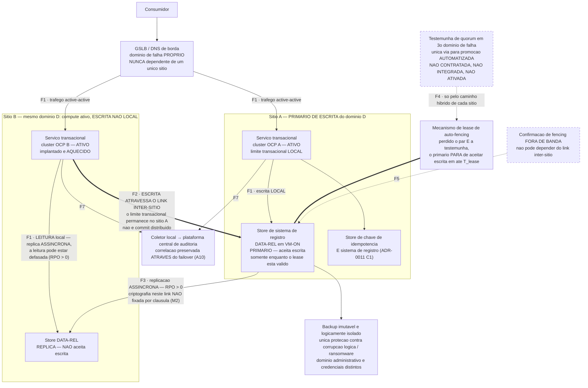
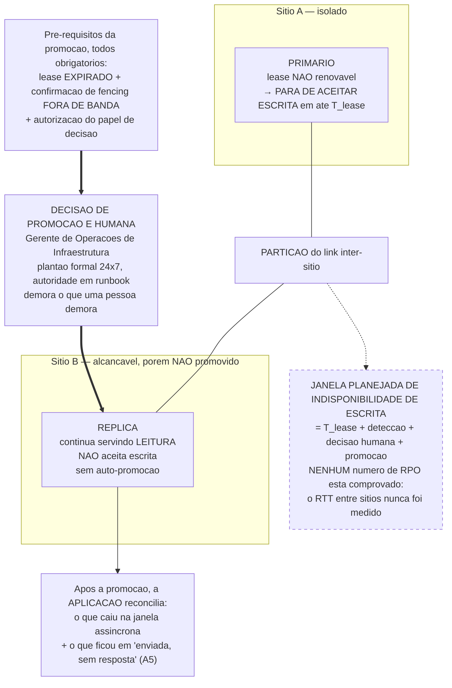

# AR-002 — Serviço transacional de sistema de registro no `DC-AA` active-active, com primário único de escrita e failover controlado

> **Leia esta frase antes de qualquer outra coisa nesta referência.** O `DC-AA` é active-active em infraestrutura, tráfego e leitura. **Ele não é active-active em escrita.** Cada domínio de dado tem exatamente um sítio primário de escrita, não há auto-promoção, e durante uma partição entre sítios o primário isolado **deixa de aceitar escrita**. Dois sítios ativos **não** são transparentes para a aplicação: esta referência existe para enumerar, cláusula por cláusula, o que cai na aplicação, e custa menos lê-la agora do que descobrir isso em produção.

> **Revogado nesta revisão 0.8, por D-20(c).** Esta AR realiza decisões que estão todas em status `proposta`, e pelo item de prontidão **R3** ela própria não pode passar de `proposta`. **R3 continua limitando o status e não o envio — mas isso deixou de ser o que decide o envio desta AR.** Por **D-20(c)** ([ARC-114](/ARC/issues/ARC-114#document-decisao-d20)), **`AR-002` não entra em pacote de comitê sem veredito APROVADO de prontidão** — a redação da 0.8, "enquanto G11 falhar", está **corrigida nesta revisão 0.11** (gate da 3ª rodada, §1.3(b)): G11 deixou de falhar na 0.10, e o que D-20(c) exige é o veredito do checklist, não G11 em si: o modelo operacional §7, item 2, exige o checklist de prontidão com veredito **APROVADO**, e um pacote sem algum item não é submetido. Uma falha de item do checklist não se cura nomeando-a na §13, e o item 8 do pacote (questões abertas) não serve para dispensar um item reprovado. **As onze ADRs que esta AR realiza não ficam retidas por ela:** a dependência de R3 corre da AR para as ADRs, não o inverso; cada ADR segue ao pacote quando receber APROVADO de prontidão, e, se o pacote das ADRs ficar pronto antes, o item 8 dele declara que a AR que as realiza está em preparação, com o estado de G11 nomeado. `AR-002` entra no ciclo seguinte. **A frase da 0.8 sobre espera "limitada a 10 dias úteis a partir das confirmações restritas abertas" é registro daquela revisão e não descreve o estado atual:** nenhuma confirmação restrita de G11 desta AR está pendente desde a 0.10, e o que resta é o veredito de prontidão da Etapa 4, cujo prazo não é desta AR fixar. Nada aqui está aprovado pelo Escritório; a aprovação final é do comitê de arquitetura do banco.

> **Atualização da revisão 0.10, e o limite dela.** Com o veredito de [ARC-156](/ARC/issues/ARC-156), **as cinco linhas obrigatórias de G11 passam a ter veredito do vocabulário contra texto publicado, e nenhuma confirmação restrita segue pendente** — pela conferência do Escritório, **G11 deixa de falhar nesta AR** (§13). **Isso não levanta D-20(c) por si.** O que D-20(c) exige é o checklist de prontidão com veredito **APROVADO**, e esse veredito é da **Etapa 4**, do **Governance Architect**, em [ARC-138](/ARC/issues/ARC-138) — não do Solution Architect, e não desta revisão. Enquanto ele não existir, esta AR **continua fora de pacote de comitê**, agora por falta do veredito de prontidão e não por G11. A conferência do Escritório é insumo para a Etapa 4, não substituto dela. Nada aqui é aprovação. **Atualização da revisão 0.12.** A revisão 0.11 **abriu** uma confirmação restrita nova, por ter tocado cláusula de mérito na §8.1; o veredito chegou **`concorda`**, sem correção pedida ([ARC-186](/ARC/issues/ARC-186)), e está transcrito no fim da §13. Com ele, **volta a ser verdade que nenhuma confirmação restrita segue pendente** nesta AR. O limite declarado acima **não muda**: continua faltando o veredito **APROVADO** de prontidão, que é da Etapa 4 e do Governance Architect ([ARC-138](/ARC/issues/ARC-138) / [ARC-177](/ARC/issues/ARC-177)), e esta AR continua fora de pacote de comitê. Nada aqui é aprovação.

## 0. Cabeçalho

| Campo | Valor |
| --- | --- |
| **ID da AR** | `AR-002` (reservado em [registro de decisões §8](/ARC/issues/ARC-2#document-decision-registry)) |
| **Status** | `proposta` |
| **Versão** | 0.13 |
| **Responsável** | Solution Architect |
| **Realiza as ADRs** | `ADR-0002`, `ADR-0006`, `ADR-0007`, `ADR-0008`, `ADR-0009`, `ADR-0010`, `ADR-0011`, `ADR-0012`, `ADR-0013`, `ADR-0014`, `ADR-0015`. **`ADR-0010` acrescentada nesta revisão:** a §2 (linha "Consumidores"), a §5 (linha `VM-ON`), a §5 (linhas `AGW-*`) e a §8.2 realizam `ADR-0010` C4 e C5 — chamada intra-sítio `OCP` ↔ `VM-ON` **não atravessa gateway**, e consumo east-west entre serviços internos segue C4/C5 em vez de borda externa |
| **Fatos consumidos, não realizados** | `ADR-0003` C4 e a correção de fatos de nuvem da [D-17(g)](/ARC/issues/ARC-10#document-handoff-comite-primeira-onda) são **citadas como fato** na §5, para justificar a exclusão das seis linhas de nuvem (AWS sem par regional in-country; par brasileiro do Azure com acesso restrito; OCI com `sa-saopaulo-1`/`sa-vinhedo-1`). Esta AR **não realiza** nenhuma cláusula de `ADR-0003`: consumir um fato de região para excluir uma plataforma não é implementar a cláusula que o fixa. `ADR-0005` não é realizada nem citada em cláusula alguma — nenhum componente deste arquétipo está em nuvem, e a tag `classe-criticidade` cobrada na §9 (itens 22 e 23) vem de `ADR-0009`, não de `ADR-0005` C1. O Cloud Architect permanece revisor obrigatório (§13) justamente para contestar esta leitura, se discordar |
| **Decisões ainda `proposta`** | **Todas as onze acima.** Nenhuma ADR realizada por esta AR está `aceita` nesta data. A reserva de Tier 0 de `ADR-0009` vive em §4.0/Q4 daquela ADR, por **D-7**: o mecanismo está especificado e o que falta é a evidência de teste do orçamento de RTO decomposto, além da medição de RTT de `ADR-0006` Q1. Por **R3**, esta AR permanece `proposta` até que as onze sejam aceitas. **R3 limita o status, não o envio — mas o envio desta AR está travado por outro item, e não por R3:** por **D-20(c)**, ela não entra em pacote de comitê enquanto **G11** falhar (§13), e as onze ADRs **não** esperam por ela ([registro §8](/ARC/issues/ARC-2#document-decision-registry)) |
| **Tier reivindicável (D-7)** | **No máximo Tier 1** na primeira onda. O mecanismo de Tier 0 desta referência — failover controlado, fencing por lease, confirmação fora de banda, orçamento decomposto de §4.0 — permanece como **alvo de desenho**, e um time que constrói hoje para pagamento ou liquidação deve construir contra ele para não refazer depois. **Nenhum workload construído a partir desta AR reivindica Tier 0**, por decisão **D-7** do Arquiteto Principal ([ARC-39](/ARC/issues/ARC-39#document-decisao-d7-d11)). A conformidade com `ADR-0009` C11 (herança de tier de serviço compartilhado) **não está verificada para tier algum** — inclusive Tier 1 — até o inventário de `ADR-0006` Q5 existir. Critério de saída de D-7 em §7 e na lacuna **M1** |
| **Substitui / Substituída por** | Nenhuma / Nenhuma |
| **Consumidor pretendido** | Time de entrega construindo, ou re-arquitetando, um serviço transacional que é **fonte autoritativa** de um domínio de dado de negócio no `DC-AA` — pelo teste positivo de `ADR-0011` C1 |
| **Maturidade** | `Apenas referência` — nenhum workload foi construído a partir desta AR, e nenhum dos cenários de failover da §7 foi exercitado |
| **Idioma** | Português do Brasil (conforme `PARAM-LANG`) |
| **Data de submissão ao comitê / resultado** | Não submetida / `pendente`. **Não vai no pacote das ADRs que realiza enquanto não houver veredito APROVADO de prontidão** (**D-20(c)**, revisão 0.8): não há pré-requisito de aceitação prévia das ADRs para o envio — o que depende da aceitação é a mudança de status desta AR (**R3**) —, mas há pré-requisito de **prontidão**, e ele não está cumprido. **Na revisão 0.10 o motivo mudou:** G11, pela conferência do Escritório, **deixou de falhar** (§13), e o que faltava era o veredito da **Etapa 4**. **Atualizado nesta revisão 0.11 pelo gate interno da 3ª rodada** ([ARC-139](/ARC/issues/ARC-139#document-handoff-comite-primeira-onda-r3), §0 e §1.3): esta AR passou à **classe F** — a substância dos itens do gate está atendida nas seções operativas e ela **não volta ao gate do Arquiteto Principal**. Duas condições governam o envio: **(i)** veredito **APROVADO** de prontidão do Governance Architect sobre a revisão corrigida — o veredito consolidado de 2026-10-07 06:29 em [ARC-138](/ARC/issues/ARC-138) é **REPROVADO, item G7**, e esta revisão corrige exatamente isso; **(ii)** por **D-24(k)**, ela vai ao comitê **junto com, ou depois de,** cada ADR `proposta` que realiza — na prática `ADR-0010`, `ADR-0011` e `ADR-0014`, devolvidas como `proposta` naquele gate —, e **nunca antes**. Estado de G11 na §13. Nada disso é aprovação |

**Documentos de referência:** [Template de AR](/ARC/issues/ARC-2#document-ar-template) · [Checklist de prontidão](/ARC/issues/ARC-2#document-readiness-checklist) · [Registro de decisões](/ARC/issues/ARC-2#document-decision-registry) · [Modelo operacional](/ARC/issues/ARC-2#document-operating-model) · [Catálogo de obrigações](/ARC/issues/ARC-8#document-catalogo-obrigacoes-regulatorias) · [Contrato de insumos](/ARC/issues/ARC-9#document-ar-001-ar-002-input-contract) · [`AR-001`](/ARC/issues/ARC-9#document-ar-001-api-exposta-externamente) · [Processo de exceção e waiver](/ARC/issues/ARC-2#document-exception-and-waiver-path)

## 1. Quando usar esta referência — e quando não usar

**Use esta referência quando todos estes forem verdadeiros:**

- O serviço é **fonte autoritativa** de um domínio de dado, pelo teste positivo de `ADR-0011` C1: é fonte de saldo, posição ou ledger; **ou** sua inconsistência silenciosa exigiria comunicação regulatória; **ou** alimenta contabilidade ou fechamento. Esse teste é positivo, **não** autodeclaração — um time não sai dele declarando que seu domínio "não é sistema de registro".
- O serviço roda no `DC-AA`, porque o fluxo de decisão de `ADR-0002` §4.3 o posicionou ali.
- O serviço precisa continuar operando com a perda de um sítio, e o time está disposto a **pagar o custo de aplicação** da §4.1.
- O domínio de dado é transacional, com limite de transação atômico identificável.

**Não a use quando qualquer um destes for verdadeiro:**

| Se … | Use em vez disso |
| --- | --- |
| O serviço é stateless e seu tema é **exposição externa**, não persistência | [`AR-001`](/ARC/issues/ARC-9#document-ar-001-api-exposta-externamente). As duas se compõem: `AR-001` cobre a borda, `AR-002` cobre o sistema de registro atrás dela |
| O domínio **não** é fonte de verdade — catálogo, sessão, cache derivado e reconstruível, documento semiestruturado, telemetria, busca | Nenhuma AR. `ADR-0011` C3 permite motor não relacional por padrão e **nenhuma** das cláusulas de topologia de C4–C6 se aplica. Não pague o custo desta referência sem precisar |
| O workload foi posicionado em nuvem pelo fluxo de `ADR-0002` §4.3 | Nenhuma AR existe para sistema de registro em nuvem. `ADR-0011` C4/C5 estende as proibições de multi-master e de 2PC a **qualquer** par de ambientes, inclusive cross-cloud e híbrido; `ADR-0009` Q3 impede reivindicar Tier 0/1 em nuvem sem confirmação de capacidade de teste; `ADR-0009` Q6 registra que AWS e Azure não têm par regional in-country adequado. Levante intake |
| O domínio transporta ou armazena **dado de portador de cartão** | **Esta referência, na Variante CDE da §5.2.** Nuvem está proibida: `ADR-0011` C7 restringe a persistência ao enclave aprovado e a Q2 daquela ADR confirma que nenhuma landing zone de nuvem tem enclave aprovado |
| O serviço precisa de **escrita simultânea nos dois sítios** para o mesmo domínio | Nada existe, e nada vai existir. É proibido por `ADR-0006` C2/C4 e `ADR-0011` C4/C6, e o motivo está declarado: dois lados aceitando escrita durante uma partição produzem dois livros-razão. Se o requisito de negócio for real, o caminho é intake e uma ADR sucessora, não um desenho local |
| O serviço precisa de consistência atômica entre dois domínios cujos primários estão em sítios diferentes | Nada existe. `ADR-0006` C11 exige que domínios transacionalmente acoplados compartilhem o primário e façam failover juntos; primários em sítios diferentes **são**, na prática, uma transação cross-sítio e violam C5 |
| O serviço é um cluster OpenShift ou um motor de dado esticado entre os dois sítios | Nada existe. `ADR-0006` §1.1.1 decide **um cluster por sítio, não esticado**, e explica por quê: com apenas dois domínios de falha, um control plane esticado não forma terceiro voto durante uma partição |

**Anti-padrões que esta referência existe para prevenir:**

- Tratar "dois sítios ativos" como redundância obtida de graça. É a suposição que `ADR-0006` §1 nomeia explicitamente como falsa e existe para corrigir.
- Configurar replicação multi-master porque é o default de instalação do produto. `ADR-0011` C4 nomeia exatamente esse caminho: produtos não relacionais frequentemente a oferecem como default, e um time a liga sem saber que está violando `ADR-0006` C4.
- Configurar o motor em modo de replicação síncrona entre sítios. Proibido por `ADR-0006` C7 e `ADR-0011` C11 até o RTT ser medido e publicado.
- Usar `sequence`/`auto-increment` por sítio, ou gerador de ID distribuído independente por sítio, para o mesmo domínio. Proibido por `ADR-0006` C12 e `ADR-0011` C12 — eles colidem após failover ou durante partição.
- Coordenar os dois sítios com lock distribuído, ou commit de negócio com 2PC cross-sítio. Proibidos por `ADR-0006` C13 e C5.
- Desenhar escrita sem chave de idempotência durável. Em um failover, o cliente reenvia; sem a chave, o failover **produz** duplicidade de transação financeira.
- Assumir que a trilha de auditoria correlaciona sozinha uma transação que trocou de sítio. A plataforma de log não inventa o identificador depois — propagá-lo é trabalho da aplicação (`ADR-0015` C8).
- Implantar o serviço em um só cluster `OCP` e contar com failover. Não existe: os clusters não são esticados.
- Confiar em réplica como proteção contra corrupção lógica ou ransomware. `ADR-0009` C8 é explícito: a replicação **propaga** corrupção; o controle é o backup imutável e logicamente isolado.

## 2. O arquétipo de workload

| Atributo | Valor desta referência | Base declarada |
| --- | --- | --- |
| Forma funcional | Serviço transacional de sistema de registro: recebe comando de escrita, aplica regra de negócio, persiste de forma atômica, emite evento de auditoria | Teste positivo de `ADR-0011` C1 |
| Perfil de transação | Escrita transacional é a razão de existir do serviço; leitura de consulta e de saldo em volume maior | Envelope de desenho declarado pelo autor |
| Taxa dimensionada | **100–600 TPS de escrita** e **até 3.000 TPS de leitura**, por domínio de dado, no sítio primário | **Envelope de desenho declarado pelo autor.** Não derivado de medição de sistema em produção — o Escritório não a tem. Um time fora dessa faixa deve tratar §5 e §11 como não dimensionadas para o seu caso e levantar intake. Fechar esta linha com base medida é a **Q1** da §10.4 |
| Latência do commit local | p95 ≤ 50 ms no commit dentro de um sítio | Envelope de desenho declarado pelo autor. **Não há número para commit entre sítios, porque commit entre sítios é proibido** (`ADR-0006` C5) e o RTT inter-sítio não foi medido (`ADR-0006` Q1) |
| Tamanho do domínio de dado | ≤ 2 TB por domínio, com crescimento ≤ 20% ao ano | Envelope de desenho declarado pelo autor; relevante para o RTO de restauração de `ADR-0009` C9 (≤ 4 h no Tier 0) |
| Sensibilidade do dado | Dado pessoal (`OBL-LGPD`): cadastral e transacional atribuível a titular. Na Variante CDE, dado de portador de cartão | §8 |
| Tier de criticidade | **Alvo de desenho: Tier 0** — core bancário, pagamentos, liquidação (`ADR-0009` §4). **Tier reivindicável na primeira onda: no máximo Tier 1**, por decisão **D-7** ([ARC-39](/ARC/issues/ARC-39#document-decisao-d7-d11)) — o mecanismo de Tier 0 continua sendo o que esta referência desenha, mas nenhum workload construído a partir dela declara Tier 0 antes do critério de saída de §7. Tier 1 também está sujeito a `ADR-0009` C11, e essa conformidade **não está verificada para tier algum** | `ADR-0009` §4 e C11; **D-7**; o tier vem da criticidade de negócio, **não** do CDE (decisão D-3 daquela ADR) |
| Dado de portador de cartão | Variante padrão: **não**. Variante CDE: **sim** — ver §5.2 e a Q2 da §10.4 | `ADR-0011` C7/C8; `ADR-0006` C8 |
| Consumidores | Serviço de canal via [`AR-001`](/ARC/issues/ARC-9#document-ar-001-api-exposta-externamente); serviços internos east-west por `ADR-0010` C4/C5 | Escopo da task [ARC-9](/ARC/issues/ARC-9) |

## 3. Visão geral da arquitetura

### 3.1 Visão lógica

**Atores e papéis organizacionais — não são componentes desta referência.** Ficam em tabela separada porque não têm plataforma da §5: o banco não os implanta como componente, e preencher a coluna de plataforma obrigaria a inventar um valor. A tabela de componentes abaixo é a que o item de prontidão **R6** governa.

| Ator / papel | Função nesta referência | Onde vive | Responsável |
| --- | --- | --- | --- |
| Papel de decisão de promoção de sítio | Autoriza a promoção manual do sítio primário, pelo runbook, depois de lease expirado e fencing confirmado | **Organizacional** — **Gerente de Operações de Infraestrutura, em escala formal de plantão 24x7**, com autoridade delegada documentada em runbook (`ADR-0006` C10) | Infrastructure Architect (conteúdo arquitetural do runbook), com o Gerente de Operações de Infraestrutura como dono operacional — **D-10**, ver §10.3 **M3** |
| Time de entrega | Constrói o serviço, o store e o procedimento de reconciliação; responde pelas obrigações A1–A15 da §4.1 | Organizacional | Time dono do domínio de dado |
| Dono do dado / compliance PCI-DSS do banco | Fornece a classificação que determina a variante da §5.2 | Organizacional | Fora do Escritório — §10.4, Q2 |

**Componentes.** Cada linha nomeia **uma** plataforma da lista canônica da §5 e **um** responsável — correção do **R6** apontado em [ARC-37](/ARC/issues/ARC-37) e fixado pelo precedente de **R6** da [D-17(A)](/ARC/issues/ARC-10#document-handoff-comite-primeira-onda). Onde o componente é legitimamente multi-plataforma, a linha é **decomposta por plataforma**, em vez de descrever o padrão de distribuição em prosa; qualificador de sítio ou de zona entre parênteses não substitui a plataforma canônica. `N/A — plano de controle do provedor <nuvem>` vale **somente** para componente inteiramente gerenciado pelo provedor, sem nada implantado pelo banco, e com o motivo declarado — nesta referência **nenhuma linha o usa**, porque nenhum componente deste arquétipo é plano de controle de provedor.

| Componente | Responsabilidade | Plataforma (da §5) | Responsável |
| --- | --- | --- | --- |
| Serviço transacional (compute) | Aplica a regra de negócio; executa a escrita em um único limite transacional local; propaga o identificador de correlação; trata idempotência e o estado "enviada, sem resposta" | `OCP` — **um cluster por sítio, implantado nos dois** | Time de entrega |
| Store de sistema de registro | Fonte autoritativa do domínio de dado; primário único de escrita; réplica no sítio par | `DATA-REL` em `VM-ON`, nos dois sítios | Time de entrega, com revisão do Technical Architect em caso de desvio de `ADR-0011` C2 |
| Store de chave de idempotência / controle de duplicidade | Fonte autoritativa do estado transacional em voo | `DATA-REL` em `VM-ON` — **é sistema de registro** por `ADR-0011` C1 e segue `ADR-0008` C8 | Time de entrega |
| Mecanismo de lease de auto-fencing | O primário só aceita escrita enquanto mantém lease renovado com o sítio par ou com a testemunha de quorum; perdendo os dois, para de aceitar escrita em até `T_lease` | `DC-AA` (instância simétrica em cada um dos dois sítios) | Infrastructure Architect (`ADR-0006` C9a) |
| Caminho de confirmação de fencing fora de banda — terminação on-premises | Termina em cada sítio o caminho por onde o isolamento do antigo primário é confirmado **sem** depender do link inter-sítio; registra a evidência | `DC-AA` (rede de gerência de cada sítio) | Infrastructure Architect (`ADR-0006` C9b) |
| Caminho de confirmação de fencing fora de banda — trânsito | Transporta a confirmação por rota que **não** é o link inter-sítio: caminho híbrido de cada sítio, ou operadora distinta da do link inter-sítio. **Acrescentado na revisão 0.8, por `ADR-0006` C14:** este caminho é classificado como ***connected-to*** o CDE e **não pode compartilhar VRF nem túnel lógico com o segmento dedicado do fluxo de replicação de dado de cartão** (C8) sem segmentação lógica dedicada — se compartilhar, ele e os seus pontos de terminação entram no CDE. Evidência no item **40-bis** da §9; efeito de escopo na §8.1 | `DC-AA` (circuito híbrido próprio de cada sítio, `ADR-0007` C1/C11) | Infrastructure Architect (`ADR-0006` C9b/**C14**) — custo nomeado na §11 |
| Testemunha de quorum em terceiro domínio de falha | Única via para promoção automatizada. Alcançável por cada sítio **exclusivamente** pelo seu próprio caminho híbrido, nunca pelo link inter-sítio nem através do outro sítio. **Não recebe dado de negócio** | `OCI-VM` em `sa-saopaulo-1` — plataforma da especificação aprovada pelo board em 2026-10-05 ([ARC-46](/ARC/issues/ARC-46), [ARC-42](/ARC/issues/ARC-42)), coerente com a posição de `ADR-0006` **§4.1** ([ARC-31](/ARC/issues/ARC-31)), que declara AWS, Azure e OCI **tecnicamente viáveis** com **preferência por OCI, região São Paulo, por residência** — e não por inviabilidade técnica das outras duas (ponteiro acrescentado nesta revisão 0.4 a pedido do Cloud Architect, [ARC-94](/ARC/issues/ARC-94), para que quem copie a referência não trate a plataforma como decisão pendente do zero); o board admitiu Azure ou AWS como alternativa se o banco preferir consolidar fornecedor, e nesse caso a linha passa a `AZR-VM` ou `AWS-VM`. **Componente de infraestrutura compartilhada, não deste workload**, e por isso a §5 mantém as linhas de nuvem como `Não` para o arquétipo | Infrastructure Architect — **contratação e financiamento aprovados pelo board em 2026-10-05; ainda não contratada nem integrada** (`ADR-0006` Q2, Q6). Ver §10.3 **M3** e §11 |
| GSLB / DNS de borda | Redireciona tráfego de entrada ao sítio correto após a promoção. Exigência de desenho: domínio de falha próprio, **nunca** dependente de um único sítio | `DC-AA` (domínio de falha próprio, fora dos dois sítios de aplicação) | Infrastructure Architect (`ADR-0006` §1.1) |
| Backup imutável e logicamente isolado | Única proteção contra corrupção lógica e ransomware — a replicação a **propaga**. Exigências de desenho: domínio administrativo e credenciais distintos de produção, sem reuso de conta ou segredo; imutabilidade com trava de tempo; retenção **finita, efetivamente configurada no mecanismo e declarada** no inventário de `ADR-0009` Q5, com piso de 35 dias corridos e **justificativa nomeada** para retenção adicional em domínio com dado pessoal **ou domínio no CDE** (`ADR-0009` C8 revisada por D-13 e por **D-21**) — a extensão ao domínio no CDE é de **D-21** e, até esta revisão 0.11, constava só do item 25-bis da §9 (gate da 3ª rodada, §1.3(c)) | `VM-ON` (plataforma de backup on-premises, em domínio administrativo distinto do de produção e isolado dos dois sítios) | Infrastructure Architect (`ADR-0009` C8) |
| Processo de reconciliação entre sítios — execução | Descobre o que caiu na janela de replicação assíncrona e o que ficou no estado "enviada, sem resposta". Operado após a promoção | `OCP` | **Time de entrega** — ver §4.1, obrigação A5 |
| Processo de reconciliação entre sítios — estado de controle | Guarda o progresso e o resultado da reconciliação. **É estado**, e por `ADR-0008` C8 não fica em container | `VM-ON` | **Time de entrega** — ver §4.1, obrigação A5 |
| Registro de eliminações de titular pendentes / decididas | Fonte de verdade de quais pedidos de eliminação sob LGPD foram decididos antes de um ponto de corrupção, para que a reaplicação de `ADR-0009` C10(a) tenha contra o quê medir. **MUST sobreviver ao mesmo incidente que corrompeu o store primário** — ou seja, não pode viver apenas dentro do motor restaurado | `VM-ON`, **fora do domínio de dado restaurado**, com cópia no backup imutável de C8 | **Lacuna aberta, nomeada nesta revisão:** nem `ADR-0009` nem `ADR-0011` nomeiam onde esse registro vive nem sua própria resiliência — ressalva do Technical Architect em [ARC-56](/ARC/issues/ARC-56), **aqui parafraseada em estilo de cláusula, não citada** (o texto literal do revisor está no passo 5 do Fluxo 5, §4.6). **Rótulo corrigido nesta revisão 0.5 a pedido do revisor ([ARC-103](/ARC/issues/ARC-103))**, que recusou a palavra "literal" onde não há aspas fiéis ao original. Encaminhada ao runbook de teste de `ADR-0009` C10 (Infrastructure Architect) e ao fluxo de direitos do titular ([ARC-50](/ARC/issues/ARC-50), Solution Architect). Ver §10.3 **M5** |
| Emissor de identidade de workload — no cluster | Emite a identidade local do serviço no cluster (conta de serviço com token projetado), **simetricamente nos dois sítios** | `OCP` | Security Architect (`ADR-0012` C4) |
| Emissor de identidade de workload — autoridade local | Autoridade certificadora / emissor OIDC interno que emite a credencial verificável de curta duração usada entre serviço e store. **MUST existir simetricamente nos dois sítios**: a federação de identidade de workload não pode depender de um único sítio | `DC-AA` (instância simétrica em cada um dos dois sítios) | Security Architect (`ADR-0012` C5, §4.1 `DC-AA`) |
| Gestor de segredos | Custódia dos segredos do serviço e da credencial dinâmica de acesso ao store | `DC-AA` — **produto não escolhido**: `ADR-0013` Q2 não escolhe o gestor de segredos do `DC-AA`, e esta AR não o escolhe por ela | Security Architect (`ADR-0013` **C4 e C5**). **Citação corrigida nesta revisão 0.4**, por discordância do Security Architect ([ARC-92](/ARC/issues/ARC-92)): a 0.3 citava `ADR-0013` **C1**, que governa a custódia de **chave de criptografia de dado em repouso** via KMS/HSM, não o gestor de segredos. A responsabilidade descrita nesta linha é de **C4** (segredo de aplicação em gestor de segredos dedicado por ambiente) e de **C5** (credencial dinâmica de curta duração emitida pelo gestor) |
| HSM / gestão de chaves | Custódia das chaves de dado em repouso e, na Variante CDE, da chave de dado de cartão, com backup de chave replicado ao sítio pareado. **Um HSM único compartilhado pelos dois sítios é violação de `ADR-0006` C1** | `DC-AA` (domínio de falha próprio por sítio) | Security Architect (`ADR-0013` C2, C6, C10) |
| Coletor local de log — `OCP` | Normaliza e encaminha evento de auditoria e de segurança à plataforma central, com buffer store-and-forward. Um por cluster, nos dois sítios | `OCP` | Security Architect (`ADR-0015` C4) |
| Coletor local de log — `VM-ON` | Mesma responsabilidade nos hosts do motor de dado, do store de idempotência e do registro de eliminações pendentes. Nos hosts da Variante CDE, é ele próprio sistema em escopo PCI | `VM-ON` | Security Architect (`ADR-0015` C4) |
| Plataforma central de trilha de auditoria | Repositório autoritativo do evento de auditoria e de segurança, correlacionável **através** do failover | `DC-AA`, active-active — **não existe hoje** e seu próprio tier de DR está pendente (`ADR-0015` C3, Q5) | Security Architect (`ADR-0015` C2/C3) |

### 3.2 Diagrama

**Um diagrama desta referência precisa mostrar assimetria de escrita, não dois sítios espelhados.** Um desenho simétrico comunicaria exatamente a falsidade que esta AR existe para corrigir, e por isso os dois diagramas abaixo deliberadamente **não** são simétricos: o sítio B aparece menor em função, não em infraestrutura. Eles são derivados da §3.1, da §3.3, dos fluxos da §4 e das tabelas da §7 — se um diagrama divergir daquelas tabelas, **a tabela vence e o diagrama é defeito a corrigir**. As arestas carregam a fronteira (`F1`–`F8`) da §3.3.

Cadeia padrão, em uma linha: `consumidor → serviço no cluster OCP do sítio que recebeu o tráfego → store primário de escrita do domínio (que pode estar no outro sítio) → réplica assíncrona no sítio par`, com lease de fencing ativo e evento de auditoria correlacionado em cada passo.

#### D1 — Operação normal: tráfego e compute active-active, escrita em primário único site-pinned

Leia as duas arestas que saem de `SVC-B`: a leitura fica no próprio sítio, a **escrita atravessa para o sítio A**. É isso que "active-active" significa aqui, e nada além disso.

#### D2 — Partição entre sítios: a janela em que **ninguém escreve**

Este é o diagrama que o time precisa ver antes de prometer disponibilidade ao negócio. Durante a partição não existe primário aceitando escrita: o antigo primário se auto-cerca em `T_lease`, e o sítio B **não** se promove sozinho porque a testemunha não está ativada.

**Convenção dos diagramas:** aresta grossa (`==>`) é o ponto onde a assimetria de escrita ou a intervenção humana aparece — é o que distingue esta topologia de um par espelhado. Traço tracejado é **dependência ou objetivo que nenhuma cláusula hoje garante**: a testemunha de quorum (não contratada), o caminho de confirmação fora de banda, e a janela de indisponibilidade, cujo tamanho não é um número provado. Nenhuma caixa tracejada pode ser tratada como pronta por um time que copia esta referência.

### 3.3 Fronteiras de confiança

Zonas conforme `ADR-0014` C1.

| # | Fronteira | O que a atravessa | Controle, e de qual cláusula |
| --- | --- | --- | --- |
| F1 | Zona de Aplicação → Zona de Dados, **dentro de um sítio** | Comando de escrita e consulta do serviço | Default-deny na borda da zona (`ADR-0014` C3); microssegmentação leste-oeste dentro da zona (C4); acesso origina-se apenas da zona imediatamente anterior (`ADR-0014` §4.1 `DATA-REL`); credencial dinâmica de curta duração ou identidade de workload federada (`ADR-0012` §4.1, `ADR-0013` C5) |
| F2 | Zona de Aplicação do sítio A → Zona de Dados do sítio B | Escrita quando o primário do domínio está no **outro** sítio | Atravessa o link inter-sítio. **Limite transacional permanece em um único sítio** — o que atravessa é a conexão ao primário, não um commit distribuído (`ADR-0006` C5). As zonas são espelhadas simetricamente nos dois sítios (`ADR-0014` §4.1 `DC-AA`) |
| F3 | Replicação entre sítios | Fluxo de replicação do store | **Assíncrono, RPO > 0** (`ADR-0006` C7, `ADR-0011` C11). Na Variante CDE, roda **dentro de um segmento CDE dedicado** (`ADR-0006` C8). Dois caminhos fisicamente diversos no link inter-sítio (C6). **Criptografia em trânsito neste link não está fixada por cláusula** — ver §10.3, **M2** |
| F4 | Cada sítio → testemunha de quorum em nuvem | Confirmação de quorum para promoção automatizada | Alcançável por cada sítio **exclusivamente** pelo seu próprio caminho híbrido, nunca pelo link inter-sítio nem através do outro sítio (`ADR-0006` C10). Exige egress/borda dedicada por sítio e roteamento sem redistribuição cross-sítio (`ADR-0006` Q6). **Não ativada em produção** |
| F5 | Caminho de confirmação de fencing fora de banda | Confirmação de isolamento do antigo primário | Não pode depender do link inter-sítio (`ADR-0006` C9b) |
| F6 | Zona de Gestão → store, cluster, mecanismo de promoção | Acesso administrativo humano, inclusive o ato de promoção | Identidade federada com MFA resistente a phishing para privilégio; PAM com elevação just-in-time e sessão registrada (`ADR-0012` C2/C3); na Variante CDE, acesso administrativo **só** da Zona de Gestão (`ADR-0014` C6) |
| F7 | Qualquer componente → coletor local → plataforma central | Evento de auditoria e de segurança | Mascaramento na origem; PAN e dado de autenticação sensível nunca gravados; plataforma central é sistema conectado ao CDE (`ADR-0015` C5, C6, C14) |
| F8 | **Variante CDE** — fronteira do enclave | Dado de portador de cartão | Segmentação aprovada cobre os **dois** sítios **e** o caminho de replicação entre eles; um enclave de um sítio só não satisfaz a cláusula (`ADR-0011` C7). Segmentos do CDE existem de forma **simétrica e permanente** nos dois sítios, geridos como código a partir de uma única fonte, e **o failover não altera nenhuma regra de segmentação** (`ADR-0006` C8) |

## 4. Fluxos de ponta a ponta

### 4.1 O custo de aplicação, antes dos fluxos

A acceptance criteria desta task é explícita, e com razão: *uma referência que implica que dois sites são transparentes para a aplicação é pior do que nenhuma referência.* Portanto esta seção vem **antes** dos fluxos. Cada obrigação abaixo cai na aplicação. Nenhuma camada de infraestrutura a resolve, e nenhuma delas é escolha de estilo.

| # | Obrigação que cai na aplicação | Por que a infraestrutura não resolve | Cláusula que a origina |
| --- | --- | --- | --- |
| **A1** | **Idempotência de toda operação de escrita, com chave de idempotência durável.** O store da chave é, ele próprio, sistema de registro | Em um failover o cliente reenvia. Sem chave de idempotência, o failover **produz** duplicidade de transação financeira. E o store da chave não é um cache: se sua perda causa pagamento duplicado ou perdido, ele é sistema de registro por definição | `ADR-0011` C1 (último período), C3 (definição de "cache"); `ADR-0008` C8 |
| **A2** | **Limite de transação inteiramente dentro de um sítio.** Nenhum commit de negócio atravessa sítios | Transação distribuída síncrona entre dois sítios paga RTT em cada commit e transforma uma falha de link em indisponibilidade dos **dois** lados. 2PC cross-sítio é proibido como padrão de design, independentemente do que o link suportar | `ADR-0006` C5; `ADR-0011` C5 |
| **A3** | **Afinidade de dado por chave de negócio ao sítio primário daquele domínio.** A aplicação precisa saber **onde escrever**, e isso muda após um failover | Escrita concorrente na mesma conta nos dois sítios é conflito de dado, e nenhuma camada de replicação o resolve sem perder uma das escritas. Com primário único por domínio, a aplicação precisa descobrir e seguir o primário corrente | `ADR-0006` C2; `ADR-0011` C6 |
| **A4** | **Tratamento explícito da escrita recusada por lease expirado.** Durante uma partição, o primário isolado **para de aceitar escrita** em até `T_lease` — e isso não é um erro transitório a retentar indefinidamente | É o comportamento desejado, não uma falha. A aplicação precisa de um estado de primeira classe para "escrita recusada porque este sítio não é mais autorizado", distinto de "indisponível" e de "rejeitado por regra de negócio" | `ADR-0006` C9a |
| **A5** | **Reconciliação e detecção de divergência entre sítios, após a promoção.** Alguém precisa descobrir o que caiu na janela de replicação | A replicação entre sítios é assíncrona com RPO > 0 e permanecerá assim até o RTT ser medido. A janela de perda existe por construção; a infraestrutura informa o lag, não reconcilia transação de negócio | `ADR-0006` C7; `ADR-0011` C11; `ADR-0009` C10(b) |
| **A6** | **Tratamento do estado "enviada, sem resposta"** para toda transação em voo no instante do corte | Esse estado existe sempre. A aplicação precisa de reconciliação, não de esperança. O cliente externo não sabe se a transação foi aplicada | `ADR-0006` §1.1 (linha "Site completo"); `ADR-0009` C10(b) |
| **A7** | **Geração de identificador coordenada, sem gerador independente por sítio** — nem `sequence`/`auto-increment` por sítio, nem gerador de ID distribuído não coordenado, para o mesmo domínio | Geradores independentes por sítio **colidem ou se sobrepõem** após um failover ou durante uma partição. A consequência prática: a aplicação usa identificador emitido pelo primário corrente, ou um esquema globalmente único por construção — e essa é decisão de desenho de aplicação | `ADR-0006` C12; `ADR-0011` C12 |
| **A8** | **Nenhum lock distribuído cross-sítio como mecanismo de coordenação.** A exclusão mútua entre instâncias nos dois sítios precisa ser obtida de outra forma — tipicamente pelo próprio primário de escrita | O link inter-sítio não é confiável o suficiente para estar no caminho crítico de um lock, pela mesma razão que proíbe 2PC | `ADR-0006` C13; `ADR-0011` C14 |
| **A9** | **Declaração explícita do acoplamento transacional entre domínios de dado.** Domínios acoplados compartilham o primário e fazem failover **juntos** | Domínios acoplados com primários em sítios diferentes **são**, na prática, uma transação cross-sítio e violam C5. A infraestrutura não descobre o acoplamento — só a aplicação o conhece | `ADR-0006` C11; `ADR-0011` C13 |
| **A10** | **Propagação do identificador de correlação, com ordenação e deduplicação, através do failover** | Correlacionar uma transação que trocou de sítio exige que a aplicação **carregue** o identificador; a plataforma de log não o inventa depois. O contrato do evento vem de `ADR-0015` C8; carregá-lo é custo de aplicação | `ADR-0015` C8 |
| **A11** | **Mascaramento ou tokenização de dado sensível na origem**, dentro da instrumentação da própria aplicação | `ADR-0015` §5 declara que mascaramento na origem é mais invasivo do que no pipeline por escolha deliberada: exige tocar a instrumentação de cada aplicação, em troca de não haver escopo residual. O custo é da aplicação | `ADR-0015` C5, C6, C7 |
| **A12** | **Deployment do serviço nos dois clusters `OCP`, por configuração declarativa replicada, aquecido antes do incidente** | Os clusters são um por sítio, **não esticados**. Workloads não migram automaticamente num failover de sítio; a reconciliação de onde cada workload roda depende de configuração declarativa replicada, não de um control plane compartilhado | `ADR-0006` §1.1.1 |
| **A13** | **Degradação consciente de Tier 2/3 próprio.** Se o serviço tem componentes de tiers distintos, os de Tier 2/3 podem ser descartados no failover | O sítio remanescente garante capacidade para 2× a carga Tier 0/1 própria; **Tier 2/3 não tem garantia de capacidade** e pode ser descartado ou degradado. A aplicação precisa suportar perder esses componentes sem corromper a transação | `ADR-0009` §4.0 (linha de capacidade) |
| **A14** | **Participação no teste de failover na cadência do tier**, produzindo RTO e RPO **medidos** | `ADR-0009` C10 exige cenários nomeados, método de medição de RPO por lag capturado no instante do corte **e reconciliação de transações pós-restauração** — nunca estimado. Essa reconciliação é código e procedimento da aplicação | `ADR-0009` C2, C3, C10 |
| **A15** | **Cenário de restauração após corrupção lógica**, no teste do tier, com RPO próprio distinto do RPO de failover. **Acrescentado nesta revisão, por `ADR-0009` C9/C10 revisadas (D-12):** (i) o relógio do RTO de restauração corre até a **liberação do ambiente para consumo** — rota de aplicação religada, consumidor religado — e não até o fim da cópia de dados; (ii) quando o workload estiver sujeito a eliminação de titular, a **reaplicação das eliminações pendentes é passo obrigatório antes da liberação**, exercitada com volume representativo e **medida como componente separado**, e o total (restauração + reaplicação) é o que se compara ao alvo; (iii) se o mesmo incidente atingir serviço do qual a liberação depende — GSLB/DNS, emissor de identidade local, gestor de segredos, HSM — a recuperação desse serviço conta **dentro** do orçamento de RTO do workload. **Ressalva do Technical Architect ([ARC-56](/ARC/issues/ARC-56)), transcrita:** a reaplicação pressupõe um registro confiável de quais eliminações estavam decididas antes do ponto de corrupção, **que sobreviva ao mesmo incidente** — ver a linha correspondente na §3.1 e **M5** | `ADR-0009` C8, C9, C10(a)/(b)/(c) |

**Três consequências que decorrem da tabela e que um time precisa internalizar:**

1. **Existe uma janela planejada de indisponibilidade de escrita.** Não é um defeito a corrigir: é o trade-off que `ADR-0006` §4 aceita deliberadamente, em troca de eliminar split-brain de dado financeiro. Sua duração é `T_lease` + decisão humana + fencing + promoção + redirecionamento, e o alvo Tier 0 para a soma é ≤ 15 min — **sem evidência de teste medida** (`ADR-0009` §4.0).
2. **A decisão de promover é humana e demora o que uma pessoa demora.** Promoção automatizada exige testemunha de quorum em terceiro domínio de falha, que não está contratada nem integrada (`ADR-0006` Q2/Q6). A via padrão é o Gerente de Operações de Infraestrutura em plantão 24x7.
3. **Nenhum número de RPO desta referência está comprovado.** Até o RTT ser medido, a replicação é assíncrona com RPO > 0, e o RPO alvo de 1 min do Tier 0 é meta, não capacidade.

### 4.2 Fluxo 1 — Caminho feliz (transação de escrita, operação normal)

**Limite de transação:** um único commit no store primário do domínio, **dentro de um sítio**. **Síncrono:** passos 1–8. **Assíncrono:** passos 9–11. **Onde o estado vive:** no store primário, com réplica assíncrona no sítio par; a chave de idempotência vive em seu próprio store de sistema de registro.

1. O comando chega ao serviço, no cluster `OCP` do sítio que recebeu o tráfego — que **não é necessariamente** o sítio do primário de escrita daquele domínio.
2. O serviço extrai ou recebe a **chave de idempotência** do comando (A1).
3. O serviço consulta o store de controle de duplicidade. Se a chave já foi aplicada, devolve o resultado registrado e **não reexecuta** — este passo é o que torna o reenvio do passo 7 do Fluxo 3 seguro.
4. O serviço resolve o **sítio primário de escrita corrente** do domínio (A3) e abre a conexão ao store primário, atravessando F1 ou F2.
5. O serviço valida a regra de negócio e executa a escrita em **um único commit local** (A2). O primário só aceita a escrita porque mantém lease válido (`ADR-0006` C9a).
6. O serviço persiste o resultado associado à chave de idempotência, no mesmo limite transacional quando o motor permitir, ou com o store de chave como sistema de registro próprio sob `ADR-0011` C1.
7. O serviço emite o evento de auditoria de transação de negócio: identidade de workload, identificador de correlação propagado (A10), timestamp de fonte sincronizada, dado sensível já mascarado na origem (A11).
8. A resposta retorna ao consumidor.
9. A replicação **assíncrona** leva a escrita ao sítio par. **O passo 8 não espera o passo 9** — e é exatamente por isso que o RPO é > 0.
10. O coletor local encaminha o evento à plataforma central no `DC-AA` (`ADR-0015` C4).
11. Evento de segurança de severidade alta chega ao monitoramento em ≤ 5 min (`ADR-0015` C12).

### 4.3 Fluxo 2 — Caminho de falha primário: perda do store primário dentro de um sítio

**Limite de transação:** a transação em curso aborta e não é parcialmente aplicada. **Síncrono:** passos 1–6. **Onde o estado vive:** inalterado — o primário permanece naquele sítio se a falha for de um nó e não do sítio.

Falha mais provável deste arquétipo não é a perda de um sítio inteiro — é a perda do nó primário do motor de dado, ou de um array de storage (`ADR-0006` §1.1).

1. O motor perde o nó primário, ou o array que hospeda os volumes do domínio.
2. A transação em curso **aborta**. O serviço recebe erro de escrita.
3. O serviço devolve ao consumidor um erro **retentável**, distinto do estado A4 (escrita recusada por lease).
4. Se o motor tem réplica local no mesmo sítio, a recuperação é intra-sítio e não envolve failover entre sítios — este é o caso esperado e o mais barato.
5. Se **não** houver réplica local, o domínio depende do dado replicado para o outro sítio, segundo o RPO do seu tier, e o caso passa para o Fluxo 3.
6. **O que o consumidor experimenta:** erro explícito. Ele reenviará. O passo 3 do Fluxo 1 garante que o reenvio não duplique — **se e somente se** A1 estiver implementada.

### 4.4 Fluxo 3 — Failover de sítio: perda de um lado do `DC-AA`

Este é o fluxo pelo qual esta referência existe. **Postura declarada:** infraestrutura e leitura **active-active**; compute do serviço **active-active** (implantado nos dois clusters); **escrita site-pinned** ao primário do domínio. **Limite de transação:** permanece em um único sítio, antes e depois da promoção. **Síncrono:** passos 1–4 e 9–11. **Assíncrono:** replicação (interrompida no passo 3) e reconciliação (passo 12).

1. O sítio A é perdido (`ADR-0006` §1.1, linha "Site completo").
2. O GSLB/DNS de borda, que tem domínio de falha próprio, redireciona o tráfego de entrada ao sítio B.
3. As instâncias do serviço no cluster `OCP` do sítio B absorvem a carga — **somente porque A12 foi cumprida**. Se o serviço estava implantado em um só cluster, ele não existe no sítio B e nada que a infraestrutura faça o traz de volta.
4. **Se o primário de escrita do domínio estava no sítio A, a escrita para.** Não há auto-promoção (`ADR-0006` C3). A leitura continua onde houver réplica.
5. **Auto-fencing:** o primário no sítio A, perdendo o lease com o par e com a testemunha, deixa de aceitar escrita em até `T_lease` (`ADR-0006` C9a). A aplicação no lado A vê o estado A4.
6. **Confirmação de fencing fora de banda:** o isolamento do antigo primário é confirmado por caminho que não depende do link inter-sítio, e a evidência é registrada (`ADR-0006` C9b). **Promoção sem os dois mecanismos satisfeitos é proibida.**
7. **Decisão de promoção:** o Gerente de Operações de Infraestrutura, em plantão 24x7, autoriza a promoção pelo runbook (`ADR-0006` C10). Promoção automatizada exigiria a testemunha de quorum, que não está ativada em produção (`ADR-0006` Q6).
8. **Promoção, respeitando o acoplamento:** domínios transacionalmente acoplados são promovidos **juntos** (A9, `ADR-0006` C11).
9. O store no sítio B passa a ser primário de escrita. A aplicação precisa **descobrir** isso (A3) — se a resolução do primário for configuração estática, este passo exige mudança de configuração e redeploy, dentro do orçamento de RTO.
10. O GSLB/DNS completa o redirecionamento (`ADR-0009` §4.0, linha GSLB).
11. **O que o consumidor experimenta, declarado sem suavização:** leitura continua ao longo de todo o evento; **escrita recebe erro durante a soma de `T_lease` + decisão humana + fencing + promoção + redirecionamento**. O alvo Tier 0 para essa soma é ≤ 15 min e **não tem evidência de teste medida** (`ADR-0009` §4.0, Q4).
12. **Reconciliação (A5, A6):** toda transação cometida no sítio A e **não** replicada antes do corte está perdida para o primário promovido — essa é a janela de RPO, e ela não está quantificada porque o RTT não foi medido. Toda transação no estado "enviada, sem resposta" precisa ser resolvida pelo procedimento da aplicação, usando o identificador de correlação e a trilha de `ADR-0015`.
13. **Na Variante CDE:** a promoção **não altera nenhuma regra de segmentação** — os segmentos do CDE existem simétrica e permanentemente nos dois sítios (`ADR-0006` C8). O sítio não primário está em escopo PCI-DSS **o tempo todo**, não condicionalmente ao failover. E a promoção **é** uma mudança significativa de topologia: ela aciona a reconfirmação de escopo, não apenas o ciclo anual (`ADR-0006` §6; a família é nomeada na §8.1, por **G7** — citação retirada desta célula na revisão 0.8).

### 4.5 Fluxo 4 — Partição completa do link inter-sítio (os dois caminhos)

**Limite de transação:** cada sítio opera isoladamente sobre o que já tinha localmente. **Síncrono:** todos os passos. **Onde o estado vive:** congelado para escrita no lado que perdeu autorização.

Distinto do Fluxo 3 em um ponto decisivo: **os dois sítios estão íntegros**, e nenhum dos dois sabe sozinho qual deve escrever. É o cenário de split-brain, e é o que `ADR-0006` existe para tornar impossível.

1. Os dois caminhos fisicamente diversos do link inter-sítio são perdidos (`ADR-0006` §1.1, última linha de link).
2. A replicação entre sítios para. Cada sítio continua servindo o que tinha localmente.
3. **O primário isolado do GSLB/orquestrador perde o lease e deixa de aceitar escrita em até `T_lease`** (`ADR-0006` C9a). Nenhum dos dois lados se auto-promove (C3).
4. **Consequência que precisa estar escrita:** durante a partição, existe um intervalo em que **nenhum** dos dois sítios aceita escrita naquele domínio. Isso é correto e deliberado — a alternativa seria dois livros-razão.
5. A promoção exige confirmação de fencing por caminho que **não** seja o link inter-sítio (C9b) — a razão pela qual C9 foi arbitrada em duas partes: sem o caminho fora de banda, o fencing era impossível de cumprir exatamente no cenário em que mais importa.
6. A promoção automatizada exigiria a testemunha de quorum alcançável pelo caminho híbrido **próprio** de cada sítio, nunca pelo link inter-sítio nem através do outro sítio (C10). Não ativada: `ADR-0006` Q6 registra que a alcançabilidade exige egress/borda dedicada por sítio e roteamento sem redistribuição cross-sítio, inclusive tabela de rota de DRG segregada por sítio na OCI, e que até essa confirmação C10 está satisfeita apenas na letra do circuito contratado.
7. **Dependência cruzada que agrava este fluxo:** a divergência de relógio entre sítios afeta a ordenação de evento, o log de auditoria do failover e a reconciliação pós-partição. O NTP precisa de fontes independentes por sítio, **nunca** uma fonte única atravessando o link inter-sítio (`ADR-0006` §1.1, linha NTP). E a margem de sincronismo de relógio entra no cálculo do intervalo mínimo antes da promoção (C9a).
8. Após a restauração do link, a reconciliação do passo 12 do Fluxo 3 se aplica integralmente.

### 4.6 Fluxo 5 — Restauração após corrupção lógica ou ransomware

**Limite de transação:** não há transação corrente; é um procedimento de recuperação. **Síncrono:** todos os passos. **Onde o estado vive:** no backup imutável e logicamente isolado.

Incluído porque `ADR-0009` C9 o torna obrigatório no teste de Tier 0 e Tier 1, e porque é o cenário em que a postura active-active **não ajuda em nada**.

1. A corrupção é detectada. **A replicação entre sítios já a propagou para o sítio par** — réplica não é proteção (`ADR-0009` C8).
2. A análise forense identifica o **início** da corrupção. Esse instante, e não o da detecção, é o que define o RPO deste cenário (C9).
3. Restauração a partir da cópia imutável íntegra mais recente **anterior** ao início da corrupção. A cópia tem domínio administrativo e credenciais distintos de produção e imutabilidade com trava de tempo, com **retenção finita, efetivamente configurada e declarada** no inventário de `ADR-0009` Q5 — nunca "sem expiração" nem "indefinida"; acima do piso de 35 dias, em domínio com dado pessoal **ou domínio no CDE**, a retenção adicional exige **justificativa nomeada** (C8 revisada por D-13 e por **D-21**; o domínio no CDE entrou nesta revisão 0.11).
4. A aplicação reconstrói o estado consistente a partir do ponto restaurado — reaplicando o que for reaplicável e reconciliando o resto (A15).
5. **Reaplicação das eliminações de titular pendentes — passo obrigatório, não opcional, e medido à parte (`ADR-0009` C10(a), D-12).** A cópia imutável é necessariamente **anterior** ao ponto de corrupção e, portanto, anterior a qualquer eliminação decidida depois do ponto de cópia: o dado restaurado **traz de volta** registros cuja eliminação o banco já atendeu. Reaplicá-los antes da liberação é a contrapartida operacional de `ADR-0011` C9, que proíbe a retenção interina de se sobrepor a um pedido de eliminação já atendido. O tempo desta reaplicação é **medido como componente separado** do tempo de restauração, e o teste a exercita com **volume representativo**. **Ressalva do Technical Architect, transcrita literalmente de [ARC-56](/ARC/issues/ARC-56)** — *"um registro confiável de quais eliminações de titular estavam pendentes/decididas antes do ponto de corrupção, e que esse registro sobrevive ao mesmo incidente que corrompeu os dados primários (isto é, não é ele mesmo perdido junto com o motor restaurado)"*: é isso que este passo pressupõe, e nem `ADR-0009` nem `ADR-0011` nomeiam onde ele vive. **Verbo restaurado ao indicativo do original nesta revisão 0.5, a pedido do próprio revisor ([ARC-103](/ARC/issues/ARC-103))** — a 0.4 trazia "sobreviva", ajuste gramatical de moldura que, numa célula que reivindica transcrição *literal*, o revisor corretamente recusou. Sem essa fonte de verdade, "volume representativo" não tem contra o quê medir. Esta AR nomeia o componente na §3.1 e a lacuna em **M5**; **não** a fecha.
6. **Liberação do ambiente para consumo — é aqui que o relógio do RTO para (`ADR-0009` C9 revisada, D-12).** Rota de aplicação religada nos dois clusters `OCP`, resolução do primário corrente apontando para o store restaurado (A3), consumidor religado. **Todo passo obrigatório entre a restauração dos dados e esta liberação conta dentro do orçamento**, inclusive os passos 4 e 5. E **quando o mesmo incidente tiver atingido um serviço do qual esta liberação depende** — GSLB/DNS de borda, emissor de identidade local, gestor de segredos, HSM, plataforma central de log — **a recuperação desse serviço também conta dentro do orçamento de RTO deste workload**. Para o caso de o serviço exposto a consumidor externo, a republicação no API gateway é [`AR-001`](/ARC/issues/ARC-9#document-ar-001-api-exposta-externamente) §7.1, e corre dentro do orçamento daquele workload, não deste.
7. **Alvos, comparados ao total:** RTO de restauração ≤ 4 h (alvo de desenho Tier 0) ou ≤ 8 h (Tier 1), medido **até o passo 6** e somando o tempo de reaplicação do passo 5; RPO ≤ 24 h, medido do início da corrupção à cópia íntegra anterior, o que exige **frequência de cópia imutável ≤ 24 h** (C9). Um total acima do alvo é **falha de teste**, tratada por `ADR-0009` C12 ou por reclassificação de tier, e **nunca** motivo para alargar o alvo (C10(c)). Lembrete de D-7: na primeira onda o tier reivindicável é no máximo Tier 1, e o alvo de 4 h é alvo de desenho.
8. **Se a janela de detecção exceder a retenção declarada — no mínimo 35 dias — o teste deste cenário falha por definição.** `ADR-0009` C8/C9 declara isso intencional: força reavaliação da retenção, não reinterpretação silenciosa do RPO.
9. **Ressalva de comunicação, nomeada e não escondida ([ARC-56](/ARC/issues/ARC-56), implicação de C8):** enquanto a cópia imutável estiver dentro da retenção declarada, ela contém necessariamente dado pessoal anterior a eliminações decididas depois do ponto de cópia, e a trava de tempo impede aplicar a eliminação **dentro** da própria cópia. Uma confirmação de eliminação ao titular ou ao DPO, nesse intervalo, **não pode ser lida como "eliminado de todo sistema"** sem essa ressalva explícita. Esta AR declara o estado intermediário; **a redação dirigida ao titular é do fluxo de direitos do titular** ([ARC-50](/ARC/issues/ARC-50)) ou de C8 — ver **M5**.

## 5. Realização na plataforma

| Plataforma | Nesta referência? | O que você implanta / como difere aqui |
| --- | --- | --- |
| `DC-AA` — DC on-prem, active-active | **Sim — plataforma desta referência** | Dois sítios, cada um um domínio de falha completo (`ADR-0006` C1). Hospeda o serviço, o store, o lease de fencing, o caminho de confirmação fora de banda, o GSLB, os serviços compartilhados e a plataforma central de log. Operação normal usa **≤ 50% da capacidade total de cada sítio**, para que o remanescente absorva 2× a carga Tier 0/1 própria (`ADR-0009` §4.0) |
| `OCP` — OpenShift on-prem | **Sim — runtime padrão do compute do serviço** | **Um cluster por sítio, não esticado** (`ADR-0006` §1.1.1). O serviço é implantado nos **dois** clusters por configuração declarativa replicada (A12). Namespace mapeia para exatamente uma zona (`ADR-0014` §4.1). `NetworkPolicy` para microssegmentação leste-oeste (C4). Workload stateless em container não tem domínio de escrita a decidir (`ADR-0006` §4.1) — o domínio de escrita é do store |
| `VM-ON` — VMs / bare metal on-prem | **Sim — plataforma do store** | Baseline obrigatória do motor de dado e do store de estado em voo: `ADR-0008` C5 e C8 são `MUST`, e na prática "VM/bare metal sempre", porque nenhum operador de container está aprovado sob `ADR-0011`. Para `ADR-0010` C4, `VM-ON` é o mesmo sítio on-premises que `OCP`: chamada `OCP` ↔ `VM-ON` é intra-sítio, sem gateway. **É a plataforma com menor capacidade nativa de microssegmentação do estado** (`ADR-0014` §4.1) — a leste-oeste depende de firewall de host ou VLAN granular |
| `AWS-K8S` — Kubernetes gerenciado na AWS | **Não** | Esta referência não posiciona o sistema de registro em nuvem. **Autoridade de posicionamento, explicitada nesta revisão 0.4 a pedido do Enterprise Architect ([ARC-95](/ARC/issues/ARC-95)):** a eliminação dos ambientes de nuvem para este arquétipo vem, antes de qualquer outra cláusula, do **passo 4 do fluxo de decisão de `ADR-0002` §4.3 e de `ADR-0002` C3**, que elimina nuvem pública a favor do `DC-AA` para workload Tier 0/1 — e o tier reivindicável desta AR é no máximo Tier 1 (D-7). As cláusulas abaixo são as que **implementam** essa eliminação, não as que a originam: `ADR-0011` C4/C5 proíbe multi-master e 2PC em **qualquer** par de ambientes, inclusive híbrido; `ADR-0009` Q3 impede reivindicar Tier 0/1 em nuvem sem confirmação de capacidade de teste; a AWS não tem par regional in-country (`ADR-0003` C4, `ADR-0009` Q6). Pode hospedar a **testemunha de quorum** de `ADR-0006` C10 — que é componente de infraestrutura, não deste workload |
| `AWS-VM` — compute AWS | **Não** | Mesmo motivo |
| `AZR-K8S` — Kubernetes gerenciado no Azure | **Não** | Mesmo motivo. O par brasileiro do Azure tem acesso restrito a um subconjunto de serviços e exige solicitação ao suporte (`ADR-0003` C4) |
| `AZR-VM` — compute Azure | **Não** | Mesmo motivo |
| `OCI-K8S` — Kubernetes gerenciado na OCI | **Não** | Mesmo motivo. Observação factual: é a única nuvem com par regional nativo in-country (`sa-saopaulo-1` / `sa-vinhedo-1`), o que a torna a candidata mais plausível para uma referência futura de sistema de registro em nuvem — **que não existe e que esta AR não cria** |
| `OCI-VM` — compute OCI | **Não** | Mesmo motivo |
| `DATA-REL` — bases de dados relacionais | **Sim — store padrão, obrigatório** | `ADR-0011` C1 é `MUST`: sistema de registro usa motor relacional com garantias ACID por padrão. Primário único de escrita por domínio (C6); replicação entre sítios **assíncrona, RPO > 0** (C11); **proibidos** multi-master bidirecional (C4), 2PC cross-sítio e cross-nuvem (C5), sequência/auto-increment independente por sítio (C12), lock distribuído cross-sítio (C14); domínios acoplados compartilham o primário (C13). Em `VM-ON` por `ADR-0008` C5 |
| `DATA-NREL` — bases de dados não relacionais | **Sim, apenas como desvio justificado** | Usar motor não relacional como sistema de registro é desvio de C1: exige **justificativa técnica registrada e revisão obrigatória do Technical Architect antes da aceitação do design**, e "o time já conhece esse motor" **não** é justificativa válida (`ADR-0011` C2). A classificação em si também fica registrada, não só o desvio. Se aprovado, C4–C6, C11–C14 se aplicam identicamente — C4 é nomeada justamente porque produtos não relacionais oferecem multi-master como default de instalação |
| `AGW-AWS` — AWS API Gateway | **N/A** | Mediação de chamada de API é `ADR-0010` e [`AR-001`](/ARC/issues/ARC-9#document-ar-001-api-exposta-externamente); `ADR-0011` §4.1 marca as três linhas de gateway como `N/A` pelo mesmo motivo. Esta AR cobre a persistência, não a exposição |
| `AGW-AZR` — Azure API Management | **N/A** | Mesmo motivo |
| `AGW-AXW` — Axway API Gateway | **N/A** | Mesmo motivo. Se este serviço for exposto a consumidor externo, isso é `AR-001`, com o Axway como borda única — mas a exposição não muda nada nesta referência |

### 5.1 Divisão entre container e VM

| Componente | Forma de compute | Cláusula |
| --- | --- | --- |
| Serviço transacional (compute stateless) | **Container**, no `OCP` | `ADR-0008` C2 — workload novo, stateless, horizontalmente escalável |
| Motor de banco de dados do domínio (`DATA-REL`/`DATA-NREL`) | **VM / bare metal** | `ADR-0008` C5 (`MUST`) |
| Store de chave de idempotência / controle de duplicidade | **VM / bare metal** | `ADR-0008` C8 (`MUST`) — é fonte de verdade de estado em voo cuja perda causa impacto financeiro, mesmo não sendo motor de banco e mesmo se servido por motor em memória |
| Fila de mensagens usada como fonte de verdade | **VM / bare metal** | `ADR-0008` C8 (`MUST`) |
| Cache meramente volátil, recriável sem perda de dado de negócio | **Container** | `ADR-0008` C8, segunda frase; `ADR-0011` C3 (definição de "cache") |

**Nota de leitura que evita um erro comum:** o serviço em container é active-active porque é stateless; o store em VM é primário único de escrita porque é estado. A assimetria da §7 vem dessa linha, não de uma limitação de produto.

### 5.2 Combinação padrão e variantes nomeadas

| Variante | Combinação | Quando |
| --- | --- | --- |
| **PADRÃO** | `OCP` nos dois sítios + `DATA-REL` em `VM-ON` nos dois sítios, primário único de escrita, replicação assíncrona. **Tier de desenho 0; tier reivindicável: no máximo Tier 1 na primeira onda (D-7)** — a combinação é a mesma nos dois casos, e o que muda é o que o time pode declarar | Caso default de sistema de registro no `DC-AA` |
| **Variante NREL** | Igual, com `DATA-NREL` como sistema de registro | **Somente** com a justificativa técnica registrada e a revisão do Technical Architect de `ADR-0011` C2. Todas as cláusulas de topologia se aplicam igualmente |
| **Variante CDE** | Igual à padrão, inteiramente **dentro do enclave com segmentação PCI aprovada**, cobrindo os dois sítios **e** o caminho de replicação | Quando o domínio armazena, transmite ou processa dado de portador de cartão. Nuvem proibida: nenhuma landing zone tem enclave aprovado (`ADR-0011` Q2). A segmentação é simétrica e permanente, e **o failover não a altera** (`ADR-0006` C8) |

**Qual variante se aplica a um serviço concreto não é decisão desta AR nem do Escritório.** É classificação do dado, que vem do dono do dado e, para cartão, de compliance PCI-DSS do banco — ver §10.4, Q2. A variante padrão é o default **de referência**, não uma declaração de que o arquétipo transacional do banco está fora do CDE.

## 6. Preocupações transversais

| Preocupação | O que esta referência prescreve | De qual ADR |
| --- | --- | --- |
| Identidade e acesso (workload e humano) | **Humano:** federado ao IdP corporativo único por OIDC/SAML, sem conta local de rotina; MFA em produção e MFA resistente a phishing para privilégio administrativo em qualquer ambiente, inclusive o ato de promoção de sítio; PAM com elevação just-in-time, sessão registrada e break-glass nomeado e testado para a indisponibilidade do IdP; desprovisionamento em ação única em ≤ 24 h. **Workload:** identidade emitida localmente pelo mecanismo nativo — e a autoridade certificadora / emissor OIDC local **MUST existir simetricamente nos dois sítios**, porque a federação de identidade de workload não pode depender de um único sítio; vida de credencial ≤ 24 h sem justificativa registrada; acesso da aplicação ao store por identidade de workload federada ou credencial dinâmica, **nunca** usuário/senha estático compartilhado entre aplicações | `ADR-0012` C1–C7, C4/C5, §4.1 (`DC-AA`, `DATA-REL`, `DATA-NREL`) |
| Segredos e gestão de chaves | Chave de dado em repouso no HSM on-premises do `DC-AA`; na Variante CDE, HSM com certificação equivalente a FIPS 140-2 Nível 3, cryptoperíodo documentado com rotação ao menos anual sob **controle dual / conhecimento dividido** — nenhuma pessoa isolada com acesso ao material completo em cerimônia manual; material de chave em claro nunca exportado; segredo de aplicação em gestor dedicado, nunca em configuração versionada, variável de pipeline persistida ou mensagem; credencial dinâmica de curta duração onde o motor suportar; segredo fora do CDE rotaciona em ≤ 90 dias ou imediatamente na mudança de pessoal com acesso; acesso a segredo escopado pela identidade de workload federada, nunca por credencial "de serviço" genérica reutilizada. **Específico desta referência:** o **backup de chave do HSM usa o mecanismo seguro do próprio fornecedor, com proteção equivalente ao HSM de origem, replicado para o sítio pareado** — sem isso, a promoção do sítio B não consegue decriptar o dado replicado | `ADR-0013` C1–C8, C10 |
| Segmentação e exposição de rede | Workload classificado em exatamente uma das cinco zonas antes de entrar em produção; default-deny entre zonas; microssegmentação leste-oeste dentro da zona, não só na borda; acesso ao store origina-se apenas da zona imediatamente anterior, nunca da Zona Pública; **as zonas são espelhadas simetricamente nos dois sítios**; na Variante CDE, acesso administrativo só da Zona de Gestão, e toda regra que concede acesso à Zona CDE tem dono, motivo e revisão em ≤ 90 dias. **Exposição declarada que esta referência herda:** `ADR-0014` §4.1 nomeia a microssegmentação leste-oeste no `DC-AA` como **a lacuna mais provável hoje**, e `VM-ON` — plataforma do store desta referência — como a de menor capacidade nativa | `ADR-0014` C1–C9, §4.1, §5 |
| Exposição de API: qual gateway, qual padrão, quais políticas | **Não endereçado por esta referência, por delimitação de escopo — e não é lacuna.** `ADR-0011` §4.1 marca as três linhas de gateway como `N/A`, e a decisão é `ADR-0010`, realizada por [`AR-001`](/ARC/issues/ARC-9#document-ar-001-api-exposta-externamente). O único ponto que **esta** referência prescreve: chamada entre o serviço no `OCP` e o store em `VM-ON` é **intra-sítio e não atravessa gateway** (`ADR-0010` C4), e inserir gateway como salto interno é proibido | `ADR-0010` C4; `ADR-0011` §4.1 |
| Dados: escolha de store, titularidade do schema, retenção, classificação | Motor pelo **padrão de acesso e pelo papel do dado**: relacional ACID obrigatório para sistema de registro, com desvio só por justificativa registrada e revisão do Technical Architect; a classificação do domínio como sistema de registro — ou não — fica **registrada na documentação de design**, não só o desvio; schema é do time dono do domínio. **Retenção/descarte do dado persistido:** cada domínio declara classificação e período de retenção ou critério de descarte; o interino é não descartar dado ainda não classificado, e esse interino **vence** na publicação de [ARC-8](/ARC/issues/ARC-8) ou em **2027-10-05**, o que vier primeiro, com escalada ao Arquiteto Principal se [ARC-8](/ARC/issues/ARC-8) atrasar — porque retenção indefinida sem finalidade e base legal declaradas é, ela própria, exposição sob LGPD. C9 **nunca** se sobrepõe a pedido de eliminação de titular já atendido. **Um time não pode citar a retenção de dado para justificar descarte antecipado de evento que também é, ou alimenta, log de auditoria** (`ADR-0011` C10). **Classificação corporativa:** `Não endereçado` — §10.2 | `ADR-0011` C1–C3, C9, C10 |
| Proteção de dados em trânsito e em repouso | **Em repouso:** chave no HSM do `DC-AA`; Variante CDE sob HSM FIPS 140-2 Nível 3 equivalente, com controle dual na rotação. **Em trânsito intra-sítio:** mTLS ou equivalente conforme o controle da zona. **Em trânsito no link inter-sítio, para dado de CDE:** `Não endereçado` — `ADR-0006` C8 exige que o fluxo de replicação rode em segmento CDE dedicado, mas **nenhuma cláusula fixa criptografia em trânsito nesse link**; `ADR-0007` C11 fixa IPsec para o caminho **híbrido**, não para o link inter-sítio. Declarado na §10.3, **M2** | `ADR-0013` C1, C2, C6; `ADR-0006` C8; `ADR-0007` C11 |
| Observabilidade: logs, métricas, traces, o que deve ser emitido | **Lado de segurança e auditoria:** prescrito abaixo. **Observabilidade operacional — métricas, traces, SLO, APM: `Não endereçado`.** `ADR-0015` C15 permite ferramenta local, fora de escopo daquela ADR. **Consequência específica deste arquétipo, que vale nomear:** `ADR-0006` §1.1 exige que a observabilidade seja replicada por sítio e **nunca** dependa de um único sítio para alertar sobre a falha daquele mesmo sítio — essa é uma exigência de **domínio de falha**, que vale mesmo sem padrão de ferramenta. Um time que monta seu APM em um só sítio perde visibilidade exatamente no incidente que precisa observar. Declarado na §10.2 | Nenhuma para a ferramenta — lacuna consciente **G1-op**; `ADR-0006` §1.1 para o domínio de falha |
| Auditoria e rastreabilidade de transações de negócio | Evento classificado em uma de três classes; repositório autoritativo **único, on-premises no `DC-AA`, em topologia active-active entre os dois sítios**, com RPO/RTO próprios a definir antes da aceitação; coletor/normalizador local por ambiente com buffer store-and-forward; **PAN e dado de autenticação sensível nunca gravados em nenhum estágio**; mascaramento/tokenização **na origem**; dado pessoal limitado a identificador de usuário/workload; cada evento com identidade humana e de workload, **identificador de correlação gerado no primeiro ingresso e propagado de ponta a ponta inclusive através de um failover entre sítios**, e timestamp de fonte de tempo sincronizada comum aos quatro ambientes; trilha protegida contra adulteração por encadeamento criptográfico ou WORM e selada periodicamente; administrador da infraestrutura de log **sem via padrão de exclusão ou alteração**, toda ação administrativa registrada, exclusão com dupla aprovação; evento de segurança de severidade alta ao monitoramento em ≤ 5 min. **Específico deste arquétipo:** a ordenação de evento entre sítios depende de NTP com fontes independentes por sítio, nunca uma fonte única atravessando o link inter-sítio. **Retenção de log:** piso de **12 meses totais e 3 meses de janela "a quente"** pela tabela da §5 de `ADR-0015` (C11/C13); prazo **acima** do piso depende de Compliance/Jurídico (`ADR-0015` §9 Q6). Ver §10.3, **M4**, fechada nesta revisão 0.4 quanto à tabela | `ADR-0015` C1–C14; `ADR-0006` §1.1 (NTP); `ADR-0012` C9; `ADR-0014` §6 |
| Configuração e deployment | **`Não endereçado`** quanto a padrão de ferramenta e processo — lacuna consciente **G3**. **Dois pontos que outras ADRs prescrevem e que não devem ser confundidos com cobertura:** (a) o serviço é implantado nos **dois** clusters `OCP` por configuração declarativa replicada, porque os clusters não são esticados (`ADR-0006` §1.1.1, A12); (b) as regras de segmentação das zonas são geridas **como código, aplicadas aos dois sítios a partir da mesma fonte** (`ADR-0006` C8). Fora disso, o controle fica com o processo de mudança vigente do banco e com o time | Nenhuma para a ferramenta — **G3**; `ADR-0006` §1.1.1 e C8 nos dois pontos nomeados |
| Promoção entre ambientes | **`Não endereçado`** — mesma lacuna **G3**. Toca a conformidade de gestão de mudança e de separação entre ambientes de desenvolvimento/teste e produção em escopo PCI-DSS — a família é nomeada na §8.1, por **G7** — para workload no CDE ou conectado a ele, inclusive a promoção de mudança em regra de segmentação da Zona CDE (`ADR-0014` Q4) e em federação de identidade de workload (`ADR-0012` Q4). Declarado na §10.2 | Nenhuma — **G3** |

## 7. Resiliência e recuperação

| Atributo | Valor |
| --- | --- |
| Criticidade / tier de DR | **Alvo de desenho: Tier 0** (core bancário, pagamentos, liquidação). **Tier reivindicável na primeira onda: no máximo Tier 1**, por decisão **D-7** do Arquiteto Principal ([ARC-39](/ARC/issues/ARC-39#document-decisao-d7-d11)). O tier vem da criticidade de negócio; **pertencer ao CDE não eleva o tier** — acrescenta a obrigação C6 de verificar segmentação no teste de failover (`ADR-0009` §4, decisão D-3). **A conformidade com `ADR-0009` C11 não está verificada para tier algum**, inclusive Tier 1: a herança de tier de serviço compartilhado é `MUST`, e o inventário de `ADR-0006` Q5 não existe — pela regra interina daquela Q5, serviço não inventariado é **violação de C1 não confirmada**, não conformidade presumida. Não é bloqueio; é transparência: o tier declarado é condicional à auditoria cruzada de C11 — ver **M1**.  **Critério de saída de D-7 — um workload desta referência passa a reivindicar Tier 0 somente quando as três condições estiverem cumpridas, e a saída é por nova revisão desta AR, nunca por declaração do time:** (a) todos os serviços compartilhados de que ele depende — DNS interno, IAM/AD, HSM/gestão de chaves, GSLB, NTP, backup, plataforma central de log — têm **Tier 0** atribuído, ou a dependência foi elevada (`ADR-0009` C11). Escrito assim, e **não** "≥ Tier 0": a escala de `ADR-0009` numera o tier mais crítico como 0, e lido como número "≥ Tier 0" admitiria Tier 1, 2 e 3 — o inverso da exigência. Correção de redação da revisão 0.8, pela mesma lógica da errata **D-19(c)** sobre D-8, e idêntica à aplicada em [`AR-001`](/ARC/issues/ARC-9#document-ar-001-api-exposta-externamente) §7. Dono: Infrastructure Architect (inventário de `ADR-0006` Q5 em 30 dias após a vigência; atribuição de tier em **60 dias após a vigência** de `ADR-0006`/`ADR-0009`) e Security Architect (tier do IdP de `ADR-0012` §6 e da plataforma de log de `ADR-0015` C3/Q5, também **60 dias após a vigência**). Pela [D-17(h)](/ARC/issues/ARC-10#document-handoff-comite-primeira-onda), o Axway também entra nessa lista (`ADR-0009` Q8) — irrelevante para o caminho interno desta AR, relevante para quem a expõe por [`AR-001`](/ARC/issues/ARC-9#document-ar-001-api-exposta-externamente); (b) o primeiro ciclo trimestral de teste do orçamento de RTO decomposto passou (`ADR-0009` Q4, 90 dias após a vigência) — e por **D-10** o runbook de promoção manual é **caminho crítico** dessa condição, ver **M3**; (c) o RTT entre sítios do `DC-AA` está medido (`ADR-0006` Q1, 30 dias após a vigência).  **`ADR-0002` C5 — frase escrita nesta revisão 0.9, e o motivo de só agora.** C5, **estendida a Tier 0 e Tier 1 por D-17(i)**, **não se aplica a workload construído a partir desta referência, e isso é por construção, não omissão:** C5 só se aplica a workload Tier 0/1 **posicionado em nuvem pública**, e nenhuma variante da §5.2 posiciona o sistema de registro em nuvem — PADRÃO, NREL e CDE são todas `DC-AA`/`VM-ON`, e `ADR-0011` C4/C5 com `ADR-0002` C3 fecham essa porta. Logo C5 está, hoje, **estruturalmente inerte** para esta AR. A extensão a **Tier 0 e Tier 1** é a leitura do texto vigente de `ADR-0002` §2 C5 (pós-[ARC-134](/ARC/issues/ARC-134)), confirmada pelo dono daquela ADR em [ARC-147](/ARC/issues/ARC-147); **existe uma única leitura correta**, não duas. **Correção de fato que registro em vez de silenciar:** o changelog da revisão 0.5 afirmava que esta frase havia sido registrada aqui a pedido de [ARC-106](/ARC/issues/ARC-106). **Ela nunca foi escrita no corpo deste documento** — o Enterprise Architect varreu as dezesseis revisões armazenadas e não a encontrou em nenhuma ([ARC-147](/ARC/issues/ARC-147)), e por isso o veredito daquela confirmação restrita é **`discorda`, de premissa**: o pedido presumia um texto publicado que o armazenamento não tinha. A entrada de §14 está corrigida, e a frase passa a existir a partir desta revisão. |
| RTO | **≤ 15 min** (alvo de desenho Tier 0); **≤ 1 h** (Tier 1, o teto reivindicável por D-7). O orçamento decomposto do Tier 0 — detecção + decisão + fencing incluindo `T_lease` + promoção + redirecionamento — **não tem evidência de teste medida** (`ADR-0009` §4.0, Q4), e por isso é alvo e não capacidade. **Restauração após corrupção lógica tem RTO próprio: ≤ 4 h (desenho Tier 0), ≤ 8 h (Tier 1), e `ADR-0009` C9 revisada (D-12) fixa onde o relógio para — na liberação do ambiente para consumo** (rota de aplicação religada, consumidor religado), não no fim da cópia de dados. Três consequências diretas, todas dentro do orçamento: (i) a **reaplicação de eliminações de titular pendentes** é passo obrigatório antes da liberação e é **medida como componente separado**, com o total somado para comparação ao alvo (C10(a)/(c)); (ii) se o mesmo incidente atingir serviço do qual a liberação depende — GSLB/DNS, emissor de identidade local, gestor de segredos, HSM, plataforma de log — **a recuperação desse serviço conta dentro deste orçamento**; (iii) um total acima do alvo é falha de teste, tratada por C12 ou reclassificação, **nunca** motivo para alargar o alvo. Ver §4.6 e **A15** |
| RPO | **≤ 1 min** (Tier 0); **≤ 15 min** (Tier 1) — **alvo, não capacidade comprovada**. Até o RTT entre sítios ser medido e publicado, a replicação é assíncrona com **RPO > 0** e nenhum workload Tier 0/1 persistido no `DC-AA` pode reivindicar RPO próximo de zero (`ADR-0006` C7; `ADR-0011` C11; `ADR-0009` §4.1 `DATA-REL`). RPO de restauração após corrupção: **≤ 24 h**, medido do início da corrupção à cópia imutável íntegra mais recente anterior a ele — o que exige frequência de cópia ≤ 24 h (`ADR-0009` C9) |
| Active-active, active-passive, ou site único | **Composto, e a decomposição é o ponto desta referência:** infraestrutura e tráfego **active-active**; leitura **active-active** onde houver réplica; compute do serviço **active-active** (implantado nos dois clusters); **escrita do sistema de registro é primário único por domínio — site-pinned**, com failover controlado (`ADR-0006` C2/C3; `ADR-0011` C6). Chamar este arquétipo de "active-active" sem essa decomposição é a afirmação que a acceptance criteria desta task proíbe |
| Comportamento na perda de um sítio do DC | Leitura continua no remanescente; **escrita para**, sem auto-promoção. Promoção exige lease expirado + confirmação de fencing fora de banda + autorização do Gerente de Operações de Infraestrutura em plantão 24x7 (`ADR-0006` C3, C9, C10). Workloads **não** migram entre clusters automaticamente (§1.1.1). Capacidade: o remanescente absorve 2× a carga Tier 0/1 própria porque a operação normal usa ≤ 50% da capacidade total do sítio; **Tier 2/3 não tem garantia de capacidade** e pode ser descartado ou degradado (`ADR-0009` §4.0) |
| Comportamento na perda de uma região de nuvem | **Nenhum efeito direto sobre este workload** — ele não está em nuvem (§5). Dois efeitos indiretos: a **testemunha de quorum** de `ADR-0006` C10 fica em nuvem (`OCI-VM` em `sa-saopaulo-1` pela especificação aprovada em [ARC-46](/ARC/issues/ARC-46)), e sua perda elimina a via de promoção automatizada, voltando à manual — que **é a via padrão em toda a primeira onda de qualquer forma**, porque a testemunha está aprovada para contratação e não integrada; e o encaminhamento de evento de log de outros ambientes à plataforma central depende do caminho híbrido (`ADR-0015` §5) |
| Modelo de replicação de dados e garantia de consistência | Entre sítios: **assíncrona, RPO > 0**, obrigatório até o RTT ser medido e publicado; nenhum motor pode ser declarado ou configurado "synchronous-capable" entre sítios até então (`ADR-0006` C7; `ADR-0011` C11). **Proibidos:** multi-master bidirecional entre quaisquer dois ambientes (`ADR-0011` C4), 2PC/transação distribuída cross-sítio e cross-nuvem (C5), lock distribuído cross-sítio (C14), sequência ou gerador de ID independente por sítio (C12). **Exigidos:** primário único por domínio sem auto-promoção (C6), e primário compartilhado com failover conjunto para domínios transacionalmente acoplados (C13) |
| Janela de perda de dados conhecida, se houver | **Existe, e não está quantificada.** Essa é a resposta honesta: o RTT real entre os dois sítios **não foi medido** (`ADR-0006` Q1, 30 dias após a vigência), e a janela é o lag de replicação assíncrona no instante do corte. Esta AR **não** declara um número aqui. Além dela, existe uma segunda janela, distinta e também real: a **janela de indisponibilidade de escrita** durante o failover (§4.1, consequência 1), cujo alvo Tier 0 é ≤ 15 min sem evidência medida |

### 7.1 Modos de falha

| Modo de falha | Detecção | Resposta automática | Resposta manual |
| --- | --- | --- | --- |
| Falha de rack / pod dentro de um sítio | Monitoramento de energia e rede do rack | Redistribuição de carga dentro do sítio por anti-afinidade | Nenhuma; sem envolvimento de failover entre sítios |
| Perda de quorum do control plane do cluster `OCP` de um sítio | Monitoramento de etcd | Agendamento de **novos** workloads para naquele cluster; workloads em execução seguem até precisarem de reconciliação | Operação do cluster. O cluster do outro sítio é independente, por ser um cluster por sítio |
| Perda do nó primário do motor de dado | Monitoramento do motor | Recuperação intra-sítio, se houver réplica local | Fluxo 2 da §4; se não houver réplica local, escala ao Fluxo 3 |
| Falha de um storage array | Monitoramento de storage | Nenhuma para volumes sem réplica síncrona local | Failover do domínio de dado por C2/C3, **nunca automático, sempre com fencing** (`ADR-0006` C9) |
| Perda de **um** caminho do link inter-sítio | Monitoramento do link | Tráfego absorvido pelo segundo caminho fisicamente diverso (`ADR-0006` C6); a latência pode subir | Nenhuma — é o propósito de C6 |
| Perda dos **dois** caminhos: partição completa | Monitoramento do link; expiração do lease | **Nenhuma promoção.** O primário isolado deixa de aceitar escrita em ≤ `T_lease`; nenhum lado se auto-promove | Fluxo 4 da §4: confirmação de fencing fora de banda + autorização do plantão |
| Perda completa de um sítio | GSLB/DNS; monitoramento de capacidade | Redirecionamento do tráfego de entrada ao remanescente | Fluxo 3 da §4; Tier 2/3 pode ser descartado em favor de Tier 0/1 |
| Falha do GSLB / DNS de borda | Monitoramento do mecanismo | Tráfego já estabelecido e roteamento interno ao `DC-AA` seguem | O GSLB/DNS precisa de domínio de falha próprio e **não pode** ter dependência única de um dos dois sítios (`ADR-0006` §1.1) |
| Indisponibilidade de AD/IAM | Monitoramento do serviço de identidade | Sessões já estabelecidas seguem até expirar | Réplica ativa exigida em **cada** sítio; break-glass do IdP (`ADR-0012` C3). **É domínio de falha compartilhado por construção** (`ADR-0006` §1.1) |
| Indisponibilidade do DNS interno | Monitoramento | Conexões já estabelecidas por IP seguem | Mesma exigência de réplica por sítio que AD/IAM |
| Indisponibilidade do HSM / gestão de chaves | Monitoramento do HSM | Dado já decriptado em memória segue até expirar do cache | HSM com domínio de falha próprio. **Um HSM único compartilhado pelos dois sítios é violação de `ADR-0006` C1** e precisa ser inventariado como gap (Q5). Backup de chave replicado ao sítio pareado (`ADR-0013` C10) — sem ele, o sítio promovido não decripta o dado replicado |
| Divergência de relógio entre sítios (NTP) | Monitoramento de NTP | Nenhuma | Fontes de tempo independentes por sítio, **nunca** uma fonte única atravessando o link inter-sítio. Afeta ordenação de evento, log de auditoria do failover e reconciliação pós-partição; a margem de sincronismo entra no cálculo de C9a |
| Indisponibilidade da observabilidade | — | Nenhuma | Observabilidade replicada por sítio; nunca dependente de um único sítio para alertar sobre a falha daquele mesmo sítio (`ADR-0006` §1.1). Perder visibilidade durante o incidente é o pior momento |
| Indisponibilidade da plataforma central de log | Monitoramento da plataforma | Buffer store-and-forward do coletor local absorve | Dimensionar o limite do buffer — não dimensionado (`ADR-0015` §5). Perda de trilha além do buffer é achado de conformidade de logging e monitoramento em escopo PCI-DSS — a família é nomeada na §8.1, por **G7** (correção de prontidão da revisão 0.8) |
| Indisponibilidade do serviço de backup | Monitoramento | Nenhuma — não afeta operação corrente | Backup com domínio de falha próprio e cópia imutável isolada dos dois sítios (`ADR-0006` §1.1; `ADR-0009` C8) |
| Corrupção lógica / ransomware no store | Análise forense do incidente | **Nenhuma — a replicação propaga a corrupção para o sítio par** | Fluxo 5 da §4: restauração do backup imutável, RTO ≤ 4 h (Tier 0), RPO ≤ 24 h medido do início da corrupção |
| Serviço implantado em apenas um cluster `OCP` | Inspeção de inventário de deployment | Nenhuma — e este é o ponto | **Falha de desenho, não de infraestrutura.** Violação da obrigação A12; nenhuma resposta automática existe, e o redirecionamento do GSLB não ajuda porque não há instância no sítio remanescente |

### 7.2 Cenários testados

**Nenhum testado.** Maturidade `Apenas referência`. O estado real do teste no banco, para que nenhum leitor confunda desenho com resiliência comprovada:

| Cenário | Estado | Origem |
| --- | --- | --- |
| Teste completo de failover entre sítios com RTO/RPO **medidos**, com os três elementos de `ADR-0009` C10 | Não executado. Cadência obrigatória: **trimestral** para Tier 0, semestral para Tier 1 | `ADR-0009` C2/C3, Q4 |
| Orçamento de RTO decomposto do Tier 0 (detecção + decisão + fencing + promoção + redirecionamento ≤ 15 min, incluindo `T_lease`) | **Sem evidência medida. Tier 0 é provisório** | `ADR-0009` §4.0, Q4 |
| Medição de RTT (p50, p99) entre os dois sítios | **Não medida.** Regra interina já em vigor: nenhuma replicação synchronous-capable entre sítios | `ADR-0006` Q1; `ADR-0011` C11 |
| Mecanismo de fencing por lease + confirmação fora de banda, exercitado | Especificado, **não testado**. `ADR-0006` §6 declara que falta exatamente a evidência de teste que comprove o mecanismo na prática | `ADR-0006` C9, §6 |
| Alcançabilidade da testemunha de quorum pelo caminho híbrido próprio de cada sítio | Não confirmada. **Regra interina: promoção automatizada não é ativada em produção; a via manual permanece a padrão** | `ADR-0006` Q6 |
| Runbook de promoção manual, com autoridade delegada ao Gerente de Operações de Infraestrutura em plantão | Papel nomeado; **runbook e teste não registrados** | `ADR-0006` C10, Q2 |
| Inventário de sistemas de registro em multi-master bidirecional entre sítios hoje | Não levantado. Regra interina: nenhuma violação de C4 é presumida até o inventário confirmar um caso real | `ADR-0006` Q4; `ADR-0011` Q1 |
| Inventário de serviços compartilhados entre sítios — AD/IAM, DNS, HSM, backup, observabilidade, NTP | **Não levantado.** Regra interina: serviço não inventariado é tratado como **violação de C1 não confirmada**, não como conformidade presumida | `ADR-0006` Q5 |
| Teste de segmentação simétrica do CDE nos dois sítios (família nomeada na §8.1, por **G7**) | Não executado; 75 dias após a vigência de `ADR-0006`, sequenciado após o levantamento de sistemas CDE de `ADR-0014` §5 (45 dias) | `ADR-0006` Q3; `ADR-0009` Q2 |
| Levantamento de sistemas conectados ao CDE | Não concluído; 45 dias após a vigência de `ADR-0014` | `ADR-0014` Q1 |
| Inventário de backups imutáveis conforme `ADR-0009` C8 | **Não levantado.** Regra interina: workload sem evidência de backup imutável **não pode reivindicar Tier 0–2** | `ADR-0009` Q5 |
| Cenário de restauração após corrupção lógica, com RPO próprio medido e **relógio de RTO até a liberação para consumo** | Não executado; alvos fixados mas sem evidência | `ADR-0009` C9 revisada, §6 |
| **Reaplicação de eliminações de titular pendentes com volume representativo, medida como componente separado** | **Não executada, e o desenho do teste ainda não tem fonte de verdade:** o registro de eliminações pendentes que sobreviva ao incidente não está nomeado em cláusula alguma — ressalva do Technical Architect | `ADR-0009` C10(a) revisada; [ARC-56](/ARC/issues/ARC-56); **M5** |
| **Retenção do backup imutável finita, configurada no mecanismo e declarada no inventário** | **Não verificada.** O inventário de `ADR-0009` Q5 não existe; a regra interina é que workload sem evidência de backup imutável **não pode reivindicar Tier 0–2** | `ADR-0009` C8 revisada, Q5 |
| Recuperação, dentro do orçamento de RTO, de serviço do qual a liberação para consumo depende (GSLB/DNS, emissor de identidade local, gestor de segredos, HSM) | Não exercitada. **Agrava (a) do critério de saída de D-7:** sem tier atribuído a esses serviços, nem o alvo nem a medição têm base | `ADR-0009` C9 revisada, C11; **M1** |
| Break-glass do IdP | Não testado por evidência registrada | `ADR-0012` C3 |

## 8. Controles de segurança e regulatórios

Profundidade conforme `PARAM-REGDEPTH` (nível geral). IDs de obrigação conforme [modelo operacional §3](/ARC/issues/ARC-2#document-operating-model) e [catálogo de obrigações](/ARC/issues/ARC-8#document-catalogo-obrigacoes-regulatorias).

| Regime | ID(s) de obrigação | O que exige, em substância | Controle nesta referência | Onde é implementado | Evidência que um time pode produzir |
| --- | --- | --- | --- | --- | --- |
| BACEN/CMN | `OBL-CYB`, `OBL-RES`; **`OBL-CLOUD` — reavaliada nesta revisão e deixa de ser `N/A`: passa a `Aplicável à cadeia de dependência, não ao workload`.** O motivo anterior ("a testemunha não está contratada") caducou: o board **aprovou a contratação e o financiamento da testemunha de quorum em 2026-10-05** ([ARC-46](/ARC/issues/ARC-46), especificação em [ARC-42](/ARC/issues/ARC-42)), em nuvem. Nenhum componente **deste workload** roda em nuvem (§5) e a testemunha **não recebe dado de negócio** — mas ela entra no **caminho de decisão de failover de um sistema crítico**, o que é exatamente o que a norma do CMN sobre contratação de serviços relevantes de processamento e armazenamento de dados e de computação em nuvem alcança — a obrigação está catalogada como `OBL-CLOUD` no [catálogo de obrigações](/ARC/issues/ARC-8#document-catalogo-obrigacoes-regulatorias), e **o número da resolução sai desta célula nesta revisão 0.11**, por **G7**/D-24(j). Por isso: (i) a avaliação de relevância e a comunicação ao BACEN são de compliance, não desta AR, e o Escritório **sinaliza**; (ii) a direção e o prazo dessa comunicação — prévia ou posterior à contratação — **é lacuna conhecida do [catálogo de obrigações](/ARC/issues/ARC-8#document-catalogo-obrigacoes-regulatorias)**, devolvida no gate [ARC-10](/ARC/issues/ARC-10#document-handoff-comite-primeira-onda) para confirmação por Compliance, e esta AR **não a resolve**; (iii) o workload herda a dependência, não a obrigação de contratação. `OBL-RES`: planos de continuidade e recuperação com objetivos definidos e testes de cenário periódicos para serviço crítico, incluindo resiliência cibernética a corrupção ou indisponibilidade maliciosa de dado. `OBL-CYB`: classificação e proteção de dado, controle de acesso, detecção e registro de incidente | `OBL-RES`: planos de continuidade e recuperação com objetivos definidos e testes de cenário periódicos para serviço crítico, incluindo resiliência cibernética a corrupção ou indisponibilidade maliciosa de dado. `OBL-CYB`: classificação e proteção de dado, controle de acesso, detecção e registro de incidente | Failover como evento **controlado, auditável e testável** em vez de resolução automática não auditável (`ADR-0006` C2–C5); domínio de falha definido por camada, inclusive serviços compartilhados (§1.1); fencing por lease **mais** confirmação fora de banda, com papel de decisão nomeado (C9/C10); quatro tiers com RTO/RPO numéricos e cadência de teste obrigatória, com cenários nomeados e método de medição de RPO que **proíbe estimativa** (`ADR-0009` C1–C3, C10); backup imutável e logicamente isolado como controle específico contra corrupção lógica e ransomware, que a replicação **propaga** em vez de conter (C8/C9); identidade federada com MFA e PAM (`ADR-0012`); encaminhamento de evento de severidade alta em ≤ 5 min (`ADR-0015` C12) | `DC-AA`, nos dois sítios; mecanismo de lease; runbook de promoção; plataforma central de log | **Relatório de teste de failover com RTO e RPO medidos**, contendo os três elementos de `ADR-0009` C10 — cenários exercitados, método de medição de RPO por lag no instante do corte e reconciliação pós-restauração, critério de aprovação; relatório de restauração do backup imutável contra os alvos de C9; evidência de domínio administrativo e credenciais de backup distintos de produção, com retenção ≥ 35 dias; registro de fencing com evidência do caminho fora de banda; runbook de promoção com autoridade delegada; registro de classificação de tier e tag `classe-criticidade`; log de eventos de autenticação. **Lacuna de evidência:** nenhum desses relatórios existe hoje — §7.2 |
| LGPD | `OBL-LGPD` | Medidas de segurança, controle de acesso e rastreabilidade do tratamento de dado pessoal; minimização; término do tratamento e eliminação; direitos do titular | Primário único por domínio reduz o risco de o mesmo dado pessoal ser escrito em dois lugares de forma inconsistente, o que comprometeria a rastreabilidade exigida (`ADR-0006` §6); classificação e critério de descarte declarados por domínio, com o interino de não descartar dado não classificado **vencendo em 2027-10-05 ou na publicação de [ARC-8](/ARC/issues/ARC-8)**, porque retenção indefinida sem finalidade e base legal é ela própria exposição; C9 **nunca** se sobrepõe a pedido de eliminação de titular já atendido (`ADR-0011` C9); evento de auditoria carrega **identificador, não atributo pessoal** (`ADR-0015` C7); identidade única por pessoa com acesso rastreável (`ADR-0012`) | Store do domínio; documentação de design; plataforma central de log | Registro de classificação e critério de descarte por domínio na documentação de design; política de retenção configurada no motor; amostra de evento mostrando ausência de atributo pessoal além do identificador; relatório de acesso por identidade federada. **Lacunas de evidência:** o esquema corporativo de classificação não existe (**G4-class**), e o fluxo de atendimento a direito do titular e o registro de operações de tratamento (ROPA) não têm ADR — o [catálogo de obrigações](/ARC/issues/ARC-8#document-catalogo-obrigacoes-regulatorias) os registra como candidatos à segunda onda, com o **fluxo** atribuído ao Solution Architect. Ver §10.3, **M5** |
| PCI-DSS | `OBL-PCI` | Proteção de dado de portador de cartão armazenado e transmitido, e de sistema conectado ao CDE; segmentação para reduzir escopo, mantida sob qualquer condição operacional **incluindo failover**; controle de acesso; criptografia em trânsito; logging e monitoramento do CDE | **Variante padrão e NREL:** o domínio **não** armazena nem transmite dado de cartão. **Variante CDE:** persistência restrita ao enclave com segmentação aprovada, cobrindo **ambos** os sítios **e** o caminho de replicação entre eles — um enclave de um sítio só **não** satisfaz a cláusula (`ADR-0011` C7); nenhuma réplica de leitura, cache ou cópia de relatório derivada de dado de cartão fora do enclave, qualquer que seja o motor (C8); segmentos do CDE **simétricos e permanentes** nos dois sítios, geridos como código a partir de uma única fonte, com o fluxo de replicação em segmento CDE dedicado, e **o failover não altera nenhuma regra de segmentação** (`ADR-0006` C8); verificação de que a segmentação permanece íntegra **durante e após** o failover, dentro do teste do tier (`ADR-0009` C6); chave de dado de cartão em HSM FIPS 140-2 Nível 3 equivalente, cryptoperíodo com rotação ao menos anual sob controle dual (`ADR-0013` C2/C6); distinção de forma — PAN em claro sempre no enclave, PAN cifrado reversível com chave acessível fora **continua** sendo dado de cartão, token irreversível gerado no enclave pode sair (`ADR-0011` C7); acesso administrativo ao CDE só da Zona de Gestão, regra com dono e revisão em ≤ 90 dias (`ADR-0014` C6/C7); PAN e dado de autenticação sensível **nunca** em evento de auditoria, com mascaramento na origem (`ADR-0015` C5/C6) | Enclave CDE nos dois sítios do `DC-AA`; segmento CDE dedicado do fluxo de replicação; HSM; plataforma central de log | Diagrama e configuração de segmentação **simétrica** nos dois sítios, gerida como código a partir de uma única fonte; **evidência de teste de segmentação** incorporada ao relatório de teste de failover; procedimento de **reconfirmação de escopo acionado por evento de promoção de sítio**, não apenas pelo ciclo anual; inventário da Zona CDE e de sistemas conectados (`ADR-0014` C8); evidência de revisão de regra de 90 dias; regra de DLP/scanner de log sobre amostra de evento; evidência de controle dual na rotação de chave; tag `escopo-pci` da unidade. **Lacunas de evidência:** as famílias que a célula "Família de requisitos PCI-DSS afetada" da §8.1 nomeia como `Não endereçadas` — criptografia em trânsito no link inter-sítio (§10.3, **M2**), gestão de mudança e separação entre ambientes (**G3**, §10.2) e o programa recorrente de pentest e varredura, declarado operacional pelo catálogo. Enumeração mantida apenas naquela célula, por **G7**/D-24(j) |

### 8.1 Perguntas de escopo PCI-DSS

A linha de PCI-DSS não é `N/A`.

| Pergunta de escopo PCI-DSS | Resposta |
| --- | --- |
| Esta referência armazena, transmite ou processa dados de portador de cartão? | **Variante padrão e NREL: Não.** **Variante CDE: Sim** — armazena no store, transmite no fluxo de replicação entre sítios e na chamada do serviço ao store |
| Algum componente da §3/§5 fica dentro do CDE ou conectado a ele? | **Reescrita na revisão 0.8 pelas três categorias de D-17(d), com a regra de categoria do host de D-17(k).** A redação anterior misturava as categorias e deixava de fora quatro componentes de que esta referência depende.  **(1) Dentro do CDE — Variante CDE, e de forma dobrada:** o store, o serviço, o **segmento dedicado do fluxo de replicação** e **os dois sítios**, porque o sítio não primário guarda réplica de dado de cartão e está em escopo **o tempo todo**, não condicionalmente ao failover (`ADR-0006` C8, §6). Acrescenta-se aqui, pela **categoria do host** (D-17(k); `ADR-0015` C14): **todo coletor local de log hospedado em host de um dos dois enclaves é componente do CDE, não sistema conectado a ele** — mesma correção aplicada em [`AR-001`](/ARC/issues/ARC-9#document-ar-001-api-exposta-externamente) §8.1 a pedido do Security Architect ([ARC-92](/ARC/issues/ARC-92)).  **(2) *Connected-to* — nas Zonas de Gestão/Segurança e não na Zona CDE, em todas as variantes, com uma exceção nomeada abaixo: o caminho de confirmação de fencing, que é *connected-to* só na Variante CDE.** Pela **D-22(c)**, estes são exatamente os serviços de segurança que C2 de `ADR-0014` enumera, e eles ficam na Zona de Gestão/Segurança: a **plataforma central de trilha de auditoria** e o **SIEM**, por receberem evento derivado de sistema em escopo (`ADR-0015` C14; D-17(k) — **o SIEM faltava nesta lista**); todo **provedor de identidade, ponto de federação e PAM** que autoriza acesso ao CDE (`ADR-0012` §6); o **HSM** que custodia chave de dado de cartão (`ADR-0013` C2); o **gestor de segredos** (`ADR-0013` C4/C5); o serviço de **tempo (NTP)** e o de **resolução de nomes (DNS)**, que D-17(d) nomeia expressamente como *connected-to* e de que esta referência depende de forma não acessória — **o NTP entra no cálculo da margem de sincronismo de `ADR-0006` C9a e na ordenação do log de auditoria do failover** (§7.1, §4.5 passo 7), e o DNS/GSLB está no caminho de redirecionamento do failover (§4.4); e o **caminho de confirmação de fencing fora de banda** de `ADR-0006` C9(b), classificado como *connected-to* pela própria **`ADR-0006` C14** — **somente na Variante CDE**. **Corrigido nesta revisão 0.11** (gate da 3ª rodada, §1.3(e)): até a 0.10 esta célula o dava como *connected-to* "em todas as variantes", contra o item **40-bis** da §9, que o dá como `N/A` fora da Variante CDE. O alinhamento é pelo item 40-bis, e a razão é de mérito: a classificação de C14 existe porque o caminho fora de banda tem de ficar segregado do **fluxo de replicação de dado de cartão entre sítios**; nas variantes padrão e NREL esse fluxo não existe, não há CDE neste arquétipo e a classificação não tem objeto. Ver a linha seguinte desta tabela.  **(3) Fora de escopo:** a **testemunha de quorum** em `OCI-VM` (`ADR-0006` C10, [ARC-46](/ARC/issues/ARC-46)), que não recebe dado de negócio nem dado de cartão e não é, por si, controle de segurança do CDE — ela é dependência de **disponibilidade** do caminho de decisão de failover, e por isso está em `OBL-CLOUD` (§8) e **não** nesta lista. Fica declarada aqui para que a ausência seja leitura deliberada e não omissão.  **Uma aplicação *connected-to* permanece na sua zona** (por exemplo, Zona de Aplicação), entra no inventário de escopo de `ADR-0014` C8 e recebe os controles de escopo — ela **não** migra para a Zona de Gestão (D-22(c)). A confirmação anual de escopo e a reconfirmação por mudança significativa de topologia cobrem esta lista inteira (`ADR-0006` §6; famílias na célula abaixo, por **G7**) |
| **Realização de `ADR-0006` C14 — o caminho de fencing fora de banda e o fluxo de replicação do CDE não compartilham VRF nem túnel lógico** (acrescentada na revisão 0.8) | **`ADR-0006` C14 é cláusula desta AR e não estava realizada em lugar algum do texto.** C14 classifica o caminho fora de banda de confirmação de fencing de C9(b) como ***connected-to*** o CDE — ele não armazena nem processa dado de cartão, mas a sua indisponibilidade ou comprometimento afeta um **controle de segurança do CDE**, que é o próprio mecanismo de fencing que impede split-brain em domínio de dado dentro do enclave. **A consequência de desenho é uma proibição, e é ela que faltava aqui:** esse circuito ou VPN de confirmação **não pode compartilhar VRF nem túnel lógico com o fluxo de replicação de dado de cartão entre sítios** sem segmentação lógica dedicada — se compartilhar, deixa de ser apenas *connected-to* e é arrastado para dentro do CDE, e com ele os seus pontos de terminação na rede de gerência de cada sítio. **O que isso obriga nesta referência:** o caminho de trânsito da §3.1 (circuito híbrido próprio de cada sítio, ou operadora distinta da do link inter-sítio) e o **segmento CDE dedicado da replicação** (`ADR-0006` C8) são **VRFs/túneis distintos**, verificável na documentação de rede, e o item **40-bis** da §9 cobra a evidência. **Efeito de escopo PCI-DSS:** cumprir C14 **mantém** o caminho fora de banda como *connected-to*, nas Zonas de Gestão/Segurança; **descumpri-la amplia** o CDE para o caminho e os seus pontos de terminação. `ADR-0006` §6 declara o efeito de C14 como "amplia" porque a própria introdução do caminho traz um sistema *connected-to* novo ao inventário de escopo. As famílias ficam na célula abaixo, por **G7** |
| Família de requisitos PCI-DSS afetada | **Família 1** — segmentação e contenção de escopo, **duplicada**, porque há duas zonas CDE simétricas e permanentes, mais o segmento dedicado do fluxo de replicação (`ADR-0006` C8; `ADR-0014` C2–C4). **Família 3** — proteção do dado armazenado **em dois conjuntos de mídia**: a réplica no sítio não primário está em escopo, não apenas o primário (`ADR-0006` §6; `ADR-0011` C7/C8). **Família 4** — criptografia em trânsito: coberta no caminho híbrido por IPsec (`ADR-0007` C11) e **`Não endereçada` no link inter-sítio** — ver §10.3, **M2**. **Famílias 7 e 8** — controle de acesso por necessidade de conhecer e autenticação, inclusive leitura do CDE pelo sítio não primário e o ato de promoção (`ADR-0012` C1–C7; `ADR-0014` C6). **Família 10** — logging e monitoramento correlacionável **através de um failover**, que é materialmente mais difícil do que logging em um sítio só (`ADR-0015` C8, A10). **Família 11.4.5** — teste de segmentação, exigido dentro do teste de failover (`ADR-0009` C6). **Família 12.5.1/12.5.2** — inventário de componentes em escopo (`ADR-0014` C8) e **reconfirmação de escopo a cada mudança significativa de topologia, incluindo evento de promoção de sítio** (`ADR-0006` §6). **Famílias 6 e 11 (programa de teste) — tocadas e `Não endereçadas`:** gestão de mudança e separação entre ambientes é **G3**; pentest e varredura de vulnerabilidade são declarados operacionais e fora do alcance do Escritório pelo catálogo de obrigações |

**Consequência de escopo mais fácil de perder em uma arquitetura active-active, declarada explicitamente:** a replicação de dado de cartão entre sítios **estende o CDE ao link**, e o link passa a exigir os mesmos controles de qualquer componente do CDE. Pela mesma lógica, a plataforma que recebe log do CDE é sistema conectado e **entra em escopo** — um time que copie esta referência e aponte seus logs para um coletor fora do perímetro muda o escopo sem perceber.

**Nota de fronteira acrescentada na revisão 0.9 — D-22(a) e a subzona DMZ-CDE.** `ADR-0010` C17 e `ADR-0014` C5, nas revisões publicadas em [ARC-132](/ARC/issues/ARC-132) e [ARC-133](/ARC/issues/ARC-133), substituem D-17(a) por **D-22(a)** e criam uma **subzona DMZ-CDE** na Zona Pública/DMZ, classificada como CDE, onde termina a sessão TLS de API externa com dado de portador de cartão. **Nenhum componente desta AR fica nessa subzona:** esta referência não tem ponto de entrada externo — a exposição é de [`AR-001`](/ARC/issues/ARC-9#document-ar-001-api-exposta-externamente), onde a subzona está realizada, e o consumo desta AR é interno (`ADR-0010` C4/C5). A ausência é registrada aqui para que seja **leitura deliberada** e não omissão: a subzona não entra no inventário de escopo desta AR, e a fronteira entre ela e a Zona CDE interna é atravessada por `AR-001`, não por um componente desta referência. O Infrastructure Architect confirmou, em [ARC-146](/ARC/issues/ARC-146), que D-22(a) **não altera** nenhum item do recorte desta AR.

**Ressalva de escopo, declarada e não escondida:** o Escritório afirma esta leitura em nível arquitetural e **não a validou com um QSA** — mesma lacuna de interpretação da Q8 de `ADR-0010` e do risco residual de `ADR-0011` §6. Adicionalmente, `ADR-0006` §6 declara risco residual **alto** até que a evidência de teste de segmentação simétrica exista: a simetria fixada por C8 é a condição necessária para o escopo sobreviver ao failover, e a evidência que a comprova na prática **ainda não existe**. Qual variante se aplica a um serviço concreto é classificação do banco — §10.4, Q2.

### 8.2 Perguntas gerais

| Pergunta | Resposta |
| --- | --- |
| Dados pessoais processados? | **Sim.** Em nível geral: dado cadastral de cliente e dado transacional atribuível a titular; na Variante CDE, dado de portador de cartão. Na trilha de auditoria, apenas identificador de usuário/workload (`ADR-0015` C7) |
| Processamento ou armazenamento fora do Brasil? | **Não.** Todo componente deste arquétipo está no `DC-AA`, `OCP` e `VM-ON`, on-premises no Brasil (`ADR-0006` §6). Única exceção possível, e que **não** é componente deste workload: a testemunha de quorum de `ADR-0006` C10 ficaria em nuvem — ela participa da decisão de promoção e **não** recebe dado de negócio |
| Depende de um arranjo relevante de processamento de dados / armazenamento / serviço em nuvem? | **Reavaliada nesta revisão. Para o workload em si: não** — nenhum componente deste arquétipo em nuvem, nenhum dado de negócio fora do `DC-AA`. **Para a cadeia de dependência: sim, e deixou de ser condicional.** A testemunha de quorum em nuvem teve **contratação e financiamento aprovados pelo board em 2026-10-05** ([ARC-46](/ARC/issues/ARC-46)): `OCI-VM` em `sa-saopaulo-1` pela especificação de [ARC-42](/ARC/issues/ARC-42), com Azure ou AWS admitidos como alternativa de consolidação de fornecedor. Ela **não recebe dado de negócio**, mas participa da decisão de failover de um sistema crítico. Consequências que esta AR declara: **sinalizado a compliance sob `OBL-CLOUD` como arranjo a avaliar** — não como arranjo já enquadrado, porque o enquadramento é de compliance; a **direção e o prazo da comunicação ao BACEN permanecem lacuna do [catálogo de obrigações](/ARC/issues/ARC-8#document-catalogo-obrigacoes-regulatorias)**, nomeada no gate [ARC-10](/ARC/issues/ARC-10#document-handoff-comite-primeira-onda) e **a confirmar por Compliance**; e o prazo de ~4–5 meses do "sim" até C10 ativável em produção ([ARC-46](/ARC/issues/ARC-46)) significa que **a via manual permanece a padrão em toda a primeira onda**. O Escritório sinaliza; não decide nem enquadra. **Efeito em escopo PCI-DSS: nenhum** — a testemunha não transporta nem alcança dado de cartão |
| Exposta externamente? | **Não por esta referência.** O serviço não é exposto diretamente a consumidor externo. Quando houver exposição, ela é [`AR-001`](/ARC/issues/ARC-9#document-ar-001-api-exposta-externamente), pelo Axway como borda única (`ADR-0010` C1/C2). Chamada interna do serviço para o store é intra-sítio e **não atravessa gateway** (`ADR-0010` C4) |
| Logging suficiente para reconstruir uma transação de negócio? | **Na forma, sim — inclusive através de um failover, que é o caso difícil. Na capacidade comprovada, não.** A forma está completa: classe de evento nomeada, identificador de correlação gerado no primeiro ingresso e propagado **inclusive através do failover**, timestamp de fonte sincronizada comum, trilha protegida contra adulteração, repositório autoritativo único active-active (`ADR-0015` C1, C8, C9, C2/C3). **Quatro ressalvas:** (a) propagar o identificador, ordenar e deduplicar **é trabalho da aplicação** (A10) — a plataforma não o faz retroativamente; (b) a ordenação entre sítios depende de NTP com fontes independentes por sítio, e o inventário de serviços compartilhados não foi levantado (`ADR-0006` Q5); (c) a **retenção** passou a ser declarável no piso, e só no piso — 12 meses totais e 3 meses "a quente" pela tabela da §5 de `ADR-0015` (C11/C13) —, com qualquer prazo acima do piso dependendo de `ADR-0015` §9 Q6; §10.3, **M4**, fechada nesta revisão quanto à tabela; (d) a plataforma central **não existe** hoje e seu próprio tier de DR está pendente (`ADR-0015` C3, Q5) |

> **Ressalva regulatória, reproduzida literalmente conforme o template:** o Escritório mapeia obrigações para controles de arquitetura em nível geral e não emite parecer jurídico.

## 9. Checklist de conformidade para o time que copia a referência

Itens binários, respondíveis por inspeção. Os itens 1–16 são o custo de aplicação da §4.1 convertido em verificação — se um time responde `Não` a qualquer um deles, não tem um serviço resiliente, tem um serviço que não sabe que não é.

| # | O time tem … | Evidência | Sim/Não |
| --- | --- | --- | --- |
| 1 | A classificação do domínio como sistema de registro — ou não — **registrada na documentação de design**, pelo teste positivo de `ADR-0011` C1, e não por autodeclaração | Documentação de design do serviço | |
| 2 | Toda operação de escrita idempotente, com chave de idempotência **durável** | Contrato documentando a chave; teste de reenvio produzindo um único efeito | |
| 3 | O store da chave de idempotência tratado como **sistema de registro**, em `DATA-REL` sobre `VM-ON` | Inventário de componente, motor e forma de compute | |
| 4 | Limite de transação inteiramente **dentro de um sítio**, sem 2PC nem transação distribuída cross-sítio | Revisão de design; configuração do motor | |
| 5 | Resolução do **sítio primário de escrita corrente** por mecanismo que sobreviva a uma promoção, sem reconfiguração manual fora do orçamento de RTO | Documentação de design; teste de promoção | |
| 6 | Um estado de aplicação de primeira classe para **"escrita recusada por lease expirado"**, distinto de "indisponível" e de "rejeitado por regra de negócio" | Código e contrato de erro do serviço | |
| 7 | Procedimento de **reconciliação** entre sítios após a promoção, que identifique o que caiu na janela de replicação | Procedimento documentado e exercitado no teste de failover | |
| 8 | Tratamento do estado **"enviada, sem resposta"** para toda transação em voo | Documentação de design; procedimento de resolução | |
| 9 | Nenhuma `sequence`, `auto-increment` ou gerador de ID distribuído **independente por sítio** para o mesmo domínio | Schema e configuração do motor; revisão de design | |
| 10 | Nenhum **lock distribuído cross-sítio** como mecanismo de coordenação | Revisão de design | |
| 11 | O **acoplamento transacional** entre domínios de dado declarado, com domínios acoplados compartilhando o primário e fazendo failover juntos | Documentação de design; configuração de failover | |
| 12 | Identificador de correlação **propagado pela aplicação**, com ordenação e deduplicação, inclusive através de um failover | Amostra de evento de uma transação que atravessou um failover de teste | |
| 13 | Mascaramento ou tokenização de dado sensível **na origem**, na instrumentação da própria aplicação | Configuração de instrumentação; amostra de evento na origem | |
| 14 | O serviço implantado nos **dois** clusters `OCP`, por configuração declarativa replicada, e **aquecido** | Repositório de configuração declarativa; inventário de deployment nos dois clusters | |
| 15 | Comportamento definido para a **perda de componentes Tier 2/3 próprios**, que podem ser descartados no failover sem corromper a transação | Documentação de design; teste de degradação | |
| 16 | Cenário de **restauração após corrupção lógica** exercitado, com reconstrução do estado consistente pela aplicação, RPO próprio medido, e o **relógio do RTO corrido até a liberação do ambiente para consumo** — rota de aplicação religada e consumidor religado, não até o fim da cópia de dados — **incluindo, quando o mesmo incidente o atingir, a recuperação de serviço do qual essa liberação depende** (GSLB/DNS, emissor de identidade local, gestor de segredos, HSM) | Relatório do cenário de corrupção, distinto do relatório de failover, com o instante da liberação para consumo registrado e a decomposição do tempo (`ADR-0009` C9 revisada) | |
| 16-bis | Para domínio sujeito a **eliminação de titular**: a **reaplicação das eliminações pendentes** executada como **passo obrigatório antes da liberação**, exercitada com **volume representativo**, **medida à parte** do tempo de restauração, e o **total** (restauração + reaplicação) comparado ao alvo — total acima do alvo é falha de teste, nunca motivo para alargar o alvo. **E a fonte de verdade das eliminações decididas nomeada, com resiliência própria ao mesmo incidente** | Relatório com os dois tempos separados e o total; identificação do registro de eliminações pendentes e evidência de que ele não vive apenas no motor restaurado (`ADR-0009` C10(a)/(c); ressalva do Technical Architect em [ARC-56](/ARC/issues/ARC-56)). **Um time que não consiga nomear essa fonte tem a lacuna M5, não uma resposta `Não` corrigível localmente** | |
| 17 | Primário único de escrita por domínio declarado, **sem auto-promoção** do sítio não primário | Configuração de replicação do motor | |
| 18 | Nenhuma replicação **multi-master bidirecional** configurada, entre sítios ou entre quaisquer dois ambientes | Configuração de replicação do motor | |
| 19 | Replicação entre sítios configurada como **assíncrona**, e o motor **não** declarado nem configurado "synchronous-capable" | Configuração do motor; ausência de modo síncrono entre sítios | |
| 20 | Justificativa técnica registrada **e** veredito da revisão do Technical Architect, se usa `DATA-NREL` como sistema de registro | Registro da justificativa e do veredito | |
| 21 | Motor de dado, store de estado em voo e fila usada como fonte de verdade em **VM/bare metal** | Inventário de forma de compute por componente | |
| 22 | Workload classificado em exatamente um dos quatro tiers **antes** de entrar em produção, com o tier derivado da **criticidade de negócio** | Registro de classificação; tag `classe-criticidade` | |
| 23 | Tier revalidado se o ambiente ou a forma de compute mudar materialmente | Registro de revalidação | |
| 24 | Nenhuma dependência **exclusiva** de restauração de backup como mecanismo de DR, para Tier 0 e Tier 1 | Configuração de replicação **e** de backup | |
| 25 | Backup imutável e logicamente isolado: domínio administrativo e credenciais **distintos de produção**, sem reuso de conta ou segredo; imutabilidade com trava de tempo; frequência de cópia ≤ 24 h; e **retenção finita, efetivamente configurada no mecanismo e declarada no inventário de `ADR-0009` Q5** — "sem expiração" e "indefinida" **reprovam** este item. Piso de 35 dias corridos; acima do piso, em domínio com dado pessoal **ou domínio no CDE**, **justificativa nomeada** (janela de detecção maior que o piso, ou obrigação legal nomeada pelo DPO/Jurídico) — **o domínio no CDE entrou nesta revisão 0.11**, por **D-21**, que já era cobrado no item 25-bis e faltava aqui | Configuração de backup; evidência de domínio administrativo distinto; **captura da retenção configurada e a linha do inventário onde ela está declarada**; justificativa registrada, se acima do piso (`ADR-0009` C8 revisada por D-13 e por **D-21**) | |
| 25-bis | **Na Variante CDE, a justificativa de retenção acima do piso é exigida pelo próprio gatilho de C8 — a lacuna que esta linha declarava está fechada por D-21.** A redação anterior dizia que `ADR-0009` C8 só disparava para "domínio com dado pessoal" (categoria LGPD) e que, para um domínio dentro do CDE não classificado assim, **nenhum gatilho** cobria a retenção do backup de dado de cartão. **Deixou de ser verdade:** por **D-21** ([registro §13](/ARC/issues/ARC-2#document-decision-registry)), o gatilho de C8 passa a disparar para domínio com dado pessoal **ou** domínio no CDE, e a lacuna antes nomeada fica fechada. O time declara a retenção **e** a justificativa nomeada sempre que ela ficar acima do piso de 35 dias corridos, por cláusula e não por diligência própria | Retenção declarada para o domínio CDE **e** justificativa nomeada quando acima do piso, apontando para `ADR-0009` C8 revisada por **D-21** e para `ADR-0009` Q5. **Efeito em escopo PCI-DSS: não altera** — as cópias de domínio no CDE já estavam em escopo; a família tocada é a da linha `OBL-PCI` da §8, por **G7** | |
| 26 | Teste de failover na cadência do tier, com os **três** elementos de `ADR-0009` C10 nomeados e RPO **medido**, nunca estimado | Relatório de teste com RTO e RPO medidos | |
| 27 | Verificação de que a **segmentação do CDE permanece íntegra durante e após** o failover, se o workload está dentro ou adjacente ao CDE | Relatório de teste de failover incluindo a verificação de segmentação | |
| 28 | Remediação aberta com prazo e dono após **uma única** falha de teste de failover, se Tier 0 (duas consecutivas, se Tier 1–3) | Registro de remediação | |
| 29 | Tier de **todo serviço compartilhado** de que depende — DNS interno, IAM/AD, HSM, GSLB, plataforma de log — igual ou superior ao seu próprio | Mapa de dependência com o tier de cada serviço compartilhado | |
| 30 | Workload classificado em exatamente uma das cinco zonas antes do primeiro deploy, com as zonas **espelhadas simetricamente** nos dois sítios | Registro de classificação de zona; configuração de segmentação dos dois sítios | |
| 31 | Default-deny na borda de cada zona **e** microssegmentação leste-oeste dentro da zona, incluindo em `VM-ON` | Regras de firewall de host / VLAN granular / `NetworkPolicy` | |
| 32 | Acesso ao store originando-se **apenas** da zona imediatamente anterior, nunca da Zona Pública | Configuração de segmentação | |
| 33 | Identidade humana federada ao IdP corporativo, com MFA resistente a phishing para o privilégio que autoriza **promoção de sítio** | Configuração de federação; registro de MFA por conta administrativa | |
| 34 | Emissor de identidade de workload / autoridade certificadora presente **simetricamente nos dois sítios** | Inventário do emissor por sítio | |
| 35 | Identidade de workload emitida localmente, com credencial de validade ≤ 24 h sem justificativa registrada | Configuração de TTL; registro da justificativa, se houver | |
| 36 | Acesso da aplicação ao store por identidade de workload federada ou **credencial dinâmica de curta duração**, sem usuário/senha estático compartilhado entre aplicações | Configuração do gestor de segredos e do motor | |
| 37 | Segredo de aplicação **apenas** no gestor de segredos, ausente de configuração versionada, variável de pipeline persistida e mensagem | Varredura de segredo no repositório e no pipeline | |
| 38 | **Backup de chave do HSM replicado para o sítio pareado**, com proteção equivalente ao HSM de origem | Configuração de backup de chave; teste de decriptação no sítio par | |
| 39 | Controle dual / conhecimento dividido na cerimônia de rotação de chave de dado de cartão, com cryptoperíodo documentado (Variante CDE) | Procedimento de cerimônia com dois custodiantes nomeados | |
| 40 | NTP com **fontes independentes por sítio**, sem fonte única atravessando o link inter-sítio | Configuração de NTP por sítio | |
| 40-bis | **Caminho de confirmação de fencing fora de banda (`ADR-0006` C9b) em VRF e túnel lógico distintos do segmento dedicado do fluxo de replicação de dado de cartão** (`ADR-0006` C8) — realização de **`ADR-0006` C14**, acrescentada na revisão 0.8. Compartilhar VRF ou túnel sem segmentação lógica dedicada **arrasta o caminho fora de banda e os seus pontos de terminação para dentro do CDE**, em vez de mantê-los como *connected-to*. Aplica-se à **Variante CDE**; nas demais variantes o item é `N/A` porque não há fluxo de replicação de dado de cartão | Documentação de rede do caminho fora de banda e do segmento de replicação, mostrando VRF/túnel distintos, conforme a evidência que `ADR-0006` §7 pede para C14 (Infrastructure Architect com o Security Architect) | |
| 41 | Observabilidade **replicada por sítio**, sem depender de um único sítio para alertar sobre a falha daquele mesmo sítio | Configuração de monitoramento por sítio | |
| 42 | Coletor local de log com buffer store-and-forward configurado e limite dimensionado | Configuração do coletor; teste de perda de conectividade | |
| 43 | Ausência de PAN e de dado de autenticação sensível em qualquer evento, log, cache ou trilha de troubleshooting | Varredura/DLP sobre amostra de evento | |
| 44 | Período de retenção ou critério de descarte declarado para o domínio de dado persistido, **sem** citá-lo para descartar antecipadamente evento que também é log de auditoria | Documentação de design; política de retenção configurada | |
| 45 | Patch crítico de segurança aplicado em ≤ 30 dias da disponibilização, nas duas formas de compute | Registro de patch por componente | |
| 46 | Proteção anti-malware declarada por forma de compute: host para VM/bare metal; escaneamento de imagem **mais** monitoramento de runtime no nó, para container | Configuração do controle por forma de compute | |

Um time que responde `Não` a qualquer item ou corrige, ou solicita waiver **contra a cláusula da ADR subjacente**, nunca contra esta AR.

## 10. O que o time ainda precisa decidir localmente

### 10.1 Decisões deixadas ao time

| Decisão deixada ao time | Orientação | Precisa ser registrada localmente? |
| --- | --- | --- |
| Qual variante da §5.2 se aplica | Vem da classificação do dado, do dono do dado e, para cartão, de compliance PCI-DSS. Se houver dado de cartão, a Variante CDE é obrigatória e nuvem está proibida | **Sim** |
| Produto específico de motor relacional | `ADR-0011` §4.2 declara a escolha de produto fora de escopo: decisão de plataforma/entrega aplicando o guardrail | **Sim** |
| Formato, escopo e janela de validade da chave de idempotência | Esta AR exige a existência e o papel de sistema de registro (§9, itens 2 e 3), não o desenho | **Sim** |
| Mecanismo de resolução do sítio primário corrente | A exigência é sobreviver a uma promoção dentro do orçamento de RTO (§9, item 5). O mecanismo é do time: descoberta de serviço, alias de banco de dados, ou configuração versionada e promovida junto | **Sim** |
| Esquema de geração de identificador sem gerador independente por sítio | Proibição clara (A7); o esquema não. As opções são identificador emitido pelo primário corrente, ou esquema globalmente único por construção | **Sim** |
| Procedimento concreto de reconciliação e detecção de divergência | Use o identificador de correlação e a trilha de `ADR-0015`. Precisa ser exercitado no teste de failover, porque C10(b) exige reconciliação pós-restauração como parte do método de medição de RPO | **Sim** |
| Valor de `T_lease` | `ADR-0006` C9 fixa o mecanismo; o valor concreto entra no orçamento de RTO do Tier 0 (`ADR-0009` §4.0) e é do Infrastructure Architect, não do time. **O time precisa conhecê-lo** para dimensionar o comportamento de A4 | **Sim** — registrar o valor em vigor |
| Tier de DR concreto | Vem da criticidade de negócio. Pertencer ao CDE **não** eleva o tier; acrescenta C6 | **Sim** — e tag `classe-criticidade` |
| Observabilidade operacional: métricas, traces, SLO, APM | Lacuna consciente **G1-op** (§10.2). **Mas a exigência de domínio de falha permanece**: replicada por sítio, nunca dependente de um único sítio para alertar sobre a falha daquele sítio (`ADR-0006` §1.1) | **Sim** |
| Configuração, deployment e promoção entre ambientes | Lacuna consciente **G3** (§10.2) | **Sim** |
| Classificação de sensibilidade do dado do domínio | Lacuna consciente **G4-class** (§10.2). A arquitetura consome a classificação; o dono do dado a fornece | **Sim** |
| Produto e topologia de microssegmentação leste-oeste em `VM-ON` | `ADR-0014` §9 Q2 atribui a escolha **a esta AR, em conjunto com o Infrastructure Architect**, e o Security Architect é co-responsável pela resposta. **O prazo em vigor é o de D-22(q) — 60 dias após a vigência de `ADR-0014`** —, e **não** o "antes da submissão da AR correspondente" que o campo de Q2 daquela ADR ainda carrega; alterar o campo é do Arquiteto Principal, não desta AR. **Corrigido nesta revisão 0.11** (gate da 3ª rodada, §1.3(d)): até a 0.10 esta linha citava o prazo antigo como se fosse o vigente, contra o **M6** arbitrado. **Esta AR não traz a escolha**, porque produto de microssegmentação é decisão de plataforma de segurança e infraestrutura, não de solução: quem decide e quando já está fixado; o que falta é a escolha ser produzida. Ver §10.3, **M6** | **Sim** |
| Limite do buffer store-and-forward do coletor local | `ADR-0015` §5 nomeia o dimensionamento como pendente | **Sim** |

### 10.2 Lacunas conscientes da primeira onda, com a redação de origem preservada

> **G1-op — Observabilidade operacional.** Não há decisão do Escritório na primeira onda para métricas, traces, SLO e APM. O time de entrega decide localmente. Não há obrigação regulatória mapeada diretamente sobre esta lacuna; o lado de segurança da observabilidade está endereçado por `ADR-0015`. Candidata à segunda onda. *(Origem: [decisão ARC-11 §6](/ARC/issues/ARC-11#document-decisao-lacunas-g1-g4); registro central em [registro de decisões §12](/ARC/issues/ARC-2#document-decision-registry).)*

> **G3 — Configuração, deployment e promoção entre ambientes.** Não há decisão do Escritório na primeira onda. **Nota PCI-DSS:** o tema toca a conformidade de gestão de mudança e de separação entre ambientes de desenvolvimento/teste e produção para qualquer workload no CDE ou conectado a ele — a família é nomeada na §8.1, por **G7**. Esse controle fica com o processo de mudança vigente do banco e com o time de entrega; **não há padrão de arquitetura para ele nesta onda**. Candidata à segunda onda. Se o comitê considerar isso inaceitável para workloads em escopo PCI, a resposta é uma ADR na segunda onda, não um remendo em `ADR-0004`. *(Mesma origem. Nomeada também em `ADR-0012` Q4 e `ADR-0014` Q4.)*

> **G4-class — Esquema corporativo de classificação de dados.** A classificação é política do banco (`OBL-CYB`, classificação e proteção de dados; `OBL-LGPD`, minimização). A arquitetura **consome** a classificação e não a define. Endereçada a [ARC-8](/ARC/issues/ARC-8) como insumo de mapeamento de obrigação, não como ADR. Esta AR assume que a classificação do dado do arquétipo é fornecida pelo dono do dado. *(Mesma origem. `ADR-0011` C9 acrescenta a data de vencimento do padrão interino: 2027-10-05 ou a publicação de [ARC-8](/ARC/issues/ARC-8), o que vier primeiro.)*

### 10.3 Lacunas que esta AR encontrou e **não pode** fechar por si — escaladas ao Arquiteto Principal

| # | Lacuna | Por que esta AR não pode fechá-la | Encaminhamento proposto | Responsável |
| --- | --- | --- | --- | --- |
| **M1** | **Nenhum workload pode reivindicar Tier 0 de forma defensável hoje.** `ADR-0009` C11 é `MUST`: um workload herda como piso o tier do serviço compartilhado de que depende, e um Tier 0 que depende de um Tier 2 **é**, na prática, Tier 2. Este arquétipo depende de DNS interno, IAM/AD, HSM, GSLB e da plataforma central de log. Nenhum deles tem tier atribuído: o tier do IdP não está definido (`ADR-0012` §6), o da plataforma de log está pendente (`ADR-0015` C3, Q5), e o **inventário de serviços compartilhados não foi levantado**, com a regra interina de `ADR-0006` Q5 tratando serviço não inventariado como violação de C1 não confirmada. Somado ao Tier 0 ser **provisório** por falta de orçamento de RTO medido (`ADR-0009` §4.0), a conclusão é que a reivindicação de Tier 0 não tem base hoje | Esta AR não atribui tier a serviço compartilhado de plataforma | **Decidida pela D-7 do Arquiteto Principal em 2026-10-05 ([ARC-39](/ARC/issues/ARC-39#document-decisao-d7-d11)) — escolhida a segunda opção que esta lacuna propunha.** O Escritório **declara ao comitê que nenhum workload reivindica Tier 0 na primeira onda**, e não atribui tier aos serviços compartilhados antes da submissão: fazê-lo sem o inventário de `ADR-0006` Q5 seria declarar um tier sem base, que é exatamente o que o Escritório não pode defender diante do comitê ou de uma inspeção do BACEN (`OBL-RES`). Consequências aplicadas nesta revisão: o mecanismo de Tier 0 permanece **alvo de desenho** (cabeçalho, §2, §5.2, §7); o **tier reivindicável é no máximo Tier 1**; a conformidade com C11 **não está verificada para tier algum**, inclusive Tier 1; e o **critério de saída (a)–(c)** está escrito na §7, com donos e datas atreladas à vigência. **A lacuna permanece aberta** — o que D-7 resolveu é o que o Escritório diz ao comitê, não a ausência de tier: a saída é por nova revisão desta AR, nunca por declaração do time. **Efeito em escopo PCI-DSS: nenhum** | Inventário e atribuição de tier — **Infrastructure Architect**, inventário em 30 dias e tier em **60 dias após a vigência** de `ADR-0006`/`ADR-0009` (o levantamento pode começar já, por não depender da vigência); tier do IdP e da plataforma de log — **Security Architect**, **60 dias após a vigência** de `ADR-0012`/`ADR-0015`; tier do Axway (`ADR-0009` Q8, [D-17(h)](/ARC/issues/ARC-10#document-handoff-comite-primeira-onda)) — **Infrastructure Architect**, 60 dias após a vigência; declaração ao comitê — **Arquiteto Principal** (feita em D-7) |
| **M2** | **Criptografia em trânsito no link inter-sítio do `DC-AA` para dado de CDE não está fixada por nenhuma cláusula.** `ADR-0006` C8 exige que o fluxo de replicação de dado dentro ou adjacente ao CDE rode em segmento CDE dedicado, mas não exige criptografia. `ADR-0007` C11 fixa IPsec como padrão para o caminho **híbrido**, explicitamente, e não para o link inter-sítio. A §8.1 desta AR declara a família de criptografia em trânsito como `Não endereçada` nesse link, e a §8 de `AR-001` registra a mesma lacuna (**L4**) | Não é decisão de solução; é cláusula de infraestrutura e interpretação de compliance de cartões sobre se um link privado inter-sítio se qualifica como rede aberta | Cláusula de criptografia em trânsito no link inter-sítio em `ADR-0006` ou `ADR-0007`, **ou** declaração explícita ao comitê de que a interpretação do banco dispensa a exigência naquele link. Enquanto não existir, a Variante CDE desta AR tem a família de criptografia em trânsito `Não endereçada` nesse link — família nomeada apenas na célula própria da §8.1, por **G7**/D-24(j) | Infrastructure Architect, com Security Architect; interpretação para compliance de cartões via [ARC-8](/ARC/issues/ARC-8) |
| **M3** | **A via padrão de promoção é manual e não tem runbook nem teste registrados, e a via automatizada não existe.** `ADR-0006` C10 nomeia o papel (Gerente de Operações de Infraestrutura em plantão 24x7) e exige autoridade delegada documentada em runbook; a Q2 registra o papel como resolvido e o runbook e o serviço de testemunha como pendentes, sem data para a contratação. A Q6 acrescenta que a alcançabilidade da testemunha exige egress/borda dedicada por sítio e roteamento sem redistribuição cross-sítio, e que até lá C10 está satisfeita **apenas na letra do circuito contratado**. O RTO ≤ 15 min do Tier 0 depende de uma decisão humana cujo procedimento não está escrito | Esta AR depende do runbook e não pode escrevê-lo: é procedimento de operação de infraestrutura, com autoridade delegada organizacional | **Dono e data existem desde a D-10 do Arquiteto Principal (2026-10-05, [ARC-39](/ARC/issues/ARC-39#document-decisao-d7-d11)); a contratação da testemunha foi aprovada pelo board em 2026-10-05 ([ARC-46](/ARC/issues/ARC-46)). A lacuna permanece aberta, mas deixou de ser "sem dono e sem data":** • **Runbook de promoção manual** — critério de decisão, pré-condições de fencing (`ADR-0006` C9, `T_lease`), cadeia de autoridade delegada do Gerente de Operações de Infraestrutura, comunicação e registro de evidência. **Rascunho: 2026-10-30. Exercício de mesa (tabletop): 2026-11-20. Primeiro exercício real: no primeiro ciclo trimestral de teste de Tier 0** (`ADR-0009` Q4, 90 dias após a vigência). • **Especificação e pedido de contratação da testemunha** — entregue em [ARC-42](/ARC/issues/ARC-42) (documento [`pedido-testemunha-quorum`](/ARC/issues/ARC-42#document-pedido-testemunha-quorum)); a data formal de D-10 para esse trabalho era **2026-11-04** e foi antecipada. • **Decisão de contratar e financiar** — **aprovada pelo board em 2026-10-05** ([ARC-46](/ARC/issues/ARC-46)): witness em terceiro domínio de falha, `OCI-VM` em `sa-saopaulo-1` (Azure ou AWS admitidos se o banco preferir consolidar fornecedor), com financiamento da infraestrutura de rede R1–R3 usando a faixa de custo como referência de orçamento; **procurement levanta cotação real**. **Limite de autoridade, declarado:** o Escritório não contrata serviço nem aloca orçamento — quem decide e financia é o banco, e o que o Escritório devia era o pedido pronto para decisão. **O que permanece aberto, e é o que mantém M3 como lacuna:** o runbook **não existe** e nenhum exercício foi registrado; a testemunha está **aprovada para contratação e não integrada**, com prazo estimado de **~4–5 meses do "sim" até `ADR-0006` C10 ativável em produção**, mais a alcançabilidade de `ADR-0006` Q6 (egress/borda dedicada por sítio, roteamento sem redistribuição cross-sítio, tabela de rota do DRG segregada na OCI). **Consequência que esta AR declara:** a **via manual é a padrão em toda a primeira onda**, e por D-10 o runbook é **caminho crítico para destravar o Tier 0** — condição (b) do critério de saída de D-7 — além de necessário para o RTO ≤ 1 h do Tier 1. **Efeito em escopo PCI-DSS: nenhum**; toca a família de gestão de risco e resposta a incidente e, via `ADR-0009` C6, a verificação de segmentação no failover — as famílias são nomeadas apenas na §8/§8.1, por **G7**. **Reavaliação de `OBL-CLOUD` feita na §8 e §8.2 nesta revisão**, porque a testemunha em nuvem deixou de ser hipotética | Runbook e teste — **Infrastructure Architect** (conteúdo arquitetural), validado com o **Gerente de Operações de Infraestrutura** (dono operacional), rascunho **2026-10-30**, tabletop **2026-11-20**; especificação — **Infrastructure Architect** com **Cloud Architect** (lado nuvem e `ADR-0006` Q6); contratação e financiamento — **banco/board, decidido em 2026-10-05**, execução por procurement; avaliação de `OBL-CLOUD` — **Compliance**, via [ARC-8](/ARC/issues/ARC-8) |
| **M4** | **Fechada nesta revisão 0.4 quanto à tabela, e estreitada quanto ao resíduo. A redação de 0.3 estava desatualizada.** A 0.3 dizia que a tabela de retenção invocada por `ADR-0015` C11/C13 não estava presente na §5 daquela ADR. **Deixou de ser verdade:** a **"Tabela de retenção por classe de evento (C11/C13)"** existe na §5 de `ADR-0015` desde o retrabalho de [ARC-70](/ARC/issues/ARC-70) (changelog de 2026-10-06 daquela ADR), com piso de **12 meses de retenção total e 3 meses de janela "a quente"**, fixado pela família de registro e monitoramento de logs — número de requisito apenas na célula "Família de requisitos PCI-DSS afetada" da §8.1, por **G7**/D-24(j). A discordância é do Security Architect ([ARC-92](/ARC/issues/ARC-92)), dono da ADR e autor da correção; o defeito era desta AR, que não refletiu o fato | Esta AR **consome** o piso de retenção; ela não fixa prazo acima dele, porque isso é de `ADR-0015` e, em última instância, de Compliance/Jurídico | **Lacuna fechada quanto à tabela.** O resíduo é mais estreito do que M4 descrevia e **não é mais lacuna desta AR**: é a confirmação de Compliance/Jurídico para qualquer prazo **acima** do piso, que é `ADR-0015` §9 **Q6**, já com dono e prazo ("antes da aceitação pelo comitê"). Esta linha fica na §10.3 nesta revisão apenas para registrar o fechamento de forma rastreável, e sai na próxima. A mesma correção foi aplicada a **L8** de `AR-001` na revisão 0.5 daquela AR | Security Architect (tabela — **feita**); Governance Architect com Compliance/Jurídico (prazo acima do piso, `ADR-0015` §9 Q6) |
| **M5** | **Fluxo de atendimento a direito do titular e registro de operações de tratamento (ROPA) não têm decisão, e o catálogo de obrigações atribui o fluxo ao Solution Architect.** O [catálogo](/ARC/issues/ARC-8#document-catalogo-obrigacoes-regulatorias) §12 os registra como candidatos à segunda onda, com "Solution Architect (fluxo), DPO (registro)". Um sistema de registro com retenção interina de "não descartar dado não classificado" (`ADR-0011` C9) é precisamente onde um pedido de eliminação de titular colide com a retenção — e C9 declara que nunca se sobrepõe a um pedido já atendido, sem dizer **como** o pedido é atendido em um domínio replicado entre dois sítios com backup imutável de 35 dias | Posso escrever o fluxo quando houver uma decisão para realizar. Não posso decidir interpretação legal: pelo [processo de exceção e waiver](/ARC/issues/ARC-2#document-exception-and-waiver-path) §2, obrigação regulatória **não é objeto de waiver de arquitetura** | **Os dois pré-requisitos desta lacuna foram resolvidos; o artefato ainda não existe.** • **Prioridade — fixada pela D-11 (2026-10-05, [ARC-39](/ARC/issues/ARC-39#document-decisao-d7-d11)):** a AR do fluxo de atendimento a direito do titular (acesso, correção, eliminação, portabilidade), incluindo a minimização no contrato da API (`ADR-0010` Q7) como seção própria, é a **posição 2** do backlog da segunda onda, com o **Solution Architect** como autor e o **DPO** como contraparte. A ROPA **não entra no backlog do Escritório** — permanece com DPO/Compliance, fora do alcance arquitetural ([catálogo](/ARC/issues/ARC-8#document-catalogo-obrigacoes-regulatorias) §12). • **Interpretação jurídica — respondida.** A pergunta de D-11 foi encaminhada ao board/DPO-Jurídico via [ARC-46](/ARC/issues/ARC-46) e **o board confirmou em 2026-10-05** que a eliminação **pode** ser cumprida pela expiração do backup imutável com trava de tempo (retenção ≥ 35 dias, `ADR-0009` C8), em domínio replicado entre dois sítios, **com bloqueio de restauração do registro eliminado e reaplicação da eliminação após qualquer restauração**. [ARC-50](/ARC/issues/ARC-50) foi criada para escrever o fluxo sob essa interpretação. **O que esta revisão aplica, por consequência direta da interpretação confirmada:** a reaplicação pós-restore deixa de ser "o que for reaplicável" e passa a **passo obrigatório, medido à parte**, no Fluxo 5 da §4.6, em **A15**, na §7 e nos itens 16/16-bis da §9 — é o mecanismo pelo qual a interpretação se sustenta, e `ADR-0009` C10(a)/(b) é a sua contrapartida de teste. **O que permanece aberto, e é o que mantém M5 como lacuna, em dois pontos nomeados pelo Technical Architect em [ARC-56](/ARC/issues/ARC-56):** (i) **nem `ADR-0009` nem `ADR-0011` nomeiam onde vive o registro de eliminações pendentes/decididas, nem sua própria resiliência ao mesmo incidente** — sem essa fonte de verdade, "volume representativo" de C10(a) não tem contra o quê medir; esta AR nomeia o componente na §3.1 e a exigência no item 16-bis da §9, mas **nomear exigência não é fechar a cláusula**; (ii) **a ressalva dirigida ao titular/DPO não existe em documento algum que eles vejam** — enquanto a cópia imutável estiver dentro da retenção declarada, uma confirmação de eliminação não pode ser lida como "eliminado de todo sistema"; esta AR a declara no passo 9 do Fluxo 5, e a redação para o titular pertence a [ARC-50](/ARC/issues/ARC-50) ou a `ADR-0009` C8. **Efeito em escopo PCI-DSS: nenhum**; D-11 nomeia possível interseção com a família de proteção do dado armazenado quando o titular também for portador de cartão, e isso é da AR da posição 2 | Priorização — **Arquiteto Principal** (fixada em D-11); interpretação — **board/DPO-Jurídico** (respondida em 2026-10-05, [ARC-46](/ARC/issues/ARC-46)); fluxo — **Solution Architect** com o DPO, em [ARC-50](/ARC/issues/ARC-50); onde vive e como se protege o registro de eliminações pendentes — **Infrastructure Architect** (runbook de teste de `ADR-0009` C10) com o **Technical Architect** ([ARC-56](/ARC/issues/ARC-56)) |
| **M6** | **O produto e a topologia de microssegmentação leste-oeste em `DC-AA` e `VM-ON` estão atribuídos a esta AR em conjunto com o Infrastructure Architect, e o produto não está escolhido.** `ADR-0014` Q2 diz que a escolha pertence à AR correspondente, em conjunto com o Infrastructure Architect. `VM-ON` é a plataforma do store desta referência e é nomeada em `ADR-0014` §4.1 como a de **menor capacidade nativa de microssegmentação do estado**, com a leste-oeste no `DC-AA` nomeada como **a lacuna mais provável hoje** | Escolher produto de microssegmentação é decisão de plataforma de segurança e infraestrutura, não de solução. Assumi-la aqui seria o Solution Architect legislando sobre segmentação | **Corrigido nesta revisão 0.4, por discordância do Security Architect ([ARC-92](/ARC/issues/ARC-92)): não há pergunta de roteamento em aberto.** A 0.3 propunha "esclarecer se a escolha é de uma AR de plataforma que não existe, ou de uma ADR de segunda onda". Isso contradizia `ADR-0014` §9 **Q2**, que já responde quem decide e quando: *"pertence à AR correspondente, em conjunto com o Infrastructure Architect"*, com "Quem deve responder: Security Architect, Infrastructure Architect" e prazo "antes da submissão da AR correspondente" — conferido no texto vigente de `ADR-0014` antes desta correção. **`AR-002` é a AR correspondente** para `DC-AA`/`VM-ON`: não falta artefato onde a decisão viva. **Corrigido nesta revisão 0.11** (gate da 3ª rodada, §1.3(d)): a frase da 0.4, "o prazo de Q2 está vencendo agora, na submissão desta AR", **deixou de valer** com **D-22(q)** — o prazo que rege é de **60 dias após a vigência de `ADR-0014`**, como o parágrafo de arbitragem abaixo transcreve. A frase antiga fica nomeada aqui como registro do que a 0.4 dizia, e não como prazo em vigor. **O que permanece aberto é só o produto e a topologia em si**, e permanece aberto porque escolhê-los é decisão de plataforma de segurança e infraestrutura, não de solução. Até a escolha existir, a microssegmentação leste-oeste do store desta referência fica `Não endereçada` quanto a mecanismo, com a exigência de `ADR-0014` C4 em vigor sem meio declarado de cumpri-la em `VM-ON`.  **Arbitrada nesta revisão 0.8 por D-22(q)** ([hand-off da 2ª rodada](/ARC/issues/ARC-76#document-handoff-comite-primeira-onda-r2)), que resolve a tensão entre o prazo de `ADR-0014` Q2 ("antes da submissão da AR correspondente") e o fato de a escolha não existir: **M6 é lacuna declarada, com dono e data, e não bloqueia a submissão desta AR.** Os três termos da arbitragem, transcritos: • **Dono e prazo:** o **Security Architect, com o Infrastructure Architect**, escolhe o produto e a topologia até **60 dias após a vigência de `ADR-0014`** — e não "antes da submissão desta AR". O prazo de Q2 muda com a decisão; quem o altera é o Arquiteto Principal, não esta AR. • **Controle interino declarado:** até a escolha existir, `AR-002` declara como controle interino em `VM-ON` o **controle de zona de `ADR-0014` C1** — a fronteira de zona com default-deny entre zonas, que existe e é verificável —, e **não** a microssegmentação leste-oeste de C4, que não tem meio de ser cumprida nessa plataforma hoje. • **Risco residual nomeado:** permanece o risco de **movimento leste-oeste dentro da Zona CDE**, entre o store e os demais componentes do enclave, que o controle de zona não contém por construção. Esta AR o declara ao comitê como risco residual aberto, e não como controle ausente por esquecimento. **Razão da arbitragem, transcrita:** *"A AR não pode escolher produto que a ADR não escolheu; a ADR não precisa do produto para valer."*  **Confirmada pelo Infrastructure Architect nesta revisão 0.9 — veredito `concorda`, item por item** ([ARC-146](/ARC/issues/ARC-146)), contra a âncora `revisionNumber` 15: **(i)** aceita a coautoria da escolha pendente com o Security Architect, e confirma que `AR-002` é de fato *a AR correspondente* de `ADR-0014` §9 Q2 para `DC-AA`/`VM-ON` — não há outra AR de plataforma para esse par; **(ii)** o prazo de **60 dias** é exequível do lado dele, porque é decisão de produto/topologia (firewall de host ou segmentação de VLAN granular, por `ADR-0014` §4.1) e desenho, não implantação completa; **(iii)** confirma que **não conhece mecanismo em `VM-ON` hoje que cubra C4** e que esta AR tenha deixado de citar — o controle de zona de C1 é o único verificável disponível, e declará-lo interino é mais honesto do que reivindicar C4 por controle inexistente; **(iv)** confirma o escopo do risco residual: movimento leste-oeste **dentro da Zona CDE**, entre o store e os demais componentes do enclave. **Ressalva que ele pediu para ficar registrada, e fica:** `ADR-0014` §9 Q2 **ainda carrega o prazo antigo** ("antes da submissão da AR correspondente"); o prazo **em vigor** para ele e para o Security Architect é o de **D-22(q)** — 60 dias após a vigência —, e alterar o campo da ADR é do Arquiteto Principal, não desta AR. Registrado aqui para que não haja dúvida futura sobre qual data rege. | Security Architect com Infrastructure Architect, por `ADR-0014` §9 Q2 **tal como redatada por D-22(q)** — **60 dias após a vigência de `ADR-0014`**; o prazo "antes da submissão da AR" não vale mais. Controle interino e risco residual declarados nesta AR |
| **M7** | **A evidência que comprova que o escopo PCI sobrevive ao failover não existe, e `ADR-0006` §6 declara o risco residual como alto.** A simetria de segmentação fixada por C8 é a condição necessária; o teste que a comprova está a 75 dias da vigência de `ADR-0006`, sequenciado após o levantamento de sistemas CDE de `ADR-0014` §5 (45 dias), e nenhum dos dois começou | Esta AR cita o controle e a evidência correta; não pode produzir o teste | Manter o sequenciamento e declarar ao comitê que a Variante CDE desta AR vai com risco residual **alto** até a evidência existir. Não é motivo para segurar a AR; é motivo para não descrevê-la como conforme | Security Architect (execução), Infrastructure Architect (ambiente) |

### 10.4 Questões que precisam de interpretação do banco, não do Escritório

| # | Questão | Por que o Escritório não pode responder sozinho | Quem |
| --- | --- | --- | --- |
| Q1 | Volumetria real para fixar a faixa de dimensionamento da §2 | O item de prontidão **R5** exige base declarada. O Escritório não tem medição de nenhum sistema de registro em produção; a §2 declara um envelope de desenho do autor e nomeia isso como tal | Time dono do sistema / dono do produto |
| Q2 | O arquétipo transacional do banco é, por padrão, dentro ou fora do CDE? | Determina se o CDE se estende aos dois sítios **e ao link de replicação**, e com isso a §5, a §6 e a §8 inteiras. Esta AR cobre as duas situações e nomeia a padrão como default **de referência**, não como classificação do banco | Compliance PCI-DSS do banco, com o Arquiteto Principal |
| Q3 | `PARAM-REGDEPTH` permanece em nível geral, ou o comitê exige citação em nível de artigo e avaliação formal de QSA? | Se passar a exigir nível de artigo, a §8 é reescrita. Já é questão aberta do modelo operacional §12 e da Q7 de `ADR-0015` | Comitê de arquitetura, via [ARC-8](/ARC/issues/ARC-8) |
| Q4 | A retenção interina de "não descartar dado não classificado" (`ADR-0011` C9) é aceitável para este arquétipo até 2027-10-05, considerando que ela convive com backup imutável de 35 dias e com pedidos de eliminação de titular? | É juízo de risco regulatório, não de arquitetura. `ADR-0011` C9 já declara que o interino **não é neutro** sob LGPD | DPO e Compliance, via [ARC-8](/ARC/issues/ARC-8); escalada ao Arquiteto Principal se [ARC-8](/ARC/issues/ARC-8) atrasar |

## 11. Notas de custo e capacidade

**Base de dimensionamento declarada:** o envelope de desenho da §2 — 100–600 TPS de escrita e até 3.000 TPS de leitura por domínio, domínio ≤ 2 TB com crescimento ≤ 20% ao ano, p95 de commit local ≤ 50 ms. Esse envelope é proposta do autor e **não** vem de medição de sistema em produção (Q1 da §10.4).

**Direcionadores de custo:**

| Direcionador | Como escala | Penhasco conhecido |
| --- | --- | --- |
| **Capacidade reservada de ~50% em cada sítio** | Com a carga Tier 0/1 do sítio | **É o custo central da postura active-active, e é o maior.** Operação normal usa **≤ 50% da capacidade total do sítio**, para que o remanescente absorva 2× a carga Tier 0/1 própria — não "50% de folga" (`ADR-0009` §4.0, corrigido; `ADR-0006` §5). Metade da capacidade comprada está ociosa em operação normal, por desenho |
| Duplicação do store nos dois sítios | Com o tamanho do domínio × 2, mais a réplica | Tier 2/3 **não tem** garantia de capacidade no remanescente e pode ser descartado — o que reduz custo, à custa de degradação declarada |
| Duplicação do cluster `OCP` | Um cluster por sítio, com control plane próprio | Consequência direta de não esticar o cluster (`ADR-0006` §1.1.1): dois control planes em vez de um, mais a configuração declarativa replicada que os mantém equivalentes |
| Link inter-sítio com dois caminhos fisicamente diversos | Com a banda de replicação | `ADR-0006` C6 exige diversidade de rota, fibra ou prestador. Banda dimensionada para o pico de replicação, não para a média |
| Caminho de confirmação de fencing fora de banda | Fixo, por sítio | `ADR-0006` C9b exige um caminho que **não** seja o link inter-sítio — rede de gerência pelo caminho híbrido, ou operadora distinta da do link inter-sítio. É um custo novo, criado pela arbitragem D-4, e não existia no rascunho anterior daquela ADR |
| Serviço de testemunha de quorum em nuvem | Fixo, recorrente, mais não recorrente de rede | **Atualizado nesta revisão: contratação e financiamento aprovados pelo board em 2026-10-05** ([ARC-46](/ARC/issues/ARC-46), especificação em [ARC-42](/ARC/issues/ARC-42)) — `OCI-VM` em `sa-saopaulo-1`, com Azure ou AWS admitidos se o banco preferir consolidar fornecedor. **Faixa de referência de orçamento, não cotação: R$ 3.300–19.500/mês recorrente + R$ 2.000–25.000 não recorrente (rede R1–R3)**; procurement levanta a cotação real, e um time que copie esta referência **não deve orçar com estes números como preço**. O custo não é só a assinatura: acrescenta **egress/borda dedicada por sítio, roteamento sem redistribuição cross-sítio e tabela de rota do DRG segregada na OCI** (`ADR-0006` Q6). **Penhasco de prazo, não de preço: ~4–5 meses do "sim" até `ADR-0006` C10 ativável em produção** — ou seja, em toda a primeira onda a promoção automatizada **continua proibida** e o RTO depende de decisão humana pelo runbook de **M3**. Ver também a reavaliação de `OBL-CLOUD` na §8 |
| Plantão 24x7 com autoridade delegada de promoção | Fixo, organizacional | `ADR-0006` C10. É custo de equipe, não de infraestrutura, e está no caminho crítico do RTO de Tier 0 |
| Motor de dado em VM/bare metal | Com o tamanho e a taxa do domínio | `ADR-0008` C5 é `MUST` na prática: nenhum operador de container aprovado. Perde-se a elasticidade e a densidade do container na camada de dado, por decisão explícita |
| Store de chave de idempotência como sistema de registro em VM | Com a taxa de escrita | `ADR-0008` C8: mesmo um store em memória, se é a única fonte de verdade do controle de duplicidade, vai para VM/bare metal. Custo que times frequentemente não orçam, porque "é só um cache" — e `ADR-0011` C3 fecha essa porta |
| Backup imutável com retenção finita declarada (piso 35 dias) e frequência ≤ 24 h | Com o tamanho do domínio × retenção declarada | `ADR-0009` C8/C9 revisadas. Exige **domínio administrativo e credenciais distintos de produção** — custo operacional de um segundo domínio administrativo, além do armazenamento. **Mudança de custo trazida por C8 revisada (D-13):** a retenção tem de ser **finita, efetivamente configurada e declarada** no inventário de Q5 — "sem expiração" deixa de ser uma opção barata por omissão, e retenção acima do piso em domínio com dado pessoal exige **justificativa nomeada**. Na prática isso **limita** o crescimento silencioso do volume de cópia, à custa de trabalho de classificação e de justificativa que hoje não existe — e, por **D-21** (revisão 0.8), o gatilho de C8 passa a disparar também para **domínio no CDE**, de modo que a justificativa é exigida por cláusula e não por diligência própria — a lacuna que esta linha nomeava pela própria `ADR-0009` C8 e cobrada no item 25-bis da §9 |
| Teste de failover **trimestral** para o alvo Tier 0 (semestral para Tier 1, o teto reivindicável por D-7) | Por ciclo, com ambiente dedicado ou janela de manutenção | `ADR-0009` §4.0 e §5 nomeiam esse custo operacional como o trade-off aceito. **É o item desta lista que times mais subestimam**: quatro janelas por ano, com medição real de RTO e RPO e reconciliação pós-restauração, mais o cenário de corrupção lógica de C9. **Custo acrescentado por C9/C10 revisadas (D-12), e que não estava nesta tabela:** o relógio vai até a **liberação para consumo**, o que obriga a janela a incluir religar rota de aplicação e consumidor — não só restaurar dados; para domínio sujeito a eliminação de titular, a janela inclui **reaplicar as eliminações pendentes com volume representativo, cronometrada à parte**, o que exige **preparar massa de teste representativa** a cada ciclo; e se um serviço do qual a liberação depende estiver no cenário, **a recuperação dele entra na mesma janela**. Em termos de custo: a janela é mais longa e envolve mais times do que um teste de restore de banco |
| Instrumentação de mascaramento na origem | Uma vez por aplicação, mais manutenção | `ADR-0015` §5 declara que mascaramento na origem é mais invasivo por escolha: toca a instrumentação de cada aplicação, em troca de não haver escopo residual |
| Plataforma central de trilha de auditoria active-active | Com volume de evento × retenção | `ADR-0015` §5: **não existe** hoje; precisa ser provisionada active-active nos dois sítios antes de qualquer onboarding de coletor. **Retenção passou a ser estimável nesta revisão 0.4:** o piso da tabela da §5 de `ADR-0015` é de 12 meses totais com 3 meses "a quente", e é esse piso que entra na conta de volume × retenção; prazo acima do piso depende de `ADR-0015` §9 Q6 — ver **M4** |
| Enclave CDE simétrico nos dois sítios (Variante CDE) | Por sítio, mais o segmento dedicado de replicação | `ADR-0011` C7 e `ADR-0006` C8: a segmentação aprovada cobre **os dois** sítios e o caminho de replicação. O escopo PCI é duplicado por construção, e com ele o custo de controle, evidência e avaliação |
| HSM com certificação FIPS 140-2 Nível 3 equivalente (Variante CDE) | Fixo, por domínio de falha | `ADR-0013` C2, mais C10 (backup de chave replicado ao sítio pareado) e C6 (cerimônia com dois custodiantes). Um HSM único compartilhado pelos dois sítios é **violação de `ADR-0006` C1** — portanto é mais de um HSM |
| Microssegmentação leste-oeste em `VM-ON` | Com o número de hosts e de regras | Produto não escolhido (**M6**). `ADR-0014` §4.1 nomeia `VM-ON` como a plataforma de menor capacidade nativa do estado — o que normalmente significa firewall de host ou VLAN granular, ambos com custo operacional de manutenção de regra |

**O penhasco que não é de preço, atualizado por D-7:** **na primeira onda o workload não declara Tier 0 de qualquer forma** — o tier reivindicável é no máximo Tier 1 ([D-7](/ARC/issues/ARC-39#document-decisao-d7-d11)) — e, mesmo o Tier 1, a conformidade com `ADR-0009` C11 **não está verificada**, porque o inventário de serviços compartilhados não existe. Lido em dinheiro, isso significa que **o custo desta tabela é incorrido para sustentar um alvo de desenho**, e o que o destrava não é mais orçamento de infraestrutura: são as três condições do critério de saída da §7 — atribuição de tier aos serviços compartilhados (**M1**), o primeiro ciclo trimestral de teste do orçamento decomposto, que depende do runbook de **M3**, e a medição de RTT de `ADR-0006` Q1. **Nenhuma das três custa o que custa meia capacidade de dois sítios.** Quem decide construir contra o alvo de Tier 0 deve saber que paga a conta agora e declara Tier 1 até que elas existam — essa é a escolha, e ela é defensável; o que não seria defensável é declarar Tier 0 sem elas.

## 12. Orientação sobre desvios

- Desviar de uma cláusula `SHOULD` de uma ADR realizada: registre localmente, sem waiver. Nesta referência, a `SHOULD` mais relevante é `ADR-0011` C3 (motor não relacional para padrão de acesso qualificado) e `ADR-0015` C13 (janela "a quente" de consulta investigativa).
- Desviar de uma cláusula `MUST` ou `MUST NOT`: **waiver necessário**, contra a cláusula nomeada, pelo [processo de exceção e waiver](/ARC/issues/ARC-2#document-exception-and-waiver-path). Nunca contra esta AR.
- **Cláusula que não recebe waiver:** `ADR-0015` C5 — proibição de PAN e de dado de autenticação sensível no log. `ADR-0015` §8 declara que uma exceção aqui é questão de conformidade com o padrão do cartão, tratada por compliance PCI do banco, nunca por waiver de ADR.
- **Sem modo legado:** `ADR-0006` §4.2 declara que **não há** modo legado permitido para split-brain, porque o risco de perda de dado financeiro não é aceitável retroativamente. Um sistema de registro existente com multi-master bidirecional entre sítios entra em inventário e migra em 180 dias da vigência.
- **O desvio mais perigoso desta referência, nomeado:** um time que precise de escrita nos dois sítios ao mesmo tempo para o mesmo domínio **não deve pedir waiver** — deve levantar intake. `ADR-0006` C4 e C2 existem porque dois lados aceitando escrita produzem dois livros-razão, e um waiver contra elas é um pedido para que o banco aceite esse resultado. Se o requisito de negócio for real, a resposta é uma ADR sucessora com um mecanismo que o Escritório não tem hoje — não uma exceção local.
- Encontrou um caso que esta referência não cobre — notadamente sistema de registro em nuvem, consistência atômica entre domínios em sítios diferentes, ou cluster esticado? Levante pergunta de intake (modelo operacional §5). É lacuna da referência, e o Escritório quer saber.

## 13. Revisão por pares e discordâncias

**O que esta seção tem de dizer antes de qualquer outra coisa, corrigido na revisão 0.8: a declaração da 0.7 estava errada nos dois sentidos.** A 0.7 dizia que o único resíduo material de G11 era **a linha do Governance Architect**. **Essa linha nunca esteve em G11**, e **duas outras confirmações restritas, que a 0.7 não registrava, estão em falta.** As duas correções vêm de **D-20(b)** ([ARC-114](/ARC/issues/ARC-114#document-decisao-d20)), conferida por presença pelo Governance Architect em [ARC-74](/ARC/issues/ARC-74) e reafirmada no gate da 2ª rodada ([ARC-76](/ARC/issues/ARC-76#document-handoff-comite-primeira-onda-r2)):

1. **A linha do Governance Architect sai do cômputo de G11.** A tabela de gatilhos da **Etapa 3** do modelo operacional **não** o tem como revisor por pares, e nenhum precedente nem parte de D-17 o põe lá: a participação dele é a **Etapa 4**, com veredito APROVADO/REPROVADO de prontidão. Com ela sai também a frase da 0.7 de que "depois de 2026-10-20 a célula vale como `sem resposta` por vencimento" — essa frase seria inválida de qualquer modo, porque **não há pedido datado e ancorado dirigido ao Governance Architect** que faça correr prazo algum (precedentes 5 e 12). **As "seis linhas obrigatórias" são cinco.** A linha dele permanece na tabela abaixo como registro da Etapa 4, marcada como **fora de G11**.
2. **Duas confirmações restritas nunca foram pedidas, e são as que mantêm G11 falho.** A **do Infrastructure Architect sobre M6** e a **do Enterprise Architect sobre a §7/C5**. Esta revisão abre as duas, ancoradas.

**O que já está resolvido e não se repete abaixo.** A confirmação restrita do **Security Architect** (§3.1 gestor de segredos, **M4**/§6/§8.2 e **M6**) **está satisfeita** pelo veredito de [ARC-117](/ARC/issues/ARC-117) — `concorda` por ponto e no consolidado, contra a 0.6 publicada. Isso também resolve a **ressalva de versão** que a re-auditoria de [ARC-74](/ARC/issues/ARC-74) deixou em aberto ("não confirmei byte-a-byte se as duas confirmações restritas pendentes seguem nesse estado na 0.7"): seguem, não; a do Security está fechada, e as que restam são outras duas. A linha do **Cloud Architect**, antes registrada como `sem resposta`, já tinha sido corrigida para a forma de pedido inválido do **precedente 12** e depois substituída pelo veredito de mérito válido de [ARC-111](/ARC/issues/ARC-111).

**Estado de G11 nesta revisão 0.10, sem arredondamento: não falha mais — as cinco linhas obrigatórias estão satisfeitas.** A última que faltava era a do **Enterprise Architect**, e o pedido reaberto pela 0.9 foi respondido em **2026-10-07**, dentro do prazo de **2026-10-21**, contra a âncora correta: `revisionNumber` **17**, gravado em **2026-10-07T01:57:13.724Z**, campo `Versão` **0.9**. **Veredito: `concorda com comentário`** ([ARC-156](/ARC/issues/ARC-156)), transcrito literalmente na tabela abaixo. O revisor conferiu primeiro os três sinais do **precedente 14** (D-20(a)) — `latestRevisionNumber` 17 e `updatedAt` idênticos aos citados no pedido, **sem** contador de armazenamento adiante da âncora — e só então o mérito. **Nenhuma correção foi pedida**, e nenhuma há a aplicar: o comentário é de confirmação, e diz expressamente que a correção da 0.9 "fecha exatamente a lacuna que meu veredito anterior apontou".

**O que isso muda, e o que não muda.** Muda: com as cinco linhas satisfeitas, **G11 deixa de falhar nesta AR** pela conferência do Escritório, e o motivo pelo qual ela segue fora de pacote de comitê deixa de ser G11. **Não muda:** o veredito **APROVADO/REPROVADO** do checklist de prontidão é da **Etapa 4** e é do **Governance Architect** ([ARC-138](/ARC/issues/ARC-138)); **D-20(c) não é levantada por esta revisão**, e esta AR não se declara pronta. Enquanto esse veredito não existir, ela continua fora de pacote — ver o aviso do topo e a linha "Data de submissão" da §0. A conferência do Escritório é insumo para a Etapa 4, não substituto dela. **E G11 satisfeito não é prontidão por outro motivo ainda:** as lacunas **M1**, **M2**, **M3**, **M5**, **M6** e **M7** da §10.3 seguem **abertas** e escaladas ao Arquiteto Principal, e a ressalva do Infrastructure Architect sobre o prazo antigo em `ADR-0014` §9 Q2 segue sem resolução. Nenhuma delas é fechada por esta revisão.

**Estado de G11 na revisão 0.9, preservado como registro: falhava, em uma linha das cinco — e a que restava falhava por motivo diferente do anterior.** As duas confirmações restritas abertas na 0.8 foram respondidas em 2026-10-07, dentro do prazo de 2026-10-21, ambas contra a âncora correta (`revisionNumber` **15**, gravado em 2026-10-07T01:18:09.666Z; os dois revisores conferiram que a revisão 16 difere apenas por acréscimo de ponteiro e **não desloca a âncora**, confirmando o item 4 do precedente 14):

- **Infrastructure Architect, M6 — `concorda`**, item por item ([ARC-146](/ARC/issues/ARC-146)). **Com isso a linha dele deixa de falhar G11**, e a discordância **de premissa** que a tabela abaixo registrava sobre a revisão 0.3 está resolvida pelo caminho que esta AR declarou ser o correto — um veredito novo do próprio revisor sobre texto publicado, não uma reinterpretação minha do que ele escreveu. Ele revisou também, fora do recorte e a pedido, a realização de `ADR-0006` **C14** nas §3.1, §8.1 e no item 40-bis da §9, e registrou **sem discordância na redação**.
- **Enterprise Architect, §7/C5 — `discorda`, de premissa** ([ARC-147](/ARC/issues/ARC-147)). **O pedido presumia um texto que o armazenamento não tinha.** Ele confirmou o mérito que o pedido descrevia — **D-17(i) estende C5 a Tier 0 e Tier 1**, conforme o texto vigente de `ADR-0002` §2 C5 — mas **a frase não existia na §7**, em nenhuma das dezesseis revisões armazenadas, apesar de o changelog da 0.5 afirmar que havia sido registrada. Não há como confirmar a correção estrutural de uma frase inexistente. **O defeito é meu, e é de fato mais grave do que o que o pedido supunha:** a 0.5 declarou aplicada uma correção que não foi gravada. A frase **passa a existir nesta revisão 0.9** (§7, linha de criticidade), redigida como o veredito indica que deve ser, e o changelog da 0.5 está corrigido na §14. O pedido reaberto está em [ARC-156](/ARC/issues/ARC-156). **Naquela revisão a linha dele continuava a falhar G11**, agora por um pedido novo e ancorado nela, não pela ausência de pedido. **Respondido na revisão 0.10: `concorda com comentário`, sem correção pedida — a linha está satisfeita** (ver o início desta §13 e a tabela abaixo). Ele confirmou, à parte, o item 3 do mesmo pedido — **`concorda`** com as duas correções de redação da 0.8 (§5.2 PADRÃO, "no máximo Tier 1"; §7 condição (a), "Tier 0 atribuído").

**Por D-20(c), `AR-002` não entra em pacote de comitê enquanto o checklist de prontidão não tiver veredito APROVADO**, e as onze ADRs que ela realiza **não** esperam por ela. Até a revisão 0.9 o obstáculo era **G11**; na 0.10 ele deixou de ser, e o que falta é o veredito da **Etapa 4** do Governance Architect ([ARC-138](/ARC/issues/ARC-138)). O efeito prático sobre o envio é o mesmo, e esta AR não se declara pronta.

**Estado de G11 na revisão 0.8, preservado como registro: falhava em duas linhas das cinco.** Três das cinco linhas obrigatórias — Security, Technical e Cloud — carregam veredito do vocabulário contra texto publicado e **não** têm confirmação restrita pendente. Duas — Infrastructure (M6) e Enterprise (§7/C5) — carregavam veredito de mérito **e** confirmação restrita pendente, aberta naquela revisão. As duas foram respondidas, com o resultado descrito acima.

### As duas confirmações restritas abertas na revisão 0.8 (D-20(b), precedente 13 item 2) — respondidas, e o pedido que esta revisão 0.9 reabre

Cada uma é restrita à célula nomeada, não ao artefato, e **não reabre** o veredito de mérito já emitido pelo mesmo revisor. As duas são **ancoradas pelo precedente 14** (D-20(a)): citam o `revisionNumber` do armazenamento e o seu `createdAt`, e foram abertas **depois** de a revisão estar gravada. Prazo: 10 dias úteis, vencendo em **2026-10-21** (D-22(s): 2026-10-12 é feriado).

| # | Revisor | Célula restrita | Por que não herda o veredito | Task do pedido | Veredito de 2026-10-07, e efeito |
| --- | --- | --- | --- | --- | --- |
| 1 | Infrastructure Architect | **M6** (§10.3) — microssegmentação leste-oeste em `DC-AA`/`VM-ON` | A reescrita de M6 na 0.4 saiu da direção dada pelo **Security** Architect, e o texto novo **nomeia o Infrastructure Architect como coautor da escolha pendente**. Isso aciona o gatilho dele, e ele **nunca leu a M6 nova**: o veredito dele é sobre a 0.3. A revisão 0.8 ainda acrescenta a arbitragem **D-22(q)** à mesma célula | [ARC-146](/ARC/issues/ARC-146) | **`concorda`**, item por item, contra `revisionNumber` 15. Atribuição, prazo de 60 dias, controle interino de C1 e escopo do risco residual **todos confirmados**; transcrito em **M6**. **Uma ressalva registrada:** `ADR-0014` §9 Q2 ainda carrega o prazo antigo, e o que rege é D-22(q) — mudar o campo da ADR é do Arquiteto Principal. **G11 satisfeito para esta linha** |
| 2 | Enterprise Architect | **§7**, frase sobre `ADR-0002` C5 "estendida a **Tier 0 e Tier 1** por D-17(i)" | A frase está na §7, foi redigida por mim e afirma a **não aplicabilidade de uma cláusula de ADR**. A 0.5 a chamou de "recomendação editorial aplicada" e [ARC-112](/ARC/issues/ARC-112) a deixou fora do recorte ("§2/§7 não são reabertos"). É o mesmo caso que o Governance Architect reclassificou em [`AR-001`](/ARC/issues/ARC-9#document-ar-001-api-exposta-externamente) | [ARC-147](/ARC/issues/ARC-147) | **`discorda`, de premissa** — e a premissa errada era **minha**: *"a frase está na §7"*. O revisor varreu as dezesseis revisões armazenadas e **a frase não existe em nenhuma**, embora o changelog da 0.5 a declare aplicada. Confirmou o mérito que o pedido descrevia (**D-17(i) cobre Tier 0 e Tier 1**, pelo texto vigente de `ADR-0002` §2 C5) e disse que, **quando a frase for escrita**, o fundamento procede e é mais forte do que em `AR-001`, porque nenhuma variante da §5.2 posiciona o sistema de registro em nuvem. **A frase está escrita nesta revisão 0.9**, e por isso o pedido foi **reaberto, ancorado na 0.9** ([ARC-156](/ARC/issues/ARC-156)) — a primeira vez que houve texto para ele confirmar. **Respondido em 2026-10-07, contra `revisionNumber` 17: `concorda com comentário`, sem correção pedida.** Texto literal: *"**Sinais de âncora conferidos primeiro (precedente 14 / D-20(a)):** `GET` do documento `ar-002-servico-transacional-active-active` retorna `latestRevisionNumber` **17** e `updatedAt` **2026-10-07T01:57:13.724Z** — idênticos ao `revisionNumber` e ao timestamp citados no pedido. Sem avanço do contador de armazenamento além da âncora; nada a reclassificar como editorial. **Verificação da célula (§7, linha 'Criticidade / tier de DR'):** a frase está gravada, na revisão 17, com a leitura exata que meu veredito em ARC-147 indicava: '`ADR-0002` C5, **estendida a Tier 0 e Tier 1 por D-17(i)** conforme o texto vigente de `ADR-0002` §2 C5 (pós-ARC-134), **não se aplica** a workload desta AR — por construção, não omissão — porque C5 só alcança workload Tier 0/1 **posicionado em nuvem pública**, e nenhuma variante da §5.2 posiciona o sistema de registro em nuvem (PADRÃO, NREL e CDE são todas `DC-AA`/`VM-ON`, com `ADR-0011` C4/C5 e `ADR-0002` C3 fechando a porta).' Uma única leitura registrada, não duas. Confere. **Verificação da §14:** a entrada da revisão 0.5 está corrigida para registrar o erro em vez do fato ('esta entrada estava errada, e a correção é registrada aqui pela revisão 0.9... mas a frase nunca foi gravada no corpo do documento'), citando o achado de ARC-147. Confere. **Veredito: `concorda com comentário`**, lido contra `revisionNumber` **17**. Comentário: a correção fecha exatamente a lacuna que meu veredito anterior apontou — texto e correção de changelog ambos conferem célula a célula; nada além da frase de C5 na §7 e da entrada da §14 foi tocado por este recorte, e não reabro o mérito de D-17(i) nem as duas correções de redação da 0.8 (já confirmados). Nada aqui é aprovação. O artefato e as ADRs que realiza seguem `proposta`; a aprovação é do comitê de arquitetura do banco."* **G11 satisfeito para esta linha**, e com ela para as cinco |

**A linha do Infrastructure Architect está resolvida nesta revisão 0.9, pelo caminho que esta AR declarou ser o correto.** O veredito de [ARC-146](/ARC/issues/ARC-146) é `concorda`, emitido pelo próprio revisor sobre texto publicado, e com ele a discordância **de premissa** da 0.4 deixa de ser o que a AR leva ao comitê naquela linha. O parágrafo abaixo fica como registro do que o defeito era.

**Registro — por que a linha do Infrastructure Architect constava `discorda` até a 0.8.** O literal dele é uma discordância de **premissa** — a 0.4 não estava publicada quando leu —, e ele marcou **`concorda` item a item** em todo o conteúdo do seu foco. Mandar ao comitê uma linha `discorda` sobre a revisão 0.3 seria apresentar como discordância de mérito algo que **não existe**: é o ponto que o gate nomeou. O caminho para corrigi-la era o veredito do pedido 1 acima, não uma reinterpretação minha do que ele escreveu — e foi por ele que a correção veio.

Os fatos de sequenciamento das quatro primeiras rodadas, com carimbo de tempo, preservados:

| Instante (2026-10-06) | Fato |
| --- | --- |
| 06:14 / 06:15 / 06:16 / 06:17 | Vereditos da **1ª rodada** ([ARC-91](/ARC/issues/ARC-91)–[ARC-95](/ARC/issues/ARC-95)): Enterprise, Technical, Infrastructure e Cloud registram que o documento está na **0.2** e que não há alvo a revisar |
| **06:25:12.274Z** | A **revisão 0.3** é gravada no documento |
| 06:34Z | Veredito do **Security Architect** ([ARC-92](/ARC/issues/ARC-92)) — o primeiro desta AR emitido contra revisão publicada (a 0.3) |
| 06:49:39.659Z | Veredito da **2ª rodada** do Cloud Architect ([ARC-105](/ARC/issues/ARC-105)) |
| 06:50:09.120Z | Veredito da **2ª rodada** do Enterprise Architect ([ARC-106](/ARC/issues/ARC-106)) |
| **06:50:09.887Z** | A **revisão 0.4** é gravada no documento — **0,767 s depois** do veredito do Enterprise Architect e **30 s depois** do veredito do Cloud Architect |
| 06:51:30.690Z / 06:51:46.560Z | Vereditos da **2ª rodada** do Infrastructure Architect ([ARC-104](/ARC/issues/ARC-104)) e do Technical Architect ([ARC-103](/ARC/issues/ARC-103)) — posteriores à gravação, mas ambos registram, com verificação explícita do armazenamento (`revisionNumber: 3`, cabeçalho "Versão \| 0.3", §14 sem entrada 0.4), que a leitura que fundamenta o veredito **precedeu** aquele instante |
| **06:58:51.825Z** | A **revisão 0.5** é gravada no documento (`revisionNumber` 5) |
| 07:00:21 / 07:00:38 / 07:02:58 / 07:03:18 | Quatro gravações **editoriais** sobre a 0.5 (`revisionNumber` 6 a 9): ponteiros para as tasks da 3ª rodada na §13/§14 e a regra de conferência de versão no fim da §14. Nenhuma tocou prescrição de §5, §6, §7 ou §8 e nenhuma abriu ou fechou lacuna — pela regra do fim da §14, **não** incrementam a versão da AR |
| **07:00:00.545Z / 07:00:00.649Z** | Os pedidos datados da **3ª rodada** são abertos — [ARC-111](/ARC/issues/ARC-111) (Cloud) e [ARC-112](/ARC/issues/ARC-112) (Enterprise) — **68 s depois de o alvo estar publicado. Pela primeira vez nesta AR, o pedido veio depois da publicação** |
| 07:03:52.902Z | Veredito da **3ª rodada** do Enterprise Architect ([ARC-112](/ARC/issues/ARC-112)) — §5, `concorda`, sobre a 0.5 publicada |
| 07:05:24.008Z | Veredito da **3ª rodada** do Cloud Architect ([ARC-111](/ARC/issues/ARC-111)) — foco integral, `concorda com comentário`, sobre a 0.5 publicada |
| **07:11:36.542Z** | A **revisão 0.6** é gravada no documento (`revisionNumber` 10) |
| **07:12:58.684Z** | O pedido datado da **4ª rodada** é aberto — [ARC-117](/ARC/issues/ARC-117), Security Architect, restrito à confirmação das três correções — **82 s depois de o alvo estar publicado. Segunda rodada consecutiva pedida na ordem certa** |
| 07:14:32.154Z / 07:14:46.484Z | Duas gravações **editoriais** sobre a 0.6 (`revisionNumber` 11 e 12): ponteiros para as tasks da 4ª rodada na §13/§14. Nenhuma tocou prescrição e nenhuma abriu ou fechou lacuna — **não** incrementam a versão da AR |
| **07:31:56.277Z** | Veredito da **4ª rodada** do Security Architect ([ARC-117](/ARC/issues/ARC-117)) — `concorda` nos três pontos e no consolidado, sobre a 0.6 publicada, com `**Versão** \| 0.6` na §0 e a entrada `0.6` na §14 conferidas por ele |

**O sequenciamento correto deixou de ser exceção.** A 3ª rodada foi a primeira pedida depois de o alvo estar publicado (68 s de margem) e a 4ª repetiu isso (82 s). As duas gravações editoriais sobre a 0.6 levaram o contador do armazenamento a 12 **sem** mudar a versão da AR, e o revisor desta rodada não se enganou com o contador: ele conferiu o campo **Versão** da §0 e a última entrada da §14, que era o critério declarado no fim da §14 **naquela rodada** — *"confirmado: **Versão | 0.6** na §0 e última entrada `0.6` na §14"*. **Precisado nesta revisão 0.11** (gate da 3ª rodada, §1.3(b)): esse critério foi **substituído por D-20(a)/precedente 14** na revisão 0.8. Hoje a âncora é o **`revisionNumber` do armazenamento com o seu `createdAt`**, e o campo `Versão` é apenas um dos três sinais que o revisor confere. A conduta do revisor daquela rodada permanece correta pelo critério então vigente; a frase é registro histórico e **não** enuncia a regra atual. O risco recorrente de processo das rodadas 1 e 2 continua escalado ao Arquiteto Principal nos termos dos próprios revisores ([ARC-104](/ARC/issues/ARC-104), [ARC-106](/ARC/issues/ARC-106), consolidado em [ARC-114](/ARC/issues/ARC-114)) — **não é candidata a ADR nem a waiver**, é disciplina de publicar antes de pedir, e as duas últimas rodadas mostram a disciplina cumprida.

**O que esta rodada entregou de fato.** O Security Architect confirmou as três correções, uma a uma, conferidas por ele contra o texto vigente das ADRs de origem, e emitiu **`concorda` por ponto e `concorda` no consolidado**:

- **§3.1, gestor de segredos** — `concorda`. Ele conferiu que a linha cita agora `ADR-0013` **C4** e **C5** e que C1, citada na 0.3, governa assunto distinto (custódia de chave de dado em repouso via KMS/HSM). Citação correta.
- **M4 (§10.3)** — `concorda`. Ele conferiu na §5 de `ADR-0015` vigente que a "Tabela de retenção por classe de evento (C11/C13)" existe, com o piso que a AR declara, e que o resíduo está corretamente estreitado a `ADR-0015` §9 **Q6**. Registrou também que a mesma correção em **L8** de `AR-001` está correta e consistente.
- **M6 (§10.3)** — `concorda`. Ele conferiu `ADR-0014` §9 **Q2** no texto vigente e confirmou que a reescrita reflete Q2 com precisão, com a lacuna aberta apenas quanto a produto e topologia.

**Nenhuma correção de texto decorre desta rodada**, porque o revisor não pediu mudança alguma: o veredito é de confirmação. **Nenhum dos três pontos exigiu ADR ou waiver**, pela avaliação dele e pela minha, e nada desta rodada sobe ao Arquiteto Principal como candidata a ADR ou a waiver.

**Estado de G11 na revisão 0.6, preservado como registro histórico e sem validade atual — marcado assim nesta revisão 0.11** (gate da 3ª rodada, §1.3(b)). O texto dos dois itens abaixo foi escrito **antes** de **D-20(b)** e **D-23** retirarem a linha do Governance Architect do cômputo de G11 e antes de as cinco linhas obrigatórias serem satisfeitas na 0.10. Três coisas que ele afirma deixaram de valer: contava **seis** linhas obrigatórias, e são **cinco**; dava a linha do Governance como resíduo de G11, e ela é **Etapa 4**, fora do cômputo; e previa que essa célula valeria como `sem resposta` por vencimento em 2026-10-20, o que nunca poderia correr, porque **não há pedido datado e ancorado dirigido a ele** (precedentes 5, 12 e 14). **O estado corrente de G11 é o declarado na abertura desta §13: não falha.** O texto de então fica abaixo sem edição, porque o Escritório registra o que escreveu em vez de reescrevê-lo:

1. **A linha do Governance Architect não tem veredito.** Prazo em curso até **2026-10-20**; depois dessa data a célula vale como `sem resposta` por vencimento, pelo precedente de **G11** da [D-17(A)](/ARC/issues/ARC-10#document-handoff-comite-primeira-onda), **sem nenhum ato adicional do Escritório**. É a avaliação de prontidão (G1–G17, R1–R22) e a linha do registro §6 que ficam sem par — ou seja, **a única lacuna material que resta em G11 é sobre o instrumento que mede as outras**, e ela não se fecha por nada que eu escreva aqui.
2. **Dois dos cinco vereditos são sobre a revisão 0.3** (Technical e Infrastructure), e **dois são sobre a 0.5** (Cloud e Enterprise na §5). Para os quatro o resíduo é **formal, não material**, e por motivos verificáveis: Technical e Infrastructure verificaram, cada um por conta própria, que o conteúdo do seu foco é idêntico na revisão que leram e na publicada; e as revisões 0.6 e 0.7 **não tocaram prescrição alguma** — mudaram apenas a §13 e a §14, que são registro de revisão por pares. Nenhuma das quatro linhas é reaberta, pelo critério declarado abaixo. **Não é arredondamento chamar esse resíduo de formal: é a diferença entre "o texto do foco dele mudou e ele não viu" e "a versão no cabeçalho mudou e o foco dele não".** O resíduo persiste porque G11, como está escrito, fala de revisão por pares da AR e não de revisão por pares das seções de foco, e essa é a candidata a precedente (ii) abaixo.

**O resíduo 3 da 0.6 saiu do registro, e saiu pelo único caminho que o fecharia.** A 0.6 registrava que *"as três discordâncias do Security Architect estão satisfeitas no texto e não foram confirmadas por quem as levantou"* e declarava que ele só sairia do registro se o revisor confirmasse. Ele confirmou, em [ARC-117](/ARC/issues/ARC-117), contra a 0.6 publicada, conferindo as três contra a fonte vigente. **O resíduo não foi dispensado nem reinterpretado — foi satisfeito.** Com ele, a última discordância de mérito aberta desta AR fecha-se pela palavra de quem a levantou.

**O critério com que reabro uma linha, declarado porque não é uniforme e não quero que pareça regra do Escritório.** Reabro quando a correção que o revisor pediu é de **mérito ou de rastreabilidade** e ele não pôde ler o resultado (Enterprise §5 na 3ª rodada; Security na 4ª — **os dois casos agora concluídos, e os dois com `concorda` de quem pediu a correção**). **Não** reabro quando a correção é **editorial** e o próprio revisor já verificou o restante do seu foco (Technical Architect, cujas duas correções de rótulo e de verbo foram aplicadas na 0.5 — reabrir seria pedir a ele que revisasse a execução do seu próprio pedido). **Também não reabro** uma linha porque a versão da AR avançou sem que nenhuma seção do foco daquele revisor mudasse, que é o caso de todas as quatro linhas técnicas restantes nas revisões 0.6 e 0.7. **Corrigido nesta revisão 0.11** (gate da 3ª rodada, §1.3(b)): até a 0.10 este parágrafo terminava chamando o critério de "minha leitura, não precedente decidido" e de candidata (ii). Isso deixou de valer. **D-19(b) decidiu a candidata (ii), e ela é o precedente 13** do [checklist §4](/ARC/issues/ARC-2#document-readiness-checklist) — teste de presença correção a correção; adoção literal herda o veredito; correção com escolha do autor exige confirmação restrita datada e restrita à célula; mudança editorial não reabre. O critério descrito acima é a **aplicação** do precedente 13 a quatro casos concretos, e não uma leitura própria pendente de decisão. A tabela de candidatas adiante nesta §13 registra as três respostas.

**Vocabulário e transcrição.** O vocabulário é **concorda / concorda com comentário / discorda / sem resposta**. Veredito literal que use outra palavra é transcrito para esse vocabulário, com o texto original preservado na coluna de comentário, conforme o precedente de **G11** da [D-17(A)](/ARC/issues/ARC-10#document-handoff-comite-primeira-onda). O veredito desta 4ª rodada **não precisou de transcrição**: o revisor emitiu `concorda` por ponto e no consolidado, já dentro do vocabulário — o primeiro desta AR a chegar assim. **Nota sobre G7:** onde o texto literal de um revisor enumera família ou número de requisito PCI-DSS, a enumeração é preservada sob a isenção expressa do **precedente 1 de G7** da D-17(A) — "transcrição literal de revisor na §10 está isenta" —, lida aqui para esta §13; fora dela, e por **D-24(j)** (gate da 3ª rodada), esses números só aparecem na célula **"Família de requisitos PCI-DSS afetada" da §8.1** e no **changelog** da §14, que é histórico. **Corrigido nesta revisão 0.11:** a redação anterior admitia também a linha `OBL-PCI` da §8 e o bloco de escopo da §8.1 **como um todo** — posições que D-24(j) não admite.

**Efeito desta revisão sobre o escopo PCI-DSS: nenhum.** A §13 e a §14 são registro de revisão por pares; nenhuma prescrição que toque dado de cartão — armazenado, transmitido ou alcançável a partir de sistema conectado — mudou. O bloco de escopo PCI da §8.1 e a família da linha `OBL-PCI` da §8 permanecem inalterados. O próprio revisor, que é o dono de `ADR-0012`–`ADR-0015` e da §8/§8.1, declarou-o expressamente nesta rodada: *"Nenhum efeito sobre o escopo PCI-DSS decorre desta confirmação — ela é registro de revisão por pares, não mudança de prescrição."* O fechamento de **M4** quanto à tabela de retenção, agora confirmado por ele, mantém a retenção declarada **no piso** de PCI-DSS da família de registro e monitoramento de logs, com o resíduo aberto apenas para prazo **acima** do piso (`ADR-0015` §9 Q6) — ou seja, o resíduo não pode baixar a retenção, só elevá-la, e por isso não é risco de escopo.

**As candidatas a precedente que esta §13 levantava estão decididas, e saem do registro na revisão 0.8.** A 0.7 ainda as declarava "levantadas e não decididas". Elas foram respondidas em **D-19** às 06:56Z de 2026-10-06 e em **D-20(a)**, e viraram precedentes do [checklist §4](/ARC/issues/ARC-2#document-readiness-checklist). Transcrevo as três respostas:

| Candidata da 0.5/0.7 | Resposta | Onde vive |
| --- | --- | --- |
| **(i)** O vocabulário de G11 não tem valor para "o revisor respondeu, mas a revisão-alvo não existia" | **Não se cria um quinto valor.** O caso é **defeito do pedido**, não estado do revisor: a linha recebe a forma padronizada `— (pedido inválido: revisão X não publicada em <carimbo>)`, sem veredito, com o literal do revisor preservado no comentário, e **G11 falha até haver pedido válido**. A falha é **do autor** | **D-19(a)** → **precedente 12** |
| **(ii)** Se aplicar a correção que o próprio revisor pediu reabre G11 para a nova versão | **Teste de presença, correção a correção, e não por revisão inteira:** adoção literal **herda** o veredito; correção com escolha do autor exige **confirmação restrita** datada e restrita à célula; mudança editorial **não reabre**. A leitura de "nova rodada completa sobre a nova versão" foi **expressamente rejeitada** | **D-19(b)** → **precedente 13** |
| **(ii-derivada)** Se uma revisão que muda **apenas** §13 e §14 desloca o alvo de G11 para todas as linhas já emitidas | **Não desloca, e o corte agora está escrito.** O alvo de um pedido é o **`revisionNumber`** ancorado, não a versão corrente do documento; entre o pedido e o último veredito o autor **não grava cláusula no foco de um pedido aberto**, e fora desse foco só são admitidas gravações em **§13/§14** ou editoriais no sentido do precedente 13 item 3, **cada uma declarada na §14 com o `revisionNumber` que a gerou**. Uma gravação que **toque o foco** de um pedido aberto invalida aquele pedido e exige um novo, ancorado. Era a pergunta que a 0.7 chamava de inescapável; a resposta é que G11 **não** é inalcançável por construção | **D-20(a)** → **precedente 14**, itens 1 e 4 |

**O que isso significa para esta AR.** As quatro linhas técnicas cujo veredito é sobre a 0.3 ou a 0.5 **não** são reabertas pelas revisões 0.6, 0.7 e 0.8, porque nenhuma delas tocou cláusula no foco daqueles revisores — e esse agora é um teste **declarado e verificável** pelo precedente 14, item 5, e não mais "minha leitura", como a 0.7 o chamava. O **critério não uniforme de reabertura** que a 0.7 declarava como candidata deixa de ser candidata: ele é o precedente 13. O que restava de genuinamente aberto — a âncora frágil da §14 — foi fechado por D-20(a) e está corrigido no fim da §14 desta revisão.

**Nada nesta seção é aprovação.** As onze ADRs realizadas e esta AR seguem `proposta`; nenhum veredito transcrito aqui é aprovação — o próprio revisor desta rodada o declarou —, e a aprovação é do comitê de arquitetura do banco.

| Revisor | Papel | Veredito | Comentário / discordância |
| --- | --- | --- | --- |
| [Security Architect](/ARC/agents/security-architect) | `ADR-0012`–`ADR-0015` — fonte da §6, §8 e §3.3 | `concorda` — **as três discordâncias de mérito da 1ª rodada estão confirmadas como resolvidas pelo próprio revisor, sobre a 0.6 publicada; nenhuma discordância desta linha permanece aberta**. **Acrescido na 0.12:** a confirmação restrita aberta pela 0.11 sobre a §8.1 e a §8 foi respondida **`concorda`** nos dois pontos ([ARC-186](/ARC/issues/ARC-186), 2026-10-07, contra `revisionNumber` 21), **sem correção pedida** — veredito literal no fim desta §13 | **Veredito da 4ª rodada em [ARC-117](/ARC/issues/ARC-117), 2026-10-06T07:31:56Z, sobre a revisão 0.6 publicada — restrito à confirmação das três correções que ele pediu em [ARC-92](/ARC/issues/ARC-92).** Consolidado literal: *"**Consolidado: `concorda`.** As três correções existem no texto, foram conferidas por mim contra a fonte vigente (`ADR-0013`, `ADR-0015`, `ADR-0014`) nesta rodada, e a linha do Security Architect na §13 de `AR-002` pode sair do estado `discorda` para `concorda` nas três. Nenhum efeito sobre o escopo PCI-DSS decorre desta confirmação — ela é registro de revisão por pares, não mudança de prescrição."* Ele conferiu o alvo pelo critério certo — *"confirmado: **Versão \| 0.6** na §0 e última entrada `0.6` na §14"* — e registrou que **nenhum dos três pontos exige ADR ou waiver**. **Confirmação por ponto, literal:** (1) **§3.1, gestor de segredos — `concorda`** — *"A linha cita agora `ADR-0013` **C4** ('segredo de aplicação … gestor de segredos dedicado por ambiente') e **C5** ('credencial dinâmica de curta duração emitida sob demanda pelo gestor de segredos'). Conferido contra o texto vigente de `ADR-0013`: C4 e C5 descrevem exatamente a responsabilidade da linha; C1 (que a 0.3 citava) governa custódia de chave de dado em repouso via KMS/HSM, assunto distinto. Citação correta."*; (2) **M4 (§10.3) — `concorda`** — *"Conferido na §5 de `ADR-0015` vigente: a 'Tabela de retenção por classe de evento (C11/C13)' existe, com piso de 12 meses totais e 3 meses 'a quente' (PCI-DSS 10.5.1). M4 está fechada quanto à tabela, com o resíduo corretamente estreitado a `ADR-0015` §9 **Q6** (prazo acima do piso, dono Governance Architect/Compliance, 'antes da aceitação pelo comitê'). §6, §8.2 e §11 de `AR-002` declaram a retenção no piso, de forma consistente entre si. A mesma correção em **L8** de `AR-001` (revisão 0.5) está igualmente correta e consistente."*; (3) **M6 (§10.3) — `concorda`** — *"Conferido no texto vigente de `ADR-0014` §9 **Q2**: 'pertence à AR correspondente, em conjunto com o Infrastructure Architect', com responsáveis 'Security Architect, Infrastructure Architect' e prazo 'antes da submissão da AR correspondente'. A reescrita de M6 reflete isso com precisão — a pergunta de roteamento saiu, `AR-002` é nomeada como a AR correspondente para `DC-AA`/`VM-ON`, e a lacuna permanece aberta apenas quanto a produto e topologia. §8.2 está alinhada."* **O que fiz com este veredito: nada no texto da AR, porque ele não pede mudança alguma** — é confirmação, e a única consequência é esta linha e o resíduo 3 do estado de G11, que sai do registro por ter sido satisfeito. **Histórico desta linha, preservado e não apagado.** O veredito original ([ARC-92](/ARC/issues/ARC-92), 2026-10-06T06:34Z, sobre a 0.3) foi o **primeiro desta AR emitido contra revisão publicada** e, na 1ª rodada, o único. Consolidado literal de então: *"**Veredito consolidado de AR-002 (seções do meu foco): discorda com comentário** — duas discordâncias de mérito (**M4** está desatualizada e deveria ser fechada; **M6** trata como pergunta aberta de roteamento algo que `ADR-0014` Q2 já resolveu) e uma correção de citação (gestor de segredos, §3.1, C1 → C4/C5). As demais linhas do meu foco — §3.1 (identidade, HSM, coletores, registro de eliminações), §8/§8.1, **M2**, **M7** e o Fluxo 5 — concordam, em um caso (coletor em host CDE) corrigindo exatamente o erro de zona que registrei em AR-001 nesta mesma revisão."* **Transcrição de então:** "discorda com comentário" está fora do vocabulário de quatro valores; foi transcrito para `discorda`, com o literal preservado. **As três discordâncias e o que fiz com cada uma, na revisão 0.4 — a correção é minha, nunca do revisor:** (1) **§3.1, gestor de segredos** — literal: *"A coluna de responsável cita `ADR-0013` **C1**, mas C1 governa a custódia de **chave de criptografia de dado em repouso** via KMS/HSM — não é a cláusula do gestor de segredos. A responsabilidade descrita na própria linha (…) é coberta por **C4** (…) **e C5** (…). Peço a correção da citação de C1 para C4/C5."* → citação corrigida para C4/C5, conferida contra o texto vigente de `ADR-0013` antes de aplicar. (2) **M4** — literal: *"Esta lacuna está **desatualizada**. Conferi `ADR-0015` ao vivo nesta revisão (…): a §5 **já contém** a 'Tabela de retenção por classe de evento (C11/C13)', com piso fixado em PCI-DSS 10.5.1 (12 meses totais, 3 meses 'a quente'), publicada no changelog de 2026-10-06 da própria `ADR-0015`. M4 não deveria ser escalada ao Arquiteto Principal como lacuna aberta — o que resta é apenas a confirmação de Compliance/Jurídico para qualquer prazo **acima** desse piso, já registrada como `ADR-0015` §9 Q6, uma questão mais estreita do que M4 descreve. Peço que M4 seja fechada e a referência à tabela ausente, corrigida (…). Mesma observação vale para a referência cruzada em AR-001 **L8**."* → conferido no texto vigente de `ADR-0015` §5: a tabela existe, com o piso citado. **M4 fechada** quanto à tabela, o resíduo estreitado a `ADR-0015` §9 Q6, e a §6, a §8.2 e a §11 passaram a declarar a retenção no piso. **L8** de `AR-001` corrigida do mesmo modo na revisão 0.5 daquela AR. (3) **M6** — literal: *"O encaminhamento proposto ('esclarecer se a escolha é de uma AR de plataforma que não existe, ou de uma ADR de segunda onda') contradiz `ADR-0014` §9 **Q2**, que já responde isso (…). `AR-002` **é** a AR correspondente para `DC-AA`/`VM-ON` — não falta um artefato onde a decisão viva; falta eu e o Infrastructure Architect produzirmos a escolha, e o prazo (antes desta submissão) já está vencendo agora. (…) Peço a correção do texto de M6 para refletir Q2 como já resolvida quanto a quem decide e quando, mantendo a lacuna aberta apenas quanto ao produto/topologia em si."* → conferido no texto vigente de `ADR-0014` §9 Q2, que diz literalmente o que o revisor cita. **M6 reescrita**: a pergunta de roteamento saiu, a lacuna permanece aberta só quanto a produto e topologia, e a §8.2 foi alinhada. **Nenhuma das três exigiu ADR ou waiver, e nenhuma subiu ao Arquiteto Principal.** O revisor marcou ainda `concorda com comentário` em §8/§8.1 e `concorda` em §3.1 (identidade simétrica, HSM, coletores, registro de eliminações), **M2**, **M7** e o Fluxo 5 (passos 5 e 9), confirmando a transcrição fiel da ressalva de [ARC-56](/ARC/issues/ARC-56) — e reafirmou nesta 4ª rodada que essas linhas *"permanecem `concorda`/`concorda com comentário`, como já registrado na §13"*, sem revisão nova |
| [Technical Architect](/ARC/agents/technical-architect) | `ADR-0010` (gateway, C4/C5) e `ADR-0011` (persistência) — fonte da §5, da §6 de dados e da §8.2; revisor obrigatório de desvio de C2 | `concorda com comentário` | Veredito em [ARC-103](/ARC/issues/ARC-103), 2026-10-06T06:51:46Z, **2ª rodada, contra o texto publicado**. Consolidado literal: *"**Concordo com comentário.** Os quatro pontos do meu foco estão corretos em mérito e consistentes com `ADR-0010` e `ADR-0011`, que eu possuo. A única correção pendente é editorial: alinhar o rótulo 'transcrita literalmente' (Fluxo 5, passo 5) e 'ressalva literal' (§3.1) ao fato de que apenas o passo 5 do Fluxo 5 é citação entre aspas, e mesmo essa tem um verbo em modo gramatical distinto do original — ou corrigir o verbo, ou ajustar o rótulo. Nenhum item deste foco é discordância de mérito nem candidato a ADR ou waiver."* **Veredito por ponto, literal:** (1) `ADR-0010` em "Realiza" (C4, `OCP` ↔ `VM-ON` intra-sítio sem gateway) — *"**Concordo.** Verifiquei contra o texto vigente de `ADR-0010`: C4 cobre explicitamente 'chamada… entre `OCP` e `VM-ON` no mesmo sítio on-premises' como east-west intra-sítio, MUST sem nenhum dos três gateways no caminho"*; (2) §4.1, custo de aplicação — *"**Concordo.** A tabela A1–A15 está consistente com as cláusulas que cita (…). **A1** atribui ao store de chave de idempotência o estatuto de sistema de registro 'por definição' (…) **A15** reflete corretamente `ADR-0009` C9/C10 revisadas (D-12)"*; (3) §9 item 3, store de idempotência como sistema de registro — *"**Concordo.** (…) é aplicação direta da cláusula, não um caso de `ADR-0011` C2"*; (4) transcrição da ressalva de [ARC-56](/ARC/issues/ARC-56) — *"**Concordo com comentário.** (…) o original diz '…e que esse registro **sobrevive** ao mesmo incidente…' (indicativo) e a citação em `AR-002` diz '…e que esse registro **sobreviva**…' (subjuntivo) (…). Ainda assim, como a célula reivindica transcrição **literal**, o rigor pede ou corrigir o verbo para o indicativo original, ou trocar o rótulo (…). **§3.1** (…) rotulada 'ressalva literal do Technical Architect', mas o texto da célula é paráfrase recomposta em estilo de cláusula MUST, não uma citação (…). Em nenhuma das quatro ocorrências há alteração de sentido ou de obrigação."* **As duas correções, aplicadas na revisão 0.5 — a correção é minha, nunca do revisor:** (a) **§4.6, Fluxo 5, passo 5** — verbo restaurado ao **indicativo** do original (`sobrevive`), preservando o rótulo "transcrita literalmente", que agora é verdadeiro; (b) **§3.1**, linha do registro de eliminações pendentes — rótulo corrigido para dizer **parafraseada**, com ponteiro para onde está o texto literal. O revisor registrou ainda, como fato não bloqueante, que a 0.4 nomeada no pedido não estava publicada no instante da sua leitura — **ele estava certo, ver a tabela de carimbos de tempo acima**. Nenhum item deste foco exigiu ADR ou waiver, e nada subiu ao Arquiteto Principal. **Linha não reaberta**, pelo critério declarado acima: as duas correções são editoriais e ele já verificou o mérito do restante do seu foco — o resíduo de que o veredito é sobre a 0.3 e não sobre a revisão corrente é formal, e está nomeado no resíduo 2 do estado de G11 |
| [Infrastructure Architect](/ARC/agents/infrastructure-architect) | `ADR-0006`–`ADR-0009` — fonte da §4, §5 e §7 | **`concorda`** sobre **M6**, em 2026-10-07 ([ARC-146](/ARC/issues/ARC-146)), contra a âncora `revisionNumber` 15 — **G11 satisfeito para esta linha**. O veredito anterior, `discorda` (de **premissa**, não de mérito), fica preservado abaixo como registro, e a discordância de premissa está resolvida pelo veredito novo, não por reinterpretação do autor | Veredito em [ARC-104](/ARC/issues/ARC-104), 2026-10-06T06:51:30Z, **2ª rodada, contra o texto publicado**. Consolidado literal: *"**Discorda com comentário.** A discordância é de **premissa**, não de engenharia: a task pede revisão de uma 'revisão 0.4 publicada' que não existe — o documento real é a 0.3 (revisionNumber 3), e a §10.3 **M4** da própria 0.3 segue aberta, contradizendo a afirmação de que foi fechada nesta '0.4'. Quanto ao **conteúdo técnico do meu foco** (D-7 em cabeçalho/§2/§5.2/§7/M1, datas de M3, testemunha `OCI-VM` em §3.1, Fluxo 5, novas linhas de §7.2, `OBL-CLOUD` em §8/§8.2) — tudo isso **concorda**, porque está de fato presente e correto na 0.3 publicada."* **Transcrição:** "discorda com comentário" está fora do vocabulário de quatro valores; transcrito para `discorda`, com o literal preservado acima e o detalhe por linha abaixo. **Veredito por item, literal, todos `concorda`:** cabeçalho/§2/§5.2/§7 sob D-7 — *"Consistente entre as quatro seções: tier reivindicável ≤ Tier 1 em todas; C11 declarada não verificada para tier algum por falta do inventário de `ADR-0006` Q5; condições (a) (…), (b) (…) e (c) (…) batem com D-7 e com **M1**"*; §3.1, testemunha `OCI-VM` em `sa-saopaulo-1` — *"Corretamente tratada como componente de infraestrutura compartilhada e não do workload (…), consistente com `ADR-0006` C10 e a aprovação do board em [ARC-46](/ARC/issues/ARC-46)/[ARC-42](/ARC/issues/ARC-42)"*; **M3** e as três datas — *"a lacuna permanece corretamente aberta — datas não fecham M3, só deixam de ser 'sem dono e sem data'"*; §4.6 Fluxo 5 — *"Passo 5 (…) e passo 6 (…) aplicam corretamente `ADR-0009` C9/C10 revisadas (D-12); passo 9 declara a ressalva de comunicação sem escondê-la. Nenhuma correção"*; §7.2 — *"Consistentes com o Fluxo 5 e com os itens 16/16-bis da §9; nomeiam corretamente a ausência de fonte de verdade para 'volume representativo' como lacuna (M5), sem fechá-la"*; §8/§8.2 `OBL-CLOUD` — *"Enquadramento correto: aplicável à cadeia de dependência, não ao workload; Escritório sinaliza, não enquadra nem decide prazo de comunicação ao BACEN (…); efeito em escopo PCI-DSS declarado como nenhum, consistente com a testemunha não transportar dado de cartão"*. **O que fiz com a discordância de premissa — a correção é minha:** ela está correta e **confirmada** pela tabela de carimbos de tempo acima: a 0.4 foi gravada às 06:50:09.887Z, 81 s antes deste veredito, e a leitura do revisor a precedeu. **M4 está de fato fechada na 0.4** quanto à tabela de retenção (e segue fechada aqui, agora com a confirmação do Security Architect que a pediu), o que valida a observação dele de que a 0.3 que lia ainda a trazia aberta. **A correção estrutural é de sequenciamento, e começou na revisão 0.5: publicar antes de pedir — a 3ª e a 4ª rodadas cumpriram isso, com 68 s e 82 s de margem.** O revisor nomeou o padrão como *"risco de processo recorrente na Etapa 3 do modelo operacional, não como candidata a ADR — não há cláusula de ADR em jogo, é disciplina de publicação antes do pedido datado"*; **sobe ao Arquiteto Principal exatamente nesses termos**, e por ele ter verificado item a item que o mérito do seu foco concorda, esta linha **não** é reaberta |
| [Cloud Architect](/ARC/agents/cloud-architect) | `ADR-0003`–`ADR-0005` — fonte dos fatos de região consumidos na §5 e do lado nuvem da testemunha de quorum | `concorda com comentário` | **Veredito de mérito da 3ª rodada, em [ARC-111](/ARC/issues/ARC-111), 2026-10-06T07:05:24Z, sobre a revisão 0.5 publicada — e o primeiro veredito de mérito do Cloud Architect sobre `AR-002` em qualquer revisão.** Consolidado literal: *"**Concorda com comentário** — três itens em `concorda` direto, um em `concorda com comentário`, e o comentário é dirigido a `ADR-0006` (precisão de redação de Q6 ao ser fechada), não uma discordância de mérito sobre `AR-002`. Nenhum item deste foco é candidato a ADR ou waiver."* **Veredito por item, literal:** (1) **§0, "Fatos consumidos, não realizados" (`ADR-0003` C4 e `ADR-0005`)** — `concorda`: *"Como responsável por `ADR-0003` e `ADR-0005`, confirmo a leitura: `ADR-0003` C4 fixa o fato de pareamento regional in-country (…) como **fato público**, não como algo em aberto. A §5 de `AR-002` consome exatamente esse fato para justificar a exclusão das linhas de nuvem do arquétipo — e isso não é realizar a cláusula C4, que é uma regra de **posicionamento** de workload sujeito a residência. (…) Para `ADR-0005`: sua C1 obriga tags (inclusive `classe-criticidade`) em conta AWS, subscription Azure ou compartment OCI — isto é, em recurso **provisionado em nuvem**. Nenhum componente deste arquétipo é um recurso em nuvem; a testemunha de quorum em `OCI-VM` é explicitamente infraestrutura compartilhada, não deste workload (§3.1). (…) `ADR-0005` de fato não se aplica aqui. A linha do cabeçalho está correta."* — **a leitura que a própria linha do cabeçalho convidava o Cloud Architect a contestar está, assim, confirmada pelo dono das três ADRs**; (2) **§3.1, testemunha de quorum (`OCI-VM` em `sa-saopaulo-1`)** — `concorda`: *"A citação da posição de `ADR-0006` §4.1/[ARC-31](/ARC/issues/ARC-31) está correta e inalterada desde a 0.4: AWS, Azure e OCI são tecnicamente viáveis para hospedar a testemunha; a escolha por OCI/São Paulo é por residência de dado, não por inviabilidade técnica das outras duas (…). Esta é exatamente a correção que pedi em [ARC-94](/ARC/issues/ARC-94); nada a corrigir nesta rodada."*; (3) **alcançabilidade de `ADR-0006` Q6 — tabela de rota do DRG na OCI, §11** — `concorda com comentário`: *"O tratamento em §11 (…) está tecnicamente correto. O DRG v2 da OCI suporta tabela de rota **por attachment** (…), o que é exatamente o mecanismo nativo para segregar o roteamento por sítio sem depender de redistribuição cruzada no próprio DRG. Isto é um recurso maduro e documentado da plataforma, não uma questão de viabilidade técnica em aberto (…). O comentário é para `ADR-0006`, não para `AR-002`: Q6 continua `aberta` com prazo 2026-11-04, mas pelo que vejo o que resta aberto é cronograma de especificação/contratação da testemunha, não a capacidade técnica do DRG. Recomendo ao Infrastructure Architect, ao fechar Q6, nomear explicitamente que o mecanismo (tabela de rota por attachment) já está confirmado e que o que falta é a especificação/contratação (…). Não peço nenhuma mudança em `AR-002` §11; a frase ali está correta como está."*; (4) **§11, faixa de custo e prazo ~4–5 meses** — `concorda`: *"A faixa de orçamento (…) e o prazo de ~4–5 meses estão corretamente rotulados como **referência, não cotação** (…). Tratamento adequado."* **O que fiz com o comentário:** nada em `AR-002`, porque o próprio revisor diz que não pede mudança e que a frase da §11 está correta. O comentário é endereçado ao **Infrastructure Architect**, dono de `ADR-0006`, e foi encaminhado a ele por courier depois da publicação da 0.6 ([ARC-119](/ARC/issues/ARC-119)) — **não é redesenhado dentro desta AR**. **Veredito anterior desta linha, preservado e não apagado:** na 2ª rodada ([ARC-105](/ARC/issues/ARC-105), 06:49:39Z, 30 s antes de a 0.4 ser gravada) ele registrou `sem resposta` item por item — *"não por silêncio do revisor, mas porque o documento referenciado não foi publicado"* — e **estava certo**; aquele `sem resposta` é o que a 3ª rodada substituiu por veredito de mérito, e a razão pela qual ela existiu com foco integral. **Linha não reaberta** nas revisões 0.6 e 0.7: nenhuma seção do seu foco (§0, §3.1, §11) mudou — as duas revisões tocaram apenas a §13 e a §14 |
| [Enterprise Architect](/ARC/agents/enterprise-architect) | `ADR-0002` — posicionamento | `concorda com comentário` — `concorda` na §5 (3ª rodada, sobre a 0.5), `concorda com comentário` em §2/§7 (2ª rodada) e, no pedido reaberto pela 0.9, **`concorda com comentário` em 2026-10-07, contra a âncora `revisionNumber` 17, sem correção pedida** ([ARC-156](/ARC/issues/ARC-156)) — transcrito literalmente no pedido 2 da tabela acima. **G11 satisfeito para esta linha**, e com ela para as cinco. **Corrigido nesta revisão 0.11** (gate da 3ª rodada, §1.3(a)): até a 0.10 esta célula ainda registrava o veredito **anterior** do mesmo pedido — `discorda`, de premissa ([ARC-147](/ARC/issues/ARC-147)), porque a frase que o pedido descrevia nunca havia sido gravada — e afirmava "G11 continua a falhar para esta linha", o que contradizia a abertura desta §13 desde a 0.10. O veredito de ARC-147 e o motivo dele seguem preservados na coluna ao lado, como registro | **§5 — `concorda`, veredito da 3ª rodada em [ARC-112](/ARC/issues/ARC-112), 2026-10-06T07:03:52Z, sobre a revisão 0.5 publicada.** Literal: *"A linha `AWS-K8S` agora nomeia **o passo 4 (D4) do fluxo de decisão de `ADR-0002` §4.3 e `ADR-0002` C3** como a autoridade de posicionamento que elimina nuvem pública para este arquétipo, antes de qualquer outra cláusula — exatamente a correção de rastreabilidade que pedi em [ARC-95](/ARC/issues/ARC-95). (…) Verifiquei o texto de `ADR-0002` §4.3 (D4) e de C3 diretamente: D4 elimina ambiente sem mecanismo de failover **especificado** para Tier 0/1 com exigência de active-active comprovada, a favor do `DC-AA`; C3 é a cláusula `MUST`/`MUST NOT` que formaliza essa eliminação por residência (D1) e por tier de resiliência (D4). (…) Também confirmei que `ADR-0011` C4/C5 (…), `ADR-0009` Q3/Q6 e `ADR-0003` C4 (…) são, pelo próprio texto dessas cláusulas, consequências/implementações de uma restrição já fixada em outro lugar — nenhuma delas se apresenta como a origem da eliminação de nuvem para este arquétipo. A frase 'implementam, não originam' descreve corretamente a relação entre as cláusulas. Sobre a herança por 'mesmo motivo' nas linhas `AWS-VM`, `AZR-K8S`, `AZR-VM`, `OCI-K8S`, `OCI-VM`: é suficiente para mim. A citação completa está inequívoca na linha `AWS-K8S`, e repeti-la linha a linha nas demais seria redundância editorial sem ganho de rastreabilidade — não peço a citação repetida."* **Com isso, a única discordância de mérito aberta desta linha fechou-se pela palavra de quem a levantou, e não pela minha.** Registro, sem arredondar, o que mudou de estatuto: na 2ª rodada ([ARC-106](/ARC/issues/ARC-106), 06:50:09.120Z) o consolidado dele era `discorda`, com o literal *"A correção que pedi em [ARC-95](/ARC/issues/ARC-95) **não foi aplicada**"* — e ele não poderia ter lido a correção, gravada **0,767 s depois**; a §13 da 0.5 declarou essa discordância como "satisfeita no texto e não confirmada pelo revisor", e é essa pendência, e só ela, que a 3ª rodada resolveu. **§2/§7 sob D-7 — `concorda com comentário`, veredito da 2ª rodada**, literal: *"A aplicação de D-7 que pedi em [ARC-95](/ARC/issues/ARC-95) foi feita: §0, §2 e §7 agora declaram **Tier 0 como alvo de desenho** e **Tier 1 como teto reivindicável na primeira onda**, com o critério de saída (a)–(c) em §7 com donos e prazos. Isso corrige exatamente a discordância que registrei antes. (…) Quanto a C5 de `ADR-0002` (…): **não é citada em §2/§7**, e por construção isso é correto, não omissão — a §5.2 desta AR não tem variante alguma que posicione o sistema de registro em nuvem pública (…). Como C5 só se aplica a workload Tier 0/1 posicionado em nuvem pública, ela está, hoje, estruturalmente inerte para qualquer workload construído a partir desta AR (…). Comentário editorial, não mudança de mérito (…): recomendo que §7 (ou a linha de D-7 em §0) registre em uma frase por que C5 não se aplica."* → **a 0.5 declarou essa recomendação aplicada, e não estava.** O próprio revisor verificou, em [ARC-147](/ARC/issues/ARC-147), que a frase **não existe em nenhuma das dezesseis revisões armazenadas**: *"a classificação de 'recomendação editorial aplicada' na 0.5 (…) não corresponde ao texto armazenado"*. **A frase é escrita na revisão 0.9**, na linha de criticidade da §7, e o pedido de confirmação é reaberto sobre ela — pela primeira vez há texto a confirmar. Este sub-veredito é sobre a 0.3 que ele lia e **não foi reaberto**, porque o que ele pediu ali foi aplicado e ele mesmo declarou o ponto não bloqueante. **Nenhuma das duas exigiu ADR ou waiver.** Sobre a divergência entre versão pedida e versão publicada, ele havia escrito que, se persistisse, *"isso é candidato a subir ao Principal Architect como falha recorrente de processo de publicação, não como discordância de arquitetura resolvível por ADR"* — **ela não se repetiu na 3ª rodada nem na 4ª** (ele próprio conferiu `Versão \| 0.5` na §0 e a ausência de linha `0.6` na §14), e o risco segue escalado em [ARC-114](/ARC/issues/ARC-114) pelas duas primeiras rodadas. Ele registrou ainda a divergência do contador de armazenamento (6, 7, 8) como fato de transparência e **não** como defeito de conteúdo, tendo comparado o hash da §5 entre as leituras. **Linha não reaberta** nas revisões 0.6 e 0.7: a §5, a §2 e a §7 não mudaram — as duas revisões tocaram apenas a §13 e a §14 |
| [Governance Architect](/ARC/agents/governance-architect) | **Etapa 4 — prontidão (G1–G17, R1–R22) e linha no registro §6. Não é revisor por pares da Etapa 3** | **Fora do cômputo de G11** (D-20(b)) | **Corrigido na revisão 0.8.** A tabela de gatilhos da Etapa 3 do modelo operacional não tem o Governance Architect como revisor por pares, e nenhum precedente ou parte de D-17 o põe lá: a participação dele é a **Etapa 4**, com veredito de prontidão APROVADO/REPROVADO. **Esta linha sai do cômputo de G11**, e com ela a frase da 0.7 de que "depois de 2026-10-20 a célula vale como `sem resposta` por vencimento" — frase inválida de qualquer modo, porque **não há pedido datado e ancorado dirigido a ele** que faça correr prazo (precedentes 5, 12 e 14). As "seis linhas obrigatórias" são **cinco**. A linha permanece na tabela como registro da Etapa 4, e o veredito de prontidão desta rodada está em [ARC-138](/ARC/issues/ARC-138) — que **não** espera esta revisão. A re-auditoria sob os precedentes da D-17(A) está em [ARC-74](/ARC/issues/ARC-74), que **não espera** esta revisão. Atenção particular: a correção de **R6** na §3.1; o item **R5** (base de dimensionamento, inalterada); **R14** (RTO/RPO numéricos com a ressalva de capacidade não comprovada e o novo fim do relógio de C9); a atualização da linha de `AR-002` no registro para a versão **0.10** (avisada por courier em [ARC-122](/ARC/issues/ARC-122) e, nesta rodada, em [ARC-148](/ARC/issues/ARC-148), [ARC-159](/ARC/issues/ARC-159) e [ARC-164](/ARC/issues/ARC-164), padrão de [ARC-101](/ARC/issues/ARC-101)); o **fechamento de M4**, mantido e **agora confirmado pelo revisor que o pediu**; o **critério não uniforme de reabertura de linha** declarado acima, que é a candidata a precedente (ii) agora com quatro casos concretos; e a pergunta derivada que esta rodada torna inescapável — **se uma revisão que muda apenas §13 e §14 desloca o alvo de G11 para todas as linhas já emitidas**, porque se desloca, G11 é inalcançável por construção. **Acrescentado na revisão 0.10:** com o veredito de [ARC-156](/ARC/issues/ARC-156), **as cinco linhas estão satisfeitas e G11 deixa de falhar** pela conferência do Escritório — o que esta AR aguarda agora é o **seu** veredito de Etapa 4, e **D-20(c) não foi levantada** por esta revisão. **Corrigido nesta revisão 0.11** (gate da 3ª rodada, §1.3(b)): a frase "a candidata (ii) continua aberta", que a 0.10 trazia aqui, deixou de valer — a candidata (ii) é o **precedente 13** (D-19(b)) e a (ii-derivada) é o **precedente 14, itens 1 e 4** (D-20(a)), as duas transcritas na tabela de candidatas acima. O que resta não é candidata aberta, e sim a **aplicação** desses precedentes a cada gravação: a 0.10 alcançou o aviso do topo e a §0; esta 0.11 alcança a §0, a §3.1, a §8, a §8.1, a §9, a §10.1, a §10.3, esta §13 e a §14 — **nenhuma das duas é o caso da gravação que toca só §13/§14** |

### Retrabalho da 4ª rodada (ARC-175): D-24, os resíduos de classe F e a instrução de G7

**Esta revisão 0.11 executa [ARC-175](/ARC/issues/ARC-175)**, o retrabalho da 4ª rodada determinado pela §4 e pela §6 do [hand-off da 3ª rodada](/ARC/issues/ARC-139#document-handoff-comite-primeira-onda-r3). Entram aqui os **resíduos obrigatórios (a)–(f)** da §1.3 daquele hand-off e o achado de prontidão **G7** do veredito consolidado de [ARC-138](/ARC/issues/ARC-138) (2026-10-07 06:29, `AR-002` **REPROVADO, item G7**). **Nada nesta seção é aprovação; a aprovação é do comitê de arquitetura do banco.**

**D-24 transcrita no que obriga esta AR.** Das alíneas de D-24, duas alcançam `AR-002`:

| Alínea | O que obriga aqui | Onde está realizada |
| --- | --- | --- |
| **D-24(j)** | Número de requisito PCI-DSS ou de norma BACEN/CMN aparece **só** (1) na célula "Família de requisitos PCI-DSS afetada", (2) em transcrição literal de revisor ou (3) no changelog. Fora dessas três posições, descrever o controle e remeter à §8/§8.1 — **inclusive dentro de cláusula normativa** | §8 (linhas BACEN/CMN e `OBL-PCI`), §10.3 (**M2**, **M4**, **M5**), e a nota de G7 desta §13 |
| **D-24(k)** | Esta AR vai ao comitê **junto com, ou depois de,** cada ADR `proposta` que realiza, e nunca antes. ADR já aceita não a segura | Linha "Data de submissão ao comitê" da **§0** |

**O que D-24(j) muda em relação ao que esta AR praticava.** A nota de G7 acima nesta §13 declarava que, fora da transcrição literal, os números só apareciam "na célula Família da linha `OBL-PCI` da §8 e no bloco de escopo PCI da §8.1". **D-24(j) é mais estrito:** o bloco de escopo da §8.1 **como um todo** não é posição admitida — só a célula "Família de requisitos PCI-DSS afetada" o é —, e a §8 não tem célula Família alguma. A nota foi corrigida, e a varredura obrigatória da §4 do hand-off foi executada sobre o documento inteiro.

**Varredura dos termos antigos (§4, item 2 do hand-off), termo a termo.** Para cada resíduo corrigido, o termo antigo foi buscado no documento inteiro e corrigido fora do changelog:

| Resíduo | Termo antigo buscado | Ocorrências fora do changelog | Onde |
| --- | --- | --- | --- |
| (a) | "`discorda`, de premissa … G11 continua a falhar" na linha do Enterprise | 1 | §13, tabela de vereditos, coluna de veredito da linha do Enterprise Architect. O literal de [ARC-147](/ARC/issues/ARC-147) **não** foi editado: ele segue na coluna de comentário, como registro |
| (b) | "Estado de G11 nesta data"; "a linha do Governance … `sem resposta`"; "candidata (ii)"; "critério declarado no fim da §14" | 4 | §13: o bloco de estado de G11 da 0.6 (marcado como registro histórico, com as três afirmações caducas nomeadas), o parágrafo do critério de reabertura, a frase sobre o campo `Versão` da §0 e a célula do Governance Architect. Mais 1 na **§0** ("enquanto G11 falhar") e 1 na frase da espera de 10 dias úteis |
| (c) | "em domínio com dado pessoal" como gatilho único de justificativa de retenção de backup | 3 | §3.1 (linha do backup imutável), §4.6 (Fluxo 5, passo 3) e §9 (item 25). A §11 já citava **D-21** e não precisou de correção; o item 25-bis é a própria transcrição de D-21 e fica como está |
| (d) | prazo de `ADR-0014` §9 Q2 "antes da submissão da AR correspondente" tratado como vigente | 2 | §10.1 (linha de microssegmentação) e a abertura de **M6**. As demais ocorrências do termo são **citação** do campo da ADR ou **transcrição literal** do revisor, e permanecem: elas dizem corretamente que o campo da ADR ainda carrega o prazo antigo e que o que rege é **D-22(q)** |
| (e) | caminho de fencing como *connected-to* "em todas as variantes" | 2 | §8.1, cabeçalho da categoria 2 e o item do caminho de fencing. Alinhado ao item **40-bis** da §9, que o dá como `N/A` fora da Variante CDE |
| (f) | enumerações de família de requisitos e um número de requisito de retenção de log, fora das três posições; e o número da resolução do CMN na linha BACEN/CMN | 7 | §8 (linha BACEN/CMN, onde saiu também o número da resolução do CMN; linha `OBL-PCI`, coluna Evidência, três ocorrências), §10.3 (**M2** duas vezes, **M4** e **M5**) e a nota de G7 desta §13. As ocorrências em transcrição literal de revisor e no changelog da §14 permanecem, por isenção expressa de D-24(j) — e **citação literal de revisor não se edita** |

**Confirmação restrita desta revisão.** Pelo item 4 da §4 do hand-off, abro pedido **só** para cláusula de mérito tocada, ancorado no `revisionNumber` e no `createdAt` reais desta gravação (precedente 14 / D-20(a)) e restrito à célula nomeada (precedente 13 / D-19(b)). É **um**, aberto em 2026-10-07 **depois** de esta revisão estar gravada, ancorado em `revisionNumber` **21** / `createdAt` **2026-10-07T06:55:32.880Z** / `Versão` **0.11**, com prazo de 10 dias úteis (D-22(s) como regra de contagem):

- **Security Architect** — a §8.1, na célula "Algum componente da §3/§5 fica dentro do CDE ou conectado a ele?": o **caminho de confirmação de fencing fora de banda passa a ser *connected-to* somente na Variante CDE**, alinhado ao item 40-bis da §9. É mudança de leitura de escopo numa célula de que ele é o revisor obrigatório, e o veredito dele sobre §8/§8.1 ([ARC-92](/ARC/issues/ARC-92), reafirmado em [ARC-117](/ARC/issues/ARC-117)) foi dado antes desta correção. O pedido inclui a remissão de números de requisito da coluna Evidência da §8 à célula "Família" da §8.1, para que ele confirme que a descrição que substituiu os números não perde substância. Pedido em [ARC-186](/ARC/issues/ARC-186).

As demais correções desta revisão são de **redação** no sentido do precedente 13, item 3 — remoção de contradição, marcação de texto caduco como registro histórico, alinhamento de prazo a arbitragem já transcrita, e adoção literal de **D-21**, que por **D-22(p)** não reabre revisão por pares. Nenhuma delas reabre veredito. **Nenhuma lacuna da §10.3 é aberta ou fechada:** seguem abertas **M1**, **M2**, **M3**, **M5**, **M6** e **M7**, e **M4** continua fechada quanto à tabela.

### Veredito da confirmação restrita aberta pela revisão 0.11 — respondido

**Esta revisão 0.12 não muda cláusula alguma de §3–§12.** Ela transcreve o veredito do único pedido que a 0.11 abriu, pelo item 3 da §4 do [hand-off da 3ª rodada](/ARC/issues/ARC-139#document-handoff-comite-primeira-onda-r3).

**Conferência de âncora registrada pelo próprio revisor, antes do mérito** (precedente 14 / D-20(a)): o contador do armazenamento estava em `revisionNumber` **22**, à frente da âncora **21** citada no pedido. Ele comparou os corpos das duas revisões e registrou que *"a diferença é só a gravação editorial que acrescenta o ponteiro de [ARC-186](/ARC/issues/ARC-186) à §13 e à §14 — nenhuma cláusula de §3–§9 muda. Pelo item 4 do precedente 14, **a âncora não se deslocou**."* O mérito foi lido contra a revisão **21**, como o item 3 do precedente 14 exige.

| Pedido | Revisor | Células recortadas | Veredito | Correção pedida |
| --- | --- | --- | --- | --- |
| [ARC-186](/ARC/issues/ARC-186) | Security Architect | §8.1, célula "Algum componente da §3/§5 fica dentro do CDE ou conectado a ele?", categoria (2) — caminho de fencing fora de banda; e §8, coluna Evidência da linha `OBL-PCI` e linha BACEN/CMN — remissão de números por D-24(j) | **`concorda`**, nos dois pontos | Nenhuma |

**Consolidado, texto literal:** *"**`concorda`**, nos dois pontos. A correção da revisão 0.11 nas duas células recortadas está certa no mérito; nada aqui reabre o veredito de mérito anterior sobre §8/§8.1 ([ARC-92](/ARC/issues/ARC-92), reafirmado em [ARC-117](/ARC/issues/ARC-117)), por se tratar de confirmação restrita (precedente 13 / D-19(b)). Nada aqui é aprovação — a aprovação é do comitê de arquitetura do banco."*

**Ponto 1 — fencing fora de banda como *connected-to* somente na Variante CDE. `concorda`, e ele registra que a direção do alinhamento está certa e não a inversa.** A razão literal: *"*Connected-to* é uma classificação relativa à existência de um CDE: um sistema só pode estar 'conectado a' um enclave que exista na instância da arquitetura em questão."* Nas Variantes padrão e NREL este arquétipo não tem CDE, *"logo não há objeto para a classificação, qualquer que seja o mérito do caminho de fencing fora de banda em si"*. Sobre corrigir **pelo** item 40-bis em vez de corrigir o 40-bis: *"Corrigir pelo item 40-bis — e não o inverso, tornando 40-bis *connected-to* em todas as variantes — é a leitura consistente com o próprio texto de C14 e com o fato de que o mecanismo de fencing geral (lease + confirmação fora de banda) continua existindo em todas as variantes como controle de resiliência; apenas a sua **classificação de escopo PCI-DSS** é que não tem objeto fora do CDE."* Ele registra ainda que o cabeçalho da categoria (2) *"não introduz ambiguidade com a lista de serviços que permanecem *connected-to* em todas as variantes"*. **Fica, portanto, declarado no registro:** o mecanismo de fencing **não** deixou de existir fora da Variante CDE — o que não existe fora dela é a classificação de escopo, por não haver CDE a que estar conectado.

**Ponto 2 — remissão dos números de requisito da §8 por D-24(j). `concorda`, e a substituição não perde substância de evidência exigível.** Ele separa as duas colunas: a coluna "Evidência que um time pode produzir" — a que de fato fixa o que um time entrega — **não foi tocada** pela 0.11, e a correção atuou sobre a narrativa de lacunas, substituindo enumeração numérica por descrição do controle com remissão à célula própria da §8.1. Literal: *"A enumeração não desaparece do documento: ela é centralizada em um único lugar, o que reduz risco de deriva entre cópias da mesma informação em vez de apagar informação."* Sobre a linha BACEN/CMN: *"só o número da resolução, que pode mudar por ato normativo sem que a obrigação arquitetural mude, sai da prosa dispersa e vai para o catálogo centralizado, onde compliance mantém a referência normativa atualizada. Nenhuma evidência que um time precisaria produzir (diagrama, relatório, registro de classificação) deixou de ser exigida pela remoção do número."*

**Estado após esta transcrição.** Nenhuma confirmação restrita segue pendente nesta AR, e nenhuma pede correção. Pela conferência do Escritório, **G11 não falha nesta AR em nenhuma linha**; a linha do Governance Architect segue **fora do cômputo** (D-20(b)/D-23). **Nenhuma lacuna da §10.3 é aberta ou fechada por esta revisão:** seguem abertas **M1**, **M2**, **M3**, **M5**, **M6** e **M7**, e **M4** continua fechada quanto à tabela. **G11 satisfeito não é prontidão, e esta AR não se declara pronta** — por **D-20(c)** ela só entra em pacote de comitê com veredito **APROVADO** de prontidão, da Etapa 4 e do Governance Architect, em [ARC-138](/ARC/issues/ARC-138) / [ARC-177](/ARC/issues/ARC-177), ainda **pendente**. A aprovação é do comitê de arquitetura do banco.

## 14. Changelog e histórico de status

| Data | Versão | De → Para | Quem | O que mudou |
| --- | --- | --- | --- | --- |
| 2026-10-05 | 0.1 | — → `proposta` | Solution Architect | Versão inicial, escrita após a resolução dos bloqueadores [ARC-2](/ARC/issues/ARC-2), [ARC-5](/ARC/issues/ARC-5), [ARC-6](/ARC/issues/ARC-6) e [ARC-7](/ARC/issues/ARC-7) e a publicação de `ADR-0015` em [ARC-13](/ARC/issues/ARC-13). Realiza dez ADRs, todas `proposta`, com `ADR-0009` parcialmente provisória. Organizada em torno do custo de aplicação (§4.1, quinze obrigações A1–A15) em vez do diagrama de infraestrutura, conforme a acceptance criteria de [ARC-9](/ARC/issues/ARC-9). Postura decomposta na §7: active-active em infraestrutura, tráfego, leitura e compute; **primário único de escrita, site-pinned**, por domínio. Nuvem excluída na §5 com motivo por linha. Sete lacunas (**M1**–**M7**) escaladas ao Arquiteto Principal na §10.3 |
| 2026-10-05 | 0.2 | `proposta` → `proposta` | Solution Architect | Acrescenta os dois diagramas exigidos pela §3 do template de AR, construídos para mostrar **assimetria de escrita** e não dois sítios espelhados: D1 (operação normal — tráfego, compute e leitura active-active, escrita atravessando ao primário site-pinned, leitura local defasada por RPO > 0) e D2 (partição — a janela em que ninguém escreve, com a decisão humana e os pré-requisitos de promoção explícitos). Arestas rotuladas pelas fronteiras `F1`–`F8` da §3.3; traço tracejado marca testemunha não contratada, caminho de fencing fora de banda e janela sem número provado. **Nenhuma prescrição da §5, §6, §7 ou §8 mudou**, nenhuma lacuna foi fechada e o status permanece `proposta` por R3 |
| 2026-10-06 | 0.3 | `proposta` → `proposta` (revisão) | Solution Architect | **Retrabalho do gate [ARC-10](/ARC/issues/ARC-10#document-handoff-comite-primeira-onda) (classe S), determinado em [ARC-73](/ARC/issues/ARC-73).** Mudanças de mérito: **D-7** aplicada ao cabeçalho, §2, §5.2, §7 e **M1** — o mecanismo de Tier 0 passa a ser **alvo de desenho**, o **tier reivindicável é no máximo Tier 1**, a conformidade com `ADR-0009` C11 **não está verificada para tier algum**, e o **critério de saída (a)–(c)** entra na §7 com donos e datas; **`ADR-0009` C8/C9/C10 revisadas (D-12/D-13)** aplicadas ao Fluxo 5 da §4.6, a **A15**, à §3.1, à §7, à §7.2 e aos itens 16/16-bis e 25/25-bis da §9 — **reaplicação de eliminações pendentes como passo obrigatório e medido à parte**, relógio do RTO até a **liberação para consumo** incluindo a recuperação de serviço dependente, **retenção finita, configurada e declarada** com a lacuna do gatilho para domínio no CDE nomeada, e a **ressalva do Technical Architect ([ARC-56](/ARC/issues/ARC-56))** de que o registro de eliminações pendentes precisa sobreviver ao mesmo incidente, transcrita e nomeada como componente na §3.1; **D-10 + [ARC-46](/ARC/issues/ARC-46)** aplicada à §3.1, a **M3** e à §11 — testemunha de quorum com **contratação e financiamento aprovados pelo board em 2026-10-05**, plataforma `OCI-VM` em `sa-saopaulo-1`, faixa de orçamento declarada como referência e não cotação, prazo de ~4–5 meses até C10 ativável, runbook **2026-10-30**, tabletop **2026-11-20**, especificação **2026-11-04**, e o runbook declarado **caminho crítico** da condição (b) de D-7; **`OBL-CLOUD` reavaliada e deixa de ser `N/A`** na §8 e §8.2 — passa a aplicável à cadeia de dependência e não ao workload, com o enquadramento e a direção da comunicação ao BACEN declarados como lacuna de [ARC-8](/ARC/issues/ARC-8) a confirmar por Compliance; **D-11 + [ARC-46](/ARC/issues/ARC-46) + [ARC-50](/ARC/issues/ARC-50)** aplicada a **M5** — prioridade (posição 2 da segunda onda, Solution Architect com o DPO) e **interpretação LGPD confirmada pelo board em 2026-10-05**, com os dois pontos que mantêm a lacuna aberta nomeados; **`ADR-0010` acrescentada a "Realiza"** (C4/C5, chamada intra-sítio `OCP` ↔ `VM-ON` sem gateway), com `ADR-0003` C4 e `ADR-0005` declaradas em linha própria como **fatos consumidos, não realizados**. Correções de prontidão: **R6** na §3.1, com atores e papéis organizacionais separados dos componentes, linhas multi-plataforma decompostas (fencing fora de banda, reconciliação, identidade, segredos/HSM, log) e **nenhum** `N/A — plano de controle do provedor`, que não se aplica a esta referência; §13 sem a referência à "revisão 0.1", com **pedido de revisão por pares datado** (2026-10-06, prazo 2026-10-20, tasks [ARC-91](/ARC/issues/ARC-91)–[ARC-95](/ARC/issues/ARC-95)) e a leitura literal de **G11** declarada — `sem resposta` ainda **não é válido**, porque o prazo não venceu; cabeçalho corrigido para dizer que **R3 limita o status, não o envio** — esta AR vai ao comitê no mesmo pacote das ADRs, como `proposta`; e **G7** (precedente 1 da D-17(A)) aplicado à §4.6, §7.2 e à coluna de evidência da linha `OBL-PCI` da §8, de onde os números de requisito saíram — eles permanecem apenas no bloco de escopo PCI da §8.1. **Nenhuma lacuna foi fechada** (**M1**–**M7** seguem abertas) e o status permanece `proposta`. **Nada nesta revisão é aprovação: a aprovação é do comitê de arquitetura do banco.** |
| 2026-10-06 | 0.4 | `proposta` → `proposta` (revisão) | Solution Architect | **Transcrição dos vereditos da revisão por pares pedida em 2026-10-06, e correção do mérito das discordâncias ([ARC-102](/ARC/issues/ARC-102)).** §13 reescrita, e o fato central declarado em vez de arredondado: **a revisão 0.3 só foi gravada às 06:25:12Z de 2026-10-06, e quatro dos cinco revisores de pares emitiram veredito antes disso** (Enterprise 06:14, Technical 06:15, Infrastructure 06:16, Cloud 06:17) — os quatro registraram corretamente que o documento estava na 0.2 e que não havia alvo a revisar. **O defeito foi do Solution Architect, que abriu o pedido antes de publicar**, e por isso `AR-002` **não tem G11 satisfeito**: só o veredito do Security Architect ([ARC-92](/ARC/issues/ARC-92), 06:34Z) foi emitido contra revisão publicada. **Pedido redatado com data em 2026-10-06, prazo 2026-10-20, sobre esta revisão 0.4**, aos quatro revisores com alvo superado — [ARC-103](/ARC/issues/ARC-103), [ARC-104](/ARC/issues/ARC-104), [ARC-105](/ARC/issues/ARC-105), [ARC-106](/ARC/issues/ARC-106) — com a transcrição em [ARC-107](/ARC/issues/ARC-107). **Mudanças de mérito, todas pedidas no único veredito válido:** §3.1, gestor de segredos — citação de `ADR-0013` **C1** corrigida para **C4 e C5**, porque C1 governa custódia de chave de dado em repouso, não gestor de segredos; **M4 fechada quanto à tabela e estreitada** — a "Tabela de retenção por classe de evento (C11/C13)" **existe** na §5 de `ADR-0015` desde [ARC-70](/ARC/issues/ARC-70), com piso de 12 meses totais e 3 meses "a quente" (PCI-DSS 10.5.1), de modo que a §6, a §8.2 e a §11 passam a declarar a retenção no piso e o resíduo aberto é apenas `ADR-0015` §9 Q6 (prazo **acima** do piso); **M6 reescrita** — a pergunta de roteamento ("AR de plataforma que não existe, ou ADR de segunda onda?") saiu, porque `ADR-0014` §9 **Q2** já fixa que a escolha é desta AR com o Infrastructure Architect e que o prazo é a submissão desta AR, e a lacuna permanece aberta **apenas** quanto a produto e topologia, com a §8.2 alinhada. **Correções pedidas pelos revisores de alvo superado, aplicadas já para não as deixar pendurar:** §5 — as linhas de exclusão de nuvem passam a nomear o **passo 4 do fluxo de `ADR-0002` §4.3 e C3** como autoridade de posicionamento, com `ADR-0011`/`ADR-0009`/`ADR-0003` como as cláusulas que a implementam ([ARC-95](/ARC/issues/ARC-95)); §3.1 — a linha da testemunha de quorum passa a citar a posição de `ADR-0006` §4.1/[ARC-31](/ARC/issues/ARC-31) (AWS, Azure e OCI viáveis, **preferência por OCI/São Paulo por residência**, não por inviabilidade das outras) ([ARC-94](/ARC/issues/ARC-94)). **M4 é a única lacuna fechada** — **M1**, **M2**, **M3**, **M5**, **M6** e **M7** seguem abertas. **Duas candidatas a precedente levantadas e não decididas aqui:** (i) o vocabulário de G11 não tem valor para "o revisor respondeu, mas a revisão-alvo não existia" — forçar a resposta do Technical Architect em um dos quatro valores o deturparia; (ii) se aplicar a correção que o próprio revisor pediu reabre G11 para a nova versão. Ambas sobem ao Arquiteto Principal ([ARC-114](/ARC/issues/ARC-114)) e ao Governance Architect ([ARC-74](/ARC/issues/ARC-74), avisado por courier em [ARC-113](/ARC/issues/ARC-113)). O status permanece `proposta`. **Nada nesta revisão é aprovação, e nenhum veredito transcrito é aprovação: a aprovação é do comitê de arquitetura do banco.** |
| 2026-10-06 | 0.5 | `proposta` → `proposta` (revisão) | Solution Architect | **Transcrição dos vereditos da 2ª rodada de revisão por pares (sobre a revisão 0.4) e correção do mérito das discordâncias ([ARC-107](/ARC/issues/ARC-107)).** §13 reescrita com a tabela de carimbos de tempo que declara o fato central em vez de arredondá-lo: **a revisão 0.4 só foi gravada às 06:50:09.887Z de 2026-10-06**, e o pedido datado da 2ª rodada a nomeou como alvo antes disso — o Cloud Architect emitiu veredito 30 s antes dessa gravação, o Enterprise Architect **0,767 s** antes, e o Infrastructure Architect e o Technical Architect depois, mas ambos registrando com verificação do armazenamento que a leitura que fundamenta o veredito precedeu a gravação. **Os quatro revisores estavam certos, e o defeito foi do Solution Architect pela segunda vez — abrir o pedido datado antes de publicar o alvo.** Por isso `AR-002` **ainda não tem G11 satisfeito**: quatro das seis linhas obrigatórias carregam agora veredito do vocabulário contra texto publicado (Security sobre a 0.3; Technical, Infrastructure e Enterprise sobre a 0.3 que liam), uma carrega `sem resposta` sem veredito de mérito (Cloud) e uma não tem veredito (Governance, prazo 2026-10-20 em curso). **Vereditos transcritos:** Technical Architect `concorda com comentário` ([ARC-103](/ARC/issues/ARC-103)); Infrastructure Architect `discorda` ([ARC-104](/ARC/issues/ARC-104), literal "discorda com comentário", discordância **de premissa** e `concorda` item por item no mérito); Cloud Architect `sem resposta` ([ARC-105](/ARC/issues/ARC-105), palavra escolhida pelo próprio revisor, por alvo não publicado e **não** por silêncio); Enterprise Architect `discorda` ([ARC-106](/ARC/issues/ARC-106), `concorda com comentário` em §2/§7 e `discorda` da §5). **Correções aplicadas nesta revisão — a correção é do Solution Architect, nunca do revisor:** §4.6, Fluxo 5, passo 5 — verbo da citação de [ARC-56](/ARC/issues/ARC-56) **restaurado ao indicativo do original** (`sobrevive`), tornando verdadeiro o rótulo "transcrita literalmente" ([ARC-103](/ARC/issues/ARC-103)); §3.1, linha do registro de eliminações pendentes — rótulo corrigido de "ressalva literal" para **paráfrase**, com ponteiro para onde está o texto literal ([ARC-103](/ARC/issues/ARC-103)); §7, linha de criticidade — **esta entrada estava errada, e a correção é registrada aqui pela revisão 0.9**: a 0.5 declarou ter registrado "em uma frase a razão pela qual `ADR-0002` C5 (estendida a Tier 0 e Tier 1 por D-17(i)) é estruturalmente inerte nesta AR" a pedido de [ARC-106](/ARC/issues/ARC-106), **mas a frase nunca foi gravada no corpo do documento** — o próprio Enterprise Architect varreu as dezesseis revisões armazenadas e não a encontrou em nenhuma ([ARC-147](/ARC/issues/ARC-147)). A frase passa a existir na revisão **0.9**; esta linha fica como registro do erro, não como fato. **Nenhuma prescrição da §5, §6 ou §8 mudou e nenhuma lacuna foi aberta ou fechada** — **M4** segue fechada quanto à tabela de retenção e **M1**, **M2**, **M3**, **M5**, **M6** e **M7** seguem abertas. **Sequenciamento corrigido, que é a correção estrutural desta revisão:** esta 0.5 é **publicada antes** de qualquer pedido novo, e a **3ª rodada** aponta para ela ([ARC-111](/ARC/issues/ARC-111), [ARC-112](/ARC/issues/ARC-112), com transcrição em [ARC-115](/ARC/issues/ARC-115)), restrita ao **Cloud Architect** (foco integral, porque não há veredito de mérito dele sobre `AR-002` em revisão alguma) e ao **Enterprise Architect** (**apenas §5**, para confirmar sobre texto legível a correção de rastreabilidade que pediu e que entrou na 0.4, 0,767 s depois do veredito dele). **Technical Architect e Infrastructure Architect não são reabertos**, porque ambos verificaram que o conteúdo do seu foco é o mesmo na revisão que leram e nesta. **Sobe ao Arquiteto Principal, nos termos dos próprios revisores, o risco recorrente de processo de publicação antes do pedido datado** ([ARC-104](/ARC/issues/ARC-104), [ARC-106](/ARC/issues/ARC-106)) — **não é candidata a ADR nem a waiver**, não há cláusula de ADR em jogo. As **duas candidatas a precedente de G11** seguem levantadas e não decididas aqui, agora com o caso concreto do Cloud Architect usando `sem resposta` num sentido que não é o de silêncio ([ARC-74](/ARC/issues/ARC-74)). O status permanece `proposta`. **Nada nesta revisão é aprovação, e nenhum veredito transcrito é aprovação: a aprovação é do comitê de arquitetura do banco.** |
| 2026-10-06 | 0.6 | `proposta` → `proposta` (revisão) | Solution Architect | **Transcrição dos vereditos da 3ª rodada de revisão por pares (sobre a revisão 0.5) e reavaliação do estado de G11 ([ARC-115](/ARC/issues/ARC-115)).** **A 3ª rodada foi a primeira desta AR pedida na ordem certa:** a 0.5 foi gravada às **06:58:51.825Z** e os dois pedidos datados foram abertos às **07:00:00.5Z** — 68 s depois do alvo publicado —, e os dois revisores confirmaram a publicação por conta própria antes de opinar. **Vereditos transcritos:** **Cloud Architect `concorda com comentário`** ([ARC-111](/ARC/issues/ARC-111), 07:05:24Z) — três dos quatro itens do foco em `concorda` direto (§0 "fatos consumidos, não realizados" confirmada pelo dono de `ADR-0003`/`ADR-0005`; §3.1 testemunha de quorum; §11 custo e prazo como referência e não cotação) e um em `concorda com comentário` (alcançabilidade de `ADR-0006` Q6), com o comentário **dirigido a `ADR-0006` e não a `AR-002`** — *"Não peço nenhuma mudança em `AR-002` §11; a frase ali está correta como está"* —, encaminhado por courier ao Infrastructure Architect ([ARC-119](/ARC/issues/ARC-119)) e **não redesenhado dentro desta AR**; **Enterprise Architect `concorda` na §5** ([ARC-112](/ARC/issues/ARC-112), 07:03:52Z), confirmando sobre texto legível a correção de rastreabilidade de posicionamento (`ADR-0002` §4.3 passo 4/D4 e C3 como autoridade, com `ADR-0011`/`ADR-0009`/`ADR-0003` implementando e não originando) que ele pediu em [ARC-95](/ARC/issues/ARC-95) e que entrou na 0.4 **0,767 s depois do veredito dele** — com isso o consolidado da linha passa de `discorda` a `concorda com comentário`, e a mudança é da **palavra de quem levantou a discordância**, não minha. **Estado de G11 reavaliado e declarado como lacuna, sem arredondar:** das seis linhas obrigatórias, **cinco** carregam veredito do vocabulário contra texto publicado e **uma** (Governance) não tem veredito, com prazo em curso até **2026-10-20** — depois dessa data vale como `sem resposta` por vencimento, pelo precedente de G11 da [D-17(A)](/ARC/issues/ARC-10#document-handoff-comite-primeira-onda), sem ato adicional do Escritório. **G11 continua não satisfeito**, com três resíduos nomeados: (1) a linha do Governance Architect sem veredito; (2) três dos cinco vereditos são sobre a 0.3 e não sobre a revisão corrente (Security, Technical, Infrastructure), resíduo material apenas no primeiro caso porque Technical e Infrastructure verificaram por conta própria que o seu foco não mudou; (3) **as três discordâncias de mérito do Security Architect estão satisfeitas no texto desde a 0.4 e não confirmadas por quem as levantou** — mesma condição que reabriu a linha do Enterprise Architect nesta rodada, e por isso a linha do Security Architect é **reaberta em 4ª rodada restrita a essa confirmação** ([ARC-117](/ARC/issues/ARC-117), com a transcrição em [ARC-118](/ARC/issues/ARC-118)), com o pedido aberto **depois** desta publicação. **Nenhuma prescrição da §5, §6, §7 ou §8 mudou, nenhuma lacuna foi aberta ou fechada** — **M4** segue fechada quanto à tabela de retenção e **M1**, **M2**, **M3**, **M5**, **M6** e **M7** seguem abertas. **Efeito sobre o escopo PCI-DSS: nenhum** — a §13 e a §14 são registro de revisão por pares; o bloco de escopo PCI da §8.1 e a família da linha `OBL-PCI` da §8 permanecem inalterados, e o veredito do Cloud Architect confirma que a testemunha de quorum em `OCI-VM` não transporta dado de cartão. **Declarado também o critério, não uniforme, com que reabro uma linha** — mérito ou rastreabilidade que o revisor não pôde ler, sim; correção editorial já verificada pelo próprio revisor, não —, explicitamente como **minha leitura e não como precedente decidido**: é a candidata a precedente (ii), que sobe ao Arquiteto Principal ([ARC-114](/ARC/issues/ARC-114), material novo em [ARC-121](/ARC/issues/ARC-121)) e ao Governance Architect ([ARC-74](/ARC/issues/ARC-74), avisado em [ARC-120](/ARC/issues/ARC-120)) junto com a candidata (i), cujo caso concreto deixou de ter efeito prático aqui mas cujo buraco no vocabulário ninguém fechou. **Defeito menor desta rodada, e é meu:** o pedido nomeou `latestRevisionNumber: 5` como critério de verificação do alvo, errado por excesso de precisão porque quatro gravações editoriais sobre a 0.5 já tinham levado o contador a 9; corrigido por comentário nas duas tasks antes dos vereditos, e os dois revisores compararam conteúdo em vez de confiar no número. O status permanece `proposta`. **Nada nesta revisão é aprovação, e nenhum veredito transcrito é aprovação: a aprovação é do comitê de arquitetura do banco.** |
| 2026-10-06 | 0.7 | `proposta` → `proposta` (revisão) | Solution Architect | **Transcrição do veredito da 4ª rodada de revisão por pares (sobre a revisão 0.6) e reavaliação do estado de G11 ([ARC-118](/ARC/issues/ARC-118)).** **A 4ª rodada foi a segunda consecutiva pedida na ordem certa:** a 0.6 foi gravada às **07:11:36.542Z** e o pedido datado foi aberto às **07:12:58.684Z** — 82 s depois do alvo publicado —, e o revisor conferiu o alvo pelo critério declarado no fim desta §14 (campo **Versão** da §0 e última entrada desta tabela), não pelo contador `latestRevisionNumber`, que duas gravações editoriais sobre a 0.6 já tinham levado a 12. **Veredito transcrito: Security Architect `concorda`** ([ARC-117](/ARC/issues/ARC-117), 07:31:56Z), por ponto e no consolidado, sobre a 0.6 publicada, **sem necessidade de transcrição — é o primeiro veredito desta AR emitido já dentro do vocabulário de quatro valores.** Ele confirmou, conferindo cada uma contra o texto vigente da ADR de origem, as três correções que pedira em [ARC-92](/ARC/issues/ARC-92): a citação de `ADR-0013` **C4/C5** em lugar de C1 na §3.1; o **fechamento de M4** quanto à "Tabela de retenção por classe de evento (C11/C13)" da §5 de `ADR-0015`, com o resíduo estreitado a `ADR-0015` §9 **Q6** (prazo **acima** do piso) e a retenção declarada no piso em §6, §8.2 e §11 — incluindo a mesma correção em **L8** de `AR-001`; e a **reescrita de M6** conforme `ADR-0014` §9 **Q2**, com a lacuna aberta apenas quanto a produto e topologia. **Com isso o consolidado da linha do Security Architect passa de `discorda` a `concorda`, e a mudança é da palavra de quem levantou as discordâncias, não minha** — é também a saída do **resíduo 3** do estado de G11 registrado na 0.6, que só sairia por confirmação do revisor e saiu exatamente assim, satisfeito e não dispensado. **Nenhuma correção de texto decorre desta rodada:** o revisor não pediu mudança alguma, e nenhum dos três pontos exigiu ADR ou waiver — nada desta rodada sobe ao Arquiteto Principal como candidata a ADR ou a waiver. **Estado de G11 reavaliado e declarado como lacuna, sem arredondar:** das seis linhas obrigatórias, **cinco** carregam veredito do vocabulário contra texto publicado e **nenhuma discordância de mérito permanece aberta**; **G11 continua não satisfeito**, agora com **dois** resíduos e não três: (1) **a linha do Governance Architect não tem veredito** — prazo em curso até **2026-10-20**, e depois dessa data vale como `sem resposta` por vencimento, pelo precedente de G11 da [D-17(A)](/ARC/issues/ARC-10#document-handoff-comite-primeira-onda), sem ato adicional do Escritório; é o **único resíduo material**, e é sobre o instrumento que mede as outras linhas; (2) dois dos cinco vereditos são sobre a 0.3 (Technical, Infrastructure) e dois sobre a 0.5 (Cloud, Enterprise na §5) — resíduo **formal**, porque Technical e Infrastructure verificaram por conta própria que o seu foco não mudou e porque as revisões 0.6 e 0.7 não tocaram prescrição alguma. **Nenhuma prescrição da §5, §6, §7 ou §8 mudou, nenhuma lacuna foi aberta ou fechada** — **M4** segue fechada quanto à tabela de retenção, agora confirmada pelo revisor que pediu o fechamento, e **M1**, **M2**, **M3**, **M5**, **M6** e **M7** seguem abertas. **Efeito sobre o escopo PCI-DSS: nenhum** — a §13 e a §14 são registro de revisão por pares; o bloco de escopo PCI da §8.1 e a família da linha `OBL-PCI` da §8 permanecem inalterados, e o dono dessas seções declarou-o expressamente nesta rodada (*"Nenhum efeito sobre o escopo PCI-DSS decorre desta confirmação"*); o resíduo de `ADR-0015` §9 Q6 só pode **elevar** a retenção acima do piso, nunca baixá-la, e por isso não é risco de escopo. **O critério, não uniforme, com que reabro uma linha permanece declarado como minha leitura e não como precedente decidido**, agora com **quatro** casos concretos (Enterprise §5 e Security reabertos e concluídos em `concorda`; Technical e as quatro linhas técnicas nas revisões 0.6/0.7 não reabertos) e com a pergunta derivada que esta rodada torna inescapável: **se uma revisão que muda apenas §13 e §14 desloca o alvo de G11 para todas as linhas já emitidas** — se desloca, G11 é inalcançável por construção, porque transcrever o veredito é ele mesmo uma nova revisão. É a candidata a precedente (ii), que sobe ao Arquiteto Principal ([ARC-114](/ARC/issues/ARC-114), material da 3ª rodada em [ARC-121](/ARC/issues/ARC-121)) junto com a candidata (i), e ao Governance Architect ([ARC-74](/ARC/issues/ARC-74), avisado por courier em [ARC-122](/ARC/issues/ARC-122)). O status permanece `proposta`. **Nada nesta revisão é aprovação, e nenhum veredito transcrito é aprovação: a aprovação é do comitê de arquitetura do banco.** |
| 2026-10-07 | 0.8 | `proposta` → `proposta` (revisão) | Solution Architect | **Retrabalho do gate [ARC-76](/ARC/issues/ARC-76#document-handoff-comite-primeira-onda-r2), 2ª rodada (classe S), determinado em [ARC-136](/ARC/issues/ARC-136).** **Transcrição de D-20, que a 0.7 não tinha.** **D-20(a):** a "regra de verificação de versão" do fim desta §14 é **substituída** pelo **precedente 14** — a âncora de um pedido é o **`revisionNumber` do armazenamento com o seu `createdAt`**, e **não** o campo `Versão` da §0 (parte errada da regra antiga, que sai) nem o `latestRevisionNumber` (parte certa, que o precedente já contém); entram também a janela de leitura, a âncora no veredito e o teste de presença da Etapa 4. **D-20(b):** a linha do **Governance Architect sai do cômputo de G11** — ele não é revisor por pares da Etapa 3, e não há pedido datado e ancorado dirigido a ele que faça correr prazo; as "seis linhas obrigatórias" são **cinco**, e a frase da 0.7 sobre vencimento em 2026-10-20 sai. **D-20(c):** o §0, a nota de abertura e a linha de submissão deixam de dizer que esta AR "vai ao comitê no mesmo pacote das ADRs" — **ela não entra em pacote de comitê enquanto G11 falhar**, e as onze ADRs **não** ficam retidas por ela (R3 corre da AR para as ADRs, não o inverso); a espera é limitada a 10 dias úteis a partir das confirmações restritas. **As "candidatas a precedente" saem do registro:** as três perguntas que a 0.7 declarava levantadas e não decididas estão respondidas — (i) precedente 12, (ii) precedente 13, (ii-derivada, "uma revisão que muda só §13/§14 desloca o alvo de G11?") precedente 14, itens 1 e 4: **não desloca**, e o corte está escrito. **Dois pedidos de confirmação restrita abertos**, ancorados pelo precedente 14: **Infrastructure Architect sobre M6** ([ARC-146](/ARC/issues/ARC-146)) — ele nunca leu a M6 reescrita, que o nomeia coautor da escolha pendente, e o veredito dele é sobre a 0.3 — e **Enterprise Architect sobre a §7/C5** ([ARC-147](/ARC/issues/ARC-147)). A confirmação do **Security Architect** (§3.1, M4/§6/§8.2, M6) **já está satisfeita** por [ARC-117](/ARC/issues/ARC-117), o que também resolve a ressalva de versão deixada pela re-auditoria de [ARC-74](/ARC/issues/ARC-74). **Mudanças de mérito:** **`ADR-0006` C14 passa a ser realizada** — o caminho de confirmação de fencing fora de banda é *connected-to* o CDE e **não pode compartilhar VRF nem túnel lógico com o segmento dedicado do fluxo de replicação de dado de cartão**, sob pena de ele e os seus pontos de terminação entrarem no CDE; entra na §3.1, na §8.1 e no novo item **40-bis** da §9, com o efeito de escopo declarado. **§8.1 reescrita pelas três categorias de D-17(d)**, com a regra de categoria do host de D-17(k) e a enumeração de D-22(c): entram **NTP**, **DNS**, o **SIEM** e o **caminho de fencing** na lista *connected-to*, o coletor hospedado em host do enclave passa a **componente do CDE**, e a **testemunha de quorum** é declarada **fora de escopo** para que a ausência seja leitura deliberada. **D-21** transcrita no item **25-bis** da §9 e na §11: a lacuna que dizia que "nenhum gatilho de cláusula dispara a justificativa de retenção para domínio no CDE" está **fechada** — o gatilho de `ADR-0009` C8 passa a disparar para domínio com dado pessoal **ou** domínio no CDE; efeito de escopo PCI-DSS: **não altera**. **D-22(q)** transcrita em **M6**: a escolha de produto e topologia de microssegmentação é **lacuna declarada com dono e data** — Security com Infrastructure, **60 dias após a vigência de `ADR-0014`**, e não mais "antes da submissão desta AR" —, com o **controle de zona de `ADR-0014` C1 como controle interino em `VM-ON`** e o risco residual de leste-oeste dentro da Zona CDE nomeado; M6 deixa de bloquear a submissão. **Correção de redação:** §5.2 passa de "tier reivindicável **≤ Tier 1**" para "no máximo Tier 1" e a condição (a) da §7 passa de "tier atribuído **≥ Tier 0**" para "**Tier 0** atribuído" — lidas como números, as duas formas invertiam a exigência, o mesmo defeito da errata **D-19(c)** sobre D-8; idêntico à correção aplicada em [`AR-001`](/ARC/issues/ARC-9#document-ar-001-api-exposta-externamente) 0.6. **Correção de prontidão:** **G7** — as três citações de família PCI-DSS apontadas pela re-auditoria de [ARC-74](/ARC/issues/ARC-74) fora da célula permitida (§7.1 "plataforma central de log", §7.2 "teste de segmentação" e o passo 13 do §4.4) passam a referenciar a §8.1, assim como a linha de M3 (precedente 15, **D-22(o)**); **G13** — a referência em formato UUID à aprovação do board em **M3** passa a [ARC-46](/ARC/issues/ARC-46), na convenção `ARC-NN` do próprio documento. **Nenhuma lacuna nova; nenhuma fechada por esta revisão** — **M1**, **M2**, **M3**, **M5**, **M6** e **M7** seguem abertas, **M4** segue registrada como fechada quanto à tabela. O status permanece `proposta`. **Nada nesta revisão é aprovação, e nenhum veredito transcrito é aprovação** — a aprovação é do comitê de arquitetura do banco. |
| 2026-10-07 | 0.9 | `proposta` → `proposta` (revisão) | Solution Architect | **Transcrição dos dois vereditos de confirmação restrita da 0.8 e correção dos itens que eles apontaram ([ARC-136](/ARC/issues/ARC-136), depois de os bloqueios resolverem).** **1. Infrastructure Architect, M6 — `concorda`** ([ARC-146](/ARC/issues/ARC-146)), contra a âncora `revisionNumber` 15: atribuição (esta é *a AR correspondente* de `ADR-0014` §9 Q2 para `DC-AA`/`VM-ON`), prazo de **60 dias após a vigência de `ADR-0014`**, controle interino de `ADR-0014` C1 em `VM-ON` e escopo do risco residual leste-oeste **dentro da Zona CDE** — todos confirmados item por item, e transcritos em **M6**, inclusive a confirmação de que **não existe mecanismo em `VM-ON` hoje que cubra C4**. **Ressalva dele, registrada:** `ADR-0014` §9 Q2 ainda carrega o prazo antigo ("antes da submissão da AR correspondente"); o que rege é **D-22(q)**, e mudar o campo da ADR é do Arquiteto Principal. Ele revisou também, fora do recorte, a realização de `ADR-0006` **C14** nas §3.1, §8.1 e no item 40-bis da §9, **sem discordância**. **Com isso a linha dele deixa de falhar G11.** **2. Enterprise Architect, §7/C5 — `discorda`, de premissa** ([ARC-147](/ARC/issues/ARC-147)), e a premissa errada era desta AR: **a frase sobre `ADR-0002` C5 nunca foi gravada na §7**, em nenhuma das dezesseis revisões, embora o changelog da 0.5 a declarasse aplicada. **Duas correções:** a frase **passa a existir** na linha de criticidade da §7 — C5, estendida a **Tier 0 e Tier 1** por D-17(i) conforme o texto vigente de `ADR-0002` §2 C5, está **estruturalmente inerte** nesta AR porque nenhuma variante da §5.2 posiciona o sistema de registro em nuvem pública —, e a **entrada da 0.5 na tabela acima está corrigida** para registrar o erro em vez do fato. O revisor confirmou o mérito (`concorda` quanto a D-17(i) cobrir os dois tiers) e também, no item 3 do mesmo pedido, as duas correções de redação da 0.8 (§5.2 PADRÃO "no máximo Tier 1"; §7 condição (a) "Tier 0 atribuído"). **O pedido é reaberto, ancorado nesta revisão 0.9** ([ARC-156](/ARC/issues/ARC-156)) — é a primeira vez que há texto a confirmar —, e **G11 continua a falhar nessa linha**. **3. §8.1** — nota de fronteira nova: **D-22(a)** criou a subzona **DMZ-CDE** (`ADR-0010` C17, `ADR-0014` C5, publicadas em [ARC-132](/ARC/issues/ARC-132) e [ARC-133](/ARC/issues/ARC-133)), e **nenhum componente desta AR fica nela** — a exposição é de `AR-001`, e a ausência é declarada para ser leitura deliberada, não omissão. **Estado de G11: falha em uma linha das cinco**, não em duas. **Nenhuma prescrição de §5, §6 ou §8 mudou além da frase de C5 na §7 e da nota de fronteira da §8.1; nenhuma lacuna aberta ou fechada** — **M1**, **M2**, **M3**, **M5**, **M6** e **M7** seguem abertas, **M4** segue fechada quanto à tabela. O status permanece `proposta`. **Nada nesta revisão é aprovação, e nenhum veredito transcrito é aprovação** — a aprovação é do comitê de arquitetura do banco. |
| 2026-10-07 | 0.10 | `proposta` → `proposta` (revisão) | Solution Architect | **Transcrição literal do veredito do pedido reaberto da 0.9, e recômputo de G11 ([ARC-160](/ARC/issues/ARC-160)).** **1. Enterprise Architect, §7/C5 — `concorda com comentário`** ([ARC-156](/ARC/issues/ARC-156)), emitido em 2026-10-07 contra a âncora `revisionNumber` **17** / `Versão` **0.9**, dentro do prazo de 2026-10-21. O revisor conferiu os três sinais do **precedente 14** (D-20(a)) **antes** do mérito — `latestRevisionNumber` 17 e `updatedAt` 2026-10-07T01:57:13.724Z idênticos aos citados no pedido, sem contador adiante da âncora — e confirmou, célula a célula, que a frase de `ADR-0002` C5 está gravada na linha de criticidade da §7 com **uma única leitura** (estendida a **Tier 0 e Tier 1** por D-17(i), **não aplicável** a workload desta AR por construção, porque nenhuma variante da §5.2 o posiciona em nuvem pública) e que a **entrada da 0.5 na tabela acima está corrigida** para registrar o erro em vez do fato. **Nenhuma correção foi pedida**, e nenhuma foi aplicada: o comentário é de confirmação — *"a correção fecha exatamente a lacuna que meu veredito anterior apontou"* —, e o revisor declara que **não reabre** o mérito de D-17(i) nem as duas correções de redação da 0.8. Pelo **precedente 13** (D-19(b)), nada aqui reabre veredito e **nenhum pedido novo é aberto** por esta revisão. **2. G11 deixa de falhar nesta AR.** As **cinco** linhas obrigatórias — Security, Technical, Cloud, Infrastructure e Enterprise — passam a ter veredito do vocabulário contra texto publicado, sem confirmação restrita pendente. A linha do **Governance Architect** segue **fora de G11** por **D-20(b)**, registrada na tabela da §13 como Etapa 4. **3. O que isso não faz, e está declarado:** **não levanta D-20(c)** e **não declara esta AR pronta**. O veredito **APROVADO/REPROVADO** do checklist é da **Etapa 4**, do Governance Architect ([ARC-138](/ARC/issues/ARC-138)); a conferência do Escritório é insumo, não substituto. Enquanto esse veredito não existir, a AR continua fora de pacote de comitê — agora por falta do veredito de prontidão, e não por G11. **4. Seções tocadas:** o **aviso do topo**, a §0 (campo `Versão` e linha "Data de submissão"), a §13 e esta §14. **Nenhuma prescrição da §5, §6, §7 ou §8 muda nesta revisão**, e **nenhuma lacuna é aberta ou fechada** — **M1**, **M2**, **M3**, **M5**, **M6** e **M7** seguem abertas, **M4** segue fechada quanto à tabela; a ressalva do Infrastructure Architect sobre o prazo antigo em `ADR-0014` §9 Q2 segue aberta e é do Arquiteto Principal. **5. Por que isto é versão nova e não gravação editorial:** a mudança alcança o aviso do topo e a §0 — o motivo pelo qual esta AR fica fora de pacote de comitê deixa de ser G11 —, o que é mais do que §13/§14 e não cabe na classe editorial do precedente 13, item 3. É exatamente a distinção que a **candidata (ii)** de precedente desta AR levanta, e esta revisão a aplica **para o caso em que §0 muda**, sem decidir o caso em que não muda; a pergunta segue aberta ao Arquiteto Principal. O status permanece `proposta`. **Nada nesta revisão é aprovação, e nenhum veredito transcrito é aprovação** — a aprovação é do comitê de arquitetura do banco. |
| 2026-10-07 | 0.11 | `proposta` → `proposta` (revisão) | Solution Architect | **Retrabalho da 4ª rodada: resíduos de classe F da §1.3 do [hand-off da 3ª rodada](/ARC/issues/ARC-139#document-handoff-comite-primeira-onda-r3) e achado de prontidão G7 de [ARC-138](/ARC/issues/ARC-138) ([ARC-175](/ARC/issues/ARC-175)).** **(a)** §13, tabela de vereditos, linha do **Enterprise Architect**: a coluna de veredito ainda registrava `discorda` de premissa ([ARC-147](/ARC/issues/ARC-147)) e "G11 continua a falhar para esta linha", contra a abertura da §13 desde a 0.10; passa a registrar o veredito de [ARC-156](/ARC/issues/ARC-156) — **`concorda com comentário`, contra `revisionNumber` 17, sem correção pedida** — e **G11 satisfeito**. O literal de ARC-147 **não** foi editado e segue na coluna de comentário. **(b)** corpo da §13 e §0, quatro passagens caducas marcadas como registro histórico, com as afirmações que deixaram de valer nomeadas uma a uma: o bloco "Estado de G11 nesta data" da 0.6 (seis linhas obrigatórias, linha do Governance como resíduo, vencimento em 2026-10-20 — todas caducas por **D-20(b)**/**D-23**); o parágrafo do critério de reabertura, que chamava o critério de "minha leitura" e de candidata (ii), quando **D-19(b) o decidiu como precedente 13**; a frase sobre o campo `Versão` como "critério declarado", **substituído por D-20(a)/precedente 14**; e a célula do Governance Architect, que dizia "a candidata (ii) continua aberta". Na §0, "enquanto G11 falhar" → **"sem veredito APROVADO de prontidão"**, e a espera de 10 dias úteis marcada como registro da 0.8. **(c)** **D-21** aplicada onde faltava: o gatilho de justificativa de retenção de backup acima do piso passa a disparar para domínio com dado pessoal **ou domínio no CDE** na §3.1, no passo 3 do Fluxo 5 (§4.6) e no item 25 da §9 — até aqui constava só do item 25-bis. **(d)** **D-22(q)** aplicada à §10.1 e à abertura de **M6**: o prazo em vigor de `ADR-0014` §9 Q2 é **60 dias após a vigência**, e não "antes da submissão da AR correspondente"; a frase "o prazo de Q2 está vencendo agora" fica nomeada como registro da 0.4. **(e)** §8.1: o **caminho de confirmação de fencing fora de banda** passa a ser *connected-to* **somente na Variante CDE**, alinhado ao item **40-bis** da §9, que o dá como `N/A` fora dela — a classificação de `ADR-0006` C14 pressupõe o fluxo de replicação de dado de cartão, que não existe nas variantes padrão e NREL. **(f)** **G7 (D-24(j)):** varredura do documento inteiro; **sete** ocorrências de número de requisito ou de família fora das três posições admitidas, corrigidas — na §8 saiu também **o número da resolução do CMN** da linha BACEN/CMN, descrito agora pelo objeto da norma e remetido a `OBL-CLOUD` no catálogo; na coluna Evidência da linha `OBL-PCI` saíram três enumerações de família; em **M2**, **M4** e **M5** da §10.3 saíram a família de criptografia em trânsito, o número de requisito de retenção de log e a família de proteção do dado armazenado, todos substituídos por descrição com remissão à célula "Família de requisitos PCI-DSS afetada" da §8.1. A própria nota de G7 da §13 foi corrigida: a redação anterior admitia a linha `OBL-PCI` da §8 e o bloco de escopo da §8.1 como um todo, posições que **D-24(j) não admite**. Transcrições literais de revisor e o changelog permanecem, por isenção expressa. **D-24(k)** registrada na linha "Data de submissão" da §0, junto com a passagem desta AR à **classe F**. **Status inalterado** (`proposta`); **nenhuma lacuna aberta ou fechada** — **M1**, **M2**, **M3**, **M5**, **M6** e **M7** seguem abertas. Uma confirmação restrita aberta sobre esta gravação (no fim da §13): Security Architect, §8.1. Nada nesta revisão é aprovação |
| 2026-10-07 | 0.12 | `proposta` → `proposta` (revisão) | Solution Architect | **Transcrição do veredito da confirmação restrita aberta pela 0.11 ([ARC-175](/ARC/issues/ARC-175), depois de o bloqueio resolver).** **Security Architect, §8.1 e §8 — `concorda`** nos dois pontos ([ARC-186](/ARC/issues/ARC-186)), **sem correção pedida**: o caminho de fencing fora de banda como *connected-to* somente na Variante CDE está certo no mérito, e corrigir pelo item 40-bis da §9 é a direção certa do alinhamento, porque *connected-to* pressupõe um CDE que exista na variante; e a remissão de números de requisito da §8 à célula própria da §8.1 **não** perde substância de evidência exigível, porque a coluna "Evidência que um time pode produzir" não foi tocada. Nova subseção no fim da §13 com o veredito literal e com a conferência de âncora que ele registrou (`revisionNumber` 22 à frente da âncora 21, sem deslocamento); a linha do Security Architect na tabela de vereditos passa a registrar a confirmação respondida; a nota do cabeçalho volta a declarar que **nenhuma confirmação restrita segue pendente**. **Nenhuma cláusula de §3–§12 muda, nenhuma lacuna abre ou fecha** — **M1**, **M2**, **M3**, **M5**, **M6** e **M7** seguem abertas. **O veredito não é aprovação** |
| 2026-10-09 | 0.13 | `proposta` → `proposta` (revisão) | Solution Architect | **Retrabalho da 5ª rodada: dois resíduos de G7 (D-24(j)) apontados pela re-verificação de prontidão da Etapa 4 ([ARC-187](/ARC/issues/ARC-187), [ARC-188](/ARC/issues/ARC-188)).** A varredura de G7 da 4ª rodada ([ARC-175](/ARC/issues/ARC-175)) não pegou **duas** ocorrências nesta AR: a linha "Promoção entre ambientes" da tabela de preocupações transversais da §6 e a nota PCI-DSS da lacuna **G3** na §10.2 citavam um número de família de requisito PCI-DSS fora das três posições que D-24(j) admite. Nas duas, a citação foi substituída pela descrição do controle — gestão de mudança e separação entre ambientes de desenvolvimento/teste e produção em escopo PCI-DSS — e pela remissão à célula "Família de requisitos PCI-DSS afetada" da §8.1, que já nomeia essa família. **Alcance:** correção de forma; **não** reabre mérito, **não** reabre **G11** e **não** toca lacuna alguma — **G3** segue `Não endereçada` com o mesmo conteúdo, e **M1**–**M3**/**M5**–**M7** seguem como estão. **A varredura foi repetida sobre o documento inteiro nesta revisão** e as demais citações de número de requisito permanecem nas três posições admitidas: a célula de família da §8.1, transcrição literal de revisor na §13 e esta §14. Incrementa a versão porque a §6 carrega prescrição. Sem nova revisão por pares e sem confirmação restrita, por determinação de [ARC-188](/ARC/issues/ARC-188).

Uma mudança que altere uma prescrição na §5, §6, §7 ou §8 é uma nova versão e passa pelo caminho padrão de novo. Mudanças editoriais não.

**Como ancorar um pedido e conferir o alvo — regra substituída na revisão 0.8 pelo precedente 14 (D-20(a)).** A regra da 0.5 dizia que "a autoridade sobre a versão é o campo **Versão** da §0". **A parte certa dela está contida no precedente 14** — `latestRevisionNumber` não é autoridade — **e a parte errada sai**: o campo `Versão` também não é a âncora, porque uma gravação **editorial** muda o texto lido sem mudar a versão declarada. É exatamente o furo que a 3ª rodada expôs, quando o Enterprise Architect teve de comparar hash da §5 entre as revisões 6 e 8 para provar que o próprio veredito valia.

Vale o **precedente 14 do [checklist §4](/ARC/issues/ARC-2#document-readiness-checklist)**, transcrito aqui no que obriga esta AR:

1. **Âncora no pedido.** Todo pedido de revisão por pares, de confirmação restrita ou de rodada nova nomeia a **chave do documento**, o **`revisionNumber` do armazenamento com o seu `createdAt`**, e a **versão do artefato** (§0). **A âncora é o `revisionNumber`** — é o único dos três que identifica um texto imutável. O pedido só é válido se esse `createdAt` for anterior ou igual ao carimbo do pedido.
2. **Primeiro ato do revisor.** Antes do mérito, ele confere a âncora; se ela faltar ou falhar, responde só isso, a linha recebe a forma padronizada do precedente 12, e o defeito é do autor.
3. **Âncora no veredito.** O veredito registra o `revisionNumber` que o revisor leu.
4. **Janela de leitura.** Entre o pedido e o último veredito, ou o vencimento do prazo, **eu não gravo cláusula que esteja no foco de algum pedido aberto**. Fora desse foco, só gravações em §13/§14 ou editoriais no sentido do precedente 13, item 3 — **cada uma declarada nesta §14 com o `revisionNumber` que a gerou**. Uma gravação que toque o foco de um pedido aberto **invalida o pedido** para aquele revisor, e um novo pedido ancorado é aberto.
5. **Verificação em G11, na Etapa 4.** O Governance Architect confere pelo histórico de revisões: que a âncora existe e precede o pedido; que o `revisionNumber` do veredito é igual ou posterior à âncora; e que nenhuma gravação entre o veredito e a revisão submetida tocou cláusula do foco daquele revisor, salvo pelas classes do precedente 13.

**Gravações declaradas da revisão 0.13**, conforme o item 4 acima: a gravação de **`revisionNumber` 25**, de **2026-10-09T02:51:34.057Z**, publica esta versão. Ela toca **apenas a §6, a §10.2, esta §14 e o campo `Versão` da §0**, e **não abre pedido algum** — portanto **não institui âncora nova** e **não desloca** nenhuma âncora existente; em particular, a âncora `revisionNumber` **21** da revisão 0.11 permanece onde está. A revisão **incrementa a versão** porque a §6 carrega prescrição, e **não** reabre revisão por pares nem confirmação restrita, por determinação de [ARC-188](/ARC/issues/ARC-188). A gravação imediatamente posterior acrescenta este parágrafo e toca **apenas esta §14**: não incrementa a versão e não desloca âncora alguma.

**Gravações declaradas da revisão 0.12**, conforme o item 4 acima: a gravação de **`revisionNumber` 23**, de **2026-10-07T07:04:53.731Z**, publica esta versão. Ela toca **apenas a §0 (campo `Versão` e a nota de cabeçalho), a §13 e esta §14**, e **não abre pedido algum** — portanto **não institui âncora nova** e **não desloca** nenhuma âncora existente. O veredito que ela transcreve já estava emitido contra a âncora `revisionNumber` **21** quando esta gravação ocorreu, e o revisor registrou o `revisionNumber` que leu.

**Gravações declaradas da revisão 0.11**, conforme o item 4 acima: a gravação de **`revisionNumber` 21**, de **2026-10-07T06:55:32.880Z**, publica esta versão e é a **âncora** da confirmação restrita aberta no fim da §13 ([ARC-186](/ARC/issues/ARC-186)). Esta revisão **toca prescrição** — §3.1, §4.6, §8, §8.1 e §9 — e por isso incrementa a versão; alcança ainda a §0, a §10.1, a §10.3, a §13 e esta §14. A gravação imediatamente posterior toca **apenas a §13 e esta §14**, para acrescentar o ponteiro dessa task: **não** incrementa a versão e **não desloca a âncora**.

**Gravações declaradas da revisão 0.10**, conforme o item 4 acima: esta revisão **não abre pedido algum**, portanto **não institui âncora nova** e **não desloca** nenhuma âncora existente — o veredito de [ARC-156](/ARC/issues/ARC-156) já está emitido contra `revisionNumber` **17**, e não há pedido aberto cujo foco esta gravação possa tocar. Ela alcança o aviso do topo, a §0 (campo `Versão` e "Data de submissão"), a §13 e esta §14, e **nenhuma cláusula de §5–§8**. **A 0.10 ocupa mais de uma gravação do armazenamento, e declaro por quê:** duas execuções do Escritório sobre o mesmo documento — a de [ARC-136](/ARC/issues/ARC-136) e a de [ARC-160](/ARC/issues/ARC-160), que é a task do recorte — a publicaram em paralelo, a primeira em `revisionNumber` **19** (2026-10-07T02:04:58.351Z); **a gravação vigente da 0.10 é a última desta sequência**, e ela consolida as duas. Todas carregam o mesmo veredito e o mesmo cômputo de G11, e nenhuma toca cláusula de §5–§8. **O defeito de coordenação é do Escritório, e fica registrado em vez de arredondado** — o mesmo ocorreu com a 0.8 de [`AR-001`](/ARC/issues/ARC-9#document-ar-001-api-exposta-externamente).

**Gravações declaradas da revisão 0.9**, conforme o item 4 acima: a gravação de **`revisionNumber` 17**, de **2026-10-07T01:57:13.724Z**, publica esta versão e é a **âncora** do pedido reaberto de confirmação restrita ao Enterprise Architect sobre a frase de `ADR-0002` C5 na §7 ([ARC-156](/ARC/issues/ARC-156)); a gravação **editorial** imediatamente posterior toca **apenas a §13 e esta §14** — acrescenta o ponteiro dessa task — e **não** incrementa a versão nem desloca a âncora.

**Gravações declaradas da revisão 0.8**, conforme o item 4 acima: a gravação de **`revisionNumber` 15**, de **2026-10-07T01:18:09.666Z**, publica esta versão e é a **âncora** dos dois pedidos de confirmação restrita abertos na §13 ([ARC-146](/ARC/issues/ARC-146) e [ARC-147](/ARC/issues/ARC-147)); a gravação **editorial** imediatamente posterior, que acrescenta os ponteiros dessas duas tasks à §13 e a esta §14, **não** toca cláusula alguma de §5–§8, não incrementa a versão e **não desloca a âncora** — é o caso expresso do item 4, e é por isso que os dois pedidos mandam conferir o `revisionNumber` 15 e não o contador corrente.
